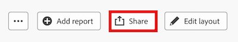

# Compartir un panel de lienzo

>[!IMPORTANT]
>
>Actualmente, la función Paneles de lienzo sólo está disponible para los usuarios que participan en la fase beta. Es posible que algunas partes de la función no estén completas o funcionen según lo previsto durante esta etapa. Por favor, envíe sus comentarios con respecto a su experiencia siguiendo las instrucciones de la sección [Proporcionar comentarios](/help/quicksilver/product-announcements/betas/canvas-dashboards-beta/canvas-dashboards-beta-information.md#provide-feedback) en el artículo general de Canvas Dashboards beta. 
>Si tiene comentarios sobre un posible fallo o problema técnico, envíe un billete al soporte técnico de Workfront. Para obtener más información, vea [Contactar con el servicio de asistencia al cliente](/help/quicksilver/workfront-basics/tips-tricks-and-troubleshooting/contact-customer-support.md). 
>Tenga en cuenta que esta beta no está disponible en los siguientes proveedores de servicios cloud:
>
>* Traer su propia clave para los servicios web de Amazon
>* Azure
>* Google Cloud Platform

Puede compartir un panel de lienzo con otros usuarios de Adobe Workfront para que puedan verlo o editarlo.

## Requisitos de acceso

+++ Expanda para ver los requisitos de acceso para la funcionalidad en este artículo.
<table style="table-layout:auto"> 
<col> 
</col> 
<col> 
</col> 
<tbody> 
<tr> 
   <td role="rowheader">
Paquete de Adobe Workfront
</td> 
   <td> 

Cualquiera 
 
   </td> 
<tr> 
 <tr> 
   <td role="rowheader">
Licencia de Adobe Workfront
</td> 
   <td> 

Estándar 
 

Plan
 
   </td> 
   </tr> 
  </tr> 
  <tr> 
   <td role="rowheader">
Configuraciones de nivel de acceso
</td> 
   <td>
Acceso de visualización a informes, paneles de control y calendarios

  </td> 
  </tr>  
    </tr>  
        <tr> 
   <td role="rowheader">
Permisos de objeto
</td> 
   <td>
Ver los permisos del panel para compartir el panel

   
Administrar permisos para que el panel asigne permisos de panel

  </td> 
  </tr>
</tbody> 
</table>

Para obtener más información sobre el contenido de esta tabla, consulte [Requisitos de acceso en la documentación de Workfront](/help/quicksilver/administration-and-setup/add-users/access-levels-and-object-permissions/access-level-requirements-in-documentation.md).
+++

## Consideraciones sobre compartir paneles

* Los paneles se pueden compartir con los recursos de usuario, equipo, grupo, rol de trabajo o empresa.

* De forma predeterminada, el creador de un panel tiene permisos de administración para el panel.

* Los administradores de sistemas y los usuarios con permiso Administrar pueden conceder acceso a View o Manage a un panel.

* Los usuarios con el permiso Ver de un panel pueden conceder a View acceso a un panel.

* Cuando se comparte un panel, los recursos con los que se comparte heredarán los permisos de los informes que se muestran en el panel.

* Cuando se distribuye un panel a través de una plantilla de diseño, se concede un permiso de vista automático para el panel (y sus informes) a todos los recursos asignados a la plantilla de diseño.

## Compartir un panel de lienzo

{{step1-to-dashboards}}

1. En el panel izquierdo, haga clic en **Paneles de control de lienzo**.

1. En la página **Canvas Dashboards**, seleccione el panel que desee compartir.

1. En la esquina superior derecha de la página, haga clic en el botón **Compartir**. Aparecerá el cuadro de diálogo **Compartir panel**.

   

1. En el campo **Dé acceso a**, comience a escribir el nombre de un usuario, equipo, función, grupo o empresa específicos con los que desee compartir el panel de lienzo y, a continuación, selecciónelo cuando aparezca en la lista desplegable.

1. (Opcional) Para editar el acceso de un recurso al panel, haga clic en **Ver** junto a su nombre y, a continuación, seleccione **Administrar** en la lista desplegable que aparece.

   >[!NOTE]
   >
   > Cuando los usuarios no tienen los permisos de edición de un panel asignado a través de su nivel de acceso, no se les pueden asignar permisos de administración a un panel.

1. Repita los pasos 5 a 6 para cada recurso con el que desee compartir el panel.

1. Haga clic en el botón **Compartir**. Los destinatarios reciben una notificación por correo electrónico en la que se les informa de que el panel se ha compartido con ellos, al que ahora pueden acceder en **paneles de paneles** > **paneles de lienzo** > **paneles compartidos**.

   >[!NOTE]
   >
   > Pueden aplicarse preferencias individuales de usuario y exclusiones del sistema para notificaciones por correo electrónico.  
   > Las notificaciones sólo se envían cuando se comparten directamente con un usuario. Compartir a grupos, roles, empresas y equipos no genera notificaciones de correo electrónico. 
   > Los permisos heredados de una plantilla de diseño no generarán una notificación por correo electrónico sobre el acceso al panel.
