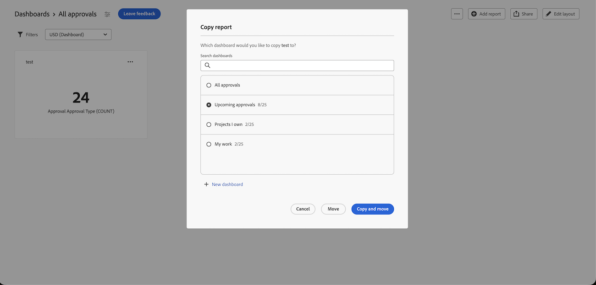

# Copia y movimiento de informes en paneles de lienzo

{{highlighted-preview}}

>[!IMPORTANT]
>
>Actualmente, la función Paneles de lienzo solo está disponible para los usuarios que participan en la fase beta. Es posible que algunas partes de la función no estén completas o que no funcionen según lo previsto durante esta fase. Envíe cualquier comentario sobre su experiencia siguiendo las instrucciones de la sección [Proporcionar comentarios](/help/quicksilver/product-announcements/betas/canvas-dashboards-beta/canvas-dashboards-beta-information.md#provide-feedback) del artículo Información general sobre la versión beta de los paneles de lienzo. 
>Si tiene comentarios acerca de un posible error o problema técnico, envíe un ticket al equipo de asistencia de Workfront. Para obtener más información, consulte [Contacto con el servicio de asistencia al cliente](/help/quicksilver/workfront-basics/tips-tricks-and-troubleshooting/contact-customer-support.md). 
>Tenga en cuenta que esta versión beta no está disponible en los siguientes proveedores de la nube:
>
>* Traer su propia clave para Amazon Web Service
>* Azure
>* Google Cloud Platform

Puede duplicar un informe de KPI, tabla o gráfico en un panel de lienzo una vez creado. Una vez duplicado, puede editar el informe según sea necesario antes de guardar.

## Requisitos de acceso

+++ Expanda para ver los requisitos de acceso para la funcionalidad en este artículo. 

<table style="table-layout:auto"> 
<col> 
</col> 
<col> 
</col> 
<tbody> 
<tr> 
   <td role="rowheader">
Paquete de Adobe Workfront
</td> 
   <td> 

Cualquiera 
 
   </td> 
<tr> 
 <tr> 
   <td role="rowheader">
Licencia de Adobe Workfront
</td> 
   <td> 

Estándar 
 

Plan
 
   </td> 
   </tr> 
  </tr> 
  <tr> 
   <td role="rowheader">
Configuraciones de nivel de acceso
</td> 
   <td>
Editar el acceso a Informes, Paneles de control y Calendarios

  </td> 
  </tr>  
      <tr> 
   <td role="rowheader">
Permisos de objeto
</td> 
   <td>
Administración de permisos para el tablero

  </td> 
  </tr>
</tbody> 
</table>

Para obtener más información sobre esta tabla, consulte [Requisitos de acceso en la documentación de Workfront](/help/quicksilver/administration-and-setup/add-users/access-levels-and-object-permissions/access-level-requirements-in-documentation.md).
+++

## Requisitos previos

Debe agregar un informe a un panel para poder duplicarlo.

Para obtener más información, consulte [Crear un panel de lienzo](/help/quicksilver/reports-and-dashboards/canvas-dashboards/create-dashboards/create-dashboards.md).

## Duplicación de un informe en producción

{{step1-to-dashboards}}

1. En el panel izquierdo, haga clic en **Paneles de control de lienzo**.
1. En la página **Paneles de lienzo**, haga clic en el icono de **Más**  en la esquina superior derecha del informe que desea duplicar y, a continuación, seleccione **Duplicado**.

   

1. (Opcional) En el cuadro **Configurar** que aparece, escriba un nuevo informe **Nombre** en la ficha **Detalles**.

1. (Opcional) Realice los ajustes necesarios en las configuraciones utilizando las pestañas del lado izquierdo.

   >[!NOTE]
   >
   >Estas pestañas variarán según si ha duplicado un informe de KPI, tabla o gráfico.  Para obtener más información, consulte [Crear un informe KPI en un panel de lienzo](/help/quicksilver/reports-and-dashboards/canvas-dashboards/add-reports/build-kpi-report.md), [Crear un informe de gráfico en un panel de lienzo](/help/quicksilver/reports-and-dashboards/canvas-dashboards/add-reports/build-chart-report.md) y [Crear un informe de tabla en un panel de lienzo](/help/quicksilver/reports-and-dashboards/canvas-dashboards/add-reports/build-table-report.md).

1. Haga clic en **Guardar**. El informe duplicado aparecerá en el tablero.

## Copiar o mover un informe en vista previa

Puede copiar un informe en el tablero actual, copiarlo en otro tablero o moverlo a otro tablero. Copiar crea un duplicado del informe en el destino; al moverlo, se reubica fuera del panel actual.

>[!IMPORTANT]
>
>* Para copiar un informe, necesita permisos de administración en el panel de destino.
>* Para mover un informe, necesita el acceso de Administración a los paneles de origen y destino.
>* Si el informe tiene configurada una opción Ejecutar como usuario y usted no es administrador del sistema ni el usuario Ejecutar como, podrá copiarlo o moverlo, pero la opción Ejecutar como usuario se eliminará del informe resultante.

Para copiar o mover un informe:

{{step1-to-dashboards}}

1. En el panel izquierdo, haga clic en **Paneles de control de lienzo**.
1. Abra el tablero que contiene el informe.
1. Haga clic en el icono **Más**  en la esquina superior derecha del informe y, a continuación, seleccione **Copiar informe**.

   

1. En el cuadro de diálogo **Copiar informe**, elija una de las siguientes opciones:

   <table>
   <tr>
   <td><strong>Copiar</strong></td>
   <td>Haga clic en <strong>Copiar</strong> en la parte inferior de la pantalla para copiar el informe. El tablero actual está seleccionado de forma predeterminada. Para copiar un informe, es necesario que tenga acceso de Administración al panel.</td>
   </tr>
   <tr>
   <td><strong>Copiar y mover</strong></td>
   <td>Seleccione un tablero de destino diferente para copiar el informe y moverlo a un tablero nuevo. El informe original permanece en el tablero actual.Para copiar y mover un informe, necesita el acceso de Administración al panel de destino. </td>
   </tr>
   <tr>
   <td><strong>Mover</strong></td>
   <td>Seleccione un tablero de destino diferente al que mover el informe. Esto reubica el informe en el panel de destino y lo elimina del panel actual. Para mover un informe, necesita el acceso de Administración a los paneles de origen y destino.</td>
   </tr>
   </table>

   >[!NOTE]
   >
   >Si el informe tiene configurada la opción Ejecutar como usuario y usted no es administrador del sistema o no es el usuario que ha establecido la opción Ejecutar como usuario, podrá copiar o mover el informe. La opción Ejecutar como usuario se elimina del informe resultante.

1. Haga clic en **Guardar**.

   

