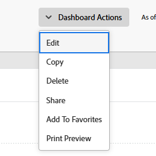

# Edición de un tablero

<!-- Audited: 1/2025 -->

El objetivo del tablero es proporcionar un acceso rápido a la información. Puede rellenar un panel de control con los siguientes elementos en Adobe Workfront:

* Informes

  Para obtener más información sobre la creación de informes, consulte [Crear un informe personalizado](../../../reports-and-dashboards/reports/creating-and-managing-reports/create-custom-report.md).

* Páginas externas

  Para obtener más información sobre la creación de páginas externas, consulte [Incrustar una página web externa en un panel de control](../../../reports-and-dashboards/dashboards/creating-and-managing-dashboards/embed-external-web-page-dashboard.md).

Después de crear estos elementos y agregarlos a un panel, puede editar el panel para agregarle más elementos, quitar elementos existentes del mismo o editar la información del panel.

Cualquier cambio realizado en un tablero afectará a todos los usuarios que tengan acceso a él.

Al compartir un tablero con los usuarios, todos los informes y las páginas externas también se comparten con los mismos usuarios.

## Requisitos de acceso

+++ Expanda para ver los requisitos de acceso para la funcionalidad en este artículo. 

<table style="table-layout:auto"> 
 <col> 
 <col> 
 <tbody> 
  <tr> 
   <td role="rowheader">paquete de Adobe Workfront</td> 
   <td> 
Cualquiera
 </td> 
  </tr> 
  <tr> 
   <td role="rowheader">Licencia de Adobe Workfront</td> 
   <td> 
      
Estándar

      
Plan

   </td> 
  </tr> 
  <tr> 
   <td role="rowheader">Configuraciones de nivel de acceso</td> 
   <td> 
Editar el acceso a Informes, Paneles de control y Calendarios
</td> 
  </tr>  
  <tr> 
   <td role="rowheader">Permisos de objeto</td> 
   <td> 
Administrar permisos en el panel de control
</td> 
  </tr> 
 </tbody> 
</table>

Para obtener más información sobre esta tabla, consulte [Requisitos de acceso en la documentación de Workfront](/help/quicksilver/administration-and-setup/add-users/access-levels-and-object-permissions/access-level-requirements-in-documentation.md).

+++

## Requisitos previos

Debe crear un tablero para poder editarlo.

Para obtener información sobre cómo crear paneles de control, consulte [Crear un panel de control](../../../reports-and-dashboards/dashboards/creating-and-managing-dashboards/create-dashboard.md).

## Edición de un tablero

1. Vaya al panel de control que desee editar.
1. Haga clic en **Acciones de panel** y luego haga clic en **Editar**.

   

   >[!TIP]
   >
   >Para obtener información sobre cómo eliminar un panel, consulte [Eliminar un panel](../../../reports-and-dashboards/dashboards/creating-and-managing-dashboards/delete-dashboard.md).

1. Considere la posibilidad de editar los campos siguientes:

   * **Nombre**: edite el nombre del tablero.
   * **Descripción**: especifique una descripción para el tablero.

1. En la sección **Informes y calendarios disponibles**, empiece a escribir el nombre de un informe, calendario o página externa en la barra de búsqueda y, a continuación, arrastre y suelte el informe, calendario o página externa en el panel de diseño situado a la derecha.

   >[!NOTE]
   >
   >Al buscar un elemento, la búsqueda devuelve cualquiera de los 2000 informes con fecha de creación más reciente. Los nombres de los informes que incluyen caracteres Unicode no se devuelven en los resultados de búsqueda. Como práctica recomendada, evite incluir caracteres Unicode al nombrar objetos en Workfront escribiendo nombres en lugar de copiar y pegar nombres de otra fuente.

1. (Opcional) Seleccione un nuevo diseño para el tablero haciendo clic en el botón de opción correspondiente al diseño que desee.
1. (Opcional) Pase el ratón sobre el nombre de un informe existente y haga clic en el icono de la papelera para eliminarlo del panel.
1. (Opcional) Cambie el orden de los informes en el panel haciendo clic en el nombre de un informe, arrastrándolo y soltándolo en el lugar deseado del panel de diseño.
1. (Opcional) Haga clic en **Agregar página externa** para agregar una página externa al panel.\
   O\
   Busque una página externa existente en el panel, luego pase el ratón sobre ella y haga clic en el icono **Editar** para editar la página externa.\
   Para obtener más información sobre cómo agregar o editar páginas externas en un panel, vea [Incrustar una página web externa en un panel](../../../reports-and-dashboards/dashboards/creating-and-managing-dashboards/embed-external-web-page-dashboard.md).

1. Haga clic en **Guardar + Cerrar**.
