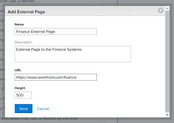
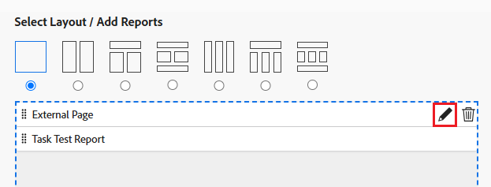

# Incrustar una página web externa en un panel

<!--Audited: 01/2024-->

Puede incrustar una página web externa en un panel para proporcionar acceso a información relacionada desde otros sistemas o desde Adobe Workfront.

Por ejemplo, si su organización tiene un repositorio de documentos basado en web, una wiki u otro sistema de administración de contenido que contenga información del proyecto a la que se accede regularmente a través de una dirección URL, puede mostrar esa información en Workfront creando una página externa en un panel.

>[!IMPORTANT]
>
>* Por motivos de seguridad, algunos sitios web no permiten incrustar páginas web como un iframe. Si la página web que desea incrustar en un panel no lo permite, la página no se muestra en el panel. Sin embargo, aún puede acceder a la página externa haciendo clic en el nombre del panel.\
>\
>Para permitir la incrustación en un sitio web de su propiedad, trabaje con el administrador web para ajustar la variable **X-Frame-Options** configuración. Para obtener más información, consulte [X-Frame-Options](https://developer.mozilla.org/en-US/docs/Web/HTTP/Headers/X-Frame-Options).
>
>
>* Las páginas de panel ya no se admiten como páginas externas incrustadas en los paneles. Aunque los tableros existentes no se modificarán automáticamente para eliminar estas páginas externas, cualquier modificación en un tablero que incluya una referencia de este tipo no podrá guardarse hasta que se elimine o cambie la referencia.
> En concreto, ya no se admiten los siguientes subdominios Workfront.com:
>
>     * /paneles&#x200B;
>     * /dashboard/:ID&#x200B;
>     * /portfolio/:ID/content-dashboard__:dashboardID&#x200B;
>     * /program/:ID/content-dashboard__:dashboardID&#x200B;
>     * /project/:ID/content-dashboard__:dashboardID&#x200B;
>     * /task/:ID/content-dashboard__:dashboardID&#x200B;
>     * /template/:ID/content-dashboard__:dashboardID&#x200B;
>     * /templatetask/:ID/content-dashboard__:dashboardID&#x200B;
>     * /resourcemanagement/:ID/
>     * content-dashboard__:dashboardID&#x200B;
>     * /team/:ID/content-dashboard__:dashboardID&#x200B;
>     * /iteration/:ID/content-dashboard__:dashboardID&#x200B;
>     * /requests/:ID/content-dashboard__:dashboardID&#x200B;
>     * /group/:ID/content-dashboard__:dashboardID&#x200B;
>     * /billingrecord/:ID/content-dashboard__:dashboardID
>
>Como solución alternativa, considere la posibilidad de incluir un informe de lista en su panel de control como se explica en [Adición de un informe a un panel](/help/quicksilver/reports-and-dashboards/dashboards/creating-and-managing-dashboards/add-report-dashboard.md)

## Requisitos de acceso

+++ Expanda para ver los requisitos de acceso para la funcionalidad en este artículo.

Debe tener lo siguiente:

<table style="table-layout:auto"> 
 <col> 
 <col> 
 <tbody> 
  <tr> 
   <td role="rowheader"><strong>plan de Adobe Workfront</strong></td> 
   <td> 
Cualquiera
 </td> 
  </tr> 
  <tr> 
   <td role="rowheader"><strong>Licencia de Adobe Workfront*</strong></td> 
   <td> 
Actual: plan 

   O
   
Nuevo: estándar 
 </td> 
  </tr> 
  <tr> 
   <td role="rowheader"><strong>Configuraciones de nivel de acceso</strong></td> 
   <td> 
Editar el acceso a Informes, Paneles y Calendarios
 </td> 
  </tr> 
  <tr> 
   <td role="rowheader"><strong>Permisos de objeto</strong></td> 
   <td> </td> 
  </tr> 
 </tbody> 
</table>

*Para saber qué plan, tipo de licencia o acceso tiene, póngase en contacto con su administrador de Workfront. Para obtener más información, consulte [Requisitos de acceso en la documentación de Workfront](/help/quicksilver/administration-and-setup/add-users/access-levels-and-object-permissions/access-level-requirements-in-documentation.md).

+++

## Requisitos previos

Debe crear un tablero para poder incrustar una página externa en él.

Para obtener información sobre la creación de paneles, consulte [Crear un tablero](../../../reports-and-dashboards/dashboards/creating-and-managing-dashboards/create-dashboard.md).

## Incrustar una página externa en un panel

>[!IMPORTANT]
>
>Puede quitar una página externa de un panel si ya no la necesita. Sin embargo, no puede eliminar una página externa después de crearla en Workfront. Solo puede eliminar una página externa mediante la API. Para obtener más información, consulte [Eliminación de una página externa de un panel](../../../reports-and-dashboards/dashboards/creating-and-managing-dashboards/remove-external-page-from-dashboard.md).

1. Busque la dirección URL de la página que se mostrará en Workfront y copie la dirección URL ubicada en la barra de direcciones.

   >[!NOTE]
   >
   >Si comparte direcciones URL con objetos de Workfront, recuerde que algunas caducan con el paso del tiempo. Por ejemplo, las direcciones URL de documentos caducan después de abrirse. Se configura como una medida de seguridad y, por diseño, se consideran direcciones URL no estáticas y no deben compartirse.

{{step1-to-dashboards}}

1. Para editar un tablero existente, seleccione el tablero en el que desea incrustar la página del sitio web y, a continuación, haga clic en **Acciones de panel**, luego haga clic en **Editar**
O\
   Para crear un nuevo tablero, haga clic en **Nuevo panel**.\
   Para obtener más información sobre la creación de tableros, consulte [Crear un tablero](../../../reports-and-dashboards/dashboards/creating-and-managing-dashboards/create-dashboard.md).

1. Clic **Agregar página externa** en el **Seleccionar diseño/ Agregar informes/ Agregar calendarios** área.

   

   El **Agregar página externa** aparece el cuadro.

1. Especifique la siguiente información sobre la página externa:

   * **Nombre**: Añada un nombre para el tablero.
   * **Descripción**: Agregue más información sobre el tablero para identificar la información que contiene. La descripción se muestra en el panel para todas las personas que tengan acceso a ella después de guardarla.
   * **URL**: Pegue la dirección URL que ha copiado anteriormente en este campo.

     Puede especificar los siguientes tipos de direcciones URL:

      * Una URL https (cifrada) a una página web.\
        Solo las páginas https (cifradas) se cargan con la dirección URL.\
        

      * Dirección URL de plantilla que contiene información de la sesión de un sitio web específico.\
        Por ejemplo: *https://localhost/?session={!$$SESSION}*
Debe haber iniciado sesión en el sitio web especificado para mostrar la página externa.\
        Para obtener información sobre cómo obtener un SessionID de Workfront, consulte [Conceptos básicos de API](../../../wf-api/general/api-basics.md).\
        El administrador de Workfront puede configurar las preferencias del sistema de forma que no permita el uso de información de sesión en las páginas externas por motivos de seguridad. En este caso, la página externa no se carga en el panel.\
        Para obtener más información sobre las preferencias de seguridad del sistema, consulte [Configurar las preferencias de seguridad del sistema](../../../administration-and-setup/manage-workfront/security/configure-security-preferences.md).\
        

     >[!WARNING]
     >
     >El uso de SessionID no es seguro y no se recomienda.
     >

   * **Altura**: escriba un número mayor que 0 para definir el espacio que ocupa la página externa en el panel. La altura predeterminada es 500.

1. Haga clic en **Guardar**.

   La página se agrega automáticamente al panel.

   Si crea paneles adicionales, puede encontrar esta página externa y agregarla a otros paneles. Puede encontrar todas las páginas externas existentes en la lista de Informes y calendarios disponibles al crear o editar un tablero.

   <!--
    *** This is linked to: Creating Dashboards, and Editing Dashboards.
   -->

## Actualización de una página externa en un panel

Para actualizar la información de una página externa utilizada en un panel:

{{step1-to-dashboards}}

1. Haga clic en el nombre del tablero que desea actualizar para abrirlo y haga clic en **Acciones de panel**, entonces **Editar**.

   El **Detalles del panel** se abre el cuadro.

1. En el **Seleccionar diseño / Agregar informes / Agregar calendarios** área de la **Detalles del panel** , busque la página externa que desea actualizar, pase el ratón sobre ella y haga clic en **Editar** icono.\
   

1. En el **Editar página externa** , actualice los campos que desee cambiar y haga clic en **Guardar**.
1. (Opcional) Haga clic en **Eliminar** icono  para eliminar la página externa del panel. Para obtener más información, consulte [Eliminación de una página externa de un panel](../../../reports-and-dashboards/dashboards/creating-and-managing-dashboards/remove-external-page-from-dashboard.md).
1. Haga clic en **Guardar + Cerrar**.

## Visualización de páginas externas en un informe

Puede ver todas las páginas externas en Workfront en un informe de página externa.

{{step1-to-reports}}

1. Clic **Nuevo informe** > seleccionar **Página externa**.

   

1. (Opcional) Actualice las pestañas Ver, Filtros o Agrupaciones del informe.

   Para obtener más información, consulte [Creación de un informe personalizado](../../../reports-and-dashboards/reports/creating-and-managing-reports/create-custom-report.md).

1. Clic **Guardar + Cerrar**.

   Puede ver el nombre y la dirección URL asociada con las páginas externas en el sistema en el nuevo informe.

   
