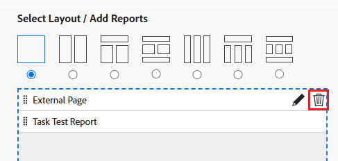

# Eliminación de una página externa de un panel

<!-- Audited: 1/2025 -->

Puede eliminar una página externa de un tablero si ya no es necesaria.

Sin embargo, no puede eliminar una página externa después de crearla en Adobe Workfront. Solamente puede eliminarsse una página externa mediante la API. Para obtener información sobre la API de Workfront, consulte [Conceptos básicos de la API](../../../wf-api/general/api-basics.md). Para obtener información sobre la creación de páginas externas, consulte [Incrustar una página web externa en un panel](../../../reports-and-dashboards/dashboards/creating-and-managing-dashboards/embed-external-web-page-dashboard.md).

## Requisitos de acceso

+++ Expanda para ver los requisitos de acceso para la funcionalidad en este artículo. 

<table style="table-layout:auto"> 
 <col> 
 <col> 
 <tbody> 
  <tr> 
   <td role="rowheader">Paquete de Adobe Workfront</td> 
   <td> 
Cualquiera
 </td> 
  </tr> 
  <tr> 
   <td role="rowheader">Licencia de Adobe Workfront</td> 
   <td> 
      
Estándar

      
Plan

   </td> 
  </tr> 
  <tr> 
   <td role="rowheader">Configuraciones de nivel de acceso</td> 
   <td> 
Editar el acceso a Informes, Paneles de control y Calendarios
</td> 
  </tr>  
  <tr> 
   <td role="rowheader">Permisos de objeto</td> 
   <td> 
Administrar permisos en el panel de control
 </td> 
  </tr> 
 </tbody> 
</table>

Para obtener más información sobre el contenido de esta tabla, consulte [Requisitos de acceso en la documentación de Workfront](/help/quicksilver/administration-and-setup/add-users/access-levels-and-object-permissions/access-level-requirements-in-documentation.md).

+++

## Quitar una página externa de un tablero

1. Vaya al panel que contiene la página externa que desea eliminar.

1. Haga clic en **Acciones del panel** y, a continuación, haga clic en **Editar**.

   

1. En el lado derecho de la pantalla, busca la página externa que deseas eliminar y haz clic en el icono **Eliminar** .

   

1. Haga clic en **Guardar + Cerrar** en la esquina inferior izquierda.

   De este modo, se quitará la página externa del panel seleccionado. La página externa permanece en Workfront y se puede acceder a ella desde un informe. Para obtener información, consulte la sección &quot;Ver páginas externas en un informe&quot; en el artículo [Incrustar una página web externa en un panel](../../../reports-and-dashboards/dashboards/creating-and-managing-dashboards/embed-external-web-page-dashboard.md).
