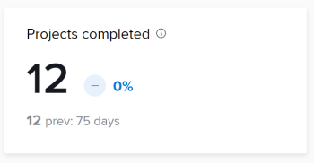

# Consultas de KPI

Puede utilizar las consultas de este artículo para crear visualizaciones de datos similares a las de Enhanced Analytics.

>[!IMPORTANT]
>
>Las consultas producirán resultados similares a los que se muestran en el análisis mejorado, pero es posible que no coincidan exactamente.


## Requisitos previos

Antes de empezar, debe

1. Establezca una conexión con la herramienta Business Intelligence (BI):
   1. [Crear una cuenta de lector o una conexión para Snowflake](/help/quicksilver/reports-and-dashboards/data-lake/create-a-reader-account.md)
   1. [Establezca una conexión con Workfront Data Connect](/help/quicksilver/reports-and-dashboards/data-lake/share-data-externally.md)

Una vez establecida una conexión, puede utilizar las consultas de este artículo para extraer y visualizar datos.

## Proyectos finalizados

El KPI de proyectos finalizados muestra cuántos proyectos se han completado en el período de tiempo filtrado, así como cómo ha aumentado o disminuido el porcentaje desde el período de tiempo anterior. Debajo de estos números, puede ver el número de proyectos completados en el período de tiempo anterior, así como el número de días.



### Consulta

```
WITH completedProjectsInRange as ( 
SELECT COUNT(t0.PROJECTID) as PROJECT_COUNT FROM PROJECTS_CURRENT t0 
WHERE t0.ACTUALCOMPLETIONDATE >= '2025-01-01' 
AND t0.ACTUALCOMPLETIONDATE <= '2025-01-31' 
), completedProjectsPreviousRange as ( 
SELECT COUNT(t0.PROJECTID) as PROJECT_COUNT FROM PROJECTS_CURRENT t0 
WHERE t0.ACTUALCOMPLETIONDATE >= '2024-12-01' 
AND t0.ACTUALCOMPLETIONDATE <= '2024-12-31' 
), rawChange as ( 
SELECT (a.PROJECT_COUNT - b.PROJECT_COUNT) as CHANGE_FROM_PREVIOUS_PERIOD FROM completedProjectsInRange a, completedProjectsPreviousRange b 
), percentChange as ( 
SELECT  
CASE 
WHEN a.PROJECT_COUNT = b.PROJECT_COUNT THEN 0.00 
WHEN b.PROJECT_COUNT > 0 THEN ((a.PROJECT_COUNT - b.PROJECT_COUNT) / b.PROJECT_COUNT * 100) 
END AS PERCENT_CHANGE_FROM_PREVIOUS_PERIOD 
FROM completedProjectsInRange a, completedProjectsPreviousRange b 
) 
SELECT 
a.PROJECT_COUNT, 
b.PROJECT_COUNT as PREVIOUS_PROJECT_COUNT, 
c.CHANGE_FROM_PREVIOUS_PERIOD, 
d.PERCENT_CHANGE_FROM_PREVIOUS_PERIOD 
FROM completedProjectsInRange a, completedProjectsPreviousRange b, rawChange c, 
percentChange d
```

## Proyectos finalizados a tiempo

El KPI de proyectos finalizados a tiempo muestra cuántos proyectos se han completado en el período de tiempo filtrado, así como cómo ha aumentado o disminuido el porcentaje desde el período de tiempo anterior. Debajo de estos números, puede ver el porcentaje de proyectos completados a tiempo en el período de tiempo anterior, así como el número de días.


## Media  de duración del proyecto

El KPI promedio de duración de los proyectos muestra el tiempo promedio de finalización (en días, semanas o años) para proyectos con fechas de finalización reales dentro del período de tiempo filtrado, así como el aumento o disminución del porcentaje desde el periodo de tiempo anterior. Debajo de estos números, puede ver el tiempo promedio de finalización de los proyectos con fechas de finalización reales en el período de tiempo anterior, así como el número de días.


## Media de tareas por proyecto

El KPI promedio de tareas por proyecto muestra el número promedio de tareas asignadas a proyectos dentro del período de tiempo filtrado, así como el aumento o disminución del porcentaje desde el periodo de tiempo anterior. Debajo de estos números puede ver el número promedio de tareas asignadas a proyectos en el período de tiempo anterior, así como el número de días.

