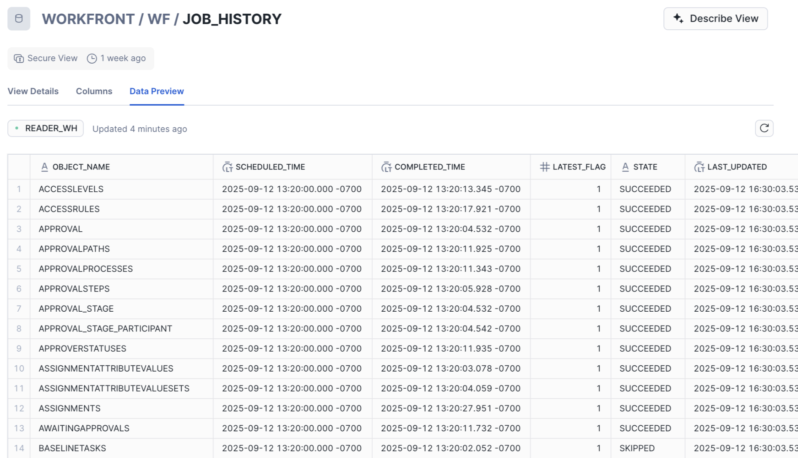

# Uso de la vista Historial de trabajos en Data Connect

En la vista Historial de trabajos, los administradores de Workfront pueden acceder a registros detallados de cada trabajo de actualización de datos. Estos registros proporcionan insight valioso en los trabajos que mantienen los datos actualizados y le ayudan a establecer marcos de tiempo ideales sobre cuándo ejecutar procesos y actualizar las visualizaciones empresariales.

Las columnas de la vista Historial de trabajos contienen la siguiente información:

* **OBJECT_NAME**: muestra el nombre del objeto asociado con el trabajo.
* **HORA_PROGRAMADA**: Muestra la hora de inicio del trabajo.
* **COMPLETED_TIME**: muestra la hora de finalización del trabajo.
* **LATEST_FLAG**: indica si el trabajo formó parte de la actualización más reciente.
* **ESTADO**: Muestra el estado del trabajo. Para obtener más información, consulte la siguiente sección en este artículo: [Estados de trabajo disponibles](#available-job-statuses).
* **LAST_UPDATED**: Marca de tiempo de la última actualización del trabajo.

>[!NOTE]
>
>La vista Historial de trabajos incluye detalles de las 72 horas anteriores de trabajos programados.

## Estados de trabajo disponibles

A cada trabajo de Data Connect se le asigna un estado que indica si se ha realizado correctamente, si se ha omitido o si ha fallado.

<table>
    <tr>
        <td><b>Estado del trabajo</b></td>
        <td><b>Definición</b></td>
    </tr>
    <tr>
        <td>Correcto</td>
        <td>El trabajo procesó correctamente cada actualización disponible y todas las actualizaciones de ese tipo de registro ahora se reflejan en el lago de datos.</td>
    </tr>
    <tr>
        <td>Omitido</td>
        <td>Se omitió el trabajo porque no había actualizaciones en cola para procesar para el tipo de registro.</td>
    </tr>
    <tr>
        <td>Error</td>
        <td>Error al ejecutar el trabajo. En estos casos, es probable que no se hayan enviado datos en cola al lago de datos. Los registros que permanecen en cola se procesarán en el siguiente trabajo programado para ese tipo de registro. </td>
    </tr>
   </table>

## Consideraciones sobre la ejecución del trabajo y el comportamiento del registro

Snowflake utiliza una herramienta de optimización del programador de trabajos que puede afectar a cómo se procesa y registra la ejecución del trabajo en la vista Historial de trabajos. Este comportamiento del registro puede variar en función de si hay datos que procesar o no.

Por ejemplo, cuando no hay filas nuevas para procesar para un objeto determinado, puede producirse uno de los siguientes resultados:

* **El trabajo se ejecuta y se marca como Omitido**: Snowflake detecta que no hay filas para procesar, ejecuta el trabajo y lo registra con el estado Omitido en la tabla.

* **El trabajo no se ejecuta**: Snowflake determina que no hay filas para procesar, no ejecuta el trabajo y lo registra con el estado Omitido en la tabla.

  >[!NOTE]
  >
  >En el segundo escenario en el que el trabajo no se ejecuta, el registro más reciente para ese objeto puede reflejar una marca de tiempo que no se alinee con la programación esperada.

En otras palabras, un trabajo se puede considerar ejecutado incluso si no se ha procesado ninguna fila y se puede registrar o no en función del comportamiento del planificador de trabajos para ese trabajo en particular.