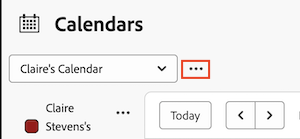

# Eliminar un informe de calendario

Puede eliminar un calendario que sea suyo o que otros hayan compartido con usted. Una vez eliminado, el calendario deja de ser accesible para los usuarios con los que lo ha compartido.

No puede eliminar el calendario predeterminado a menos que tenga un calendario alternativo existente. Si intenta eliminar todos los calendarios, el sistema crea automáticamente un calendario predeterminado.

## Requisitos de acceso

+++ Expanda para ver los requisitos de acceso para la funcionalidad en este artículo.

<table style="table-layout:auto"> 
 <col> 
 </col> 
 <col> 
 </col> 
 <tbody> 
  <tr> 
   <td role="rowheader">paquete de Adobe Workfront</td> 
   <td> 
Cualquiera
 </td> 
  </tr> 
  <tr> 
   <td role="rowheader">Licencia de Adobe Workfront</td> 
   <td>
Estándar

       
Plan
</td> 
  </tr> 
  <tr> 
   <td role="rowheader">Configuraciones de nivel de acceso</td> 
   <td> 
 Editar el acceso a Informes, Paneles y Calendarios
</td> 
  </tr> 
  <tr> 
   <td role="rowheader">Permisos de objeto</td> 
   <td>Administrar el acceso al informe de calendario, con acceso para eliminarlo</td> 
  </tr> 
 </tbody> 
</table>

Para obtener más información sobre el contenido de esta tabla, consulte [Requisitos de acceso en la documentación de Workfront](/help/quicksilver/administration-and-setup/add-users/access-levels-and-object-permissions/access-level-requirements-in-documentation.md).

+++

## Eliminar un informe de calendario

1. Vaya al calendario que desee eliminar.
1. Haga clic en el menú **Más** situado junto al menú desplegable Calendario.
   

1. Seleccione **[!UICONTROL Delete]** de la lista desplegable.
1. Haga clic **[!UICONTROL eliminar]**.
