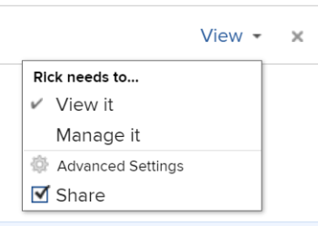

# Compartir un informe de calendario

Puede compartir un calendario con otros usuarios y ponerlo a disposición del público, lo que permite que alguien sin [!DNL Adobe Workfront] licencia para verla.

## Requisitos de acceso

Debe tener el siguiente acceso para realizar los pasos de este artículo:

<table style="table-layout:auto"> 
 <col> 
 </col> 
 <col> 
 </col> 
 <tbody> 
  <tr> 
   <td role="rowheader"><strong>[!DNL Adobe Workfront plan*]</strong></td> 
   <td> 
Cualquiera
 </td> 
  </tr> 
  <tr> 
   <td role="rowheader"><strong>[!DNL Adobe Workfront] licencia*</strong></td> 
   <td> 
[!UICONTROL Review] o superior
 </td> 
  </tr> 
  <tr> 
   <td role="rowheader"><strong>Configuraciones de nivel de acceso*</strong></td> 
   <td> 
[!UICONTROL View] o acceso superior [!UICONTROL to Reports], [!UICONTROL Dashboards] y [!UICONTROL Calendars]
 
Nota: Si todavía no tiene acceso, pregunte a su [!DNL Workfront] administrador si establecen restricciones adicionales en su nivel de acceso. Para obtener información sobre cómo se [!DNL Workfront] administrador puede modificar el nivel de acceso, consulte <a href="../../../administration-and-setup/add-users/configure-and-grant-access/create-modify-access-levels.md" class="MCXref xref">Crear o modificar niveles de acceso personalizados</a>.
 </td> 
  </tr> 
  <tr> 
   <td role="rowheader"><strong>Permisos de objeto</strong></td> 
   <td> 
[!UICONTROL View] o permisos superiores en el informe de calendario, con acceso para compartir
 
Para obtener información sobre la solicitud de acceso adicional, consulte <a href="../../../workfront-basics/grant-and-request-access-to-objects/request-access.md" class="MCXref xref">Solicitar acceso a objetos </a>.
 </td> 
  </tr> 
 </tbody> 
</table>

&#42;Para saber qué plan, tipo de licencia o acceso tiene, póngase en contacto con su [!DNL Workfront] administrador.

## Compartir un calendario con [!DNL Workfront] usuarios {#share-a-calendar-with-workfront-users}

Compartir un calendario es similar a compartir otros objetos. Para obtener más información sobre cómo compartir objetos en [!DNL Adobe Workfront], consulte [Información general sobre cómo compartir permisos en objetos](../../../workfront-basics/grant-and-request-access-to-objects/sharing-permissions-on-objects-overview.md).

Los calendarios que se han compartido con usted se muestran con un asterisco (&#42;) junto al nombre del calendario.

Para compartir un calendario dentro de [!DNL Workfront]:

1. Vaya al calendario que desee compartir.
1. Haga clic en **[!UICONTROL Acciones de calendario]** y haga clic en **[!UICONTROL Uso compartido]**.

1. En el **[!UICONTROL Dar acceso al calendario a]** , empiece a escribir el nombre del usuario, equipo, función, grupo o empresa que desea compartir en el calendario y, a continuación, haga clic en el nombre cuando aparezca en la lista desplegable.\
   Para obtener más información sobre la configuración de permisos, consulte [Información general sobre cómo compartir permisos en objetos](../../../workfront-basics/grant-and-request-access-to-objects/sharing-permissions-on-objects-overview.md).

1. (Opcional) Repita el paso 3 con cada usuario, equipo, función o grupo al que desee conceder acceso en el calendario.
1. Especifique los permisos para cada usuario, equipo, función, grupo o empresa que agregó en el paso 3 haciendo clic en el menú desplegable y, a continuación, seleccione el nivel de permiso que desea conceder:

   * **[!UICONTROL Ver]:** Los usuarios pueden revisar y compartir el calendario.

      

   * **[!UICONTROL Administrar]:** Los usuarios tienen acceso completo al calendario, menos derechos administrativos, que se conceden en el nivel de acceso, además de todos los permisos de visualización.

      

      >[!NOTE]
      >
      >La variable [!DNL Workfront] y el creador del calendario tienen la capacidad de eliminar permisos de estas entidades.

1. (Opcional) Según la función de un usuario, puede hacer clic en **[!UICONTROL Opciones avanzadas]** y haga clic en **[!UICONTROL Compartir]**&#x200B; para permitir que el usuario comparta el calendario con otros usuarios.

   Para obtener más información sobre los niveles de permisos, consulte [Información general sobre cómo compartir permisos en objetos](../../../workfront-basics/grant-and-request-access-to-objects/sharing-permissions-on-objects-overview.md).

1. (Opcional) Para que el calendario esté disponible para todos [!DNL Workfront] usuarios, haga clic en el icono de engranaje y, a continuación, en el menú desplegable, haga clic en **[!UICONTROL Hacer que esto sea visible en todo el sistema]** para que el objeto esté disponible para todos [!DNL Workfront] usuarios.\
   Todos los usuarios pueden ver el objeto en función de los permisos que haya establecido.

1. Haga clic en **[!UICONTROL Guardar]**.

## Compartir un calendario con un vínculo público

Puede hacer que un calendario sea público y compartir un vínculo con personas que no tengan un [!DNL Workfront] licencia.

1. Vaya al calendario que desee compartir.
1. Haga clic en **[!UICONTROL Acciones de calendario]** y haga clic en **[!UICONTROL Uso compartido]**.

1. Haga clic en el icono del engranaje y, a continuación, haga clic en **[!UICONTROL Convertir esto en público para usuarios externos]**.
1. Haga clic en **[!UICONTROL Copiar vínculo]**.
1. Haga clic en **[!UICONTROL Guardar]**.

## Compartir un calendario con un vínculo privado

Puede compartir un vínculo de calendario privado con [!DNL Workfront] usuarios. Los usuarios deben iniciar sesión para ver el calendario cuando utilicen el vínculo.

1. Vaya al calendario que desee compartir.
1. Haga clic en **[!UICONTROL Acciones de calendario]** y haga clic en **[!UICONTROL Obtener vínculo compartido]**.

1. Haga clic en **[!UICONTROL Copiar vínculo]**.

   >[!NOTE]
   >
   >[!DNL Workfront] los usuarios deben tener acceso al calendario para poder acceder a él mediante el vínculo . Para conceder acceso, consulte [Compartir un calendario con [!DNL Workfront] usuarios](#share-a-calendar-with-workfront-users).\
   >Si los usuarios no tienen acceso, pueden solicitarlo después de pegar el vínculo en el navegador.
