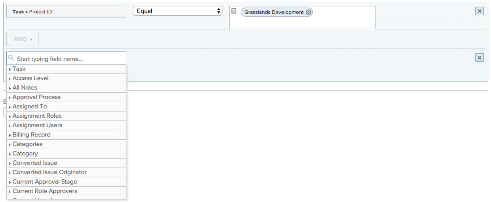

# Usar campos de fecha personalizados en un informe de calendario

Un informe de [!UICONTROL calendario] es un informe dinámico que proporciona una representación visual de su trabajo. Puede utilizar campos de fecha personalizados en un informe de calendario para los siguientes objetos:

* Tareas
* Problemas
* Proyectos

## Requisitos de acceso

+++ Expanda para ver los requisitos de acceso para la funcionalidad en este artículo.

Debe tener el siguiente acceso para realizar los pasos de este artículo:

<table style="table-layout:auto"> 
 <col> 
 </col> 
 <col> 
 </col> 
 <tbody> 
  <tr> 
   <td role="rowheader">[!DNL Adobe Workfront plan]</td> 
   <td> 
Cualquiera
 </td> 
  </tr> 
  <tr> 
   <td role="rowheader">[!DNL Adobe Workfront] licencia</td> 
   <td>
Nuevo: estándar

       
o

       
Actual: plan
</td> 
  </tr> 
  <tr> 
   <td role="rowheader">Configuraciones de nivel de acceso</td> 
   <td> 
Acceso [!UICONTROL Edit] a [!UICONTROL Reports], [!UICONTROL Dashboards] y [!UICONTROL Calendars]
</td> 
  </tr> 
  <tr> 
   <td role="rowheader">Permisos de objeto</td> 
   <td>Acceso [!UICONTROL Manage] al informe de calendario</td> 
  </tr> 
 </tbody> 
</table>

Para obtener más información sobre esta tabla, consulte [Requisitos de acceso en la documentación de Workfront](/help/quicksilver/administration-and-setup/add-users/access-levels-and-object-permissions/access-level-requirements-in-documentation.md).

+++

## Requisitos previos

1. Debe tener campos de fecha personalizados y un valor dentro del campo disponibles en la instancia [!DNL Workfront]. Si no tienes un formulario personalizado configurado con fechas personalizadas, sigue las instrucciones de [Crear un formulario personalizado](/help/quicksilver/administration-and-setup/customize-workfront/create-manage-custom-forms/form-designer/design-a-form/design-a-form.md).
1. Adjunte el formulario personalizado a un proyecto, tarea o problema que planee agregar al calendario y especifique una fecha. Para obtener más información, vea [Agregar un formulario personalizado a un objeto](../../../workfront-basics/work-with-custom-forms/add-a-custom-form-to-an-object.md).

## Configurar el grupo de elementos

Puede elegir cómo desea que se muestre el grupo de elementos en el calendario.

{{step1-to-calendars}}

1. Seleccione el calendario al que desee agregar un nuevo grupo de elementos.
O
Haga clic en **[!UICONTROL + Nuevo calendario]** y escriba el nombre del calendario.

   >[!NOTE]
   >
   >Debe tener el acceso [!UICONTROL Editar] en [!UICONTROL Informes], [!UICONTROL Paneles] y [!UICONTROL Calendarios] en su nivel de acceso para crear un informe de calendario.

1. A la izquierda, haga clic en **[!UICONTROL Añadir al calendario]** y luego haga clic en **[!UICONTROL Añadir elementos avanzados]**.

1. Especifique lo siguiente:

   <table style="table-layout:auto">
    <col>
    <col>
    <tbody>
     <tr>
      <td role="rowheader"><strong>[!UICONTROL Name this group of items]</strong></td>
      <td>Escriba un nombre para el grupo de elementos.</td>
     </tr>
     <tr>
      <td role="rowheader"><strong>[!UICONTROL Color]</strong></td>
      <td>Seleccione un color para el grupo de elementos. Todos los elementos se muestran en el color seleccionado en el informe de calendario.</td>
     </tr>
     <tr>
      <td role="rowheader"><strong>[!UICONTROL Date Field]</strong></td>
      <td>Elija <strong>[!UICONTROL Fechas personalizadas]</strong>. </td>
     </tr>
     <tr>
      <td role="rowheader"><strong>[!UICONTROL On the calendar, show]</strong></td>
      <td>
Elija cómo desea que se muestren las fechas:

       <ul>
        <li><strong>[!UICONTROL Single Date]</strong>: el calendario muestra el objeto en una sola fecha.</li>
        <li><strong>[!UICONTROL Duration] (de inicio a fin)</strong>: el calendario muestra el objeto durante un periodo de días. 
Nota: Si elige <strong>[!UICONTROL Duration]</strong>, la fecha de finalización especificada debe ser posterior a la fecha de inicio o el elemento no se mostrará en el calendario.
</li>
       </ul></td>
     </tr>
     <tr data-mc-conditions="">
      <td role="rowheader"><strong>[!UICONTROL Fechas personalizadas]</strong></td>
      <td>
Introduzca el nombre de fecha personalizado adjunto al objeto que desea rastrear.

<strong>NOTA:</strong> La búsqueda del nombre de fecha personalizado está limitada a 50 resultados para evitar problemas de rendimiento.</td>
     </tr>
    </tbody>
   </table>

1. Continúe en la sección siguiente.

## Añadir objetos al grupo de elementos

Después de configurar cómo desea que se muestren los elementos, debe añadir los objetos que desea ver en el calendario a la agrupación.

1. En la sección **[!UICONTROL ¿Qué desea añadir al calendario?]**, seleccione

   * **[!UICONTROL Tareas]**
   * **[!UICONTROL Proyectos]**
   * **[!UICONTROL Problemas]**

1. Haga clic en **[!UICONTROL Añadir tareas]**, **[!UICONTROL Añadir proyectos]** o **[!UICONTROL Añadir problemas]**, según el tipo de objeto que esté añadiendo al calendario.
   

1. En el menú desplegable, empiece a escribir el nombre del campo y, a continuación, seleccione el origen del campo del objeto que desea mostrar en el calendario (por ejemplo, **[!UICONTROL Tareas tardías]**).
1. Establezca una instrucción de condición para la agrupación de calendario.

   

   Para obtener más información sobre la configuración de condiciones, consulte [Modificadores de filtro y condición](../../../reports-and-dashboards/reports/reporting-elements/filter-condition-modifiers.md).

1. (Opcional) Especifique objetos adicionales para la agrupación de calendario repitiendo los pasos del 1 al 4.
1. En el campo **[!UICONTROL Establecer las etiquetas Tareas/Proyectos/Problemas para que sean...]**, seleccione cómo se etiquetan los objetos de esta agrupación de calendario en el calendario.

   >[!NOTE]
   >
   >Si las opciones de etiqueta predeterminadas no están disponibles para un objeto determinado, se muestra el nombre del objeto en su lugar. Por ejemplo, cuando se selecciona la etiqueta [!UICONTROL Tarea principal] y no hay ninguna tarea principal asociada al objeto, [!DNL Adobe Workfront] muestra el nombre de objeto que está viendo en el calendario.

1. Haga clic en **[!UICONTROL Guardar]**.
