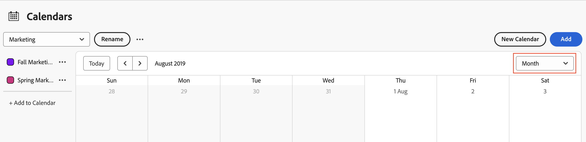

# Ver informes de calendario y detalles de eventos

Puede ver informes de calendario y detalles de eventos que haya creado o que se hayan compartido con usted en Adobe Workfront.

## Requisitos de acceso

+++ Expanda para ver los requisitos de acceso para la funcionalidad en este artículo.

Debe tener el siguiente acceso para realizar los pasos de este artículo:

<table style="table-layout:auto"> 
 <col> 
 </col> 
 <col> 
 </col> 
 <tbody> 
  <tr> 
   <td role="rowheader">[!DNL Adobe Workfront plan]</td> 
   <td> 
Cualquiera
 </td> 
  </tr> 
  <tr> 
   <td role="rowheader">[!DNL Adobe Workfront] licencia</td> 
   <td>
Nuevo: colaborador

       
o

       
Actual: Solicitud
</td> 
  </tr> 
  <tr> 
   <td role="rowheader">Configuraciones de nivel de acceso</td> 
   <td> 
[!UICONTROL Ver] o acceso superior a [!UICONTROL Informes], [!UICONTROL Paneles] y [!UICONTROL Calendarios]
</td> 
  </tr> 
  <tr> 
   <td role="rowheader">Permisos de objeto</td> 
   <td>[!UICONTROL View] o permisos superiores para el informe de calendario</td> 
  </tr> 
 </tbody> 
</table>

Para obtener más información sobre el contenido de esta tabla, consulte [Requisitos de acceso en la documentación de Workfront](/help/quicksilver/administration-and-setup/add-users/access-levels-and-object-permissions/access-level-requirements-in-documentation.md).

+++

## Ver un informe de calendario

<!--{{step1-to-calendars}}-->

1. Haga clic en el icono **[!UICONTROL Menú principal]**  en la esquina superior derecha de Adobe Workfront o (si está disponible), haga clic en el icono **[!UICONTROL Menú principal]**  en la esquina superior izquierda y, a continuación, haga clic en **[!UICONTROL Calendarios]**.

   Según su nivel de acceso, podría ver los siguientes calendarios en la lista:

   * Su calendario [!DNL Adobe Workfront] predeterminado

     Workfront crea un calendario para usted en función de los proyectos, tareas y problemas que se le hayan asignado o que se hayan asignado a equipos, grupos o funciones a los que esté asignado.

   * Calendarios que ha creado

     Para obtener más información sobre la creación de calendarios, consulte [Resumen de informes de calendario](../../../reports-and-dashboards/reports/calendars/calendar-reports-overview.md).

   * Calendarios que otros usuarios han compartido con usted

     Para obtener más información sobre cómo compartir calendarios, consulte el informe [[!UICONTROL Compartir un calendario]](../../../reports-and-dashboards/reports/calendars/share-a-calendar-report.md).

1. (Condicional) Haga clic en la lista desplegable **[!UICONTROL Ver]** y, a continuación, seleccione la duración de calendario que desee ver.
   
Puede elegir entre las siguientes vistas de informes de calendario:

   * **[!UICONTROL Mes]**: muestra cuatro semanas del calendario
   * **[!UICONTROL Semana]**: muestra una semana del calendario
   * **[!UICONTROL Gantt]**: muestra una vista continua del calendario

     ![[!UICONTROL Informe de calendario Gantt]](assets/gantt-calendar-report.png)

     Puede ver más eventos en una vista de [!UICONTROL Gantt] desplazándose hacia abajo o hacia los lados. Aparecerá un símbolo de carga a medida que se rellenen los datos para la vista.

   >[!NOTE]
   >
   >En las vistas [!UICONTROL Mes] y [!UICONTROL Semana], los eventos actuales o futuros (incluidos los eventos que abarcan varios días, siempre que contengan un día de hoy o un día futuro) tienen un sombreado que corresponde al color del proyecto o de la agrupación de calendario. Los eventos anteriores tienen un sombreado más claro para indicar que ya no son actuales, pero aún puede seleccionar y ver dichos eventos.

1. (Opcional) Si está viendo el calendario en las vistas [!UICONTROL Mes] o [!UICONTROL Semana], puede cambiar la vista del calendario con las siguientes opciones:

   * Para incluir o excluir fines de semana:

      1. En la barra de herramientas de **[!UICONTROL Calendario]**, haga clic en **[!UICONTROL Acciones de calendario]** y, a continuación, en la lista desplegable, seleccione **[!UICONTROL Mostrar fin de semana]** u **[!UICONTROL Ocultar fin de semana]**.

   * Para cambiar rápidamente las fechas mostradas:

      1. En la barra de herramientas **[!UICONTROL Calendario]**, haga clic en la flecha izquierda del indicador de fecha para retroceder en el calendario o en la flecha derecha para avanzar.

         \
         Las fechas mostradas se ajustan mediante un intervalo basado en la vista de calendario actual. Por ejemplo, si está viendo el calendario en la vista [!UICONTROL Semana], el calendario mostrará una semana hacia adelante o una semana hacia atrás, según la flecha que seleccione.

      1. (Opcional) Para volver al día actual, haga clic en [!UICONTROL **Hoy**].

1. (Opcional) Para ver un calendario en pantalla completa, haga clic en las flechas de pantalla completa en la parte derecha de la barra de herramientas de **[!UICONTROL Calendario]**.
   \
   Pulse Esc para volver a la vista normal del calendario.

1. (Opcional) Para ocultar los eventos de un proyecto o agrupación de calendario vinculada al calendario, borre la agrupación de proyecto o calendario en la lista de proyectos.
   
Para volver a hacer visibles los eventos, seleccione el [!UICONTROL proyecto] o la agrupación de calendario en la lista de proyectos.

## Ver detalles del evento del informe de calendario

Puede ver los detalles de un evento en un calendario, tanto para los eventos actuales como para los anteriores.

1. Vaya al evento cuyos detalles desee conocer y, a continuación, haga clic en el evento.
Se abre una página de detalles del evento.
   

1. (Opcional) Para ver detalles adicionales sobre el objeto:

   1. Pase el puntero por encima del nombre del proyecto, la tarea o el problema.

      Se abre una página de detalles del objeto.
      

   1. (Opcional) Para abrir el proyecto, la tarea o el problema asociado, haga clic en el título del objeto.
   1. (Opcional) Para cerrar todas las páginas de detalles abiertas, haga clic en cualquier lugar fuera de las páginas de detalles del evento.
