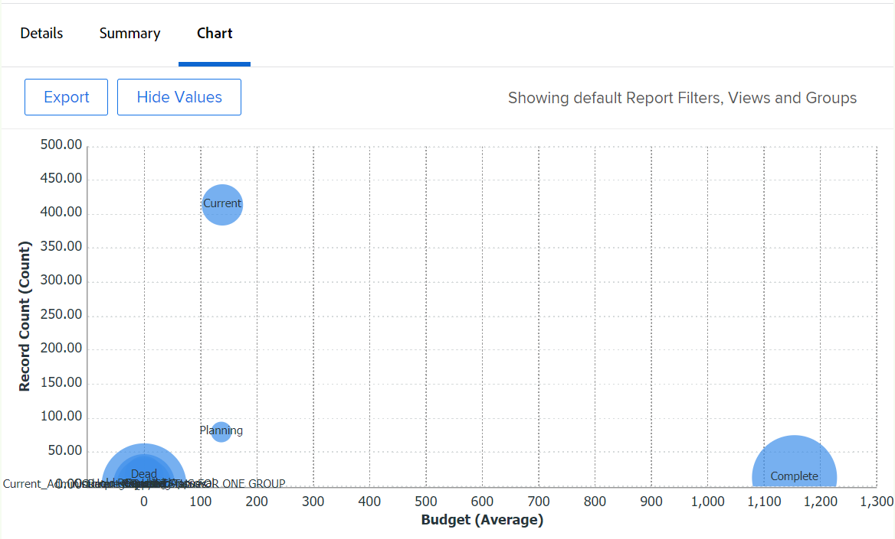

# Agregar un gráfico a un informe

<!--Audited: 01/2024-->

Puede mejorar los informes agregando un gráfico. Puede agregar gráficos a los informes existentes o a los informes que esté creando.

Antes de agregar un gráfico a un informe, debe crear una Vista y una Agrupación para el informe.

No puede agregar gráficos a la mayoría de los informes a menos que agrupe primero la información en el informe. El único gráfico que se puede agregar sin agrupar es un gráfico de medición.

Para obtener información sobre las vistas, consulte [Información general sobre vistas en Adobe Workfront](../../../reports-and-dashboards/reports/reporting-elements/views-overview.md).

Para obtener más información sobre las agrupaciones, consulte [Información general sobre agrupaciones en Adobe Workfront](../../../reports-and-dashboards/reports/reporting-elements/groupings-overview.md).

Si el informe muestra demasiados elementos, no se creará ningún gráfico. En este caso, también debe agregar un Filtro al informe para reducir el número de resultados en el informe.

Para obtener más información sobre los filtros, consulte [Resumen de filtros](../../../reports-and-dashboards/reports/reporting-elements/filters-overview.md).

## Requisitos de acceso

Debe tener el siguiente acceso para realizar los pasos de este artículo:

<table style="table-layout:auto"> 
 <col> 
 <col> 
 <tbody> 
  <tr> 
   <td role="rowheader">plan de Adobe Workfront</td> 
   <td> 
Cualquiera
 </td> 
  </tr> 
  <tr> 
   <td role="rowheader">Licencia de Adobe Workfront*</td> 
   <td> 
Actual: plan 

   O
   
Nuevo: estándar
 </td> 
  </tr> 
  <tr> 
   <td role="rowheader">Configuración del nivel de acceso</td> 
   <td> 
Editar acceso a informes, tableros y calendarios
 
Editar acceso a filtros, vistas y agrupaciones
 </td> 
  </tr> 
  <tr> 
   <td role="rowheader">Permisos de objeto</td> 
   <td> 
Administración de permisos de un informe
  </td> 
  </tr> 
 </tbody> 
</table>

&#42;Para saber qué plan, tipo de licencia o acceso tiene, póngase en contacto con su administrador de Workfront. Para obtener más información sobre los requisitos de acceso, consulte [Requisitos de acceso en la documentación de Workfront](/help/quicksilver/administration-and-setup/add-users/access-levels-and-object-permissions/access-level-requirements-in-documentation.md).

## Agregar un gráfico a un informe

1. Vaya a un informe existente o cree un nuevo informe. Para obtener más información sobre la creación de un nuevo informe, consulte [Creación de un informe personalizado](../../../reports-and-dashboards/reports/creating-and-managing-reports/create-custom-report.md).
1. (Condicional) Si ha ido a un informe existente, haga clic en **Acciones de informe** > **Editar**.

1. Asegúrese de que la variable **Columnas (vista)** La pestaña se ha actualizado para mostrar la información que desea representar en el gráfico del informe.

   Para obtener información sobre cómo crear o modificar la vista del informe, consulte [Creación o edición de vistas en Adobe Workfront](/help/quicksilver/reports-and-dashboards/reports/reporting-elements/create-edit-views.md).

1. Haga clic en **Agrupaciones** y agregue una agrupación.

   >[!TIP]
   >
   >* Solo se puede agregar un gráfico a un informe cuando los resultados del informe están agrupados.
   >* Los gráficos no admiten agrupaciones en modo de texto. Para obtener más información sobre las agrupaciones en modo de texto, consulte [Editar modo de texto en una agrupación](../../../reports-and-dashboards/reports/text-mode/edit-text-mode-in-grouping.md).
   >* Si agrega una sola agrupación que representa una métrica, todos los gráficos, excepto un gráfico circular, muestran cada resultado en la agrupación con el mismo color.

   Para obtener más información sobre la creación de agrupaciones, consulte [Creación de agrupaciones en Adobe Workfront](/help/quicksilver/reports-and-dashboards/reports/reporting-elements/create-groupings.md).

1. Seleccione el **Gráfico** pestaña.
1. Haga clic en un tipo de gráfico para seleccionarlo.\
   

1. Seleccione entre los siguientes tipos de gráficos:

   * [Gráfico de columnas](#column-chart)
   * [Gráfico de barras](#bar-chart)
   * [Gráfico circular](#pie-chart)
   * [Gráfico de líneas](#line-chart)
   * [Gráfico de medición](#gauge-chart)
   * [Gráfico de burbujas](#bubble-chart)

1. Clic **Guardar + Cerrar** para guardar el gráfico y el informe.

### Gráfico de columnas {#column-chart}

Para agregar un **Columna** a su informe:

1. Comience a añadir un gráfico al informe, tal como se describe en [Agregar un gráfico a un informe](#add-a-chart-to-a-report).
1. En el **Eje izquierdo (Y)** , seleccione los valores que desee incluir en el eje Y del gráfico, así como la forma en que desea resumir la información.
1. En el **Eje inferior (X)** , seleccione la Agrupación que desee incluir en el gráfico.
1. (Opcional) Seleccione **Colores personalizados** para asignar los colores preferidos a cada una de las columnas.\
   Para obtener más información sobre cómo personalizar los colores del gráfico, consulte [Personalizar colores del gráfico](#customize-chart-colors).

1. (Opcional) Seleccione **Mostrar en 3D** para mostrar el gráfico en una vista tridimensional.
1. (Opcional) **Agrupar columnas**: seleccione esta opción para definir cómo desea que se agrupen las columnas.\
   Seleccione entre las siguientes opciones:

   * Haga clic en una de las siguientes opciones para seleccionar cómo se van a mostrar las columnas agrupadas:

      * **Lado a lado**
      * **Apiladas**
      * **Apiladas al 100%**

   * Seleccione la agrupación que desee incluir en el gráfico desde el **Agrupar datos por** menú desplegable.
   * (Opcional) Seleccione **Colores personalizados** para personalizar los colores de las columnas.\
     Para obtener más información sobre cómo personalizar los colores del gráfico, consulte [Personalizar colores del gráfico](#customize-chart-colors).

1. (Opcional) Seleccione **Gráfico de combinación** para incluir un valor adicional en el gráfico, así como la forma en que desea resumir la información.\
   Tenga en cuenta las siguientes opciones:

   * **Trazar en el eje secundario**: seleccione esta opción para trazar los datos en el lado derecho del gráfico.
   * **Tipo de gráfico**: seleccione si desea que este valor adicional se muestre como una línea o como una tercera columna.\
     

1. Clic **Guardar + Cerrar** para guardar el gráfico y el informe.

### Gráfico de barras {#bar-chart}

Para agregar un **Barra** a su informe:

1. Comience a añadir un gráfico al informe, tal como se describe en [Agregar un gráfico a un informe](#add-a-chart-to-a-report).
1. En el **Eje inferior (X)** , seleccione los valores que desea incluir en el eje X del gráfico, así como la forma en que desea resumir la información.
1. En el **Eje izquierdo (Y)** , seleccione la Agrupación que desee incluir en el gráfico.
1. (Opcional) Seleccione **Colores personalizados** para personalizar los colores de las barras.\
   Para obtener más información sobre cómo personalizar los colores del gráfico, consulte [Personalizar colores del gráfico](#customize-chart-colors).

1. (Opcional) Seleccione **Mostrar en 3D** para mostrar el gráfico en una vista tridimensional.
1. (Opcional) Seleccione **Agrupar barras** para definir cómo desea que se agrupen las barras.\
   Seleccione entre las siguientes opciones:

   * Haga clic en una de las siguientes opciones para seleccionar cómo se van a mostrar las barras agrupadas:

      * **Lado a lado**
      * **Apiladas**
      * **Apiladas al 100%**

   * Seleccione cómo desea agrupar la información del gráfico desde el **Agrupar datos por** menú desplegable.
   * (Opcional) Seleccione **Colores personalizados** para personalizar los colores de las columnas.\
     Para obtener más información sobre cómo personalizar los colores del gráfico, consulte [Personalizar colores del gráfico](#customize-chart-colors).

1. (Opcional) Seleccione **Gráfico de combinación** para incluir un valor adicional en el gráfico, así como la forma en que desea resumir la información.\
   

1. Clic **Guardar + Cerrar** para guardar el gráfico y el informe.

>[!IMPORTANT]
>
>Limite los gráficos de barras a 23 barras o menos, ya que los gráficos de barras que incluyen más de 23 barras no mostrarán correctamente todas las etiquetas de barras.

### Gráfico circular {#pie-chart}

Para agregar un **Circular** a su informe:

1. Comience a añadir un gráfico al informe, tal como se describe en [Agregar un gráfico a un informe](#add-a-chart-to-a-report).
1. En el **Valores** , seleccione los valores que desea mostrar en el informe, así como la forma en que desea que se resuman.\
   En el **Cuñas** , seleccione la Agrupación que desee incluir en el gráfico. La agrupación se representa mediante las cuñas del gráfico.

1. (Opcional) Seleccione **Colores personalizados** para personalizar los colores de las cuñas del gráfico.\
   Para obtener más información sobre cómo personalizar los colores del gráfico, consulte [Personalizar colores del gráfico](#customize-chart-colors).

1. (Opcional) Seleccione **Mostrar en 3D** para mostrar el gráfico en una vista tridimensional.
1. En el **Mostrar resultados como** , seleccione cómo desea que se muestren los resultados en el gráfico. Tenga en cuenta las siguientes opciones:

   * **Porcentaje**: los resultados del gráfico se muestran como un porcentaje.
   * **Números**: los resultados del gráfico se muestran como un número.\
     

1. Clic **Guardar + Cerrar** para guardar el gráfico y el informe.

### Gráfico de líneas {#line-chart}

Para agregar un **Línea** a su informe:

1. Comience a añadir un gráfico al informe, tal como se describe en [Agregar un gráfico a un informe](#add-a-chart-to-a-report).
1. En el **Eje izquierdo (Y)** , seleccione los valores que desee incluir en el eje Y del gráfico, así como la forma en que desea resumir la información.
1. En el **Eje inferior (X)** , seleccione la Agrupación que desee incluir en el gráfico.
1. (Opcional) Seleccione un color para personalizar el color de la línea.
1. (Opcional) Seleccione **Agrupar líneas**, para seleccionar una agrupación adicional para el gráfico.\
   (Opcional) Seleccione **Colores personalizados** para personalizar los colores de la nueva agrupación.\
   Para obtener más información sobre cómo personalizar los colores del gráfico, consulte [Personalizar colores del gráfico](#customize-chart-colors).

1. (Opcional) Seleccione **Gráfico de combinación** para combinar las líneas mediante un valor adicional.\
   Considere las siguientes opciones:

   * Seleccione el valor que desea incluir en el gráfico, así como la forma en que desea resumir la información.
   * Seleccione el **Trazar en el eje secundario** para trazar los datos en el lado derecho del gráfico.\
     

1. Clic **Guardar + Cerrar** para guardar el gráfico y el informe.

### Gráfico de medición {#gauge-chart}

A **Medidor** El gráfico muestra el número de registros que cumplen un determinado criterio en un formato de medidor. El indicador de la medición señala al número de registros que cumplen los criterios seleccionados en la vista y la agrupación del informe. No se requiere una agrupación de informes para configurar un gráfico de medición.

Para agregar un **Medidor** a su informe:

1. Comience a añadir un gráfico al informe, tal como se describe en [Agregar un gráfico a un informe](#add-a-chart-to-a-report).
1. En el **Valores** , seleccione los valores que desea mostrar en el informe, así como la forma en que desea que se resuman. Si selecciona **Recuento de registros**, los valores mostrados son el objeto del informe.

1. En el **Indicadores** , seleccione la Agrupación que desee incluir en el gráfico. La agrupación se representa mediante la línea indicadora del gráfico.\
   Si tiene una agrupación que contiene dos elementos, en el gráfico se muestran dos indicadores.\
   Por ejemplo, si tiene una Agrupación de estados de proyecto y hay dos estados de proyecto (Actual y En espera), el gráfico Medición contiene dos indicadores. Ellos indicarán el número de proyectos que se encuentran en ese estado.\
   (Opcional) Seleccione **Total** en el **Indicadores** para mostrar el total de los objetos seleccionados en la **Valores** field.

1. En el **Rango de valores** , especifique el rango de valores y el color para representar esos valores que se mostrarán en el gráfico Medición.
1. (Opcional) Haga clic en **Agregar otro intervalo de valores** para agregar rangos de valores adicionales al gráfico.\
   

1. Clic **Guardar + Cerrar** para guardar el gráfico y el informe.

### Gráfico de burbujas {#bubble-chart}

Se pueden mostrar hasta tres campos de un objeto en una **Burbuja** gráfico. Esto significa que se pueden mostrar hasta cuatro puntos de datos en un gráfico de burbujas. Cada entidad con tres campos asociados se muestra como un círculo que expresa dos de los campos dentro de su ubicación dentro de los ejes X e Y. El tercer campo se representa mediante el tamaño del círculo.

Para agregar un **Burbuja** a su informe:

1. Comience a añadir un gráfico al informe, tal como se describe en [Agregar un gráfico a un informe](#add-a-chart-to-a-report).
1. En el **Eje izquierdo (Y)** , seleccione los valores que desee incluir en el eje Y del gráfico. Los valores provienen de la vista del informe. Especifique cómo desea resumir la información.
1. En el **Campo del eje inferior (X)**, seleccione los valores que desee incluir en el eje X del gráfico. Los valores provienen de la vista del informe. Especifique cómo desea resumir la información.

   >[!NOTE]
   >
   >Asegúrese de tener al menos una columna resumida para que este campo esté activo.\
   >Para obtener más información sobre cómo resumir la información en una columna de informe, consulte [Creación de un informe personalizado](../../../reports-and-dashboards/reports/creating-and-managing-reports/create-custom-report.md).

1. En el **Tamaño de burbuja** , seleccione los valores que desee representar por el tamaño de las burbujas del gráfico. Los valores provienen de la vista del informe. Especifique cómo desea resumir la información.

   >[!NOTE]
   >
   >Asegúrese de tener al menos una columna resumida para que este campo esté activo.\
   >Para obtener más información sobre cómo resumir la información en una columna de informe, consulte [Creación de un informe personalizado](../../../reports-and-dashboards/reports/creating-and-managing-reports/create-custom-report.md).

1. En el **Burbujas** , seleccione la Agrupación que desee incluir en el gráfico. La agrupación se representa mediante la colocación de las burbujas en el gráfico.
1. En el **Color de burbuja** , seleccione el campo que desee que se represente con los colores de las burbujas.

   

   El **Color de burbuja** puede ser una Agrupación que defina en el informe, pero solo está disponible al seleccionar la variable **Nombre** para el objeto del informe en la columna **Burbujas** field.

   Por ejemplo, si selecciona **Nombre de tarea** en un informe de tareas, puede agregar lo siguiente **Estado de tarea** como el **Color de burbuja** field.

   

   Sin embargo, si seleccionó **Estado de tarea** para el **Burbujas** , no se puede seleccionar un **Color de burbuja** field. Tampoco puede seleccionar **Nombre de proyecto** para el **Color de burbuja** , incluso al seleccionar **Nombre de tarea** para el **Burbuja** field.

   

1. Clic **Guardar + Cerrar** para guardar los cambios en el generador de interfaces.

## Exportar un gráfico

Puede exportar un gráfico a un archivo .pdf.

Para exportar un gráfico:

1. Clic **Exportar** para exportar el gráfico a .pdf.\
   Se descargará un archivo .pdf en el equipo.

1. Abra el archivo .pdf.\
   El archivo exportado incluye la siguiente información:

   * Una imagen del gráfico.
   * Un título que es el nombre del informe.
   * Un nombre de archivo único que es el nombre del informe.
   * Pie de página con la fecha y hora de exportación del informe y el número de página.

## Personalizar colores del gráfico {#customize-chart-colors}

Puede permitir que Workfront seleccione los colores de los elementos del gráfico o puede personalizarlos mientras agrega un gráfico a los informes. Si el gráfico contiene una sola Agrupación que representa una métrica, como un informe de tareas que muestra el número de tareas agrupadas por Fecha real de finalización, cada resultado de la Agrupación se muestra en el mismo color.

Solo puede elegir un color para los campos que se muestran en la vista del informe. Puede elegir varios colores, uno para cada opción, para los campos mostrados en la agrupación del informe.

>[!IMPORTANT]
>
>Para los campos de fecha, solo puede seleccionar un color para los elementos del gráfico.

Para personalizar los colores del gráfico:

1. Mientras crea un informe, vaya a **Gráfico** pestaña en report builder.
1. Seleccione un tipo de gráfico para agregarlo al informe.\
   Para obtener más información sobre cómo agregar un gráfico al informe, consulte [Agregar un gráfico a un informe](#add-a-chart-to-a-report).

1. Clic **Colores personalizados** cuando este campo esté disponible.\
   Aparece el cuadro de diálogo Colores personalizados.\
   

   >[!NOTE]
   >
   >Puede asociar colores personalizados a cualquier campo que pueda agrupar y con algunos campos que se pueden mostrar en una vista, incluidos los campos personalizados. Los campos personalizados o las opciones personalizadas de los campos que elija en el cuadro de diálogo Color personalizado distinguen entre mayúsculas y minúsculas.

1. Considere la posibilidad de seleccionar cualquiera de las siguientes opciones:

   * **Usar un color**: todos los elementos del gráfico se muestran en el color seleccionado.

      1. Empiece a escribir el nombre de una opción del campo seleccionado y, a continuación, seleccione un color. Esta opción se muestra en el color seleccionado en el gráfico.
      1. (Opcional) Especifique un valor hexadecimal del color, en lugar de seleccionar uno de los ejemplos de color disponibles\
         O\
         Haga clic en el selector de color que aparece después de hacer clic en el código hexadecimal y seleccione otro color.

   * **Añadir color**: continúe añadiendo colores personalizados para todas las demás opciones posibles del campo seleccionado.
   * **Eliminar todo**: seleccione esta opción para eliminar todos los colores y opciones del campo seleccionado anteriormente.
   * **Opciones avanzadas**: seleccione una de las siguientes opciones:

      * **Sin valor**: seleccione este campo y un color personalizado para mostrar la columna del gráfico que agrupa los elementos sin valor. Son elementos que no se pueden agrupar por ninguna de las opciones del campo seleccionado en la agrupación.
      * **Todos los demás valores**: seleccione este campo y un color personalizado para mostrar todos los demás elementos del gráfico cuyas opciones no estén seleccionadas anteriormente.

        >[!NOTE]
        >
        >Los colores utilizados más recientemente se muestran en la parte superior del cuadro de diálogo Colores personalizados. Cuando pasa el ratón sobre un color que se ha utilizado recientemente, se muestra el nombre del campo asociado a él.

1. Haga clic en la &quot;x&quot; de la esquina superior derecha de Colores personalizados para cerrar el cuadro de diálogo Colores personalizados. Los colores que ha seleccionado se guardan automáticamente.
1. Clic **Guardar + Cerrar** para guardar el gráfico y ejecutar el informe.

## Eliminación de un gráfico de un informe

Para eliminar un gráfico de un informe:

1. Abra el **Gráfico** de report builder.
1. Pase el ratón sobre el icono del tipo de gráfico que ha elegido y aparecerá un botón &quot;x&quot; en la esquina superior derecha del icono.
1. Haga clic en la &quot;x&quot; para eliminar el gráfico.
1. Haga clic en **Guardar + Cerrar**.

## Limitaciones al trabajar con gráficos

Tenga en cuenta las siguientes limitaciones al trabajar con gráficos:

* El **Previsualización de gráfico** a la derecha de report builder no contiene datos reales de su informe. Debe guardar el gráfico y verlo desde el **Gráfico** para ver el gráfico con los datos.

* Algunos elementos del gráfico no se pueden editar:

   * No se puede cambiar el tipo de fuente ni el tamaño de los valores de cada elemento.
   * No puede cambiar los nombres de los ejes en el gráfico.

* No se puede editar el pie de ilustración del gráfico.
* Al utilizar campos calculados para las agrupaciones, no se puede hacer clic en los elementos del gráfico.
* La mayor cantidad de puntos de datos que se pueden mostrar en un gráfico es de cuatro, en un gráfico de burbujas. Todos los demás tipos de gráficos muestran dos puntos de datos o un máximo de tres.
