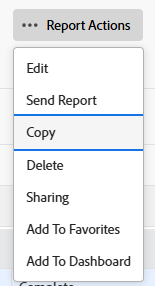

# Creación de una copia de un informe

<!-- Audited: 11/2024 -->

Puede crear una copia de cualquier informe al que tenga acceso. Puede crear una copia exacta de un informe personalizado o guardar una nueva versión de un informe predeterminado. Una vez copiado un informe, pasa a ser el propietario del informe copiado y aparece en la sección Mis informes.

## Requisitos de acceso

+++ Expanda para ver los requisitos de acceso para la funcionalidad en este artículo.

Debe tener el siguiente acceso para realizar los pasos de este artículo:

<table style="table-layout:auto"> 
 <col> 
 <col> 
 <tbody> 
  <tr> 
   <td role="rowheader">Plan de Adobe Workfront*</td> 
   <td> 
Cualquiera
 </td> 
  </tr> 
  <tr> 
   <td role="rowheader">Licencia de Adobe Workfront*</td> 
   <td> 
      
Nuevo:

         <ul>
         <li>
Estándar
</li>
         </ul>
      
Actual:

         <ul>
         <li>
Plan
</li>
         </ul>
   </td>
  </tr> 
  <tr> 
   <td role="rowheader">Configuraciones de nivel de acceso*</td> 
   <td> 
Acceso de edición a informes, paneles y calendarios
 
Acceso de edición a filtros, vistas y agrupaciones
</td> 
  </tr> 
  <tr> 
   <td role="rowheader">Permisos de objeto*</td> 
   <td>
Permisos de visualización para un informe
</td> 
  </tr> 
 </tbody> 
</table>

*Para obtener información, consulte [Requisitos de acceso en la documentación de Workfront](/help/quicksilver/administration-and-setup/add-users/access-levels-and-object-permissions/access-level-requirements-in-documentation.md).

+++

## Crear una copia exacta de un informe

Si desea realizar una copia de un informe personalizado, haga lo siguiente:

1. Haga clic en el icono **[!UICONTROL Main Menu]**  en la esquina superior derecha de Adobe Workfront o (si está disponible), haga clic en el icono **[!UICONTROL Main Menu]**  en la esquina superior izquierda y, a continuación, haga clic en **[!UICONTROL Informes]**.

1. Haga clic en **Todos los informes** y, a continuación, abra un informe.

1. Haga clic en **Acciones de informe** y luego en **Copiar**.

   >[!TIP]
   >
   >Si el informe es un informe predeterminado, la opción Copiar no aparece en el menú Acciones de informe.\
   >Para obtener información sobre cómo crear una copia de un informe predeterminado, consulte [Crear una nueva versión de un informe](#create-a-new-version-of-a-report).

   

   Se crea una copia del informe original con el nombre predeterminado _[Nombre del informe original] (Copiar)_. Por ejemplo, una copia del informe &quot;Tareas completadas en el cuarto trimestre&quot; se llamaría &quot;Tareas completadas en el cuarto trimestre (copia)&quot;.

1. (Opcional) Para cambiar el nombre del informe, haga clic en **Acciones de informe** y luego en **Editar**. Escriba un nombre nuevo en el cuadro de texto de la esquina superior izquierda y haga clic en **Guardar + Cerrar** cuando termine.

1. (Opcional) Para compartir la nueva versión del informe con otros usuarios, haga clic en **Acciones de informe** y luego en **Compartir**.

   >[!NOTE]
   >
   >La información compartida no se transfiere al informe copiado desde la versión original.\
   >Para obtener información sobre cómo ver con quién se compartió el informe anterior, consulte [Crear un informe de actividades de informes](../../../reports-and-dashboards/reports/report-usage/create-report-reporting-activities.md#identify).

1. (Opcional) Si tiene permisos de Administración para el informe original y este ya no es necesario, puede eliminarlo para eliminar los informes duplicados innecesarios en Workfront.

   Para eliminar el informe original, haga lo siguiente:

   1. Vaya al informe.

   1. Haga clic en **Acciones de informe** y luego en **Eliminar**.

   1. Haga clic en **Sí, eliminarlo** para confirmar que desea eliminar el informe.

## Creación de una nueva versión de un informe {#create-a-new-version-of-a-report}

Si desea crear una copia de un informe integrado, haga lo siguiente:

1. Haga clic en el icono **Menú principal**  en la esquina superior derecha de Adobe Workfront.

1. Haga clic en **Informes** y luego en **Todos los informes**.
1. Haga clic en el nombre de un informe integrado para abrirlo.
1. Haga clic en **Acciones de informe** y, a continuación, en **Editar**.

   

1. Realice las modificaciones necesarias en las siguientes pestañas del informe:

   * **Columnas (vista)**: para obtener más información acerca de cómo personalizar vistas, vea el artículo [Información general sobre vistas en Adobe Workfront](../../../reports-and-dashboards/reports/reporting-elements/views-overview.md).
   * **Agrupaciones**: para obtener más información acerca de cómo personalizar agrupaciones, vea el artículo [Información general sobre agrupaciones en Adobe Workfront](../../../reports-and-dashboards/reports/reporting-elements/groupings-overview.md).
   * **Filtros**: para obtener más información acerca de cómo personalizar filtros, vea el artículo [Resumen de filtros](../../../reports-and-dashboards/reports/reporting-elements/filters-overview.md).
   * **Gráfico**: para obtener más información acerca de cómo personalizar un gráfico de informe, vea el artículo [Agregar un gráfico a un informe](../../../reports-and-dashboards/reports/creating-and-managing-reports/add-chart-report.md).

1. En la esquina superior derecha, haga clic en **Configuración de informes**.
1. En el campo **Título del informe**, asigne un nombre nuevo al informe.
1. Haga clic en **Listo**.
1. Haga clic en **Guardar como nuevo informe**.

   

1. (Opcional) Para compartir la nueva versión del informe con otros usuarios, haga clic en **Acciones de informe** y luego en **Compartir**.
