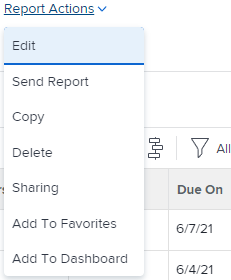

# Creación de una copia de un informe

Puede crear una copia de cualquier informe al que tenga acceso. Puede crear una copia exacta de un informe personalizado o guardar una nueva versión de un informe predeterminado. Una vez copiado un informe, pasa a ser el propietario del informe copiado y aparece en la sección Mis informes.

## Requisitos de acceso

Debe tener el siguiente acceso para realizar los pasos de este artículo:

<table style="table-layout:auto"> 
 <col> 
 <col> 
 <tbody> 
  <tr> 
   <td role="rowheader">plan Adobe Workfront*</td> 
   <td> 
Cualquiera
 </td> 
  </tr> 
  <tr> 
   <td role="rowheader">Licencia de Adobe Workfront*</td> 
   <td> 
Plan 
 </td> 
  </tr> 
  <tr> 
   <td role="rowheader">Configuraciones de nivel de acceso*</td> 
   <td> 
Editar acceso a informes, tableros y calendarios
 
Editar acceso a filtros, vistas y agrupaciones
 
Nota: Si sigue sin tener acceso, pregunte al administrador de Workfront si ha establecido restricciones adicionales en su nivel de acceso. Para obtener información sobre cómo un administrador de Workfront puede modificar su nivel de acceso, consulte <a href="../../../administration-and-setup/add-users/configure-and-grant-access/create-modify-access-levels.md" class="MCXref xref">Crear o modificar niveles de acceso personalizados</a>.
 </td> 
  </tr> 
  <tr> 
   <td role="rowheader">Permisos de objeto</td> 
   <td> 
Ver permisos de un informe
 
Para obtener información sobre cómo solicitar acceso adicional, consulte <a href="../../../workfront-basics/grant-and-request-access-to-objects/request-access.md" class="MCXref xref">Solicitud de acceso a objetos </a>.
 </td> 
  </tr> 
 </tbody> 
</table>

&#42;Para saber qué plan, tipo de licencia o acceso tiene, póngase en contacto con su administrador de Workfront.

## Crear una copia exacta de un informe

Si desea realizar una copia de un informe del que es propietario, haga lo siguiente:

1. Haga clic en **Menú principal** icono  en la esquina superior derecha de Adobe Workfront.

1. Clic **Informes**, entonces **Todos los informes**.
1. Abra un informe.
1. Clic **Acciones de informe**, entonces **Copiar**.

   >[!TIP]
   >
   >Si el informe es un informe predeterminado, la opción Copiar no aparece en el menú Acciones de informe.\
   >Para obtener información sobre cómo crear una copia de un informe predeterminado, consulte [Creación de una nueva versión de un informe](#create-a-new-version-of-a-report).

   

   Se crea una copia del informe original con el nombre predeterminado de *Copia de [Nombre del informe original]*. Por ejemplo, el informe &quot;Tareas completadas en el cuarto trimestre&quot; tendría como nombre &quot;Copia de las tareas completadas en el cuarto trimestre&quot;.

1. (Opcional) Para cambiar el nombre del informe, empiece a escribir un nombre nuevo.

   >[!TIP]
   >
   >Si anula la selección del título antes de escribir el nuevo nombre, seleccione el título del informe, elimine el nombre y, a continuación, escriba el nuevo nombre.

1. (Opcional) Para compartir la nueva versión del informe con otros usuarios, haga clic en **Acciones de informe**, entonces **Uso compartido**.

   >[!NOTE]
   >
   >La información compartida no se transfiere al informe copiado desde la versión original.\
   >Para obtener información sobre cómo ver con quién se compartió el informe anterior, consulte [Creación de un informe sobre las actividades de creación de informes](../../../reports-and-dashboards/reports/report-usage/create-report-reporting-activities.md#identify).

1. (Opcional) Si tiene permisos de Administración para el informe original y este ya no es necesario, puede eliminarlo para eliminar los informes duplicados innecesarios en Workfront.

   Para eliminar el informe original, haga lo siguiente:

   1. Vaya al informe.
   1. Clic **Acciones de informe**, entonces **Eliminar**.

   1. Clic **Sí, eliminarla** para confirmar que desea eliminar el informe.

## Creación de una nueva versión de un informe {#create-a-new-version-of-a-report}

Si desea crear una copia de un informe predeterminado, haga lo siguiente:

1. Haga clic en **Menú principal** icono  en la esquina superior derecha de Adobe Workfront.

1. Clic **Informes**, entonces **Todos los informes**.
1. Haga clic en el nombre de un informe predeterminado para abrirlo.
1. Clic **Acciones de informe**, entonces **Editar**.

   

1. Realice las modificaciones necesarias en las siguientes pestañas del informe:

   * **Columnas (vista)**: para obtener más información sobre cómo personalizar vistas, consulte el artículo [Información general sobre vistas en Adobe Workfront](../../../reports-and-dashboards/reports/reporting-elements/views-overview.md).
   * **Agrupaciones**: para obtener más información sobre cómo personalizar agrupaciones, consulte el artículo [Información general sobre agrupaciones en Adobe Workfront](../../../reports-and-dashboards/reports/reporting-elements/groupings-overview.md).
   * **Filtros**: para obtener más información sobre cómo personalizar filtros, consulte el artículo [Resumen de filtros](../../../reports-and-dashboards/reports/reporting-elements/filters-overview.md).
   * **Gráfico**: para obtener más información sobre cómo personalizar un gráfico de informes, consulte el artículo [Agregar un gráfico a un informe](../../../reports-and-dashboards/reports/creating-and-managing-reports/add-chart-report.md).

1. En la esquina superior derecha, haga clic en **Configuración de informes**.
1. En el **Título del informe** , asigne un nuevo nombre al informe.
1. Clic **Listo**.
1. Clic **Guardar como nuevo informe**.

   

1. (Opcional) Para compartir la nueva versión del informe con otros usuarios, haga clic en **Acciones de informe**, entonces **Uso compartido**.
