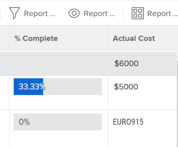

# Crear informes de datos financieros con tipos de cambio únicos

Si se han configurado varios tipos de cambio en Adobe Workfront, puede establecer valores financieros en informes y listas para que se muestren en una moneda distinta de la predeterminada.

>[!IMPORTANT]
>
>Si selecciona una moneda distinta de la predeterminada en una vista, ya no verá los vínculos **Agregar más tareas** y **Agregar más problemas** en la parte inferior de una lista de proyectos.

Para obtener información sobre cómo cambiar la moneda predeterminada de un proyecto determinado, consulte [Cambiar la moneda del proyecto](../../../manage-work/projects/project-finances/change-project-currency.md).

Si hay proyectos con una sola moneda en el informe, las sumas de las agrupaciones también se muestran en la moneda predeterminada del sistema.

## Requisitos de acceso

Debe tener el siguiente acceso para realizar los pasos de este artículo:

<table style="table-layout:auto"> 
 <col> 
 <col> 
 <tbody> 
  <tr> 
   <td role="rowheader">plan de Adobe Workfront*</td> 
   <td> 
Cualquiera
 </td> 
  </tr> 
  <tr> 
   <td role="rowheader">Licencia de Adobe Workfront*</td> 
   <td> 
Plan 
 </td> 
  </tr> 
  <tr> 
   <td role="rowheader">Configuraciones de nivel de acceso*</td> 
   <td> 
Editar acceso a informes, tableros y calendarios
 
Editar acceso a filtros, vistas y grupos
 
Nota: Si todavía no tiene acceso, pregunte a su administrador de Workfront si establece restricciones adicionales en su nivel de acceso. Para obtener información sobre cómo un administrador de Workfront puede modificar su nivel de acceso, consulte <a href="../../../administration-and-setup/add-users/configure-and-grant-access/create-modify-access-levels.md" class="MCXref xref">Crear o modificar niveles de acceso personalizados</a>.
 </td> 
  </tr> 
  <tr> 
   <td role="rowheader">Permisos de objeto</td> 
   <td> 
Administrar permisos en un informe
 
Para obtener información sobre la solicitud de acceso adicional, consulte <a href="../../../workfront-basics/grant-and-request-access-to-objects/request-access.md" class="MCXref xref">Solicitar acceso a objetos </a>.
 </td> 
  </tr> 
 </tbody> 
</table>

&#42;Para saber qué plan, tipo de licencia o acceso tiene, póngase en contacto con el administrador de Workfront.

## Requisitos previos

Para poder ver las monedas alternativas tal como se describe en esta sección, el administrador de Workfront primero debe habilitar y configurar varias monedas en el área Configuración de Workfront. Para obtener más información, consulte [Configurar tipos de cambio](../../../administration-and-setup/manage-workfront/exchange-rates/set-up-exchange-rates.md).

## Aplicar valores financieros a un informe {#apply-financial-values-to-a-report}

Para convertir valores financieros entre monedas al trabajar con informes:

1. Vaya al informe en el que desea convertir valores financieros a una moneda diferente.
1. Haga clic en el **Ver** lista desplegable, haga clic en **Cambiar moneda** y, a continuación, seleccione una de las siguientes monedas en la que desee mostrar los valores financieros:

   * Moneda original del proyecto
   * Cualquiera de las demás monedas

      >[!TIP]
      >
      >Solo puede elegir las monedas previamente seleccionadas en Configuración.
   El uso de esta opción le permite convertir rápidamente valores financieros en un informe entre valores de tasa.

   

   <!--
   
(NOTE: drafted this tip because I think this is confusing; this is in the step above.)

   -->

   <!--
   <note type="tip">
   You can also select the Change Currency option to convert financial values in other lists.
    
   
    
    
   </note>
   -->

## Mostrar la moneda predeterminada en varios proyectos con distintas monedas

Cuando personaliza la moneda en el nivel de proyecto y desea mostrar información de todos los proyectos del mismo informe, existen las siguientes situaciones:

* Si crea un informe que obtiene información financiera de dos o más proyectos que tienen distintas monedas aplicadas, de forma predeterminada el resumen de la agrupación refleja la moneda predeterminada del sistema seleccionada por el administrador de Workfront.
* Si crea un informe para dos o más proyectos que tienen la misma moneda, pero difieren de los de la moneda predeterminada del sistema, las sumas de las agrupaciones se muestran utilizando la moneda predeterminada del sistema.
* Si crea un informe para dos o más proyectos que tienen asignaciones de funciones asociadas con una anulación de moneda, Workfront convierte la información financiera de las tasas de divisa anuladas del rol de trabajo a la moneda del proyecto (cuando selecciona la Moneda original del proyecto en la vista) o a cualquier moneda diferente que seleccione al ver el informe. Para obtener información sobre cómo anular la moneda de una función de trabajo, consulte [Crear y administrar funciones de trabajo](../../../administration-and-setup/set-up-workfront/organizational-setup/create-manage-job-roles.md).

Para mostrar dos proyectos con monedas personalizadas en un informe:

1. Cree dos proyectos con distintas monedas aplicadas.

   

1. Inicie sesión en ambos proyectos.

   Para obtener más información sobre el tiempo de registro, consulte [Tiempo de registro](../../../timesheets/create-and-manage-timesheets/log-time.md).

1. Haga clic en el **Menú principal** icono y haga clic en **Informes**.
1. Haga clic en **Nuevo informe**, luego **Informe de proyecto**.
1. En el **Columnas (Vista)** , agregue una **Costo real** y resumirlo por **Sum**.

   Para obtener información sobre cómo crear una columna, consulte [Información general sobre las vistas en Adobe Workfront](../../../reports-and-dashboards/reports/reporting-elements/views-overview.md).

1. En el **Agrupaciones** , aplique un **Fecha de finalización planeada** agrupación.

   Para obtener información sobre cómo crear una agrupación, consulte [Información general sobre las agrupaciones en Adobe Workfront](../../../reports-and-dashboards/reports/reporting-elements/groupings-overview.md).

1. En el **Filtros** , agregue un filtro para **Nombre del proyecto** y seleccione los dos proyectos con las distintas monedas.

   Para obtener información sobre cómo crear un filtro, consulte [Información general sobre filtros en Adobe Workfront](../../../reports-and-dashboards/reports/reporting-elements/filters-overview.md).

1. Haga clic en **Guardar + Cerrar**.

   El total de **Costo real** se muestra en la Agrupación utilizando la moneda predeterminada del sistema, independientemente de la moneda de los proyectos del informe.

   

   Si los dos proyectos tienen monedas diferentes entre sí, la moneda predeterminada del sistema también se muestra en la Agrupación del informe.

## Mostrar la moneda del proyecto en un informe a nivel de proyecto

Si se aplica una agrupación a una lista de tareas o horas dentro de un proyecto, las sumas de la agrupación se muestran en la moneda del proyecto.

1. Cree un proyecto con una moneda personalizada, distinta de la moneda predeterminada del sistema.
1. Vaya al proyecto y asegúrese de que incluye las horas que se han registrado para las tareas.

   Para obtener más información sobre el tiempo de registro, consulte [Tiempo de registro](../../../timesheets/create-and-manage-timesheets/log-time.md).

   >[!NOTE]
   >
   >Las tareas deben asignarse a usuarios o funciones de trabajo con tasas de coste por hora.

1. Haga clic en **Tareas**.
1. Expanda el **Ver** menú desplegable y seleccione **Nueva vista**.
1. Agregar **Costo real** en la nueva vista como una columna nueva y resumirla en **Sum**.
1. Haga clic en **Listo** y haga clic en **Guardar vista**.
1. Expanda el **Agrupación** menú desplegable y seleccione **Nuevo grupo**.
1. Agregar **Fecha de finalización real** en la nueva agrupación como campo nuevo, haga clic en **Guardar agrupación**.

   La variable **Costo real** resume en la nueva Agrupación y muestra el total en la moneda del proyecto.

## Editar informes con monedas únicas

Los campos financieros de un informe no se pueden editar hasta que cambie la configuración del informe para mostrar la moneda original de los proyectos.

Para editar en línea un campo financiero de un informe:

1. Vaya a un informe.

   >[!NOTE]
   >
   >Si la moneda predeterminada no se muestra para una lista en ninguna otra área, puede editar la vista para mostrar la moneda predeterminada.\
   >Para obtener información sobre cómo cambiar la moneda en una vista, consulte la sección de este artículo [Aplicar valores financieros a un informe](#apply-financial-values-to-a-report).

1. Haga clic en **Acciones de informe** y, a continuación, seleccione **Editar**.
1. Haga clic en **Configuración de informes**.
1. Haga clic en el **Moneda predeterminada** desplegable y, a continuación, seleccione **Moneda original del proyecto**.

   

1. Haga clic en **Listo**.
