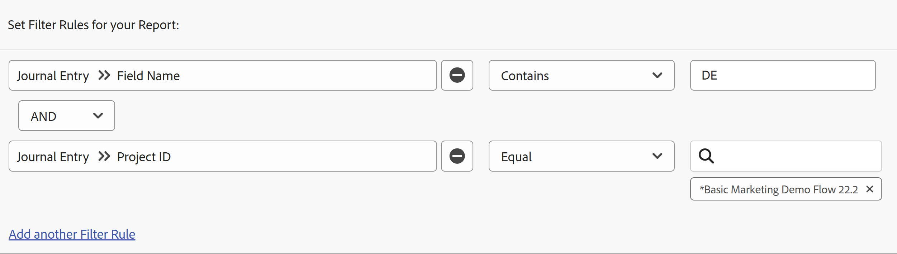

# Informe sobre el área de Actualizaciones

El informe Entrada de cuaderno muestra las actualizaciones del sistema desde el área Actualizaciones de proyectos, tareas, problemas y otros objetos que anteriormente solo estaban disponibles a través de la API de Adobe Workfront. Aunque se trata de un informe avanzado diseñado para casos de uso específicos, el formato más digerible facilita la creación de informes sobre la actividad del proyecto y las actualizaciones del sistema en Workfront.

>[!TIP]
>
>El informe Entrada de cuaderno sólo contiene actualizaciones del sistema desde el área de Actualizaciones de objetos. Para informar sobre los comentarios que queden en el área de Actualizaciones, debe utilizar el informe Nota.\
>Para obtener más información sobre el informe Nota, consulte [Ver todas las actualizaciones en un informe de notas](../../../workfront-basics/updating-work-items-and-viewing-updates/view-all-updates-in-a-report.md). DATADOM

El informe Entrada de cuaderno puede mostrar:

* Cuántos cambios de estado se han producido
* Cuando se eliminó una tarea o un problema
* Cómo cambiaron los valores de los campos personalizados importantes a lo largo del ciclo de vida de un proyecto
* Qué fechas importantes cambiaron durante el ciclo de vida de un proyecto
* Si el propietario de un proyecto ha cambiado

## Requisitos de acceso

Debe tener el siguiente acceso para realizar los pasos de este artículo:

<table style="table-layout:auto"> 
 <col> 
 <col> 
 <tbody> 
  <tr> 
   <td role="rowheader">plan Adobe Workfront*</td> 
   <td> 
Cualquiera
 </td> 
  </tr> 
  <tr> 
   <td role="rowheader">Licencia de Adobe Workfront*</td> 
   <td> 
Plan 
 </td> 
  </tr> 
  <tr> 
   <td role="rowheader">Configuraciones de nivel de acceso*</td> 
   <td> 
Editar acceso a informes, tableros y calendarios
 
Editar acceso a filtros, vistas y agrupaciones
 
Nota: Si sigue sin tener acceso, pregunte al administrador de Workfront si ha establecido restricciones adicionales en su nivel de acceso. Para obtener información sobre cómo un administrador de Workfront puede modificar su nivel de acceso, consulte <a href="../../../administration-and-setup/add-users/configure-and-grant-access/create-modify-access-levels.md" class="MCXref xref">Crear o modificar niveles de acceso personalizados</a>.
 </td> 
  </tr> 
  <tr> 
   <td role="rowheader">Permisos de objeto</td> 
   <td> 
Ver permisos para los objetos que contienen las entradas del diario que se muestran en el informe
 
Obtendrá permisos de administración en el informe después de crearlo
 
Para obtener información sobre cómo solicitar acceso adicional, consulte <a href="../../../workfront-basics/grant-and-request-access-to-objects/request-access.md" class="MCXref xref">Solicitud de acceso a objetos </a>.
 </td> 
  </tr> 
 </tbody> 
</table>

&#42;Para saber qué plan, tipo de licencia o acceso tiene, póngase en contacto con su administrador de Workfront.

## Requisitos previos

Antes de realizar las acciones descritas en este artículo, debe asegurarse de lo siguiente:

* Cualquier campo sobre el que desee crear un informe se rastrea en Workfront. Solo puede informar sobre los datos del área de Actualizaciones de la que se realiza un seguimiento.

  Para obtener información sobre cómo agregar campos de los que desea que Workfront realice un seguimiento, consulte [Configurar actualizaciones del sistema](../../../administration-and-setup/set-up-workfront/system-tracked-update-feeds/configure-system-updates.md).

* Los campos personalizados sobre los que desee informar tienen la configuración **Mostrar cambios de los campos en las fuentes de actualización** activado.

  Para obtener información sobre cómo habilitar esta configuración para un campo personalizado, consulte la sección [Crear o editar un formulario personalizado](../../../administration-and-setup/customize-workfront/create-manage-custom-forms/create-or-edit-a-custom-form.md#create) en el artículo [Crear o editar un formulario personalizado](../../../administration-and-setup/customize-workfront/create-manage-custom-forms/create-or-edit-a-custom-form.md).

## Resumen del informe de entradas de diario

Como el informe Entrada de cuaderno consulta las actualizaciones del sistema, puede devolver un número significativo de resultados. Por este motivo, le recomendamos que filtre a objetos específicos, como proyectos, programas, portafolios, grupos, etc., al crear el informe.

Para obtener más información sobre los distintos tipos de objetos en Workfront, consulte [Explicación de los objetos en Adobe Workfront](../../../workfront-basics/navigate-workfront/workfront-navigation/understand-objects.md).

>[!NOTE]
>
>Como el informe Entrada de cuaderno devuelve tantos datos, no se admite la exportación ni la entrega programada del informe.

La vista predeterminada para este informe contiene las siguientes columnas:

<table style="table-layout:auto"> 
 <col> 
 <col> 
 <thead> 
  <tr> 
   <th>Campo</th> 
   <th>Explicación</th> 
  </tr> 
 </thead> 
 <tbody> 
  <tr> 
   <td><strong>Nombre de campo</strong> </td> 
   <td> 
Nombre del campo afectado. En función de cómo configure el informe, esta columna puede contener los campos Estado, ID de propietario, Nombre de tarea, Fecha planificada de finalización u otros. 
 
Cuándo <strong>DE</strong>: aparece en esta columna e indica que el campo mostrado es un campo personalizado.
 </td> 
  </tr> 
  <tr> 
   <td><strong>Cambiar tipo</strong> </td> 
   <td> 
El tipo de cambio realizado en el campo afectado. Según las reglas de filtro que configure y las acciones realizadas por los usuarios, puede aparecer lo siguiente en este campo:
 
    <ul> 
     <li> 
Agregar
 </li> 
     <li> 
Auditar
 </li> 
     <li> 
Eliminar
 </li> 
     <li> 
Resumen
 </li> 
     <li> 
Editar
 </li> 
     <li> 
Restaurar
 </li> 
    </ul> </td> 
  </tr> 
  <tr> 
   <td><strong>ObjCode superior</strong> </td> 
   <td> 
El objeto principal más alto de la jerarquía.
 </td> 
  </tr> 
  <tr> 
   <td><strong>Ámbito</strong> </td> 
   <td> 
Tipo de objeto que se ha cambiado.
 </td> 
  </tr> 
  <tr> 
   <td><strong>Fecha de entrada</strong> </td> 
   <td> 
La fecha en la que se cambió el campo.
 </td> 
  </tr> 
  <tr> 
   <td><strong>Editado por nombre</strong> </td> 
   <td> 
El usuario que cambió el campo.
 </td> 
  </tr> 
 </tbody> 
</table>

Para organizar la información de este informe, puede utilizar la agrupación integrada Proyecto. La agrupación Proyecto proporciona una agrupación principal de Nombre del proyecto y una agrupación secundaria de Fecha de entrada. Puede aplicar esta agrupación existente durante la creación del informe o puede aplicarla cuando visualice el informe.

Para obtener información sobre cómo configurar las vistas, los filtros y las agrupaciones que desee para el informe, consulte la sección correspondiente:

<!--

(NOTE: from&nbsp;Luke: Take this for what it's worth, but part of me wonders if all of these subsections should be separate articles.

The biggest reason for breaking these up would be searchability, in my mind. For example, as a user, I might want to know how to see if the owner of a project changed. If I search the help site for that, I would be a lot more likely to find a separate article called "See if the owner of a project changed" vs an article titled "Create a Journal Entry report" because "Journal Entry" might mean nothing to me.) 

-->

* [Ver qué cambios de estado se han producido](#see-what-status-changes-occurred)
* [Ver cuándo se eliminó una tarea o un problema](#see-when-a-task-or-issue-was-deleted)
* [Ver cómo cambiaron los campos personalizados durante el ciclo de vida de un proyecto](#see-how-custom-fields-changed-over-the-course-of-a-project-s-life-cycle)
* [Ver cómo cambió la fecha planificada de finalización a lo largo del ciclo de vida de un proyecto](#see-how-the-planned-completion-date-changed-over-the-course-of-a-project-s-life-cycle)
* [Ver si ha cambiado el propietario de un proyecto](#see-if-the-owner-of-a-project-changed)

## Ver qué cambios de estado se han producido {#see-what-status-changes-occurred}

Puede configurar el informe Asientos para que muestre:

* Cuántos cambios de estado se realizaron en un proyecto, tarea o problema

* Estado anterior antes del cambio
* Quién cambió el estado
* Cuando se produjo el cambio de estado

Si desea ver el estado de un proyecto, también puede configurar el informe para que muestre esta misma información utilizando el proyecto **Condición** field.

Esta información se puede utilizar para ayudar con la auditoría y para ilustrar lo bien que usted y su organización están planificando.

<!--

(NOTE:&nbsp;for tip below: When analytics adds the status option, update this note to say "these entries (status or condition changes)")

-->

>[!TIP]
>
>Si desea comparar la diferencia de días entre los cambios de condición, puede utilizar el análisis mejorado.\
>Para obtener más información sobre el análisis mejorado, consulte [Resumen de análisis mejorado](../../../enhanced-analytics/enhanced-analytics-overview.md).

1. Haga clic en **Menú principal** icono  en la esquina superior derecha de Adobe Workfront, haga clic en **Informes**.
1. Clic **Nuevo informe**, luego seleccione **Entrada de diario**.

   

   Se carga Report Builder.

1. En el **Columnas (vista)** , añada las siguientes columnas:

   <table style="table-layout:auto"> 
    <col> 
    <col> 
    <thead> 
     <tr> 
      <th>Columna</th> 
      <th>Explicación</th> 
     </tr> 
    </thead> 
    <tbody> 
     <tr> 
      <td> 
Nombre de campo
 </td> 
      <td> 
Nombre del campo afectado. En este caso, <strong>status</strong> debería mostrarse en esta columna.
 </td> 
     </tr> 
     <tr> 
      <td> 
Cambiar tipo
 </td> 
      <td> 
El tipo de cambio realizado en el campo afectado, como <strong>Añadir</strong>, <strong>Eliminar</strong>, o <strong>Editar</strong>.
 </td> 
     </tr> 
     <tr> 
      <td> 
Editado por nombre
 </td> 
      <td> 
El nombre del usuario que actualizó el estado.
 </td> 
     </tr> 
     <tr> 
      <td> 
Fecha de entrada
 </td> 
      <td> 
La fecha en la que se cambió el estado.
 </td> 
     </tr> 
     <tr> 
      <td> 
Valor de texto anterior
 </td> 
      <td> 
La clave del estado anterior. Las siguientes son las claves de estado de los estados de proyecto predeterminados:
 
       <ul> 
        <li> 
 <strong>CUR</strong>: Actual
 </li> 
        <li> 
<strong>MUERTO</strong>: Inactivo
 </li> 
        <li> 
<strong>ONH</strong>: En espera
 </li> 
        <li> 
<strong>PLN</strong>: Planificación
 </li> 
        <li> 
<strong>CPL</strong>: completo
 </li> 
        <li> 
<strong>REQ</strong>: Solicitado
 </li> 
        <li> 
<strong>ABR</strong>: aprobado
 </li> 
        <li> 
<strong>REJ</strong>: rechazado
 </li> 
        <li> 
<strong>IDA</strong>: idea
 </li> 
       </ul> 
Si su organización ha configurado estados personalizados, es posible que en esta columna aparezcan otras claves de estado. Para saber qué estado personalizado está relacionado con una clave de estado, póngase en contacto con el administrador de Workfront o del grupo.
 </td> 
     </tr> 
     <tr> 
      <td> 
Nuevo valor de texto
 </td> 
      <td> 
La clave para el estado actualizado.
 </td> 
     </tr> 
     <tr> 
      <td> 
Código de objeto superior
 </td> 
      <td> 
El objeto principal más alto para el campo que tuvo el cambio de estado.
 </td> 
     </tr> 
     <tr> 
      <td> 
Ámbito
 </td> 
      <td> 
El tipo de objeto cuyo estado ha cambiado.
 </td> 
     </tr> 
     <tr> 
      <td> 
Nombre de problema (Opcional)
 </td> 
      <td> 
El nombre del problema que tuvo un cambio de estado.
 </td> 
     </tr> 
     <tr> 
      <td> 
Nombre de tarea (Opcional)
 </td> 
      <td> 
Nombre de la tarea cuyo estado ha cambiado.
 </td> 
     </tr> 
    </tbody> 
   </table>

   Para obtener más información sobre cómo añadir columnas, consulte [Información general sobre vistas en Adobe Workfront](../../../reports-and-dashboards/reports/reporting-elements/views-overview.md).

1. En el **Filtros** pestaña, haga clic en **Agregar regla de filtro** y luego agregue la regla de filtro **Nombre de campo** > **Igual** > **status**.

   

   >[!TIP]
   >
   >Para informar sobre los cambios de condición, en su lugar puede agregar la regla de filtro **Nombre de campo** > **Igual** > **Condición**.

   Para obtener más información sobre cómo añadir filtros, consulte [Resumen de filtros](../../../reports-and-dashboards/reports/reporting-elements/filters-overview.md).

1. (Opcional) Para reducir el enfoque del informe y los tiempos de carga, añada un mensaje.

   O

   Cree reglas de filtro adicionales para incluir proyectos, tareas o problemas específicos.

   >[!IMPORTANT]
   >
   >Creación de una regla de filtro que utilice el modificador **Contains** puede aumentar los tiempos de carga. Por este motivo, recomendamos utilizar un modificador diferente como **Igual** cuando sea posible, para filtrar por un proyecto específico o ID de objeto de nivel superior.

   Para obtener información sobre cómo agregar un mensaje, consulte [Agregar una solicitud a un informe](../../../reports-and-dashboards/reports/creating-and-managing-reports/add-prompt-report.md).

1. En el **Agrupaciones** pestaña, haga clic en **Aplicar agrupación existente**, luego seleccione **Proyecto**.

   Para obtener más información sobre cómo agregar agrupaciones, consulte [Información general sobre agrupaciones en Adobe Workfront](../../../reports-and-dashboards/reports/reporting-elements/groupings-overview.md).

1. Haga clic en **Guardar + Cerrar**.

   Se carga el nuevo informe.

## Ver cuándo se eliminó una tarea o un problema {#see-when-a-task-or-issue-was-deleted}

Puede configurar el informe Asientos para que muestre:

* Qué tareas o problemas se han eliminado
* Quién eliminó una tarea o un problema

Para ver cuándo se eliminó una tarea o un problema:

1. Haga clic en **Menú principal** icono  en la esquina superior derecha de Adobe Workfront, haga clic en **Informes**.
1. Clic **Nuevo informe**, luego seleccione **Entrada de diario**.

   

   Se carga Report Builder.

1. En el **Columnas (vista)** , añada las siguientes columnas:

   <table style="table-layout:auto"> 
    <col> 
    <col> 
    <thead> 
     <tr> 
      <th>Columna</th> 
      <th>Explicación</th> 
     </tr> 
    </thead> 
    <tbody> 
     <tr> 
      <td> 
Ámbito
 </td> 
      <td> 
El tipo de objeto que se eliminó.
 </td> 
     </tr> 
     <tr> 
      <td> 
Cambiar tipo
 </td> 
      <td> 
El tipo de cambio que se produjo. El <strong>Eliminar</strong> el cambio se muestra en esta columna.
 </td> 
     </tr> 
     <tr> 
      <td> 
Fecha de entrada
 </td> 
      <td> 
La fecha en la que se eliminó la tarea o el problema.
 </td> 
     </tr> 
     <tr> 
      <td> 
Editado por nombre
 </td> 
      <td> 
Nombre del usuario que eliminó la tarea o el problema.
 </td> 
     </tr> 
     <tr> 
      <td> 
Nombre del proyecto
 </td> 
      <td> 
Nombre del proyecto que tuvo tareas o problemas eliminados.
 </td> 
     </tr> 
    </tbody> 
   </table>

   Para obtener más información sobre cómo añadir columnas, consulte [Información general sobre vistas en Adobe Workfront](../../../reports-and-dashboards/reports/reporting-elements/views-overview.md).

1. En el **Filtros** pestaña, haga clic en **Agregar regla de filtro** y, a continuación, agregue lo siguiente:

   * **Cambiar tipo** > **Igual** > **Eliminar**
   * **Identificador de proyecto** > **Igual** > **`<project>`**

     <!--WRITER check link; this png file has spaces
     -->

   Para obtener más información sobre cómo añadir filtros, consulte [Resumen de filtros](../../../reports-and-dashboards/reports/reporting-elements/filters-overview.md).

1. (Opcional) Para reducir el enfoque del informe y los tiempos de carga, añada un mensaje.

   O

   Cree reglas de filtro adicionales para incluir proyectos, tareas o problemas específicos.

   >[!IMPORTANT]
   >
   >Creación de una regla de filtro que utilice el modificador **Contains** puede aumentar los tiempos de carga. Por este motivo, recomendamos utilizar un modificador diferente como **Igual** cuando sea posible, para filtrar por un proyecto específico o ID de objeto de nivel superior.

   Para obtener información sobre cómo agregar un mensaje, consulte [Agregar una solicitud a un informe](../../../reports-and-dashboards/reports/creating-and-managing-reports/add-prompt-report.md).

1. (Opcional) En el **Agrupaciones** pestaña, haga clic en **Aplicar agrupación existente**, luego seleccione **Proyecto**.

   Para obtener más información sobre cómo agregar agrupaciones, consulte [Información general sobre agrupaciones en Adobe Workfront](../../../reports-and-dashboards/reports/reporting-elements/groupings-overview.md).

1. Haga clic en **Guardar + Cerrar**.

   Se carga el nuevo informe.

## Ver cómo cambiaron los campos personalizados durante el ciclo de vida de un proyecto {#see-how-custom-fields-changed-over-the-course-of-a-project-s-life-cycle}

Puede realizar un seguimiento de los cambios importantes en los campos a lo largo del proyecto. Para ello, puede configurar la entrada de cuaderno para que realice un seguimiento:

* Si se han agregado, actualizado o editado ciertos campos personalizados
* Cuando se produjeron estos cambios
* Quién realizó los cambios

Para ver cómo han cambiado los campos personalizados durante el ciclo de vida de un proyecto:

1. Haga clic en **Menú principal** icono  en la esquina superior derecha de Adobe Workfront, haga clic en **Informes**.
1. Clic **Nuevo informe**, luego seleccione **Entrada de diario**.

   

   Se carga Report Builder.

1. En el **Columnas (vista)** , añada las siguientes columnas:

   <table style="table-layout:auto"> 
    <col> 
    <col> 
    <thead> 
     <tr> 
      <th>Columna</th> 
      <th>Explicación</th> 
     </tr> 
    </thead> 
    <tbody> 
     <tr> 
      <td> 
Nombre de campo
 </td> 
      <td> 
Nombre del campo personalizado afectado.
 
Cuándo <strong>DE</strong>: aparece en esta columna e indica que el campo mostrado es un campo personalizado.
 </td> 
     </tr> 
     <tr> 
      <td> 
Cambiar tipo
 </td> 
      <td> 
El tipo de cambio realizado en el campo afectado, como <strong>Añadir</strong>, <strong>Eliminar</strong>, o <strong>Editar</strong>.
 </td> 
     </tr> 
     <tr> 
      <td> 
Editado por nombre
 </td> 
      <td> 
El nombre del usuario que actualizó el campo personalizado.
 </td> 
     </tr> 
     <tr> 
      <td> 
Fecha de entrada
 </td> 
      <td> 
La fecha en la que cambió el valor del campo personalizado.
 
Debe ordenar por este campo en orden descendente.
 </td> 
     </tr> 
     <tr> 
      <td> 
Valor de número anterior
 </td> 
      <td> 
El valor numérico anterior del campo personalizado.
 </td> 
     </tr> 
     <tr> 
      <td> 
Nuevo valor de número
 </td> 
      <td> 
El valor del número actual en el campo personalizado.
 </td> 
     </tr> 
     <tr> 
      <td> 
Valor de fecha anterior
 </td> 
      <td> 
El valor de fecha anterior en el campo personalizado.
 </td> 
     </tr> 
     <tr> 
      <td> 
Nuevo valor de fecha
 </td> 
      <td> 
El valor de fecha actual en el campo personalizado.
 </td> 
     </tr> 
     <tr> 
      <td> 
Valor de texto anterior
 </td> 
      <td> 
El valor de texto anterior del campo personalizado.
 </td> 
     </tr> 
     <tr> 
      <td> 
Nuevo valor de texto
 </td> 
      <td> 
El valor de texto actual en el campo personalizado.
 
Si el campo personalizado es un campo de escritura anticipada, la variable <strong>Nuevo valor de texto</strong> muestra el ID de objeto.
 </td> 
     </tr> 
    </tbody> 
   </table>

   Para obtener más información sobre cómo añadir columnas, consulte [Información general sobre vistas en Adobe Workfront](../../../reports-and-dashboards/reports/reporting-elements/views-overview.md).

1. En el **Filtros** pestaña, haga clic en **Agregar regla de filtro** y, a continuación, agregue lo siguiente:

   * **Nombre del campo de entrada de diario** > **Contains** > **DE**

     >[!TIP]
     >
     >Para limitar este informe a campos personalizados específicos, agregue la regla de filtro **Nombre del campo de entrada de diario** > **Igual** > **`<custom field>`**.

   * **Identificador de proyecto** > **Igual** > **`<project>`**

     

   Para obtener más información sobre cómo añadir filtros, consulte [Resumen de filtros](../../../reports-and-dashboards/reports/reporting-elements/filters-overview.md).

1. (Opcional) Para reducir el enfoque del informe y los tiempos de carga, añada un mensaje.

   O

   Cree reglas de filtro adicionales para incluir proyectos, tareas o problemas específicos.

   >[!IMPORTANT]
   >
   >Creación de una regla de filtro que utilice el modificador **Contains** puede aumentar los tiempos de carga. Por este motivo, recomendamos utilizar un modificador diferente como **Igual** cuando sea posible, para filtrar por un proyecto específico o ID de objeto de nivel superior.

   Para obtener información sobre cómo agregar un mensaje, consulte [Agregar una solicitud a un informe](../../../reports-and-dashboards/reports/creating-and-managing-reports/add-prompt-report.md).

1. En el **Agrupaciones** pestaña, haga clic en **Aplicar agrupación existente**, luego seleccione **Proyecto**.

   Para obtener más información sobre cómo agregar agrupaciones, consulte [Información general sobre agrupaciones en Adobe Workfront](../../../reports-and-dashboards/reports/reporting-elements/groupings-overview.md).

1. Haga clic en **Guardar + Cerrar**.

   Se carga el nuevo informe.

## Ver cómo cambió la fecha planificada de finalización a lo largo del ciclo de vida de un proyecto {#see-how-the-planned-completion-date-changed-over-the-course-of-a-project-s-life-cycle}

Puede configurar el informe Entrada de cuaderno para mostrar la frecuencia con la que cambia la fecha planificada de finalización a lo largo de la vida útil de un proyecto.

1. Haga clic en **Menú principal** icono  en la esquina superior derecha de Adobe Workfront, haga clic en **Informes**.
1. Clic **Nuevo informe**, luego seleccione **Entrada de diario**.

   

   Se carga Report Builder.

1. En el **Columnas (vista)** , añada las siguientes columnas:

   <table style="table-layout:auto"> 
    <col> 
    <col> 
    <thead> 
     <tr> 
      <th>Columna</th> 
      <th>Explicación</th> 
     </tr> 
    </thead> 
    <tbody> 
     <tr> 
      <td> 
Nombre de campo
 </td> 
      <td> 
Nombre del campo afectado.
 
Cuándo <strong>DE</strong>: aparece en esta columna e indica que el campo mostrado es un campo personalizado.
 </td> 
     </tr> 
     <tr> 
      <td> 
Cambiar tipo
 </td> 
      <td>El tipo de cambio que se produjo, como <strong>Añadir</strong>, <strong>Eliminar</strong>, o <strong>Editar</strong>.</td> 
     </tr> 
     <tr> 
      <td> 
Editado por nombre
 </td> 
      <td> 
Nombre del usuario que actualizó la fecha planificada de finalización del proyecto.
 </td> 
     </tr> 
     <tr> 
      <td> 
Fecha de entrada
 </td> 
      <td> 
La fecha en la que se cambió la fecha planificada de finalización del proyecto.
 
Debe ordenar por este campo en orden descendente.
 </td> 
     </tr> 
     <tr> 
      <td> 
Código de objeto superior
 </td> 
      <td> 
El objeto principal más alto para el campo que tuvo el cambio de Fecha planificada de finalización.
 </td> 
     </tr> 
     <tr> 
      <td> 
Ámbito
 </td> 
      <td> 
El objeto que tuvo el cambio de Fecha planificada de finalización.
 </td> 
     </tr> 
     <tr> 
      <td> 
Valor de fecha anterior
 </td> 
      <td> 
El valor anterior de la fecha planificada de finalización.
 </td> 
     </tr> 
     <tr> 
      <td> 
Nuevo valor de fecha
 </td> 
      <td> 
El valor actual para la fecha planificada de finalización.
 </td> 
     </tr> 
     <tr> 
      <td> 
Nombre del proyecto
 
(Opcional)
 </td> 
      <td> 
Nombre del proyecto que cambió la fecha planificada de finalización.
 </td> 
     </tr> 
     <tr> 
      <td> 
Nombre de la tarea
 
(Opcional)
 </td> 
      <td> 
Nombre de las tareas del proyecto cuya fecha planificada de finalización ha cambiado.
 </td> 
     </tr> 
     <tr> 
      <td> 
Nombre del problema
 
(Opcional)
 </td> 
      <td>Nombre de los problemas del proyecto que tienen el cambio de fecha planificada de finalización.</td> 
     </tr> 
    </tbody> 
   </table>

   Para obtener más información sobre cómo añadir columnas, consulte [Información general sobre vistas en Adobe Workfront](../../../reports-and-dashboards/reports/reporting-elements/views-overview.md).

1. En el **Filtros** pestaña, haga clic en **Agregar regla de filtro** y, a continuación, agregue lo siguiente:

   * **Nombre de campo** > **Igual** > **Fecha**
   * **Identificador de proyecto** > **Igual** > **`<project>`**

   

   Para obtener más información sobre cómo añadir filtros, consulte [Resumen de filtros](../../../reports-and-dashboards/reports/reporting-elements/filters-overview.md).

1. (Opcional) Para reducir el enfoque del informe y los tiempos de carga, añada un mensaje.

   O

   Cree reglas de filtro adicionales para incluir proyectos, tareas o problemas específicos.

   >[!IMPORTANT]
   >
   >Creación de una regla de filtro que utilice el modificador **Contains** puede aumentar los tiempos de carga. Por este motivo, recomendamos utilizar un modificador diferente como **Igual** cuando sea posible, para filtrar por un proyecto específico o ID de objeto de nivel superior.

   Para obtener información sobre cómo agregar un mensaje, consulte [Agregar una solicitud a un informe](../../../reports-and-dashboards/reports/creating-and-managing-reports/add-prompt-report.md).

1. En el **Agrupaciones** pestaña, haga clic en **Aplicar agrupación existente**, luego seleccione **Proyecto**.

   Para obtener más información sobre cómo agregar agrupaciones, consulte [Información general sobre agrupaciones en Adobe Workfront](../../../reports-and-dashboards/reports/reporting-elements/groupings-overview.md).

1. Haga clic en **Guardar + Cerrar**.

   Se carga el nuevo informe.

## Ver si ha cambiado el propietario de un proyecto {#see-if-the-owner-of-a-project-changed}

Puede configurar el informe Entrada de cuaderno para que muestre cuántas veces cambia el propietario del proyecto (o el jefe de proyecto) a lo largo de la vida de un proyecto.

1. Haga clic en **Menú principal** icono  en la esquina superior derecha de Adobe Workfront, haga clic en **Informes**.
1. Clic **Nuevo informe**, luego seleccione **Entrada de diario**.

   

   Se carga Report Builder.

1. En el **Columnas (vista)** , añada las siguientes columnas:

   <table style="table-layout:auto"> 
    <col> 
    <col> 
    <thead> 
     <tr> 
      <th>Columna</th> 
      <th>Explicación</th> 
     </tr> 
    </thead> 
    <tbody> 
     <tr> 
      <td> 
Nombre de campo
 </td> 
      <td>Nombre del campo afectado. El <strong>ownerID</strong> se muestra en esta columna.</td> 
     </tr> 
     <tr> 
      <td> 
Cambiar tipo
 </td> 
      <td> 
El tipo de cambio que se produjo, como <strong>Añadir</strong>, <strong>Eliminar</strong>, o <strong>Editar</strong>.
 </td> 
     </tr> 
     <tr> 
      <td> 
Código de objeto superior
 </td> 
      <td> 
El objeto principal más alto del proyecto que tuvo actualizado el propietario del proyecto.
 </td> 
     </tr> 
     <tr> 
      <td> 
Fecha de entrada
 </td> 
      <td>La fecha en la que se cambió el propietario del proyecto. Debe ordenar por este campo en orden descendente.</td> 
     </tr> 
     <tr> 
      <td> 
Editado por nombre
 </td> 
      <td> 
El nombre del usuario que actualizó al propietario del proyecto.
 </td> 
     </tr> 
     <tr> 
      <td> 
Información adicional 1
 </td> 
      <td> 
El propietario actual del proyecto.
 </td> 
     </tr> 
     <tr> 
      <td> 
Información adicional 2
 </td> 
      <td> 
Propietario del proyecto anterior del proyecto.
 </td> 
     </tr> 
     <tr> 
      <td> 
Nombre del proyecto
 </td> 
      <td> 
Proyecto que tuvo el campo Propietario del proyecto actualizado.
 </td> 
     </tr> 
    </tbody> 
   </table>

   Para obtener más información sobre cómo añadir columnas, consulte [Información general sobre vistas en Adobe Workfront](../../../reports-and-dashboards/reports/reporting-elements/views-overview.md).

1. En el **Filtros** pestaña, haga clic en **Agregar regla de filtro** y, a continuación, agregue lo siguiente:

   * **Nombre de campo** > **Igual** > **ownerID**
   * **Identificador de proyecto** > **Igual** > **`<project name>`**

     

   Para obtener más información sobre cómo añadir filtros, consulte [Resumen de filtros](../../../reports-and-dashboards/reports/reporting-elements/filters-overview.md).

1. (Opcional) Para reducir el enfoque del informe y los tiempos de carga, añada un mensaje.

   O

   Cree reglas de filtro adicionales para incluir proyectos, tareas o problemas específicos.

   >[!IMPORTANT]
   >
   >Creación de una regla de filtro que utilice el modificador **Contains** puede aumentar los tiempos de carga. Por este motivo, recomendamos utilizar un modificador diferente como **Igual** cuando sea posible, para filtrar por un proyecto específico o ID de objeto de nivel superior.

   Para obtener información sobre cómo agregar un mensaje, consulte [Agregar una solicitud a un informe](../../../reports-and-dashboards/reports/creating-and-managing-reports/add-prompt-report.md).

1. (Opcional) En el **Agrupaciones** pestaña, haga clic en **Aplicar agrupación existente**, luego seleccione **Proyecto**.

   Para obtener más información sobre cómo agregar agrupaciones, consulte [Información general sobre agrupaciones en Adobe Workfront](../../../reports-and-dashboards/reports/reporting-elements/groupings-overview.md).

1. Haga clic en **Guardar + Cerrar**.

   Se carga el nuevo informe.
