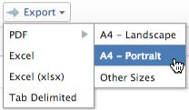

# Exportar datos

Puede exportar datos de Adobe Workfront desde varias listas, informes, tableros y búsquedas.
La información contenida en este artículo no se aplica a las siguientes exportaciones:

* Exportación de información desde informes de gráficos.

   Para obtener más información sobre cómo exportar un informe de gráfico, consulte [Agregar un gráfico a un informe](../../../reports-and-dashboards/reports/creating-and-managing-reports/add-chart-report.md).

* Exportación de información desde el gráfico Gantt.

   Para obtener más información sobre la exportación del diagrama de Gantt, consulte [Exportar el diagrama de Gantt al PDF](../../../manage-work/gantt-chart/use-the-gantt-chart/export-gantt-chart-to-pdf.md).

* Exportación de información desde el planificador de recursos.

   Para obtener más información sobre la exportación de información desde el planificador de recursos, consulte &quot;Opción de exportación&quot; en [Información general sobre navegación del planificador de recursos](../../../resource-mgmt/resource-planning/resource-planner-navigation.md).

Algunas de las razones para exportar datos son:

* Desea proporcionar una copia impresa de los datos a alguien que no esté en Workfront.
* Desea enviar los resultados de un informe como datos adjuntos a un usuario externo.
* Desea crear una copia de seguridad externa de los datos de Workfront.
* Hay un límite para mostrar solo 2000 resultados en una página dentro de la aplicación web de Workfront. Si el informe produce más de 2000, puede exportarlo a cualquiera de los formatos que se mencionan a continuación y obtener todos los resultados del informe en una lista.

Puede exportar un informe manualmente desde la interfaz de Workfront o programar una entrega para un informe, que se le enviará más adelante. Para obtener más información sobre la programación de informes entregados, consulte [Resumen del envío de informes](../../../reports-and-dashboards/reports/creating-and-managing-reports/set-up-report-deliveries.md).

## Requisitos de acceso

Debe tener el siguiente acceso para realizar los pasos de este artículo:

<table style="table-layout:auto"> 
 <col> 
 </col> 
 <col> 
 </col> 
 <tbody> 
  <tr> 
   <td role="rowheader">plan de Adobe Workfront*</td> 
   <td> <p>Cualquiera</p> </td> 
  </tr> 
  <tr> 
   <td role="rowheader">Licencia de Adobe Workfront*</td> 
   <td> <p>Revisar o superior</p> </td> 
  </tr> 
  <tr> 
   <td role="rowheader">Configuraciones de nivel de acceso*</td> 
   <td> <p>Ver o tener acceso superior a informes, tableros y calendarios para exportar informes</p> <p>Ver o acceder más a los objetos que se ven en una lista para exportar la lista</p> <p>Nota: Si todavía no tiene acceso, pregunte a su administrador de Workfront si establece restricciones adicionales en su nivel de acceso. Para obtener información sobre cómo un administrador de Workfront puede modificar su nivel de acceso, consulte <a href="../../../administration-and-setup/add-users/configure-and-grant-access/create-modify-access-levels.md" class="MCXref xref">Crear o modificar niveles de acceso personalizados</a>.</p> </td> 
  </tr> 
  <tr> 
   <td role="rowheader">Permisos de objeto</td> 
   <td> <p>Ver o permisos superiores de un informe o tablero para exportar el informe o el tablero</p> <p>Ver o conceder permisos superiores a los objetos que se ven en una lista para exportar la lista</p> <p>Para obtener información sobre la solicitud de acceso adicional, consulte <a href="../../../workfront-basics/grant-and-request-access-to-objects/request-access.md" class="MCXref xref">Solicitar acceso a objetos </a>.</p> </td> 
  </tr> 
 </tbody> 
</table>

## Requisitos previos

El informe debe crearse para poder exportar sus datos.

Para obtener más información sobre la creación de informes, consulte [Crear un informe](../../../reports-and-dashboards/reports/creating-and-managing-reports/create-report.md).

## Exportación de formatos y límites

* [Formatos de exportación](#export-formats)
* [Límites de exportación](#export-limits)

### Formatos de exportación {#export-formats}

La información se puede exportar en los siguientes formatos:

* PDF (horizontal o vertical, legal, contable y A4)
* Excel (.xls)
* Excel (.xlsx)
* Delimitado por tabulaciones

>[!NOTE]
>
>Los tableros se pueden imprimir o exportar solamente a un archivo .pdf.

### Límites de exportación {#export-limits}

<!--
NOTE: Alina: [! This information is shared between "Exporting Data" and "Setting Up Report Deliveries."]
-->

Existen varias limitaciones en la forma en que se muestran los informes en Workfront, así como en la forma en que exportan a través de una exportación manual, un informe enviado o a través de la API.

* **50 000 filas:** Número de filas de datos permitidas en una exportación de informe para archivos .pdf y Delimitados por tabuladores.

   * Para los archivos .xls de Excel, este límite es **65 000 filas**.
   * Para los archivos .xlsx de Excel, este límite es **100 000 filas**.
   * Estos límites excluyen los encabezados de columna, así como las filas para las agrupaciones en el informe. Por ejemplo, si tiene 6 agrupaciones en un informe y 50 000 filas o datos, el archivo exportado tendrá 50 000 filas.

   >[!IMPORTANT]
   >
   >Exportar un informe que incluya una referencia de recopilación dentro de una columna puede generar un error, incluso si el informe se encuentra dentro de los límites de exportación enumerados. Si la colección a la que se hace referencia es demasiado grande, se agota el tiempo de espera del proceso de exportación y, posteriormente, se produce un error.
   >
   >Para evitar este error, excluya las columnas que hacen referencia a colecciones grandes o reduzca el tamaño de las colecciones a las que se hace referencia antes de exportar.

   Si el informe tiene más elementos que estos límites, aparece un error que indica que la exportación no se ha realizado correctamente. Reduzca el número de elementos que ve en la pantalla a un número menor o igual que estos límites para poder exportar los resultados.

   Si el informe tiene más de 50 000/ 65 000/ 100 000 filas y desea exportar todos los datos, le sugerimos que utilice filtros o mensajes para obtener cargas de datos menores y que realice varias exportaciones.

   Para obtener información sobre el uso de filtros, consulte [Información general sobre filtros en Adobe Workfront](../../../reports-and-dashboards/reports/reporting-elements/filters-overview.md).

   Para obtener información sobre el uso de las indicaciones, consulte [Agregar solicitudes a un informe](../../../reports-and-dashboards/reports/creating-and-managing-reports/add-prompt-report.md).

* Estos límites se aplican a:

   * Exportación manual de un informe.
   * Un informe programado.
   * Una exportación a través de una integración de API.
   * Datos exportados mediante un inicio.

      Para obtener más información sobre la exportación de datos mediante inicios iniciales, consulte [Exportar datos de Adobe Workfront mediante Kick-Starts](../../../administration-and-setup/manage-workfront/using-kick-starts/export-data-from-wf-via-kick-starts.md)

      >[!NOTE]
      >
      >Puede exportar 50 000 filas en un archivo de inicio, aunque solo puede exportar los datos a un archivo en formato Excel. 

   * Exportación de información de uso para un proyecto.

      Para obtener más información sobre la exportación de información de uso para un proyecto, consulte [Resumen del informe de Utilización de Recursos](../../../reports-and-dashboards/reports/using-built-in-reports/resource-utilization-report.md#exporting-utilization-information-for-a-project).

* **Tamaño de archivo de 10 MB:** Límite de tamaño de archivo para cualquier informe exportado programado para su envío. Si un archivo exportado adjunto a un correo electrónico supera los 5 MB, se envía un vínculo en el que se puede descargar el archivo por correo electrónico en lugar del informe exportado adjunto.
* **65.530 hipervínculos:** Este es un límite impuesto por Excel a los documentos que contienen más de 65.530 hipervínculos. Estos documentos no se pueden abrir cuando se exportan manualmente o se envían en un informe enviado. Tenga en cuenta que un documento de Excel puede tener solo 200 filas de datos, pero si hay más de 65.530 vínculos dentro del documento, el documento no se abre. Este límite existe solo en archivos de Excel, no en los demás formatos admitidos. 
* **256 columnas**: Este es un límite impuesto por Excel a los documentos que contienen más de 256 columnas. Estos documentos no se pueden exportar manualmente ni enviar en un informe enviado. Este límite existe solo en archivos de Excel, no en los demás formatos admitidos.

Si intenta exportar datos más allá del límite, es posible que no reciba todos los datos esperados en la exportación. Por el contrario, se produce un informe modificado dentro del límite.

Además, se detendrán los informes que tarden más de 60 minutos en ejecutarse.

Si tiene dudas o problemas con respecto a su límite, póngase en contacto con el servicio de asistencia técnica de Workfront.

## Exportar datos

* [Exportación de datos de un informe o una lista](#export-data-from-a-report-or-list)
* [Exportar datos de un tablero](#export-data-from-a-dashboard)

### Exportación de datos de un informe o una lista {#export-data-from-a-report-or-list}

1. Vaya al informe o la lista que desee exportar.
1. Seleccione los elementos que desee exportar. (Si selecciona elementos individuales, solo se exportan los artículos seleccionados).

   Por ejemplo, en un proyecto, seleccione las tareas que desee exportar.

   O

   Deje todos los elementos sin seleccionar para exportar toda la lista.

1. Haga clic en **Exportar** y, a continuación, seleccione un formato.

   >[!NOTE]
   Para exportar un informe de tablero, debe tener una licencia de plan.\
   

   O

   Haga clic en el **Exportar** icono y, a continuación, seleccione un formato.

   Las opciones disponibles para la exportación del PDF dependen de la configuración regional de la configuración de usuario de Workfront:

   * América del Norte: carta (predeterminada), legal, libro mayor, A4

      <!--   
        
     -->

   * Todas las ubicaciones fuera de Norteamérica: A3, A4 (predeterminado), carta, legal, libro mayor

      <!--   
        
     -->

1. (Condicional) Según el sistema operativo que utilice, puede tener la opción de abrir o guardar el archivo. Abra el archivo con la aplicación asociada o guárdelo en el disco duro.
1. Continuar con [Usar el documento exportado](#use-the-exported-document).

### Exportar datos de un tablero {#export-data-from-a-dashboard}

Puede imprimir la información desde un tablero o exportarla como un archivo .pdf.

Para obtener más información sobre la exportación de datos desde un panel, consulte [Exportación de un tablero](../../../reports-and-dashboards/dashboards/creating-and-managing-dashboards/export-dashboard.md).

## Usar el documento exportado {#use-the-exported-document}

* [Nombres de archivo](#file-names)
* [Títulos](#titles)
* [Marcas de hora](#timestamps)
* [Formato](#formatting)
* [Vínculos](#links)
* [Personalización de marca](#branding)

### Nombres de archivo {#file-names}

Tanto si exporta una lista de objetos como un informe, el archivo exportado tendrá un nombre de archivo y un título. Puede encontrar el archivo exportado en el equipo haciendo referencia al nombre del archivo. El título del informe dará a los usuarios una indicación de lo que representa el archivo exportado cuando lo comparta con ellos.

* [Nombres de archivo para listas exportadas](#file-names-for-exported-lists)
* [Nombres de archivo para informes exportados](#file-names-for-exported-reports)

#### Nombres de archivo para listas exportadas {#file-names-for-exported-lists}

Cuando se exporta una lista de objetos, el tipo del objeto se muestra en el archivo exportado, en el nombre del archivo y en el título de la lista.

Al exportar una lista de tareas o problemas, la variable **Nombre del archivo** puede ser uno de los siguientes:

* Al exportar Listas de tareas y problemas en un proyecto:

   * *The_project_name_Exported_Tasks*(*en los formatos PDF, Excel, Excel (.xlsx) o delimitado por tabuladores*
   * *The_project_name_Exported_Issues*(*en los formatos PDF, Excel, Excel (.xlsx) o delimitado por tabuladores*

* Al exportar Listas de tareas y problemas en una tarea (subtareas):

   * **The_project_name_the_task_name_Exported_Tasks**(*en los formatos PDF, Excel, Excel (.xlsx) o delimitado por tabuladores*
   * **The_project_name_the_task_name_Exported_Issues**(*en los formatos PDF, Excel, Excel (.xlsx) o delimitado por tabuladores*

Al exportar una lista de cualquier otro objeto de un proyecto a un archivo de PDF, el nombre de archivo del documento exportado indica el tipo de objetos exportados.\
Por ejemplo, el nombre del archivo puede ser:

* *Exported_Users*, al exportar la pestaña Personas del proyecto(*en los formatos PDF, Excel, Excel (.xlsx) o delimitado por tabuladores*
* *Exported_Risks*, al exportar una lista de riesgos en el proyecto(*en los formatos PDF, Excel, Excel (.xlsx) o delimitado por tabuladores*

#### Nombres de archivo para informes exportados {#file-names-for-exported-reports}

Al exportar un informe, el nombre de archivo del informe exportado es:

*The_report_name*(*en los formatos PDF, Excel, Excel (.xlsx) o delimitado por tabuladores*

### Títulos {#titles}

Al exportar una lista de objetos, solo el archivo en formato de PDF tendrá un título. Si exporta una lista o un informe a Excel, Excel (.xlsx) o a los formatos delimitados por tabuladores, el archivo no tiene título.

* [Títulos para listas exportadas](#titles-for-exported-lists)
* [Títulos para informes exportados](#titles-for-exported-reports)

#### Títulos para listas exportadas {#titles-for-exported-lists}

Al exportar Listas de tareas y problemas en un proyecto a un archivo PDF, el título del documento exportado es uno de los siguientes:

* *Nombre del proyecto: Tareas exportadas*
* *Nombre del proyecto: Problemas exportados*

Al exportar listas de tareas y problemas de una tarea a un archivo PDF, el mosaico del documento exportado es uno de los siguientes:

* *Nombre del proyecto - Nombre de la tarea - Tareas exportadas*
* *Nombre del proyecto - Nombre de la tarea - Problemas exportados*

Al exportar una lista de cualquier otro objeto de un proyecto a un archivo PDF, el título del documento exportado indica el tipo de objetos exportados.\
Por ejemplo, el título puede ser:

* *Usuarios exportados*, al exportar la pestaña Personas del proyecto.
* *Riesgos exportados*, al exportar una lista de riesgos del proyecto.

#### Títulos para informes exportados {#titles-for-exported-reports}

Un informe que se exporta a un archivo de PDF tendrá un título.

Si el informe se exporta a los formatos Excel, Excel (.xlsx) o Tabulador, el informe exportado no tendrá título. El título del archivo exportado es el nombre del informe tal como aparece en la aplicación web de Workfront.

Si el informe tiene una descripción, se incluirá en el archivo exportado.

### Marcas de hora {#timestamps}

Se muestra una marca de tiempo en el documento exportado desde el contexto del usuario que exportó el elemento.

La marca de tiempo incluye:

* Fecha
* Hora
* Zona horaria en la que se exportó el elemento

Según el tipo de documento que exporte, las marcas de tiempo se muestran en varias ubicaciones:

* **PDF:** Las marcas de tiempo se muestran en el pie de página de cada página y en el nombre del archivo.
* **Excel:** Las marcas de tiempo se muestran en el nombre del archivo.

### Formato {#formatting}

Al exportar un proyecto a .pdf, todas las subtareas se muestran como sangradas en sus tareas principales. Las listas exportadas no contraen ninguna tarea principal.

Siempre recibe la pestaña predeterminada de un informe cuando se envía o se programa un informe para una entrega, a menos que el informe tenga una vista especial.

Si el informe tiene un formato especial en la aplicación web, el informe debe entregarse con el formato especial cuando las pestañas Details y Matrix se envíen solo para archivos .pdf y Excel.

>[!NOTE]
Si los datos que exporta contienen columnas compartidas y exporta a un formato de Excel o Delimitado por tabulaciones, estas columnas se separan en el archivo exportado.

Para obtener más información sobre cómo personalizar el formato en un informe, consulte [Utilizar el formato condicional en las vistas](../../../reports-and-dashboards/reports/reporting-elements/use-conditional-formatting-views.md).

### Vínculos {#links}

Los vínculos pueden apuntar a cualquier objeto de Workfront que admita la vinculación. Al exportar una lista en Workfront a .pdf, los vínculos admitidos que existan en el documento original permanecerán activos en el documento exportado.

>[!TIP]
Si la línea `valueformat=HTML` aparece en modo de texto para una columna de campo personalizado y los valores de vínculo no se muestran en un archivo .pdf exportado. es necesario introducir líneas de código adicionales a la columna en modo de texto.
Por ejemplo, si tiene un campo personalizado llamado Abrir proyectos del primer trimestre que contiene vínculos, agregaría el siguiente código:

```
link.url=customDataLabelsAsString(Open Q1 Projects)
linkedname=direct
```

Al exportar a un formato de Excel, solo se incluyen en el archivo exportado los vínculos a objetos de Workfront, que solo se admiten en los lugares en los que se puede seleccionar permitir vínculos en documentos de Excel exportados, como envíos de informes.

## Personalización de marca {#branding}

Si el administrador de Workfront ha añadido una marca personalizada a la instancia de Workfront para la barra de navegación global, los archivos .pdf exportados también incluirán su logotipo personalizado.

Los datos que se exportan en cualquier otro formato no se pueden personalizar con el logotipo.

Para obtener más información sobre la marca de la instancia de Workfront y la barra de navegación global, consulte [Marca la instancia de Adobe Workfront](../../../administration-and-setup/customize-workfront/brand-workfront/brand-your-workfront-instance.md).
