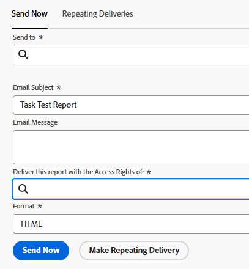

# Ejecutar y entregar un informe con los derechos de acceso de otro usuario

<!-- Audited: 11/2024 -->

De forma predeterminada, los usuarios solo pueden ver los objetos de un informe para los que tienen permisos de visualización.

Puede permitir que todos los usuarios vean los mismos resultados en un informe que otro usuario, independientemente de su nivel de acceso o de permiso en los objetos dentro del informe.

Si ejecuta un informe con los derechos de acceso de otro usuario con acceso superior (por ejemplo, los derechos de acceso de un administrador de Adobe Workfront), todos los usuarios que tengan permisos para Ver el informe podrán ver la información en el informe como el usuario especificado en Report Builder. Puede configurarlo tanto para los informes que los usuarios encuentran en la interfaz de Workfront como para los informes que se entregan a los usuarios como datos adjuntos a un correo electrónico.

>[!TIP]
>
>Debe reemplazar el campo **Ejecutar este informe con los derechos de acceso de:** por un usuario activo solamente cuando desee que el informe se muestre con los derechos de acceso de ese usuario. Por ejemplo, es posible que un usuario con licencia de trabajo no tenga permisos para ver todos los elementos de un informe creado por un usuario con licencia de planificación o un administrador del sistema, a menos que el informe se muestre con los derechos de acceso de un planificador o un administrador del sistema.\
>Si el informe se comparte con usuarios con acceso similar al especificado en el campo **Ejecutar este informe con los derechos de acceso de:**, puede dejar este campo en blanco.

## Requisitos de acceso

+++ Expanda para ver los requisitos de acceso para la funcionalidad en este artículo.

Debe tener el siguiente acceso para realizar los pasos de este artículo:

<table style="table-layout:auto"> 
 <col> 
 <col> 
 <tbody> 
  <tr> 
   <td role="rowheader">Plan de Adobe Workfront*</td> 
   <td> <p>Cualquiera</p> </td> 
  </tr> 
  <tr> 
   <td role="rowheader">Licencia de Adobe Workfront*</td> 
      <td> 
      <p>Nuevo:</p>
         <ul>
         <li><p>Estándar</p></li>
         </ul>
      <p>Actual:</p>
         <ul>
         <li><p>Plan</p></li>
         </ul>
   </td>
  </tr> 
  <tr> 
   <td role="rowheader">Configuraciones de nivel de acceso*</td> 
   <td> <p>Acceso de edición a informes, paneles y calendarios</p> <p>Acceso de edición a filtros, vistas y agrupaciones</p></td> 
  </tr> 
  <tr> 
   <td role="rowheader">Permisos de objeto</td> 
   <td> <p>Ver los permisos de un informe (para ver el informe enviado)</p><p>Administración de permisos de un informe (para ejecutar el informe)</p></td> 
  </tr> 
 </tbody> 
</table>

*Para obtener información, consulte [Requisitos de acceso en la documentación de Workfront](/help/quicksilver/administration-and-setup/add-users/access-levels-and-object-permissions/access-level-requirements-in-documentation.md).

+++

## Mostrar un informe con los derechos de acceso de otro usuario

Rellenar el campo **Ejecutar este informe con los derechos de acceso de:** garantiza que un informe contenga los mismos datos, independientemente de qué usuario tenga acceso al informe. El informe se muestra tal como lo haría para el usuario especificado.

Los usuarios que accedan al informe deben tener al menos permisos de visualización en el informe para poder verlo. Si el usuario que aparece en el campo **Ejecutar este informe con los derechos de acceso de:** está desactivado, el informe ya no se mostrará a ningún otro usuario con el que se comparta el informe.

Para ejecutar un informe con los derechos de acceso de otro usuario:

1. Haga clic en el icono **[!UICONTROL Main Menu]**  en la esquina superior derecha de Adobe Workfront o (si está disponible), haga clic en el icono **[!UICONTROL Main Menu]**  en la esquina superior izquierda y, a continuación, haga clic en **[!UICONTROL Informes]**.

1. Seleccione el informe que desea mostrar con los derechos de acceso de otro usuario.
1. Haga clic en **Acciones de informe** y luego haga clic en **Editar**.

1. Haga clic en **Configuración del informe**.

1. En el campo **Ejecutar este informe con los derechos de acceso de:**, empiece a escribir el nombre del usuario con el que desea que se muestre el informe y, a continuación, selecciónelo cuando lo vea en la lista.\
   

   >[!NOTE]
   >
   >Los usuarios con un nivel de acceso inferior que tienen permiso para generar informes no tienen la capacidad de seleccionar a un usuario que no sean ellos mismos para el campo **Ejecutar este informe con los derechos de acceso de:**.

1. Haga clic en **Listo**.
1. Haga clic en **Guardar + Cerrar**.\
   El informe ahora se muestra para todos los usuarios con los que se comparte el informe como si lo viera el usuario especificado en el campo **Ejecutar este informe con los derechos de acceso de:**.

>[!IMPORTANT]
>
>La introducción de un usuario distinto del que inició sesión para el campo **Ejecutar este informe con los derechos de acceso de:** afecta a la información que se muestra en el informe si éste contiene un filtro que utiliza un comodín que hace referencia al usuario que ha iniciado sesión. El informe se muestra de acuerdo con el valor especificado en el campo **Ejecutar este informe con los derechos de acceso de:** en lugar de lo que se defina en el filtro comodín.
>
>Para obtener más información sobre los caracteres comodín de los campos de usuario, consulte la sección &quot;Variables basadas en usuarios&quot; en [Información general sobre las variables de filtro comodín](../../../reports-and-dashboards/reports/reporting-elements/understand-wildcard-filter-variables.md).

## Enviar un informe con los derechos de acceso de otro usuario

Puede configurar los informes para que se envíen como archivos adjuntos a un correo electrónico. Puede configurar estos informes enviados para que se muestren a medida que los usuarios de un nivel de acceso superior, de modo que todos los usuarios puedan ver la misma información en los informes enviados. Los usuarios que vayan a ver el informe entregado en el correo electrónico deben añadirse a la lista de envío de destinatarios dentro de la entrega del informe. Para obtener más información sobre la configuración de un informe para su entrega, consulte el artículo [Resumen de la entrega de informes](../../../reports-and-dashboards/reports/creating-and-managing-reports/set-up-report-deliveries.md).

Para entregar un informe con los derechos de acceso de otro usuario:

1. Haga clic en el icono **Menú principal**  en la esquina superior derecha de Workfront y, a continuación, haga clic en **Informes**.

1. Seleccione el informe que desea enviar con los derechos de acceso de otro usuario.
1. Haga clic en el nombre del informe para seleccionarlo.
1. Haga clic en **Acciones de informe**.
1. Haga clic en **Enviar informe**.

1. En el campo **Enviar este informe con los derechos de acceso de:**, empiece a escribir el nombre del usuario que desea que muestre el informe como cuando se envía en un mensaje de correo electrónico y, a continuación, selecciónelo cuando lo vea en la lista. El valor predeterminado es el nombre del usuario que está creando el informe.\
   

   >[!NOTE]
   >
   >Los usuarios con un nivel de acceso inferior que pueden generar informes no tienen la capacidad de seleccionar a otro usuario que no sea a sí mismos para el campo **Enviar este informe con los derechos de acceso de:**.

1. Seleccione el **formato** que desea que el informe muestre en el correo electrónico:

   * HTML
   * PDF
   * Excel
   * Excel (.xlsx)
   * TSV

1. Haga clic en **Enviar ahora** para enviarlo inmediatamente.\
   O\
   Haga clic en **Hacer entrega repetida** para programar una entrega recurrente para el informe.\
   Para obtener más información sobre las entregas de informes, consulte el artículo [Resumen de entrega de informes](../../../reports-and-dashboards/reports/creating-and-managing-reports/set-up-report-deliveries.md).

## Limitaciones para informes con una columna Source

Los siguientes informes muestran una columna Source en la que puede ver información sobre el objeto principal:

* Informes de problema
* Informes por hora
* Informes de documentos

Si los usuarios no tienen permisos para el objeto principal de un problema, hora o documento, la columna Source del informe se muestra vacía, incluso cuando el informe está configurado para mostrarse o para entregarse con los derechos de acceso de otro usuario.

Para mostrar información sobre el objeto principal en el informe, se recomienda añadir una columna para el objeto principal en la que se pueda mostrar el nombre del objeto principal.

Por ejemplo, puede añadir cualquiera de las siguientes opciones a un informe con una columna Source:

* Las columnas Nombre del proyecto, Nombre de tarea o Nombre del problema a un documento o informe de horas.
* Las columnas Nombre del proyecto o Nombre de tarea a un informe de problemas.
* Columna que utiliza expresiones en modo de texto que hace referencia a los tres objetos. El siguiente es un ejemplo de un informe de horas:

  ```
  displayname=Custom Source
  
  linkedname=opTask
  
  namekey=view.relatedcolumn
  
  namekeyargkey.0=opTask
  
  namekeyargkey.1=name
  
  textmode=true
  
  valueexpression=IF(!ISBLANK({opTaskID}),{opTask}.{name},IF(!ISBLANK({taskID}),{task}.{name},IF(!ISBLANK({projectID}),{project}.{name},IF(!ISBLANK({timesheetID}),CONCAT({owner}.{name}," ",{timesheet}.{startDate}," - ",{timesheet}.{endDate}),""))))
  
  valueformat=HTML
  ```

  Para obtener información acerca de las vistas en modo de texto, vea [Editar una vista con modo de texto](../text-mode/edit-text-mode-in-view.md).
