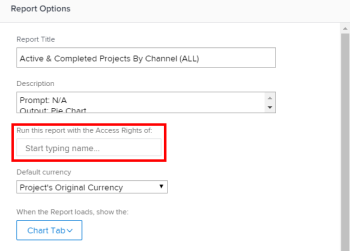

# Ejecutar y entregar un informe con los derechos de acceso de otro usuario

De forma predeterminada, los usuarios solo pueden ver los objetos de un informe para los que tienen permisos de visualización.

Puede permitir que todos los usuarios vean los mismos resultados en un informe que otro usuario, independientemente de su nivel de acceso o de permiso en los objetos dentro del informe.

Si ejecuta un informe con los derechos de acceso de otro usuario con acceso superior (por ejemplo, los derechos de acceso de un administrador de Adobe Workfront), todos los usuarios que tengan permisos para Ver el informe podrán ver la información en el informe como el usuario especificado en Report Builder. Puede configurarlo tanto para los informes que los usuarios encuentran en la interfaz de Workfront como para los informes que se entregan a los usuarios como datos adjuntos a un correo electrónico.

>[!TIP]
>
>Debe reemplazar el **Ejecutar este informe con los derechos de acceso de:** con un usuario activo solo cuando desee que el informe se muestre con los derechos de acceso de ese usuario. Por ejemplo, es posible que un usuario con licencia de trabajo no tenga permisos para ver todos los elementos de un informe creado por un usuario con licencia de planificación o un administrador del sistema, a menos que el informe se muestre con los derechos de acceso de un planificador o un administrador del sistema.\
Si el informe se comparte con usuarios con acceso similar al especificado en la variable **Ejecutar este informe con los derechos de acceso de:** , puede dejar este campo en blanco.

## Requisitos de acceso

Debe tener el siguiente acceso para realizar los pasos de este artículo:

<table style="table-layout:auto"> 
 <col> 
 <col> 
 <tbody> 
  <tr> 
   <td role="rowheader">plan Adobe Workfront*</td> 
   <td> 
Cualquiera
 </td> 
  </tr> 
  <tr> 
   <td role="rowheader">Licencia de Adobe Workfront*</td> 
   <td> 
Plan 
 </td> 
  </tr> 
  <tr> 
   <td role="rowheader">Configuraciones de nivel de acceso*</td> 
   <td> 
Editar acceso a informes, tableros y calendarios
 
Editar acceso a filtros, vistas y agrupaciones
 
Nota: Si sigue sin tener acceso, pregunte al administrador de Workfront si ha establecido restricciones adicionales en su nivel de acceso. Para obtener información sobre cómo un administrador de Workfront puede modificar su nivel de acceso, consulte <a href="../../../administration-and-setup/add-users/configure-and-grant-access/create-modify-access-levels.md" class="MCXref xref">Crear o modificar niveles de acceso personalizados</a>.
 </td> 
  </tr> 
  <tr> 
   <td role="rowheader">Permisos de objeto</td> 
   <td> 
Ver los permisos de un informe (para ver el informe enviado)
 
Administración de permisos de un informe (para ejecutar el informe)
 
Para obtener información sobre cómo solicitar acceso adicional, consulte <a href="../../../workfront-basics/grant-and-request-access-to-objects/request-access.md" class="MCXref xref">Solicitud de acceso a objetos </a>.
 </td> 
  </tr> 
 </tbody> 
</table>

&#42;Para saber qué plan, tipo de licencia o acceso tiene, póngase en contacto con su administrador de Workfront.

## Mostrar un informe con los derechos de acceso de otro usuario

Rellenar el **Ejecutar este informe con los derechos de acceso de:** garantiza que un informe contenga los mismos datos, independientemente de qué usuario acceda al informe. El informe se muestra tal como lo haría para el usuario especificado.

Los usuarios que accedan al informe deben tener al menos permisos de visualización en el informe para poder verlo. Si el usuario aparece en la lista **Ejecutar este informe con los derechos de acceso de:** Cuando el campo está desactivado, el informe ya no se muestra a los demás usuarios con los que se comparte.

Para ejecutar un informe con los derechos de acceso de otro usuario:

1. Haga clic en **Menú principal** icono  en la esquina superior derecha de Workfront, haga clic en **Informes**.

1. Seleccione el informe que desea mostrar con los derechos de acceso de otro usuario.
1. Clic **Acciones de informe**, luego haga clic en **Editar**.

1. Clic **Configuración de informes**.

1. En el **Ejecutar este informe con los derechos de acceso de:** , empiece a escribir el nombre del usuario con el que desea que se muestre el informe y selecciónelo cuando lo vea en la lista.\
   

   >[!NOTE]
   Los usuarios con un nivel de acceso menor que pueden crear informes no tienen la capacidad de seleccionar a otro usuario que no sea él para el **Ejecutar este informe con los derechos de acceso de:** field.

1. Clic **Listo**.
1. Clic **Guardar + Cerrar**.\
   El informe ahora se muestra para todos los usuarios con los que se comparte el informe como si lo viera el usuario especificado en la variable **Ejecutar este informe con los derechos de acceso de:** field.

>[!IMPORTANT]
Introducción de un usuario distinto del que ha iniciado sesión para **Ejecutar este informe con los derechos de acceso de:** Este campo afecta a la información mostrada en el informe si este contiene un filtro que utiliza un comodín que hace referencia al usuario que ha iniciado sesión. El informe se muestra según el valor especificado en la variable **Ejecutar este informe con los derechos de acceso de:** en lugar de lo que se define en el filtro comodín.
Para obtener más información sobre los caracteres comodín de los campos de usuario, consulte la sección &quot;Variables basadas en usuarios&quot; en [Variables de filtro comodín](../../../reports-and-dashboards/reports/reporting-elements/understand-wildcard-filter-variables.md).

## Enviar un informe con los derechos de acceso de otro usuario

Puede configurar los informes para que se envíen como archivos adjuntos a un correo electrónico. Puede configurar estos informes enviados para que se muestren a medida que los usuarios de un nivel de acceso superior, de modo que todos los usuarios puedan ver la misma información en los informes enviados. Los usuarios que vayan a ver el informe entregado en el correo electrónico deben añadirse a la lista de envío de destinatarios dentro de la entrega del informe. Para obtener más información sobre la configuración de un informe para su envío, consulte el artículo [Resumen de entrega de informes](../../../reports-and-dashboards/reports/creating-and-managing-reports/set-up-report-deliveries.md).

Para entregar un informe con los derechos de acceso de otro usuario:

1. Haga clic en **Menú principal** icono  en la esquina superior derecha de Workfront, haga clic en **Informes**.

1. Seleccione el informe que desea enviar con los derechos de acceso de otro usuario.
1. Haga clic en el nombre del informe para seleccionarlo.
1. Clic **Acciones de informe**.
1. Clic **Enviar informe**.

1. En el **Entregar este informe con los derechos de acceso de:** , empiece a escribir el nombre del usuario que desea que muestre el informe como cuando se envía en un mensaje de correo electrónico y, a continuación, selecciónelo cuando lo vea en la lista. El valor predeterminado es el nombre del usuario que está creando el informe.\
   

   >[!NOTE]
   Los usuarios con un nivel de acceso menor que pueden crear informes no tienen la capacidad de seleccionar a otro usuario que no sea él para el **Entregar este informe con los derechos de acceso de:** field.

1. Seleccione el **Formato** desea que el informe se muestre en el correo electrónico:

   * HTML
   * PDF
   * MS Excel
   * MS Excel (.xlsx)
   * TSV

1. Clic **Enviar ahora** para enviarlo inmediatamente.\
   O\
   Clic **Hacer entrega repetida** para programar una entrega recurrente para el informe.\
   Para obtener más información sobre las entregas de informes, consulte el artículo [Resumen de entrega de informes](../../../reports-and-dashboards/reports/creating-and-managing-reports/set-up-report-deliveries.md).

## Limitaciones para los informes con una columna de origen

Los siguientes informes muestran una columna Origen en la que puede ver información sobre el objeto principal:

* Informes de problemas
* Informes por hora
* Informes de documentos

Si los usuarios no tienen permisos para el objeto principal de un problema, hora o documento, la columna Origen del informe se muestra vacía, incluso cuando el informe está configurado para mostrarse o para entregarse con los derechos de acceso de otro usuario.

Para mostrar información sobre el objeto principal en el informe, se recomienda añadir una columna para el objeto principal en la que se pueda mostrar el nombre del objeto principal.

Por ejemplo, puede agregar cualquiera de las siguientes opciones a un informe con una columna Origen:

* Las columnas Nombre del proyecto, Nombre de tarea o Nombre del problema se transfieren a un documento o informe de horas.
* Las columnas Nombre del proyecto o Nombre de tarea se transfieren a un informe de problemas.
* Columna que utiliza expresiones en modo de texto que hace referencia a los tres objetos. El siguiente es un ejemplo de un informe de horas:

   `displayname=Custom Source`

   `linkedname=opTask`

   `namekey=view.relatedcolumn`

   `namekeyargkey.0=opTask`

   `namekeyargkey.1=name`

   `textmode=true`

   `valueexpression=IF(!ISBLANK({opTaskID}),{opTask}.{name},IF(!ISBLANK({taskID}),{task}.{name},IF(!ISBLANK({projectID}),{project}.{name},IF(!ISBLANK({timesheetID}),CONCAT({owner}.{name}," ",{timesheet}.{startDate}," - ",{timesheet}.{endDate}),""))))`

   `valueformat=HTML`

   Para obtener información sobre las vistas del modo de texto, consulte [Edición de una vista mediante el modo de texto](../text-mode/edit-text-mode-in-view.md).