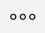

# Crear un gráfico de un informe utilizando un campo personalizado de selección múltiple

<span class="preview">La información resaltada en esta página hace referencia a funcionalidades que aún no están disponibles de forma general. Solo está disponible en el entorno de vista previa.</span>

No se puede crear un gráfico de un informe utilizando un campo personalizado de selección múltiple. Se debe crear un campo calculado adicional que haga referencia al campo personalizado de selección múltiple para representar también gráficamente el informe por el valor del campo personalizado de selección múltiple.

## Requisitos de acceso

Debe tener el siguiente acceso para realizar los pasos de este artículo:

<table style="table-layout:auto"> 
 <col> 
 <col> 
 <tbody> 
  <tr> 
   <td role="rowheader">plan Adobe Workfront*</td> 
   <td> <p>Cualquiera</p> </td> 
  </tr> 
  <tr> 
   <td role="rowheader">Licencia de Adobe Workfront*</td> 
   <td> <p>Plan </p> </td> 
  </tr> 
  <tr> 
   <td role="rowheader">Configuraciones de nivel de acceso*</td> 
   <td> <p>Editar acceso a informes, tableros y calendarios</p> <p>Editar acceso a filtros, vistas y agrupaciones</p> <p>Nota: Si sigue sin tener acceso, pregunte al administrador de Workfront si ha establecido restricciones adicionales en su nivel de acceso. Para obtener información sobre cómo un administrador de Workfront puede modificar su nivel de acceso, consulte <a href="../../../administration-and-setup/add-users/configure-and-grant-access/create-modify-access-levels.md" class="MCXref xref">Crear o modificar niveles de acceso personalizados</a>.</p> </td> 
  </tr> 
  <tr> 
   <td role="rowheader">Permisos de objeto</td> 
   <td> <p>Administración de permisos de un informe</p> <p>Para obtener información sobre cómo solicitar acceso adicional, consulte <a href="../../../workfront-basics/grant-and-request-access-to-objects/request-access.md" class="MCXref xref">Solicitud de acceso a objetos </a>.</p> </td> 
  </tr> 
 </tbody> 
</table>

&#42;Para saber qué plan, tipo de licencia o acceso tiene, póngase en contacto con su administrador de Workfront.

## Requisitos previos

Antes de empezar, debe crear un campo personalizado calculado que muestre los valores seleccionados del campo personalizado de selección múltiple. Para obtener más información, consulte [Crear un campo personalizado calculado que haga referencia a un campo personalizado de selección múltiple](#build-a-calculated-custom-field-that-references-a-multi-select-custom-field) de este artículo.

## Crear gráficos de un informe mediante campos personalizados de selección múltiple

<!--
<p data-mc-conditions="QuicksilverOrClassic.Draft mode">(NOTE: this moved to its own article, linked in the Note above!)</p>
-->

No se puede crear un gráfico en un informe haciendo referencia a un campo personalizado de selección múltiple. En su lugar, puede crear un campo calculado que registre los valores del campo personalizado de selección múltiple en un objeto determinado y agrupar por el campo calculado. 

* [Crear un campo personalizado calculado que haga referencia a un campo personalizado de selección múltiple](#build-a-calculated-custom-field-that-references-a-multi-select-custom-field)
* [Crear un gráfico que haga referencia a un campo personalizado calculado](#build-a-chart-that-references-a-calculated-custom-field)

### Crear un campo personalizado calculado que haga referencia a un campo personalizado de selección múltiple {#build-a-calculated-custom-field-that-references-a-multi-select-custom-field}

Para poder generar un campo calculado que haga referencia a un campo personalizado de selección múltiple, debe cumplir los siguientes requisitos previos:

* Cree el campo personalizado de selección múltiple en un formulario personalizado.\
   Para obtener información sobre cómo crear formularios personalizados y agregarles campos personalizados, consulte el artículo [Crear o editar un formulario personalizado](../../../administration-and-setup/customize-workfront/create-manage-custom-forms/create-or-edit-a-custom-form.md).

* Adjuntar el formulario personalizado a objetos.
* Rellene el campo personalizado de selección múltiple con un valor para cada objeto.

Para generar el campo personalizado calculado que hace referencia al campo personalizado de selección múltiple:

1. Cree un formulario personalizado o edite uno existente.\
   Para obtener información sobre la creación de formularios personalizados, consulte el artículo [Crear o editar un formulario personalizado](../../../administration-and-setup/customize-workfront/create-manage-custom-forms/create-or-edit-a-custom-form.md).

1. Seleccione el objeto u objetos que planea utilizar con el formulario personalizado.
1. Clic **Añadir un campo**, entonces **Calculado** para agregar el campo personalizado de selección múltiple al formulario.

1. En el **Etiqueta** , asigne un nombre al nuevo campo calculado para indicar que hace referencia al campo personalizado de selección múltiple.\
   Por ejemplo: &quot;Campo de selección múltiple calculado&quot;.

1. En el **Cálculo** , introduzca el siguiente código:

   ```
   {DE:Multi-select Custom Field}
   ```

1. Sustituya &quot;Campo personalizado de selección múltiple&quot; por el nombre real del campo personalizado de selección múltiple, tal como aparece en Workfront.

   

1. (Opcional) Si el campo personalizado de selección múltiple ya está en este formulario y si este formulario ya está adjunto a objetos, habilite la opción **Actualizar cálculos anteriores** opción.\
   Esto garantiza que el nuevo campo se rellene automáticamente con el valor del campo personalizado de selección múltiple cuando ya se agregue a los formularios adjuntos a los objetos.

1. Clic **Listo**.
1. Clic **Guardar +Cerrar**.

### Crear un gráfico que haga referencia a un campo personalizado calculado {#build-a-chart-that-references-a-calculated-custom-field}

1. (Opcional) Para asegurarse de que todos los campos calculados por los que desea crear un gráfico se rellenen con valores, seleccione todos los objetos del informe que contengan el formulario personalizado con el campo personalizado de selección múltiple y el campo personalizado calculado y, a continuación, haga clic en **Editar**.
1. (Opcional y condicional) Habilite la **Volver a calcular expresiones personalizadas** y haga clic en **Guardar cambios**.\
   

   >[!NOTE]
   >
   ><span class="preview">Esta opción se ha eliminado de la edición de proyectos por lotes en el entorno de vista previa.  Puede seguir recalculando expresiones para proyectos por lotes haciendo clic en **Más**  en la parte superior de una lista de proyectos, **Recalcular expresiones**. </span>


1. Vaya al informe donde desee agregar el gráfico para el campo calculado que hace referencia al campo personalizado de selección múltiple.
1. Clic **Acciones de informe**, entonces **Editar**.

1. Seleccione el <strong>Agrupaciones</strong> y haga clic en <strong>Agregar agrupación</strong>.
1. Añada el<strong>Campo de selección múltiple calculado</strong> ha creado como agrupación.
1. Seleccione el <strong>Gráfico</strong> y agregue un gráfico al informe.<br>Para obtener información sobre cómo agregar un gráfico a un informe, consulte la sección <a href="../../../reports-and-dashboards/reports/creating-and-managing-reports/create-custom-report.md#add-a-chart" class="MCXref xref">Agregar un gráfico a un informe</a> en el artículo <a href="../../../reports-and-dashboards/reports/creating-and-managing-reports/create-custom-report.md" class="MCXref xref">Creación de un informe personalizado</a>.
1. Seleccione el <strong>Campo de selección múltiple calculado</strong> como uno de los campos que se mostrarán en el gráfico.
1. Clic <strong>Guardar + Cerrar</strong>.<br>El informe muestra los resultados agrupados por el campo de selección múltiple calculado en un gráfico.
