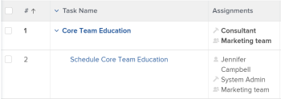

# Informes o listas: mostrar usuarios asociados a un objeto

Puede mostrar usuarios, funciones de trabajo y equipos asociados a objetos en informes o listas, así como hacer referencia a ellos en filtros. No puede agrupar por usuarios, funciones de trabajo o equipos asociados a objetos.

Puede mostrar o filtrar por usuarios, funciones de trabajo o equipos asociados a los siguientes objetos:

<table style="table-layout:auto"> 
 <col> 
 <col> 
 <tbody> 
  <tr> 
   <td role="rowheader">Objeto</td> 
   <td>Usuarios asociados o funciones de trabajo</td> 
  </tr> 
  <tr> 
   <td role="rowheader">Proyecto</td> 
   <td> 
Puede mostrar todos los usuarios y las funciones de trabajo que cumplen en el proyecto en un informe de proyecto. En un informe de proyecto no se puede filtrar por usuarios ni por sus funciones de trabajo asociadas. 
 </td> 
  </tr> 
  <tr> 
   <td role="rowheader">Tareas</td> 
   <td>Puede mostrar y filtrar por todos los usuarios, funciones de trabajo y equipos asignados a una tarea en un informe de tareas.</td> 
  </tr> 
  <tr> 
   <td role="rowheader">Problemas</td> 
   <td>Puede mostrar y filtrar por todos los usuarios, funciones de trabajo y equipos asignados a un problema en un informe de problema.</td> 
  </tr> 
  <tr> 
   <td role="rowheader">Portafolios</td> 
   <td>Puede mostrar todos los usuarios y las funciones de trabajo que cumplen en el proyecto en un informe de proyecto y agrupar el informe por Portfolio. En un informe de proyecto no se puede filtrar por usuarios ni por sus funciones de trabajo asociadas.</td> 
  </tr> 
  <tr> 
   <td role="rowheader">Programas</td> 
   <td>Puede mostrar todos los usuarios y las funciones de trabajo que cumplen en el proyecto en un informe de proyecto y agrupar el informe por programa. En un informe de proyecto no se puede filtrar por usuarios ni por sus funciones de trabajo asociadas.</td> 
  </tr> 
 </tbody> 
</table>

## Mostrar todos los usuarios y funciones de trabajo asociados a un proyecto

Puede mostrar todos los usuarios asociados con en el proyecto en la vista de una lista de proyectos o un informe. Esto incluye a todos los usuarios enumerados en la sección Personas del proyecto. También puede ver las funciones a las que están asociadas cuando se asignan a tareas o problemas en el proyecto en un informe de proyecto.

Para obtener información sobre la creación de un informe de proyecto que muestre todos los usuarios y sus funciones en el proyecto, consulte [Ver: lista de usuarios del proyecto con funciones de trabajo](../../../reports-and-dashboards/reports/custom-view-filter-grouping-samples/view-project-user-list.md).

No puede filtrar por usuarios o funciones de trabajo asociadas con proyectos en un filtro de proyecto.

## Mostrar todos los usuarios, roles de trabajo o equipos asignados a una tarea

Puede mostrar todos los usuarios, funciones o equipos asignados a una tarea en la vista de una lista de tareas o informe agregando el campo Asignaciones a la vista.

Puede filtrar por usuarios, funciones de trabajo o equipos asignados a tareas haciendo referencia a los siguientes campos en un filtro de tareas:

* Usuarios de asignación
* Roles de asignación
* Equipo

## Mostrar todos los usuarios, roles de trabajo o equipos asignados a un problema

Puede mostrar todos los usuarios, funciones o equipos asignados a un problema en la vista de una lista de problemas o un informe agregando el campo Asignaciones a la vista.

Puede filtrar por usuarios, funciones de trabajo o equipos asignados a problemas haciendo referencia a los siguientes campos en un filtro de problemas:

* Usuarios de asignación
* Roles de asignación
* Equipo

## Mostrar todos los usuarios y funciones de trabajo asociados a un portafolio

Puede mostrar todos los usuarios y funciones asociados a un portafolio mostrándolos en un informe de proyecto y, a continuación, agrupando el informe por Portfolio.

Para obtener información sobre la creación de un informe de proyecto que muestre todos los usuarios y sus funciones en el proyecto, consulte [Ver: lista de usuarios del proyecto con funciones de trabajo](../../../reports-and-dashboards/reports/custom-view-filter-grouping-samples/view-project-user-list.md).

No puede filtrar por usuarios o funciones de trabajo asociadas con proyectos en un portafolio o filtro de proyecto.

## Mostrar todos los usuarios y funciones de trabajo asociados a un programa

Puede mostrar todos los usuarios y funciones asociados a un programa mostrándolos en un informe de proyecto y, a continuación, agrupando el informe por Programa.

Para obtener información sobre la creación de un informe de proyecto que muestre todos los usuarios y sus funciones en el proyecto, consulte [Ver: lista de usuarios del proyecto con funciones de trabajo](../../../reports-and-dashboards/reports/custom-view-filter-grouping-samples/view-project-user-list.md).

No puede filtrar por usuarios o funciones de trabajo asociadas con proyectos en un filtro de programa o proyecto.
