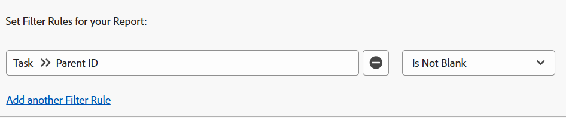

# Filtro: mostrar tareas principales

Puede aplicar los filtros de tareas a continuación para mostrar las tareas de trabajo. Las tareas de trabajo son tareas que se pueden trabajar de forma independiente y no son tareas principales a otras tareas. En un ejemplo, un filtro identifica las tareas hijas que podrían ser los propios padres. En este caso, no son tareas de trabajo.

>[!TIP]
>
>* Si tiene en cuenta la posibilidad de agregar más de un filtro a un informe, le recomendamos que agregue todos los filtros mediante la interfaz de Report Builder y que haga clic en Cambiar a modo de texto después de haber agregado todas las demás reglas de filtro. A continuación, puede agregar el código para el filtro de tarea principal como se indica más arriba. 
>* También se recomienda agregar una agrupación para Nombre del proyecto para facilitar la lectura del informe. Para obtener más información sobre cómo agregar agrupaciones a los informes, consulte el artículo [Información general sobre agrupaciones en Adobe Workfront](../../../reports-and-dashboards/reports/reporting-elements/groupings-overview.md).
>

## Requisitos de acceso

Debe tener el siguiente acceso para realizar los pasos de este artículo:

<table style="table-layout:auto"> 
 <col> 
 <col> 
 <tbody> 
  <tr> 
   <td role="rowheader">plan Adobe Workfront*</td> 
   <td> <p>Cualquiera</p> </td> 
  </tr> 
  <tr> 
   <td role="rowheader">Licencia de Adobe Workfront*</td> 
   <td> <p>Solicitud para modificar un filtro </p>
   <p>Plan para modificar un informe</p> </td> 
  </tr> 
  <tr> 
   <td role="rowheader">Configuraciones de nivel de acceso*</td> 
   <td> <p>Editar el acceso a Informes, Tableros y Calendarios para modificar un informe</p> <p>Editar el acceso a filtros, vistas y agrupaciones para modificar un filtro</p> <p><b>NOTA</b>

Si sigue sin tener acceso, pregunte al administrador de Workfront si ha establecido restricciones adicionales en su nivel de acceso. Para obtener información sobre cómo un administrador de Workfront puede modificar su nivel de acceso, vea <a href="../../../administration-and-setup/add-users/configure-and-grant-access/create-modify-access-levels.md" class="MCXref xref">Crear o modificar niveles de acceso personalizados</a>.</p> </td>
</tr>
  <tr> 
   <td role="rowheader">Permisos de objeto</td> 
   <td> <p>Administración de permisos de un informe</p> <p>Para obtener información sobre cómo solicitar acceso adicional, vea <a href="../../../workfront-basics/grant-and-request-access-to-objects/request-access.md" class="MCXref xref">Solicitar acceso a los objetos </a>.</p> </td> 
  </tr> 
 </tbody> 
</table>

&#42;Para saber qué plan, tipo de licencia o acceso tiene, póngase en contacto con el administrador de Workfront.

## Mostrar tareas sin tareas secundarias (podrían tener una principal)

Puede aplicar el siguiente filtro a un informe de tareas para mostrar tareas sin tareas secundarias. Podrían tener padres propios y ser hijos de otras tareas.

1. En el **menú principal** , haga clic en **Informes.**

1. Haga clic en **Nuevo informe**.
1. Seleccionar un **informe de tareas**.
1. Haga clic en **Filtros**.
1. Haga clic en **Agregar una regla de filtro**.
1. En la línea **Empiece a escribir el nombre del campo...**, empiece a escribir **Número de elementos secundarios**.

1. Seleccione **Igual (distingue mayúsculas y minúsculas)** para el modificador y, a continuación, escriba **0** para el número de elementos secundarios.\
   

   O

   Haga clic en **Cambiar al modo de texto** y, en la ventana de edición de texto, copie y pegue el texto siguiente: 

   ```
   numberOfChildren=0
   numberOfChildren_Mod=eq
   ```


1. Haga clic en **Guardar + Cerrar**.

   Esto extrae un informe de todas las tareas que están trabajando en tareas del sistema. Algunas de estas tareas podrían tener un elemento principal, pero no son tareas principales en sí mismas.

## Mostrar tareas con los padres (podrían tener hijos)

Puede aplicar el siguiente filtro a un informe de tareas para mostrar las tareas con los padres, lo que significa que son tareas secundarias. Sin embargo, estas tareas también podrían tener elementos secundarios propios porque el filtro no excluye a sus elementos secundarios. Las tareas de los niños que también son padres para otras tareas no se consideran tareas laborales.

1. En el **Menú principal** , haga clic en **Informes.
1. Haga clic en **Nuevo informe**.
1. Seleccionar un **informe de tareas**.
1. Haga clic en **Filtros**.
1. Haga clic en **Agregar una regla de filtro**.
1. En la línea **Empiece a escribir el nombre del campo...**, empiece a escribir **Id. principal**.
1. Seleccione **No está en blanco** para el modificador.

   

   O

   Haga clic en **Cambiar al modo de texto** y, en la ventana de edición de texto, copie y pegue el texto siguiente: 

   `parentID_Mod=notblank`

1. Haga clic en **Guardar + Cerrar**.

   Esto extrae un informe de todas las tareas del sistema que tienen tareas principales y secundarias de esas tareas principales. Algunas de estas tareas podrían ser las mismas de un padre.

## Mostrar tareas sin tareas secundarias ni principales (tareas independientes)

Puede aplicar el siguiente filtro a un informe de tareas para mostrar las tareas de trabajo independientes. Estas tareas no tienen padres y no tienen hijos propios.

1. En el **menú principal** , haga clic en **Informes.**
1. Haga clic en **Nuevo informe**.
1. Seleccionar un **informe de tareas**.
1. Haga clic en **Filtros**.
1. Haga clic en **Agregar una regla de filtro** y en el **Empiece a escribir el nombre del campo ...**, la línea empiece a escribir **Número de elementos secundarios**, seleccione **Igual (distingue mayúsculas de minúsculas)** para el modificador y, a continuación, escriba **0** para el número de elementos secundarios.
1. Haga clic en **Agregar otra regla de filtro** y en el **Empiece a escribir el nombre del campo ...**, empiece a escribir la línea **Id. principal** y, a continuación, seleccione **Está en blanco**.

   

   O

   En lugar de los pasos 6-7, haga clic en **Cambiar al modo de texto** y en la ventana de edición de texto, copie y pegue el siguiente texto: 

   <!--
   <p data-mc-conditions="QuicksilverOrClassic.Draft mode">(NOTE: ensure steps above stay accurate)</p>
   -->

   ```
   numberOfChildren=0
   numberOfChildren_Mod=eq
   parentID_Mod=isblank
   ```

1. Haga clic en **Guardar + Cerrar**.

   Esto extrae un informe de todas las tareas del sistema que no tienen tareas principales ni secundarias. Son tareas de trabajo independientes.
