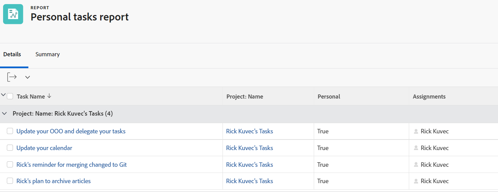

# Filtro: tareas personales

<!--Audited: 10/2024-->

This task filter returns ad hoc work requests sent to a user, or to-do items added by users in their To-dos widget in the Home area.

Ad hoc work requests and to-do items are saved in Adobe Workfront as personal tasks.

Personal tasks are not connected to a project but they can be moved to a project, if needed. For information, see [Create personal tasks](/help/quicksilver/workfront-basics/updating-work-items-and-viewing-updates/create-personal-tasks.md).

## Requisitos de acceso

+++ Expanda para ver los requisitos de acceso para la funcionalidad en este artículo. 

<table style="table-layout:auto"> 
 <col> 
 <col> 
 <tbody> 
  <tr> 
   <td role="rowheader">Paquete de Adobe Workfront</td> 
   <td> 
Cualquiera
 </td> 
  </tr> 
  <tr> 
   <td role="rowheader">Licencia de Adobe Workfront</td> 
   <td> 
   
Contributor or Request to modify a filter 

   
Standard or Plan to modify a report

  </tr> 
  <tr> 
   <td role="rowheader">Configuraciones de nivel de acceso</td> 
   <td> 
Editar el acceso a Informes, Paneles de control y Calendarios para modificar un informe
 
Acceso de edición a filtros, vistas y agrupaciones para modificar un filtro
 </td> 
  </tr> 
  <tr> 
   <td role="rowheader">Permisos de objeto</td> 
   <td> 
Permisos de administración para un informe
  </td> 
  </tr> 
 </tbody> 
</table>

Para obtener más información sobre el contenido de esta tabla, consulte [Requisitos de acceso en la documentación de Workfront](/help/quicksilver/administration-and-setup/add-users/access-levels-and-object-permissions/access-level-requirements-in-documentation.md).

+++

## Filter personal tasks

To create this filter:

1. Go to a list of tasks or a task report.
1. From the **Filter** drop-down menu, click **New filter**.
1. (Conditional) Click **Add a filter rule** of you are accessing the filter from a report, or start selecting your filter criteria in the first field, if you are accessing the filter from a list.
1. (Conditional) Select the following filtering criteria:

   * From a list filter: **Task** > **Personal** **Is true**
   * From a report filter: **Task** > **Personal** > **Equal (Case sensitive)** > **True**.
1. Save the filter.

   The list displays only personal tasks that are not on any projects.
