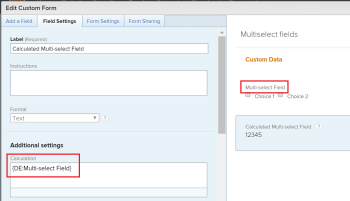

# Agrupar un informe por un campo personalizado de selección múltiple

<!--Audited: 10/2024-->

Puede agrupar por el valor de un campo personalizado de selección múltiple en un informe de Adobe Workfront solo con el modo de texto.

Ejemplos de campos personalizados de selección múltiple pueden ser:

* Casillas de verificación
* Menús desplegables de selección múltiple

Para obtener información sobre el uso del modo de texto, consulte el artículo [Información general sobre el modo de texto](../../../reports-and-dashboards/reports/text-mode/understand-text-mode.md).

## Consideraciones al agrupar mediante un campo personalizado de selección múltiple

* No se puede crear un gráfico de un informe que utilice una agrupación de modo de texto. Debe crear un campo calculado adicional que haga referencia al campo personalizado de selección múltiple para crear también un gráfico del informe mediante el valor del campo personalizado de selección múltiple.

  Para obtener más información, consulte [Crear gráficos de un informe mediante un campo personalizado de selección múltiple](../../../reports-and-dashboards/reports/custom-view-filter-grouping-samples/chart-report-by-multi-select-custom-field.md).
* Los elementos que tengan cualquiera de las opciones seleccionadas se contabilizan solo una vez.

  Por ejemplo, si tiene un campo personalizado Casilla de verificación con Opción 1 y Opción 2 como opciones, y adjunta el formulario a las tareas, las tareas que tienen seleccionadas la Opción 1 y la Opción 2 se agrupan por separado de las tareas que solo tienen seleccionada la Opción 1 o la Opción 2.

## Requisitos de acceso

+++ Expanda para ver los requisitos de acceso para la funcionalidad en este artículo.

Debe tener el siguiente acceso para realizar los pasos de este artículo:

<table style="table-layout:auto"> 
 <col> 
 <col> 
 <tbody> 
  <tr> 
   <td role="rowheader">Plan de Adobe Workfront</td> 
   <td> 
Cualquiera
 </td> 
  </tr> 
  <tr> 
   <td role="rowheader">Licencia de Adobe Workfront*</td> 
   <td> 
    
Nuevo:

   <ul><li>
Colaborador para modificar un filtro 
</li>
   <li>
Estándar para modificar un informe
</li> </ul>

Actual:

   <ul><li>
Solicitud para modificar un filtro 
</li>
   <li>
Plan para modificar un informe
</li> </ul></td> 
  </tr> 
  <tr> 
   <td role="rowheader">Configuraciones de nivel de acceso</td> 
   <td> 
Editar el acceso a Informes, Paneles de control y Calendarios para modificar un informe
 
Acceso de edición a filtros, vistas y agrupaciones para modificar un filtro
 </td> 
  </tr> 
  <tr> 
   <td role="rowheader">Permisos de objeto</td> 
   <td> 
Permisos de administración para un informe
  </td> 
  </tr> 
 </tbody> 
</table>

*Para obtener información, consulte [Requisitos de acceso en la documentación de Workfront](/help/quicksilver/administration-and-setup/add-users/access-levels-and-object-permissions/access-level-requirements-in-documentation.md).

+++

## Agrupación de un informe mediante campos personalizados de selección múltiple

Para poder agrupar mediante un campo personalizado de selección múltiple, debe contar con los siguientes requisitos previos:

* Generar campo personalizado de selección múltiple en un formulario personalizado.\
  Para obtener información sobre cómo crear formularios personalizados y agregarles campos personalizados, consulte el artículo [Crear un formulario personalizado](/help/quicksilver/administration-and-setup/customize-workfront/create-manage-custom-forms/form-designer/design-a-form/design-a-form.md).

* Adjuntar el formulario personalizado a objetos. 
* Rellenar el campo personalizado de selección múltiple con un valor en cada objeto.

Para agrupar mediante un campo personalizado de selección múltiple en un informe:

1. Cree un informe o edite uno existente en el que desee añadir una agrupación para un campo personalizado de selección múltiple.\
   Para obtener información sobre la creación de informes, consulte el artículo [Creación de un informe personalizado](../../../reports-and-dashboards/reports/creating-and-managing-reports/create-custom-report.md).
1. Haga clic en **Acciones de informe** y, a continuación, en **Editar**.
1. Seleccione la pestaña **Agrupaciones**.
1. Haga clic en **Cambiar al modo de texto**.

1. Seleccione el texto en el cuadro **Agrupar por** y reemplácelo por el siguiente código:

   <pre>
   group.0.displayname=Nombre de campo personalizado de selección múltiple
   group.0.valueexpression={DE:Multi-select Custom Field Name}
   group.0.valueformat=HTML
   group.0.textmode=true
   </pre>

1. Sustituya &quot;Nombre de campo personalizado de selección múltiple&quot; por el nombre real del campo personalizado de selección múltiple, tal como aparece en la instancia de Workfront.
1. Haga clic en **Guardar y cerrar**.

   Los objetos del informe se agrupan mediante los valores del campo personalizado de selección múltiple.

   

   El nombre de las agrupaciones del informe son los nombres del campo personalizado de selección múltiple seguido de los valores seleccionados en el campo.

<!--

<h2>Chart a report by multi-select Custom Fields</h2>

(NOTE: this moved to its own article, linked in the Note above!)

You cannot build a chart in a report by referencing a multi-select custom field. Instead, you can create a calculated field that records the values of the multi-select custom field on a given object and group by the calculated field.&nbsp;

<ul>
<li><a href="#build-a-calculated-custom-field-that-references-a-multi-select-custom-field" class="MCXref xref">Build a calculated custom field that references a multi-select custom field</a> </li>
<li><a href="#build-a-chart-that-references-a-calculated-custom-field" class="MCXref xref">Build a chart that references a calculated custom field</a> </li>
</ul>

<strong>Build a calculated custom field that references a multi-select custom field</strong>

To be able to build a calculated field that references a multi-select custom field, you must have the following prerequisites:

<ul>
<li>Build the multi-select custom field in a custom form. .</li>
<li>Attach the custom form to objects.</li>
<li>Populate the multi-select custom field with a value on each object.</li>
</ul>

To build the calculated custom field that references the multi-select custom field:

<ol>
<li value="1">Create a custom form, or edit an existing one. .</li>
<li value="2">Click<strong>Add a Field</strong>, then <strong>Calculated</strong> to add the multi-select custom field to the form.</li>
<li value="3">In the <strong>Label</strong> box, name the new calculated field to indicate that it references the multi-select custom field. For example: "Calculated Multi-select Field."</li>
<li value="4"> 
In the <strong>Calculation</strong> box, enter the following code:
<pre>{DE:Multi-select Custom Field}</pre> 
    
 </li>
<li value="5">Replace "Multi-select Custom Field" with the actual name of your multi-select custom field, as it appears in Workfront.</li>
<li value="6"> 
(Optional) If the multi-select custom field is already on this form and if this form is already attached to objects, enable the <strong>Update previous calculations</strong>&nbsp;option.
 
This ensures that the new field is automatically populated with the value from the multi-select custom field as it is added to the forms attached to the objects already.
 </li>
<li value="7">Click <strong>Done</strong>.</li>
<li value="8">Click <strong>Save +Close</strong>.</li>
</ol>

<strong>Build a chart that references a calculated custom field</strong>

<ol>
<li value="1"> Go to the report where you want to add the chart for the calculated field that references the multi-select custom field. </li>
<li value="2"> (Optional) To ensure that all the calculated fields that you want to chart by are populated with values, select all the objects in your report, then click <strong>Edit</strong>. </li>
<li value="3"> 
 (Optional and conditional) Enable the <strong>Recalculate Custom Expressions</strong> field, then click <strong>Save Changes</strong>.
 
    
 </li>
<li value="4"> Click <strong>Report Actions</strong>, then <strong>Edit</strong>. </li>
<li value="5">Select the <strong>Groupings</strong> tab, then click <strong>Add Grouping</strong>. </li>
<li value="6">Add the<strong>Calculated Multi-select Field</strong> you created as your grouping. </li>
<li value="7"> 
Select the <strong>Chart</strong> tab, and add a chart to your report.
 
For information about adding a chart to a report, see the section <a href="../../../reports-and-dashboards/reports/creating-and-managing-reports/create-custom-report.md#add-a-chart" class="MCXref xref">Add a chart to a report</a> in the article <a href="../../../reports-and-dashboards/reports/creating-and-managing-reports/create-custom-report.md" class="MCXref xref">Create a custom report</a>. 
 </li>
<li value="8">Select the <strong>Calculated Multi-select Field</strong> as one of the fields to display in the chart. </li>
<li value="9"> 
Click <strong>Save + Close</strong>.
 
The report displays the results grouped by the Calculated Multi-select Field in a chart. 
 </li>
</ol>

-->
