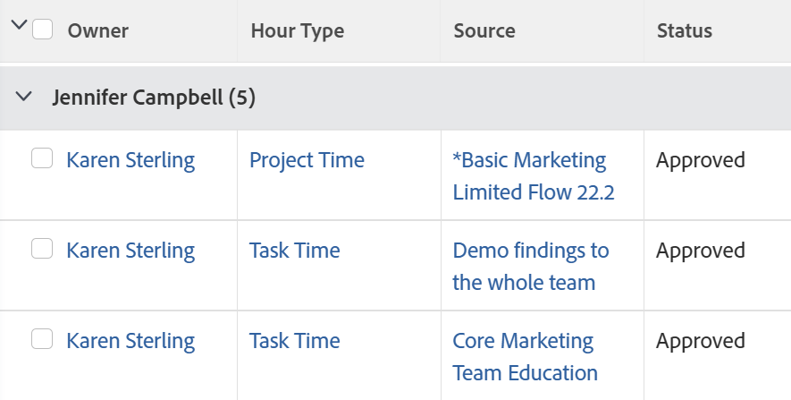

# Agrupación: patrocinador del proyecto por horas

<!--Audited: 10/2024-->

Este grupo de horas organiza las horas por el patrocinador del proyecto en el que se registran. La interfaz estándar del Report Builder para las agrupaciones de horas no proporciona una asignación al campo Patrocinador de proyecto. Debe utilizar la interfaz del modo Texto para acceder a este campo.



## Requisitos de acceso

+++ Expanda para ver los requisitos de acceso para la funcionalidad en este artículo.

Debe tener el siguiente acceso para realizar los pasos de este artículo:

<table style="table-layout:auto"> 
 <col> 
 <col> 
 <tbody> 
  <tr> 
   <td role="rowheader">plan de Adobe Workfront</td> 
   <td> <p>Cualquiera</p> </td> 
  </tr> 
  <tr> 
   <td role="rowheader">Licencia de Adobe Workfront*</td> 
   <td> 
    <p>Nuevo:</p>
   <ul><li><p>Colaborador para modificar un filtro </p></li>
   <li><p>Estándar para modificar un informe</p></li> </ul>

<p>Actual:</p>
   <ul><li><p>Solicitud para modificar un filtro </p></li>
   <li><p>Plan para modificar un informe</p></li> </ul></td> 
  </tr> 
  <tr> 
   <td role="rowheader">Configuraciones de nivel de acceso</td> 
   <td> <p>Editar el acceso a Informes, Tableros y Calendarios para modificar un informe</p> <p>Editar el acceso a filtros, vistas y agrupaciones para modificar un filtro</p> </td> 
  </tr> 
  <tr> 
   <td role="rowheader">Permisos de objeto</td> 
   <td> <p>Administración de permisos de un informe</p>  </td> 
  </tr> 
 </tbody> 
</table>

*Para obtener más información, consulte [Requisitos de acceso en la documentación de Workfront](/help/quicksilver/administration-and-setup/add-users/access-levels-and-object-permissions/access-level-requirements-in-documentation.md).

+++

## Agrupar por patrocinador del proyecto durante horas

Para aplicar esta agrupación:

1. Ir a una lista de horas.
1. En el menú desplegable **Agrupación**, seleccione **Nueva agrupación**.

1. Haga clic en **Cambiar al modo de texto**.
1. Elimine el texto del área que se muestra y reemplácelo por el siguiente código:

```
   group.0.linkedname=project:sponsor:name
   group.0.name=
   group.0.valuefield=project:sponsor:name
   group.0.valueformat=HTML
   textmode=true
```

1. Haga clic en **Listo**.
1. Actualice el nombre de la agrupación y haga clic en **Guardar agrupación**.
