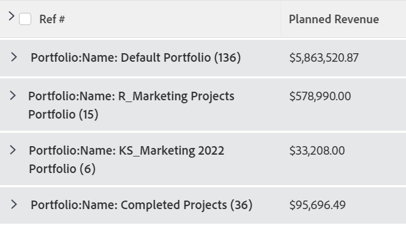
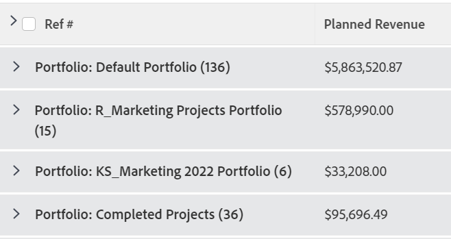
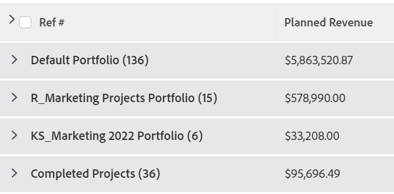

# Agrupación: editar el nombre para mostrar en una agrupación

<!--Audited: 01/2024-->

Puede cambiar el nombre de las agrupaciones por otro más familiar para los usuarios.

Por ejemplo, cuando se aplica la agrupación Nombre de portafolio estándar a una lista de proyectos, el nombre de la agrupación aparece como *Portafolio: nombre:`<name of portfolio>`*.

Puede modificar esta agrupación mediante el modo de texto para mostrar un nombre que sea más fácil de leer.

## Requisitos de acceso

+++ Expanda para ver los requisitos de acceso para la funcionalidad en este artículo. 

<table style="table-layout:auto"> 
 <col> 
 <col> 
 <tbody> 
  <tr> 
   <td role="rowheader">Paquete de Adobe Workfront</td> 
   <td> 
Cualquiera
 </td> 
  </tr> 
  <tr> 
   <td role="rowheader">Licencia de Adobe Workfront</td> 
   <td> 
   
Colaborador o solicitud para modificar un filtro 

   
Estándar o plan para modificar un informe

  </tr> 
  <tr> 
   <td role="rowheader">Configuraciones de nivel de acceso</td> 
   <td> 
Editar el acceso a Informes, Paneles de control y Calendarios para modificar un informe
 
Acceso de edición a filtros, vistas y agrupaciones para modificar un filtro
 </td> 
  </tr> 
  <tr> 
   <td role="rowheader">Permisos de objeto</td> 
   <td> 
Permisos de administración para un informe
  </td> 
  </tr> 
 </tbody> 
</table>

Para obtener más información sobre el contenido de esta tabla, consulte [Requisitos de acceso en la documentación de Workfront](/help/quicksilver/administration-and-setup/add-users/access-levels-and-object-permissions/access-level-requirements-in-documentation.md).

+++

## Editar el nombre para mostrar en una agrupación

Para cambiar el nombre para mostrar en una agrupación de proyectos, haga lo siguiente:

1. Ir a una lista de proyectos.
1. En el menú desplegable **Agrupación**, seleccione **Nueva agrupación**.

1. Haga clic en **Agregar agrupación** y comience a escribir &quot;Nombre de la cartera&quot; en el campo **Grupo por:**, a continuación selecciónelo cuando aparezca en la lista.

1. Haga clic en **Cambiar al modo de texto**.
1. Realice una de las siguientes acciones:

   * Agregue el código siguiente al texto existente disponible en el cuadro **Agrupar su informe**:

     `group.0.displayname=Your Value`

     Por ejemplo, agregue el código siguiente para cambiar el nombre de la pantalla a &quot;Portfolio&quot;:

     `group.0.displayname=Portfolio`

   * Elimine todas las líneas de la interfaz de modo de texto de la agrupación que tengan la palabra &quot;name&quot; y, a continuación, añada la línea:

     `group.0.name=Your Value`

     Por ejemplo, agregue el código siguiente para cambiar el nombre de la pantalla a &quot;Portfolio&quot;:

     `group.0.name=Portfolio`

     >[!TIP]
     >
     >También puede dejar las líneas `group.0.name=` y `group.0.displayname=` en blanco, en cuyo caso la agrupación muestra el valor por el que está agrupando.

     

1. Haga clic en **Listo** y, a continuación, en **Guardar Agrupación**.
1. (Opcional) Actualice el nombre de la agrupación y, a continuación, haga clic en **Guardar agrupación**.

   El nombre predeterminado de la agrupación se modifica según la información del modo de texto.
