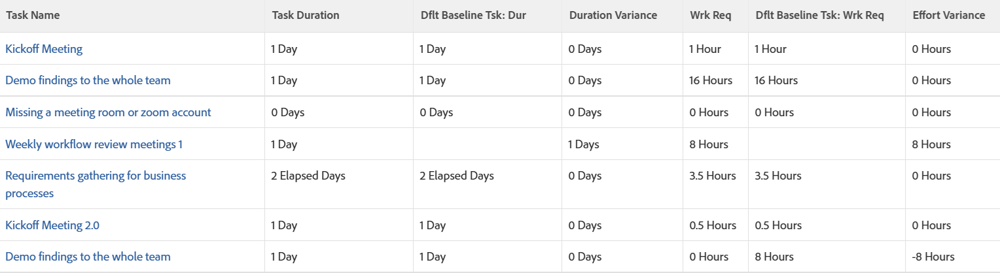

# Vista: variación de línea de base para duración y trabajo planificado en una vista de tarea

<!--Audited: 11/2024-->

Esta vista muestra lo siguiente en una vista de tareas:

* Información de la tarea con información de la tarea prevista.
* Diferencia entre Duración y Duración de línea de base predeterminada.
* Diferencia entre el trabajo planificado y el trabajo planificado previsto predeterminado.

>[!NOTE]
>
>Los datos mostrados en la vista siguiente comparan los valores reales de las tareas con los valores asociados con las tareas de Línea de base predeterminada.



## Requisitos de acceso

+++ Expanda para ver los requisitos de acceso para la funcionalidad en este artículo. 

<table style="table-layout:auto"> 
 <col> 
 <col> 
 <tbody> 
  <tr> 
   <td role="rowheader">Paquete de Adobe Workfront</td> 
   <td> <p>Cualquiera</p> </td> 
  </tr> 
  <tr> 
   <td role="rowheader">Licencia de Adobe Workfront</td> 
   <td> 
   <p>Colaborador o solicitud para modificar un filtro </p>
   <p>Estándar o Plan para modificar un informe</p>
  </tr> 
  <tr> 
   <td role="rowheader">Configuraciones de nivel de acceso</td> 
   <td> <p>Editar el acceso a Informes, Paneles de control y Calendarios para modificar un informe</p> <p>Acceso de edición a filtros, vistas y agrupaciones para modificar un filtro</p> </td> 
  </tr> 
  <tr> 
   <td role="rowheader">Permisos de objeto</td> 
   <td> <p>Permisos de administración para un informe</p>  </td> 
  </tr> 
 </tbody> 
</table>

Para obtener más información sobre el contenido de esta tabla, consulte [Requisitos de acceso en la documentación de Workfront](/help/quicksilver/administration-and-setup/add-users/access-levels-and-object-permissions/access-level-requirements-in-documentation.md).

+++

## Ver variación prevista para Duración y Trabajo planificado en una vista de tareas

1. Vaya a una lista de tareas.
1. En el menú desplegable **Vista**, seleccione **Nueva vista** o edite una vista existente.
1. Quite todas las columnas de la vista, excepto la primera.
1. Con la primera columna seleccionada, haga clic en **Cambiar al modo de texto** y luego haga clic en **Editar vista de texto**.
1. Copie el texto siguiente y péguelo en la primera columna de la vista:

   ```
   column.0.descriptionkey=name
   column.0.link.linkproperty.0.name=ID
   column.0.link.linkproperty.0.valuefield=ID
   column.0.link.linkproperty.0.valueformat=int
   column.0.link.lookup=link.view
   column.0.link.valuefield=objCode
   column.0.link.valueformat=val
   column.0.linkedname=direct
   column.0.listsort=string(name)
   column.0.namekey=name.abbr
   column.0.querysort=name
   column.0.shortview=false
   column.0.stretch=100
   column.0.valuefield=name
   column.0.valueformat=HTML
   column.0.width=150
   column.0.displayname=Task Name
   column.1.descriptionkey=duration
   column.1.linkedname=direct
   column.1.listsort=intAsInt(durationMinutes)
   column.1.namekey=duration.abbr
   column.1.querysort=durationMinutes
   column.1.shortview=false
   column.1.stretch=0
   column.1.valuefield=durationFieldLong
   column.1.valueformat=compound
   column.1.viewalias=duration
   column.1.width=100
   column.1.displayname=Task Duration
   column.2.descriptionkey=view.relatedcolumn
   column.2.descriptionkeyargkey.0=defaultbaselinetask
   column.2.descriptionkeyargkey.1=duration
   column.2.linkedname=defaultBaselineTask
   column.2.listsort=intAsInt(durationMinutes)
   column.2.namekey=duration
   column.2.namekeyargkey.0=defaultbaselinetask.abbr
   column.2.namekeyargkey.1=duration.abbr
   column.2.querysort=defaultBaselineTask:durationMinutes
   column.2.shortview=false
   column.2.stretch=0
   column.2.valuefield=defaultBaselineTask:durationFieldLong
   column.2.valueformat=compound
   column.2.viewalias=defaultBaselineTask:duration
   column.2.width=100
   column.2.displayname=Dflt Baseline Tsk: Dur
   column.2.durationunitfield=durationUnit.value
   column.3.description=Duration Variance"column.3.linkedname=direct
   column.3.listsort=intAsInt(durationMinutes)
   column.3.name=Duration Variance
   column.3.querysort=durationMinutes
   column.3.shortview=false
   column.3.stretch=0
   column.3.valueexpression=CONCAT(SUB({duration},{defaultBaselineTask}.{duration})/480," Days")
   column.3.valueformat=HTML
   column.3.viewalias=duration
   column.3.width=100
   column.3.displayname=Duration Variance
   column.4.descriptionkey=workrequired
   column.4.linkedname=direct
   column.4.listsort=doubleAsDouble(workRequired)
   column.4.namekey=workrequired.abbr
   column.4.querysort=workRequired
   column.4.shortview=false
   column.4.stretch=0
   column.4.valuefield=workFieldLong
   column.4.valueformat=compound
   column.4.viewalias=workrequired
   column.4.width=100
   column.4.displayname=Wrk Req
   column.5.descriptionkey=view.relatedcolumn
   column.5.descriptionkeyargkey.0=defaultbaselinetask
   column.5.descriptionkeyargkey.1=workrequired
   column.5.linkedname=defaultBaselineTask
   column.5.listsort=doubleAsDouble(workRequired)
   column.5.namekey=view.relatedcolumn
   column.5.namekeyargkey.0=defaultbaselinetask.abbr
   column.5.namekeyargkey.1=workrequired.abbr
   column.5.querysort=defaultBaselineTask:workRequired
   column.5.shortview=false
   column.5.stretch=0
   column.5.valuefield=defaultBaselineTask:workFieldLong
   column.5.valueformat=compound
   column.5.viewalias=defaultBaselineTask:workrequired
   column.5.width=100
   column.5.displayname=Dflt Baseline Tsk: Wrk Req
   column.6.descriptionkey=workrequired
   column.6.linkedname=direct
   column.6.listsort=doubleAsDouble(workRequired)
   column.6.name=Effort Variance
   column.6.querysort=workRequired
   column.6.shortview=false
   column.6.stretch=0
   column.6.valueexpression=CONCAT(SUB({workRequired},{defaultBaselineTask}.{workRequired})/60," Hours")
   column.6.valueformat=HTML
   column.6.viewalias=workrequired
   column.6.width=100
   column.6.displayname=Effort Variance
   ```

1. Haga clic en **Guardar vista**.
