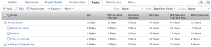

# Ver: varianza de línea de base para Duración y Trabajo planificado en una vista de tarea

Esta vista muestra lo siguiente en una vista de tareas:

* Información de tarea con información de tarea de línea de base.
* La diferencia entre Duración y Duración de línea de base predeterminada.
* La diferencia entre el trabajo planificado y el trabajo planificado previsto predeterminado.

>[!NOTE]
>
> Los datos mostrados en la siguiente vista comparan los valores de la tarea real con los valores asociados con las tareas Línea de base predeterminada.

 

## Requisitos de acceso

Debe tener el siguiente acceso para realizar los pasos de este artículo:

<table style="table-layout:auto"> 
 <col> 
 <col> 
 <tbody> 
  <tr> 
   <td role="rowheader">plan de Adobe Workfront*</td> 
   <td> 
Cualquiera
 </td> 
  </tr> 
  <tr> 
   <td role="rowheader">Licencia de Adobe Workfront*</td> 
   <td> 
Plan 
 </td> 
  </tr> 
  <tr> 
   <td role="rowheader">Configuraciones de nivel de acceso*</td> 
   <td> 
Editar acceso a informes, tableros y calendarios
 
Editar acceso a filtros, vistas y grupos
 
Nota: Si todavía no tiene acceso, pregunte a su administrador de Workfront si establece restricciones adicionales en su nivel de acceso. Para obtener información sobre cómo un administrador de Workfront puede modificar su nivel de acceso, consulte <a href="../../../administration-and-setup/add-users/configure-and-grant-access/create-modify-access-levels.md" class="MCXref xref">Crear o modificar niveles de acceso personalizados</a>.
 </td> 
  </tr> 
  <tr> 
   <td role="rowheader">Permisos de objeto</td> 
   <td> 
Administrar permisos en un informe
 
Para obtener información sobre la solicitud de acceso adicional, consulte <a href="../../../workfront-basics/grant-and-request-access-to-objects/request-access.md" class="MCXref xref">Solicitar acceso a objetos </a>.
 </td> 
  </tr> 
 </tbody> 
</table>

&#42;Para saber qué plan, tipo de licencia o acceso tiene, póngase en contacto con el administrador de Workfront.

## Ver la varianza de línea de base para Duración y Trabajo planificado en una vista de tareas

1. Vaya a una lista de tareas.
1. En el **Ver** menú desplegable, seleccione **Nueva vista**.

1. Elimine todas las columnas de la vista, excepto la primera.
1. Con la primera columna seleccionada, haga clic en **Cambiar al modo de texto**.
1. Copie el texto siguiente y péguelo en la primera columna de la vista:

   <pre>column.0.descriptionkey=name column.0.link.linkproperty.0.name=ID column.0.link.linkproperty.0.valueField=ID column.0.link.linkproperty.0.value.format=int column.0.link.lookup=link.view column.0.link.value.field=objCode column.0.link.value.format=val column.0.linkedname=direct column.0.listsort=string(name) column.0.name=name.abbr column.0.querysort=name column.0.abreviview=false column.0.stretch=100 column.0.valuefield=name column.0.valueformat=HTML column.0.width=150 column.0.displayname=Task Name column.1.descriptionkey=duration column.1.linkedname=direct column.1.listsort=intAsInt(durationMinutes) column.1.namekey=duration.abbr column.1.querysort=durationMinutes column.1.abreviview=false column.1.stretch=0 column.1.valuefield=durationFieldLong column.1.valueformat=complex column.1.viewalias=duration column.1.width=100 column.1.displayname=Duración de la tarea column.2.descriptionkey=view.relation.column column.2.descriptionkeyargkey.0=defaultbaselinetask column.2.descriptionkeyargkey.1=duration column.2.linkedname=defaultBaselineTask column.2.listsort=intAsInt(durationMinutes) column.2.namekey=duration column.2.namekeyargkey.0=defaultbaselinetask.abbr column.2.namekeyargkey.1=duration.abbr column.2.querysort=defaultBaselineTask:durationMinutes column.2.abreviview=false column.2.stretch=0 column.2.valuefield=defaultBaselineTask:durationFieldLong column.2.value eformat=complex column.2.viewalias=defaultBaselineTask:duration column.2.width=100 column.2.displayname=Tarea de línea de base de Dflt: Dur column.2.durationunitfield=durationUnit.value column.3.description=Duration Variance"column.3.linkedname=direct column.3.listsort=intAsInt(durationMinutes) column.3.name=Duration Variance column.3.querysort=durationMinutes column.3.abreviview=false column.3.stretch=0 column.3.valueexpression=CONCAT(SUB({duration},{defaultBaselineTask}.{duration})/480," Días") column.3.valueformat=HTML column.3.viewalias=duration column.3.width=100 column.3.displayname=Variación de la duración column.4.descriptionkey=workrequired column.4.linkedname=direct column.4.listsort=doubleAsDouble(workRequired) column.4.namekey=workrequired.abbr column.4.querysort=workRequired column.4.shorview=false column.4.stretch=0 column.4.valuefield=workFieldLong column.4.value eformat=complex column.4.viewalias=workrequired column.4.width=100 column.4.displayname=Wrk Req column.5.descriptionkey=view.relatedcolumn column.5.descriptionkeyargkey.0=defaultbaselinetask column.5.descriptionkeyargkey.1=workrequired column.5.linkedname=defaultBaselineTask column.5.listsort=doubleAsDouble(workRequired) column.5.namekey=view.relation.column column.5.namekeyargkey.0=defaultbaselinetask.abbr column.5.namekeyargkey.1=workrequired.abbr column.5.querysort=defaultBaselineTask:workRequired column.5.abreviview=false column.5.stretch=0 column.5.valuefield=defaultBaselineTask:workFieldLong column.5.value eformat=complex column.5.viewalias=defaultBaselineTask:workrequired column.5.width=100 column.5.displayname=Tarea de línea de base de Dflt: Req. trabajo column.6.descriptionkey=workrequired column.6.linkedname=direct column.6.listsort=doubleAsDouble(workRequired) column.6.name=Variación del esfuerzo column.6.querysort=workRequired column.6.abreviview=false column.6.stretch=0 column.6.valueexpression=CONCAT(SUB({workRequired}),{defaultBaselineTask}.{workRequired})/60," Horas") column.6.valueformat=HTML column.6.viewalias=workrequired column.6.width=100 column.6.displayname=Variación del esfuerzo</pre>

1. Haga clic en **Guardar vista**.\
   
