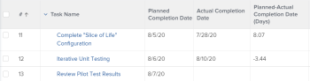

# Ver: calcular diferencias de fecha y hora

>[!IMPORTANT]
>
>No se puede calcular la diferencia de fecha y hora en Adobe Workfront entre dos objetos diferentes del mismo tipo. Por ejemplo, no se puede calcular la diferencia de fecha y hora entre dos fechas en dos proyectos, tareas o problemas diferentes.

Puede calcular la diferencia entre lo siguiente:

* Diferencia de fecha y hora entre dos campos de fecha del mismo objeto
* Diferencia de fecha y hora entre el campo de un objeto y otro campo del objeto principal

>[!TIP]
>
>Estos cálculos muestran el número de días entre las dos fechas. El resultado se muestra en días. La marca de tiempo del campo de fecha también se tiene en cuenta, y el número de días puede ir seguido de decimales si las marcas de tiempo no coinciden. Si la tarea se completó tarde, el número de días se muestra como un valor negativo.

## Requisitos de acceso

Debe tener el siguiente acceso para realizar los pasos de este artículo:

<table style="table-layout:auto"> 
 <col> 
 <col> 
 <tbody> 
  <tr> 
   <td role="rowheader">plan Adobe Workfront*</td> 
   <td> <p>Cualquiera</p> </td> 
  </tr> 
  <tr> 
   <td role="rowheader">Licencia de Adobe Workfront*</td> 
   <td> <p>Solicitud para modificar una vista </p>
   <p>Plan para modificar un informe</p> </td> 
  </tr> 
  <tr> 
   <td role="rowheader">Configuraciones de nivel de acceso*</td> 
   <td> <p>Editar el acceso a Informes, Tableros y Calendarios para modificar un informe</p> <p>Editar el acceso a filtros, vistas y agrupaciones para modificar una vista</p> <p><b>NOTA</b>

Si sigue sin tener acceso, pregunte al administrador de Workfront si ha establecido restricciones adicionales en su nivel de acceso. Para obtener información sobre cómo un administrador de Workfront puede modificar su nivel de acceso, consulte <a href="../../../administration-and-setup/add-users/configure-and-grant-access/create-modify-access-levels.md" class="MCXref xref">Crear o modificar niveles de acceso personalizados</a>.</p> </td>
</tr>  
  <tr> 
   <td role="rowheader">Permisos de objeto</td> 
   <td> <p>Administración de permisos de un informe</p> <p>Para obtener información sobre cómo solicitar acceso adicional, consulte <a href="../../../workfront-basics/grant-and-request-access-to-objects/request-access.md" class="MCXref xref">Solicitud de acceso a objetos </a>.</p> </td> 
  </tr> 
 </tbody> 
</table>

&#42;Para saber qué plan, tipo de licencia o acceso tiene, póngase en contacto con su administrador de Workfront.

## Calcule la diferencia de hora y fecha entre dos campos de fecha en el mismo objeto

Por ejemplo, puede calcular la diferencia entre la fecha planificada de finalización y la fecha real de finalización de una tarea.



1. Ir a una lista de tareas.
1. Desde el **Ver** , haga clic en **Nueva vista**.

1. Clic **Agregar columna** y empiece a escribir &quot;Fecha planificada de finalización&quot; en la **Mostrar en esta columna** a continuación, selecciónelo cuando se muestre en la lista.

1. Clic **Agregar columna** y empiece a escribir &quot;Fecha real de finalización&quot; en la **Mostrar en esta columna** a continuación, selecciónelo cuando se muestre en la lista.

1. Clic **Agregar columna**, luego haga clic en **Cambiar a modo de texto**.

1. Pase el ratón sobre el área de modo de texto y haga clic en **Haga clic para editar el texto**.
1. Elimine el texto que encuentre en la **Modo de texto** y reemplácelo por el siguiente código:

   ```
   displayname=Planned-Actual Completion Date<br>linkedname=direct<br>querysort=plannedCompletionDate<br>textmode=true<br>valueexpression=ROUND(DATEDIFF({plannedCompletionDate},{actualCompletionDate}),2)<br>valueformat=HTML
   ```

1. Clic **Guardar**, entonces **Guardar vista**.

## Calcular la diferencia de fecha y hora entre el campo de un objeto y otro campo de un objeto principal

Para obtener una lista de objetos y sus elementos principales, consulte la sección &quot;Explicación de la interdependencia y la jerarquía de objetos&quot; en [Explicación de los objetos en Adobe Workfront](../../../workfront-basics/navigate-workfront/workfront-navigation/understand-objects.md).\
Por ejemplo, puede calcular la diferencia entre la fecha planificada de finalización de una tarea y la fecha planificada de finalización de su tarea principal o del proyecto en el que se encuentra la tarea.


1. Ir a una lista de tareas.
1. Desde el **Ver** , haga clic en **Nueva vista**.

1. Clic **Agregar columna** y empiece a escribir &quot;Fecha planificada de finalización del proyecto&quot; o &quot;Fecha de finalización principal&quot; en el **Mostrar en esta columna** a continuación, selecciónelo cuando se muestre en la lista.

1. Clic **Agregar columna** y empiece a escribir &quot;Fecha planificada de finalización&quot; en la **Mostrar en esta columna** a continuación, selecciónelo cuando se muestre en la lista.

1. Clic **Agregar columna**, luego haga clic en **Cambiar a modo de texto**.

1. Pase el ratón sobre el área de modo de texto y haga clic en **Haga clic para editar el texto**.
1. Elimine el texto que encuentre en la **Modo de texto** y sustitúyalo por uno de los códigos siguientes:

   * Para mostrar la diferencia entre la fecha planificada de finalización del proyecto y la de la tarea:

      ```
      displayname=Project Planned Completion - Task Planned Completion (Days)<br>textmode=true<br>valueexpression=ROUND(DATEDIFF({project}.{plannedCompletionDate},{plannedCompletionDate}),2)<br>valueformat=HTML
      ```

   * Para mostrar la diferencia entre la fecha planificada de finalización de la tarea principal y la de la tarea:

      ```
      valueexpression=ROUND(DATEDIFF({parent}.{plannedCompletionDate},{plannedCompletionDate}),2)<br>textmode=true<br>valueformat=HTML<br>displayname=Parent Planned Completion - Planned Completion (Days)
      ```

1. Clic **Guardar**, entonces **Guardar vista**.
