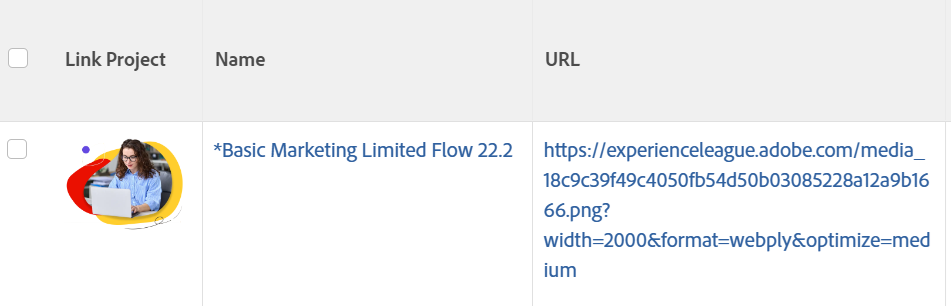

# Vista: mostrar una imagen en lugar de una cadena en una columna

<!--Audited: 11/2024-->

Puede reemplazar el nombre de un objeto en una vista con una imagen mediante el modo de texto. También puede agregar a la imagen un vínculo que pueda abrir el objeto al que reemplaza.

>[!NOTE]
>
>Las imágenes aparecen en su resolución real, por lo que intente utilizar imágenes pequeñas.



## Requisitos de acceso

+++ Expanda para ver los requisitos de acceso para la funcionalidad en este artículo.

Debe tener el siguiente acceso para realizar los pasos de este artículo:

<table style="table-layout:auto"> 
 <col> 
 <col> 
 <tbody> 
  <tr> 
   <td role="rowheader">plan de Adobe Workfront</td> 
   <td> <p>Cualquiera</p> </td> 
  </tr> 
  <tr> 
   <td role="rowheader">Licencia de Adobe Workfront*</td> 
   <td> 
    <p>Nuevo:</p>
   <ul><li><p>Colaborador para modificar un filtro </p></li>
   <li><p>Estándar para modificar un informe</p></li> </ul>

<p>Actual:</p>
   <ul><li><p>Solicitud para modificar un filtro </p></li>
   <li><p>Plan para modificar un informe</p></li> </ul></td> 
  </tr> 
  <tr> 
   <td role="rowheader">Configuraciones de nivel de acceso</td> 
   <td> <p>Editar el acceso a Informes, Tableros y Calendarios para modificar un informe</p> <p>Editar el acceso a filtros, vistas y agrupaciones para modificar un filtro</p> </td> 
  </tr> 
  <tr> 
   <td role="rowheader">Permisos de objeto</td> 
   <td> <p>Administración de permisos de un informe</p>  </td> 
  </tr> 
 </tbody> 
</table>

*Para obtener más información, consulte [Requisitos de acceso en la documentación de Workfront](/help/quicksilver/administration-and-setup/add-users/access-levels-and-object-permissions/access-level-requirements-in-documentation.md).

+++

## Ejemplo: Reemplazar el nombre de un proyecto en una vista de proyecto por una imagen:

1. Cargue una imagen en un sitio web o servidor externo de Adobe Workfront. Debe poder acceder a la imagen desde el explorador web.

   >[!TIP]
   >
   >* Cada tipo de explorador es diferente, pero todos pueden mostrar direcciones URL.
   >* Evite utilizar imágenes que se carguen en Workfront. Dado que las imágenes almacenadas en Workfront no están disponibles para el público y tienen una clave de acceso que caduca después de un tiempo, estas imágenes dejan de mostrarse en la vista a lo largo del tiempo.
   >* Una imagen guardada en el equipo no tiene una dirección URL inherente. Encuentre un sitio que proporcione alojamiento de imágenes y aloje su imagen allí. Es posible que su organización ya tenga un sitio de este tipo.

1. Con el navegador web, vaya a la imagen que ha guardado.
1. Obtenga la dirección URL de la imagen haciendo lo siguiente:

   <!--
   <p data-mc-conditions="QuicksilverOrClassic.Draft mode">(NOTE: I used this blog post to document what kind of image we need for this: https://www.canto.com/blog/image-url/ (consulting uses this)) </p>
   -->

   1. Haga clic con el botón derecho y seleccione **Copiar ubicación de la imagen** o **Obtener vínculo**, según el explorador. Ahora tiene la dirección URL de esa imagen específica y puede pegarla desde el portapapeles.
   1. Asegúrese de que todas las personas que tengan ese vínculo tengan permisos para ver la imagen simplemente yendo al vínculo y de que no necesiten iniciar sesión para acceder a ella.

1. Vaya a un proyecto, haga clic en el menú **Más**  junto al nombre del proyecto y luego haga clic en **Editar**.

1. En el campo **URL**, agregue el vínculo a la imagen.
1. Ir a una vista de proyecto en una lista de proyectos.
1. Haga clic en el menú desplegable **Vista** y luego haga clic en **Nueva vista**.
1. Haga clic en el encabezado de la columna del **Nombre de proyecto** y, a continuación, haga clic en **Cambiar a modo de texto**.

1. Agregue el siguiente código a la columna y al código existente:

   ```
   displayname=Link Project
   image.name=Link Project
   image.valuefield=URL
   link.linkproperty.0.name=projectID
   link.linkproperty.0.value=ID
   link.lookup=link.edit
   link.page=/view
   link.valuefield=objCode
   link.valueformat=val
   textmode=true
   type=image
   valueformat=
   ```

1. Haga clic en **Listo** > **Guardar vista**.
La imagen seleccionada reemplaza el nombre del proyecto en la vista de proyecto y la imagen es un vínculo al proyecto.