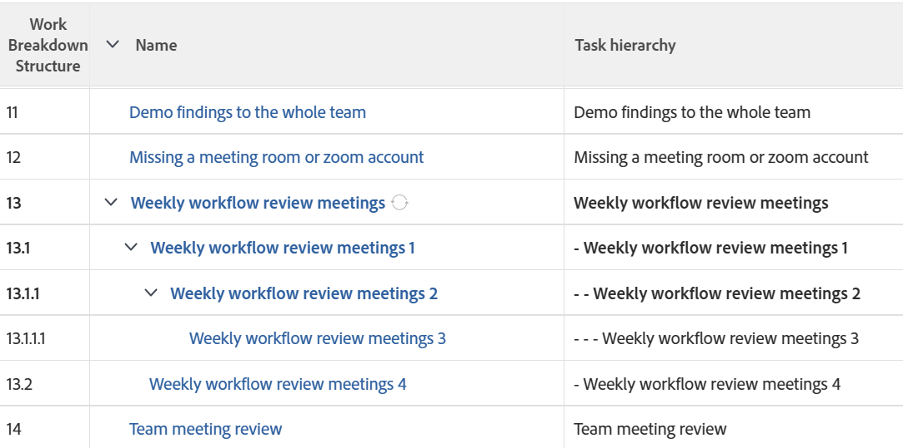

# Ver: mostrar las sangrías de las tareas en una lista de tareas

<!--Audited: 11/2024-->

En esta vista de tareas, puede agregar código a la columna Nombre de tarea para mostrar las tareas con sangría según la Estructura de desglose de trabajo del proyecto.



## Requisitos de acceso

+++ Expanda para ver los requisitos de acceso para la funcionalidad en este artículo. 

<table style="table-layout:auto"> 
 <col> 
 <col> 
 <tbody> 
  <tr> 
   <td role="rowheader">paquete de Adobe Workfront</td> 
   <td> <p>Cualquiera</p> </td> 
  </tr> 
  <tr> 
   <td role="rowheader">Licencia de Adobe Workfront</td> 
   <td> 
   <p>Colaborador o solicitud para modificar un filtro </p>
   <p>Estándar o Plan para modificar un informe</p>
  </tr> 
  <tr> 
   <td role="rowheader">Configuraciones de nivel de acceso</td> 
   <td> <p>Editar el acceso a Informes, Paneles de control y Calendarios para modificar un informe</p> <p>Acceso de edición a filtros, vistas y agrupaciones para modificar un filtro</p> </td> 
  </tr> 
  <tr> 
   <td role="rowheader">Permisos de objeto</td> 
   <td> <p>Permisos de administración para un informe</p>  </td> 
  </tr> 
 </tbody> 
</table>

Para obtener más información sobre el contenido de esta tabla, consulte [Requisitos de acceso en la documentación de Workfront](/help/quicksilver/administration-and-setup/add-users/access-levels-and-object-permissions/access-level-requirements-in-documentation.md).

+++

## Mostrar sangrías de tareas en una columna de una lista de tareas

1. Vaya a una lista de tareas.
1. En el menú desplegable **Vista**, haga clic en **Nueva vista**.

1. Haga clic en **Agregar columna** y empiece a escribir &quot;Nombre de tarea&quot; en el campo **Mostrar en esta columna**; a continuación, selecciónelo cuando se muestre en la lista.

1. En la nueva columna, haga clic en **Cambiar al modo de texto** > **Editar modo de texto**.
1. Elimine el texto que encuentre en la línea `valuefield=` y reemplácelo por el siguiente código:

   ```
   displayname=Task hierarchy
   valueexpression=IF({indent}<1,{name},IF({indent}<2,CONCAT(' - ',{name}),IF({indent}<3,CONCAT(' - - ',{name}),IF({indent}<4,CONCAT(' - - - ',{name}),CONCAT(' - - - - ',{name})))))
   ```

1. Haga clic en **Listo** y luego en **Guardar vista**.
1. (Opcional) Actualice el nombre de la vista y, a continuación, haga clic en **Guardar vista**.
