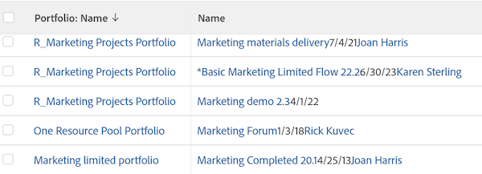

# Ver: combinar información de varias columnas en una columna compartida

<!-- Audited: 11/2024 -->

Puede combinar la información que se muestra en varias columnas independientes y mostrarla en una columna compartida.

## Requisitos de acceso

+++ Expanda para ver los requisitos de acceso para la funcionalidad en este artículo.

Debe tener el siguiente acceso para realizar los pasos de este artículo:

<table style="table-layout:auto"> 
 <col> 
 <col> 
 <tbody> 
  <tr> 
   <td role="rowheader">plan de Adobe Workfront</td> 
   <td> <p>Cualquiera</p> </td> 
  </tr> 
  <tr> 
   <td role="rowheader">Licencia de Adobe Workfront</td> 
   <td> <p> Actual: 
   <ul>
   <li>Solicitud para modificar una vista</li> 
   <li>Plan para modificar un informe</li>
   </ul>
     </p>
     <p> Nuevo: 
   <ul>
   <li>Colaborador para modificar una vista</li> 
   <li>Estándar para modificar un informe</li>
   </ul>
     </p>
    </td> 
  </tr> 
  <tr> 
   <td role="rowheader">Configuraciones de nivel de acceso*</td> 
   <td> <p>Editar el acceso a Informes, Tableros y Calendarios para modificar un informe</p> <p>Editar el acceso a filtros, vistas y agrupaciones para modificar una vista</p> </td> 
  </tr> 
  <tr> 
   <td role="rowheader">Permisos de objeto</td> 
   <td> <p>Administración de permisos de un informe</p> </td> 
  </tr> 
 </tbody> 
</table>

Para obtener más información sobre esta tabla, consulte [Requisitos de acceso en la documentación de Workfront](/help/quicksilver/administration-and-setup/add-users/access-levels-and-object-permissions/access-level-requirements-in-documentation.md).

+++

## Consideraciones al compartir o combinar columnas

* Puede combinar dos columnas adyacentes y mostrar la información de cada columna separadas por un salto de línea, o puede combinar la información en dos columnas adyacentes sin separador entre la información de cada columna.
* Puede combinar la información de más de dos columnas aplicando la misma sintaxis descrita en este artículo a una columna ya compartida y a una adyacente.
* La línea `valueformat=HTML` es obligatoria en una columna compartida. De lo contrario, las columnas no contienen información (estarán en blanco) cuando el informe se exporte desde Adobe Workfront.
* Es posible que no se admita el formato condicional en las columnas combinadas.

  Existen las siguientes excepciones:

   * Al ver información en Workfront, se conserva el formato de la primera columna y el de todas las demás columnas si las columnas que componen una columna combinada tienen un formato diferente entre sí,.
   * Al exportar la vista a un archivo de PDF, el formato condicional se aplica a la primera columna de una columna combinada.
   * Al exportar la vista a un archivo de Excel, las columnas combinadas se muestran como columnas independientes. Las columnas individuales también muestran sus respectivas reglas de formato condicional.

* Las columnas con el atributo **viewalias** pueden limitar la cantidad de columnas que se pueden combinar. Para evitar estos límites, evite utilizar el atributo **viewalias**. Si debe incluir el atributo **viewalias** en una columna, asegúrese de que sea el último elemento que aparezca en la columna.

* Si exporta una lista con columnas compartidas a un formato de Excel o Delimitado por tabuladores, estas columnas se separan en el archivo exportado.

* Cuando una o ambas columnas muestran un campo de tipo `tile`, se introduce automáticamente un salto de línea forzado en la columna combinada. Por ejemplo, los campos de texto con formato son de tipo `tile`. En este caso, hay un código de línea de `type=tile` cuando se visualizan las columnas en modo de texto.

## Combinar datos de dos columnas sin un salto de línea

Puede combinar los datos de varias columnas independientes para mostrarlos en una columna sin saltos ni espacios entre los valores de cada columna.

>[!TIP]
>
>Este método se recomienda cuando se combinan dos columnas que nunca pueden mostrar un valor para el mismo registro al mismo tiempo. Por ejemplo, en un informe de elemento de trabajo, las columnas Nombre de problema y Nombre de tarea se pueden combinar sin un salto de línea entre ellas, porque un elemento de trabajo nunca puede tener un Nombre de problema y un Nombre de tarea al mismo tiempo. Un elemento de trabajo puede ser un problema o una tarea en Workfront.

Para combinar datos de dos columnas sin un salto de línea:

1. Ir a una lista de objetos.
1. En la lista desplegable **Vista**, seleccione una vista y luego haga clic en el icono **Editar**  para editar la vista.
1. Vaya a la primera columna que desee combinar y, a continuación, haga clic en **Cambiar al modo de texto** > **Editar modo de texto**.
1. Agregue el siguiente texto a la primera columna que desee combinar:

   `sharecol=true`

   Al combinar las dos primeras columnas de una lista o informe, Workfront precede cada línea de texto que contiene información sobre el objeto de la primera columna con `column.0.` y las líneas de texto que contienen información sobre la segunda columna con `column.1.`

   Debe anteponer el número de columna de la primera columna al número de esa columna. El recuento de columnas siempre comienza con la columna situada más a la izquierda de la lista o del informe con la etiqueta `column.0.`.

   Si comparte más de una columna, asegúrese de agregar el número de columna en las líneas de código que contienen la información para compartir de cada columna.


   **EJEMPLO:** A continuación se muestra el código de modo de texto de una columna combinada que contiene tres columnas independientes, comenzando por la segunda columna de la lista. Los valores combinados son Nombre del proyecto, Fecha planificada de inicio y Nombre del propietario del proyecto. No hay ningún salto entre los tres valores:

   ```
   column.1.valuefield=name
   column.1.valueformat=HTML
   column.1.sharecol=true
   column.2.valuefield=plannedStartDate
   column.2.valueformat=atDate
   column.2.sharecol=true
   column.3.valuefield=owner:name
   column.3.valueformat=HTML
   ```

   


1. Haga clic en **Listo** y luego en **Guardar vista**.

## Combinar datos de dos columnas con un salto de línea

Haga lo siguiente para combinar los datos de varias columnas y mostrarlos en una columna común con un salto de línea entre los valores de cada columna:

1. Ir a una lista de objetos.
1. En la lista desplegable **Vista**, seleccione una vista y luego haga clic en el icono **Editar**  para editar la vista.
1. Agregue una tercera columna entre las dos columnas que desee combinar.

   >[!TIP]
   >
   >* Las columnas que desee combinar deben ser adyacentes entre sí.
   >* Debe hacer clic en la primera columna que desee combinar.

1. Haga clic en **Cambiar al modo de texto** > **Editar modo de texto** y agregue el siguiente código en la columna central que agregó en el paso 1:

   ```
   value=<br>
   valueformat=HTML
   width=1
   sharecol=true
   ```

1. Haga clic en la primera columna y haga clic en **Cambiar al modo de texto** > **Editar modo de texto**; a continuación, agregue el texto siguiente a la columna:

   `sharecol=true`

   Al combinar las dos primeras columnas de una lista o informe, Workfront precede cada línea de texto que contiene información sobre el objeto de la primera columna con `column.0.`, la columna con la información de uso compartido con `column.1.` y las líneas de texto que contienen información sobre la segunda columna con `column.2.`.

   Si la columna combinada está en el centro de la vista, las columnas se numeran según su lugar en la vista. El recuento de columnas siempre comienza con la columna situada más a la izquierda de la lista o del informe con la etiqueta `column.0.`.

   Si comparte más de una columna, asegúrese de agregar el número de columna en las líneas de código que contienen la información para compartir.

   **EJEMPLO:** A continuación se muestra el código de modo de texto de una columna compartida que contiene el nombre del proyecto, la fecha planificada de inicio y el nombre del propietario del proyecto con un salto de línea. La columna compartida es la segunda columna de una vista de proyecto.

   ```
   column.1.displayname=Project_StartDate_Owner
   column.1.sharecol=true
   column.1.textmode=true
   column.1.valuefield=name
   column.1.valueformat=HTML
   column.2.value=<br>
   column.2.width=1
   column.2.valueformat=HTML
   column.2.sharecol=true
   column.3.valuefield=plannedStartDate
   column.3.valueformat=atDate
   column.3.sharecol=true
   column.4.value=<br>
   column.4.width=1
   column.4.valueformat=HTML
   column.4.sharecol=true
   column.5.textmode=true
   column.5.valuefield=owner:name
   column.5.valueformat=HTML 
   ```

   

1. Haga clic en **Listo** y luego en **Guardar vista**.
