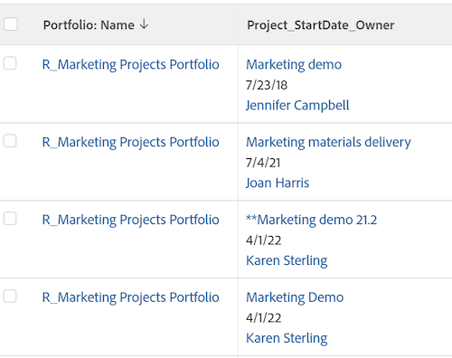

# Ver: combinar información de varias columnas en una columna compartida

Puede combinar la información que se muestra en varias columnas independientes y mostrarla en una columna compartida.

## Requisitos de acceso

Debe tener el siguiente acceso para realizar los pasos de este artículo:

<table style="table-layout:auto"> 
 <col> 
 <col> 
 <tbody> 
  <tr> 
   <td role="rowheader">plan de Adobe Workfront*</td> 
   <td> <p>Cualquiera</p> </td> 
  </tr> 
  <tr> 
   <td role="rowheader">Licencia de Adobe Workfront*</td> 
   <td> <p>Plan </p> </td> 
  </tr> 
  <tr> 
   <td role="rowheader">Configuraciones de nivel de acceso*</td> 
   <td> <p>Editar acceso a informes, tableros y calendarios</p> <p>Editar acceso a filtros, vistas y grupos</p> <p>Nota: Si todavía no tiene acceso, pregunte a su administrador de Workfront si establece restricciones adicionales en su nivel de acceso. Para obtener información sobre cómo un administrador de Workfront puede modificar su nivel de acceso, consulte <a href="../../../administration-and-setup/add-users/configure-and-grant-access/create-modify-access-levels.md" class="MCXref xref">Crear o modificar niveles de acceso personalizados</a>.</p> </td> 
  </tr> 
  <tr> 
   <td role="rowheader">Permisos de objeto</td> 
   <td> <p>Administrar permisos en un informe</p> <p>Para obtener información sobre la solicitud de acceso adicional, consulte <a href="../../../workfront-basics/grant-and-request-access-to-objects/request-access.md" class="MCXref xref">Solicitar acceso a objetos </a>.</p> </td> 
  </tr> 
 </tbody> 
</table>

&#42;Para saber qué plan, tipo de licencia o acceso tiene, póngase en contacto con el administrador de Workfront.

## Consideraciones al compartir o combinar columnas

* Puede combinar dos columnas adyacentes y mostrar la información de cada columna separada por un salto de línea, o puede combinar la información en dos columnas adyacentes sin ningún separador entre la información de cada columna.
* Puede combinar la información de más de dos columnas aplicando la misma sintaxis descrita en este artículo a una columna ya compartida y a una adyacente.
* El

   ```
   valueformat=HTML
   ```

   es obligatorio en una columna compartida. De lo contrario, las columnas no contienen información (quedarán en blanco) al exportar el informe desde Adobe Workfront.
* Es posible que no se admita el formato condicional en las columnas combinadas.

   Existen las siguientes excepciones:

   * Cuando se visualiza la información en Workfront, se conserva el formato de la primera columna y se ignora el formato de todas las demás columnas si las columnas que conforman una columna combinada tienen un formato diferente entre sí.
   * Al exportar la vista a un archivo de PDF, el formato condicional se aplica a la primera columna de una columna combinada.
   * Al exportar la vista a un archivo de Excel, las columnas combinadas se muestran como columnas independientes. Las columnas individuales también muestran sus respectivas reglas de formato condicional.

* Columnas con la variable **viewalias** puede limitar la cantidad de columnas que puede combinar. Para evitar estos límites, evite utilizar la variable **viewalias** atributo. Si debe incluir la variable **viewalias** en una columna, asegúrese de que es el último elemento de la columna.

* Si exporta una lista con columnas compartidas en formato Excel o Delimitado por tabulaciones, estas columnas se separan en el archivo exportado.

## Combinación de datos de dos columnas sin salto de línea

Puede combinar los datos de varias columnas independientes para mostrarlos en una columna sin saltos ni espacios entre los valores de cada columna.

>[!TIP]
>
>Se recomienda utilizar este método cuando se combinan dos columnas que nunca pueden mostrar un valor para el mismo registro al mismo tiempo. Por ejemplo, en un informe de elemento de trabajo, las columnas Nombre de problema y Nombre de tarea se pueden combinar sin un salto de línea entre ellas, ya que un elemento de trabajo nunca puede tener un nombre de problema y un nombre de tarea al mismo tiempo. Un elemento de trabajo puede ser un problema o una tarea en Workfront.

Para ello:

1. Con el modo de texto de una vista, agregue el siguiente texto a la primera columna que desee combinar:

   ```
   sharecol=true
   ```

   Cuando combina las dos primeras columnas de una lista o informe, Workfront precede cada línea de texto que contenga información sobre el objeto de la primera columna con

   ```
   column.0.
   ```

   y las líneas de texto que contienen información sobre la segunda columna con

   ```
   column.1.
   ```

   .\
   Debe preceder el número de columna de la primera columna con el número de dicha columna. El recuento de columnas siempre comienza con la columna situada más a la izquierda de la lista o informe etiquetado como

   ```
   column.0.
   ```

   .

   Si comparte más de una columna, asegúrese de agregar el número de columna en las líneas de código que contienen la información de uso compartido para cada columna.

   **Ejemplo:** El siguiente es el código de modo de texto de una columna combinada que contiene tres columnas independientes, empezando por la segunda columna de la lista. Los valores combinados son Nombre del proyecto, Fecha de inicio planificada y Nombre del propietario del proyecto, y no hay ningún salto entre los tres valores:

   ```
   column.1.valuefield=name
   ```

   ```
   column.1.valueformat=HTML
   ```

   ```
   column.1.sharecol=true
   ```

   ```
   column.2.valuefield=plannedStartDate
   ```

   ```
   column.2.valueformat=atDate
   ```

   ```
   column.2.sharecol=true
   ```

   ```
   column.3.valuefield=owner:name
   ```

   ```
   column.3.valueformat=HTML
   ```

   <pre></pre>

1. Haga clic en **Guardar**, luego **Guardar vista**.

## Combinación de datos de dos columnas con un salto de línea

Realice lo siguiente para combinar los datos de varias columnas y mostrarlos en una columna común con un salto de línea entre los valores de cada columna:

1. Agregue una tercera columna entre las dos columnas que desee combinar.

   >[!TIP]
   * Las columnas que desee combinar deben ser adyacentes entre sí.
   * Debe hacer clic en la primera columna que desee combinar.


1. Haga clic en **Cambiar al modo de texto** y añada el siguiente código en la columna media que agregó en el paso 1:

   ```
   value=<br>
   ```

   ```
   valueformat=HTML
   ```

   ```
   width=1
   ```

   ```
   sharecol=true
   ```

1. Agregue el siguiente texto a la primera columna:

   ```
   sharecol=true
   ```

   Cuando combina las dos primeras columnas de una lista o informe, Workfront precede cada línea de texto que contenga información sobre el objeto de la primera columna con

   ```
   column.0.
   ```

   , la columna con la información de uso compartido con

   ```
   column.1.
   ```

   y las líneas de texto que contienen información sobre la segunda columna con

   ```
   column.2.
   ```

   . Si la columna combinada está en medio de la vista, las columnas se numeran según su lugar en la vista. El recuento de columnas siempre comienza con la columna situada más a la izquierda de la lista o informe etiquetado como

   ```
   column.0.
   ```

   .

   Si comparte más de una columna, asegúrese de agregar el número de columna en las líneas de código que contienen la información de uso compartido.

   **Ejemplo:** El siguiente es el código de modo de texto de una columna compartida que contiene Nombre del proyecto, Fecha de inicio planificada y el nombre del propietario del proyecto con un salto de línea. La columna compartida es la segunda columna de una vista de proyecto.

   ```
   column.1.displayname=Project_StartDate_Owner
   ```

   ```
   column.1.sharecol=true
   ```

   ```
   column.1.textmode=true
   ```

   ```
   column.1.valuefield=name
   ```

   ```
   column.1.valueformat=HTML
   ```

   ```
   column.2.value=<br>
   ```

   ```
   column.2.width=1
   ```

   ```
   column.2.valueformat=HTML
   ```

   ```
   column.2.sharecol=true
   ```

   ```
   column.3.valuefield=plannedStartDate
   ```

   ```
   column.3.valueformat=atDate
   ```

   ```
   column.3.sharecol=true
   ```

   ```
   column.4.value=<br>
   ```

   ```
   column.4.width=1
   ```

   ```
   column.4.valueformat=HTML
   ```

   ```
   column.4.sharecol=true
   ```

   ```
   column.5.textmode=true
   ```

   ```
   column.5.valuefield=owner:name
   ```

   ```
   column.5.valueformat=HTML
   ```

   <pre></pre>

1. Haga clic en **Guardar**, luego **Guardar vista**.
