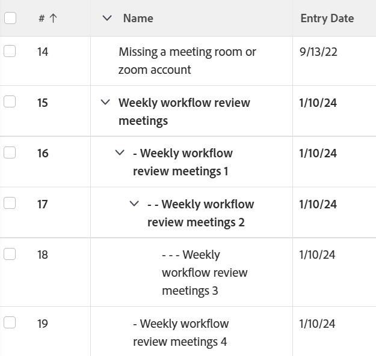

# Vista: mostrar la relación principal y secundaria en una tarea aplicando una sangría a las tareas

<!--Audited: 11/2024-->

Puede mantener la distinción de relaciones principal-secundaria en una lista de tareas exportada añadiendo una vista personalizada a la lista de tareas y asegurándose de que esta vista esté seleccionada antes de exportar la lista.



## Requisitos de acceso

+++ Expanda para ver los requisitos de acceso para la funcionalidad en este artículo.

<table style="table-layout:auto"> 
 <col> 
 <col> 
 <tbody> 
  <tr> 
   <td role="rowheader">Paquete de Adobe Workfront</td> 
   <td> <p>Cualquiera</p> </td> 
  </tr> 
  <tr> 
   <td role="rowheader">Licencia de Adobe Workfront</td> 
   <td> 
   <p>Colaborador o solicitud para modificar una vista </p>
   <p>Estándar o Plan para modificar un informe</p>
  </tr> 
  <tr> 
   <td role="rowheader">Configuraciones de nivel de acceso</td> 
   <td> <p>Editar el acceso a Informes, Paneles de control y Calendarios para modificar un informe</p> <p>Edición del acceso a Filtros, Vistas y Agrupaciones para modificar una vista</p> </td> 
  </tr> 
  <tr> 
   <td role="rowheader">Permisos de objeto</td> 
   <td> <p>Permisos de administración para un informe</p>  </td> 
  </tr> 
 </tbody> 
</table>

Para obtener más información sobre el contenido de esta tabla, consulte [Requisitos de acceso en la documentación de Workfront](/help/quicksilver/administration-and-setup/add-users/access-levels-and-object-permissions/access-level-requirements-in-documentation.md).


+++

## Mostrar la relación principal y secundaria en una tarea aplicando una sangría a las tareas

1. Vaya al proyecto con la lista de tareas que desee exportar.
1. Haga clic en el menú desplegable **Vista** y seleccione **Nueva vista**.
1. Haga clic en el encabezado de columna **Nombre de la tarea**.
1. Seleccione **Cambiar a modo de texto** en la esquina superior derecha.
1. Haga clic en **Editar modo de texto** y quite todo el texto existente.
1. Pegue el siguiente texto:


   ```
   displayname=
   linkedname=direct
   namekey=name
   querysort=name
   textmode=true
   valueexpression=IF({indent}<1,{name},IF({indent}<2,CONCAT(" - ",{name}),IF({indent}<3,CONCAT(" - - ",{name}),IF({indent}<4,CONCAT(" - - - ",{name}),CONCAT(" - - - - ",{name})))))
   valueformat=HTML
   ```

1. Haga clic en **Hecho** > **Guardar vista**.
