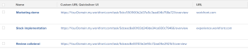

# Vista: URL externa con campo de datos personalizados

Puede mostrar un vínculo a una dirección URL personalizada interna mediante una **Campo personalizado calculado** con el nombre &quot;URL personalizada&quot; en una **Vista de tareas**.

Esto le ayuda a vincular rápidamente desde ciertos objetos de una vista a ciertas áreas de la aplicación directamente desde los informes.

Al crear un campo personalizado calculado, primero debe crear el campo y, a continuación, crear la vista.

Las siguientes secciones son un ejemplo de un campo personalizado calculado para tareas. El campo personalizado se denomina Dirección URL personalizada. La vista personalizada muestra el valor del campo, así como la variable **URL** para tareas.

Con los mismos pasos, puede crear campos personalizados calculados y vistas personalizadas similares para todos los objetos del sistema que tengan un formulario personalizado.

## Requisitos de acceso

Debe tener el siguiente acceso para realizar los pasos de este artículo:

<table style="table-layout:auto"> 
 <col> 
 <col> 
 <tbody> 
  <tr> 
   <td role="rowheader">plan Adobe Workfront*</td> 
   <td> <p>Cualquiera</p> </td> 
  </tr> 
  <tr> 
   <td role="rowheader">Licencia de Adobe Workfront*</td> 
   <td> <p>Solicitud para modificar una vista </p>
   <p>Plan para modificar un informe</p> </td> 
  </tr> 
  <tr> 
   <td role="rowheader">Configuraciones de nivel de acceso*</td> 
   <td> <p>Editar el acceso a Informes, Tableros y Calendarios para modificar un informe</p> <p>Editar el acceso a filtros, vistas y agrupaciones para modificar una vista</p> <p><b>NOTA</b>

Si sigue sin tener acceso, pregunte al administrador de Workfront si ha establecido restricciones adicionales en su nivel de acceso. Para obtener información sobre cómo un administrador de Workfront puede modificar su nivel de acceso, consulte <a href="../../../administration-and-setup/add-users/configure-and-grant-access/create-modify-access-levels.md" class="MCXref xref">Crear o modificar niveles de acceso personalizados</a>.</p> </td>
</tr>  
  <tr> 
   <td role="rowheader">Permisos de objeto</td> 
   <td> <p>Administración de permisos de un informe</p> <p>Para obtener información sobre cómo solicitar acceso adicional, consulte <a href="../../../workfront-basics/grant-and-request-access-to-objects/request-access.md" class="MCXref xref">Solicitud de acceso a objetos </a>.</p> </td> 
  </tr> 
 </tbody> 
</table>

&#42;Para saber qué plan, tipo de licencia o acceso tiene, póngase en contacto con su administrador de Workfront.

## Cree el campo personalizado calculado &quot;URL personalizada&quot;

Para obtener información sobre la creación de un campo personalizado calculado, consulte el artículo [Añadir datos calculados a un formulario personalizado](../../../administration-and-setup/customize-workfront/create-manage-custom-forms/add-calculated-data-to-custom-form.md).

Si tiene acceso para crear un formulario personalizado, puede crear un campo personalizado calculado para las tareas denominadas &quot;URL personalizada&quot;. Este campo está vinculado directamente al **Información general** dentro de la pestaña **Detalles de tarea** pestaña.

1. Cree un campo personalizado calculado.
1. En el campo Calculation, introduzca el siguiente código:

   CONCAT(&#39;&#39;https://`<domain>`.my.workfront.com&quot;,&quot;/&quot;,&quot;task/&quot;,ID,&quot;/overview&#39;&#39;)

1. Reemplazar &quot;`<domain>`&quot; con su nombre de dominio real, sin los corchetes.

   El

   ```
   /overview
   ```

   parte de esta dirección URL dirige el vínculo a **Información general** en el panel izquierdo de la tarea.

1. Después de crear su **Campo personalizado calculado**, adjunte el **Formulario personalizado** con este campo para mostrar varias tareas de Adobe Workfront que desee mostrar en la nueva vista.

## Cree la vista que muestre los campos &quot;URL personalizada&quot; y &quot;URL&quot; de la tarea

La tarea **Ver** en el ejemplo siguiente se muestra la variable **Campo personalizado calculado** se denomina &quot;URL personalizada&quot; como vínculo directo al **Información general** subpestaña dentro de la tarea **Detalles** , así como la variable **URL** de la tarea.



Para personalizar esta vista:

1. Ir a una lista de tareas.
1. Expanda el **Ver** en la parte superior de la lista de tareas.
1. Clic **Personalizar vista**.
1. Quite todas las columnas dentro de la vista, excepto la primera columna.
1. Haga clic en el encabezado de la primera columna.
1. Clic **Cambiar a modo de texto** en la esquina superior derecha de la interfaz.
1. Clic **Haga clic para editar el texto**.
1. Pegue el modo de texto siguiente en la columna.\
   En este ejemplo, la &quot;columna.1.&quot; muestra el valor del campo &quot;URL personalizada&quot; como un vínculo al nombre de la tarea **Información general**. &quot;Column.2.&quot; muestra el valor almacenado en el **Campo de URL** de la tarea.
   <pre>column.0.descriptionkey=name<br>column.0.link.linkproperty.0.name=ID<br>column.0.link.linkproperty.0.valuefield=ID<br>column.0.link.linkproperty.0.valueformat= int<br>column.0.link.lookup=link.view<br>column.0.link.valuefield= objCode<br>column.0.link.valueformat= val<br>column.0.linkedname=direct<br>column.0.listsort=string(name)<br>column.0.namekey=name.abbr<br>column.0.querysort=name<br>column.0.shortview=false<br>column.0.stretch=100<br>column.0.valuefield=name<br>column.0.valueformat=HTML<br>column.0.width=150<br>column.1.description=URL personalizada<br>column.1.link.isnewwindow=true<br>column.1.link.url=customDataLabelsAsString(Custom URL)<br>column.1.linkedname=direct<br>column.1.listsort=customDataLabelsAsString(Custom URL)<br>column.1.name=Dirección URL personalizada<br>column.1.querysort=URL<br>column.1.shortview=false<br>column.1.stretch=0<br>column.1.valuefield=Custom URL<br>column.1.valueformat=customDataLabelsAsString<br>column.1.width=150<br>column.2.descriptionkey=url<br>column.2.linkedname=direct<br>column.2.listsort=string(URL)<br>column.2.namekey=url.abbr<br>column.2.querysort=URL<br>column.2.shortview=false<br>column.2.stretch=0<br>column.2.valuefield=URL<br>column.2.valueformat=HTML<br>column.2.width=150</pre>

1. Clic **Guardar vista**.
