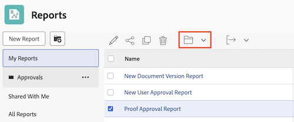

# Acceso y organización de informes

Los informes se pueden usar en Adobe Workfront para revisar o editar la información sobre los objetos del sistema. Puede crear sus propios informes, organizar los que cree y ver los que se han compartido con usted o de manera pública.

## Requisitos de acceso

Debe tener el siguiente acceso para realizar los pasos de este artículo:

<table style="table-layout:auto"> 
 <col> 
 <col> 
 <tbody> 
  <tr> 
   <td role="rowheader">Plan de Adobe Workfront*</td> 
   <td> 
Cualquiera
 </td> 
  </tr> 
  <tr> 
   <td role="rowheader">Licencia de Adobe Workfront*</td> 
   <td> 
Plan 
 </td> 
  </tr> 
  <tr> 
   <td role="rowheader">Configuraciones de nivel de acceso*</td> 
   <td> 
Acceso de edición a informes, paneles y calendarios
 
Acceso de edición a filtros, vistas y agrupaciones
 
Nota: Si sigue sin tener acceso, pregunte al administrador de Workfront si ha establecido restricciones adicionales en su nivel de acceso. Para obtener información sobre cómo un administrador de Workfront puede modificar su nivel de acceso, consulte <a href="../../../administration-and-setup/add-users/configure-and-grant-access/create-modify-access-levels.md" class="MCXref xref">Crear o modificar niveles de acceso personalizados</a>.
 </td> 
  </tr> 
  <tr> 
   <td role="rowheader">Permisos de objeto</td> 
   <td> 
Permisos de administración para un informe
 
Para obtener información sobre cómo solicitar acceso adicional, consulte <a href="../../../workfront-basics/grant-and-request-access-to-objects/request-access.md" class="MCXref xref">Solicitar acceso a los objetos </a>.
 </td> 
  </tr> 
 </tbody> 
</table>

&#42;Para saber qué plan, tipo de licencia o acceso tiene, póngase en contacto con el administrador de Workfront.

## Visualización de informes

Para acceder a los informes que ha creado o que se han compartido con usted o de manera pública:

1. En el **Menú principal** , haga clic en **Informes**.

1. Haga clic en una de las siguientes opciones, según el informe que desee ver:

   * Haga clic en **Mis informes** para ver los informes que ha creado.
   * Haga clic en **Compartido conmigo** para ver los informes que otros usuarios han compartido con usted.
   * Haga clic en **Todos los informes** para ver tanto los informes que ha creado como los que se han compartido con usted o de manera pública.

## Organización de los informes creados

Puede utilizar carpetas para organizar los informes que cree. No puede organizar informes que se hayan compartido con usted, que se hayan compartido de manera pública o del sistema.

* [Creación de una carpeta nueva para los informes](#create-a-new-folder-for-reports)
* [Adición de informes a una carpeta](#add-reports-to-a-folder)

### Creación de una nueva carpeta para informes {#create-a-new-folder-for-reports}

1. En el **Menú principal** , haga clic en **Informes**.

1. Haga clic en el icono **Nueva carpeta**.\
   

1. Especifique un nombre para la nueva carpeta y pulse Intro.
1. Desde la carpeta **Mis informes**, añada informes a la nueva carpeta.\
   Para obtener información sobre cómo añadir un informe a una carpeta nueva, consulte la sección [Adición de informes a una carpeta](#add-reports-to-a-folder) en este artículo.

   >[!NOTE]
   >
   >Solo puede añadir carpetas nuevas a la carpeta **Mis informes**. No puede añadir nuevas carpetas o informes a las carpetas **Compartido conmigo** o **Todos los informes**.

### Adición de informes a una carpeta {#add-reports-to-a-folder}

1. En el **Menú principal** , haga clic en **Informes**.

1. Haga clic en **Mis informes**.\
   O\
   Haga clic en cualquier carpeta anidada en la carpeta **Mis informes**.

1. Seleccione el informe y luego haga clic en el icono de carpeta  en la parte superior de la lista.

1. Elija la carpeta a la que desea agregar el informe.

   

   >[!NOTE]
   >
   >Solo puede mover informes de la carpeta **Mis informes** a otras carpetas anidadas en **Mis informes**. No puede mover informes desde o hasta la carpeta **Compartido conmigo** o **Todos los informes** hasta o desde otras carpetas.

