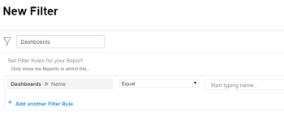

# Obtenga información sobre cómo organizar informes en un tablero

## Acceso a información de tablero en una lista de informes

Puede ver si un informe se añade a un panel de control en Adobe Workfront. Esto puede resultar útil a la hora de decidir qué informes se pueden conservar y cuáles se pueden eliminar del sistema. Si los informes están en los paneles de control, es posible que los usuarios sigan dependiendo de ellos. Se recomienda no eliminar los informes que se enumeran en los paneles de control que utilizan los usuarios.\
Para obtener más información acerca de cómo añadir informes a los paneles de control, consulte el artículo [Añadir un informe a un panel de control](../../../reports-and-dashboards/dashboards/creating-and-managing-dashboards/add-report-dashboard.md).

Puede ver si un informe se ha añadido a un panel de control realizando una de las siguientes acciones:

* Crear una vista para una lista de informes e incluir información del panel de control en las columnas
* Filtrar una lista de informes por uno o varios paneles de control específicos que sabes que están siendo utilizados activamente
* Creación de un informe para el objeto de informe y uso de una vista o un filtro que incluya información del panel de control

Cualquiera puede crear una vista o un filtro, pero debe tener acceso de edición a los informes en su nivel de acceso para crear un informe.\
Para obtener más información acerca del acceso a los informes, consulte el artículo [Conceder acceso a informes, paneles de control y calendarios](../../../administration-and-setup/add-users/configure-and-grant-access/grant-access-reports-dashboards-calendars.md).\
Para obtener más información sobre cómo generar un informe, consulte el artículo [Creación de un informe personalizado](../../../reports-and-dashboards/reports/creating-and-managing-reports/create-custom-report.md).

## Requisitos de acceso

+++ Expanda para ver los requisitos de acceso para la funcionalidad en este artículo. 

<table style="table-layout:auto"> 
 <col> 
 <col> 
 <tbody> 
  <tr> 
   <td role="rowheader">paquete de Adobe Workfront</td> 
   <td> 
Cualquiera
 </td> 
  </tr> 
  <tr> 
   <td role="rowheader">Licencia de Adobe Workfront</td> 
   <td> 
   
Estándar

   
Plan 
 </td> 
  </tr> 
  <tr> 
   <td role="rowheader">Configuraciones de nivel de acceso</td> 
   <td> 
Acceso de Edición a informes, paneles de control y calendarios
 
Acceso de edición a filtros, vistas y agrupaciones
</td> 
  </tr> 
  <tr> 
   <td role="rowheader">Permisos de objeto</td> 
   <td> 
Permisos de administración para un informe
</td> 
  </tr> 
 </tbody> 
</table>

Para obtener más información sobre el contenido de esta tabla, consulte [Requisitos de acceso en la documentación de Workfront](/help/quicksilver/administration-and-setup/add-users/access-levels-and-object-permissions/access-level-requirements-in-documentation.md).

+++

## Mostrar información de tablero en la lista Vista de un informe

>[!WARNING]
>
>Incluir la columna Paneles de control en una lista de informes puede aumentar significativamente los tiempos de carga, especialmente en el caso de listas de informes largas.

Para crear una vista con información del tablero para una lista de informes:

1. Haga clic en el icono **Menú principal**  en la esquina superior derecha de Workfront y, a continuación, haga clic en **Informes**.
1. En la lista de informes, haga clic en el menú desplegable **Ver**.
1. Haga clic en **vista nueva**.
1. Haga clic en **Añadir columna**.
1. Empiece a escribir “Paneles de control” en el campo **Empiece a escribir el nombre del campo**.
1. En el objeto **Informe**, seleccione **Paneles de control**.

1. Haga clic en **Guardar vista**.\
   Los paneles de control en los que aparece un informe se muestran en la columna Paneles de control de la lista de informes.\
   

## Filtrado de una lista de informes por información de panel de control

Para filtrar una lista de informes por información de panel de control:

1. Haga clic en el icono **Menú principal**  en la esquina superior derecha de Workfront y, a continuación, haga clic en **Informes**.

1. En la lista de informes, haga clic en el menú desplegable **Filtro**.
1. Haga clic en **Nuevo Filtro**, luego, en **Añadir una regla de filtro**.

1. Escriba “Paneles de control” en el campo **Escriba el nombre del campo**.

1. En el objeto **Paneles de control**, seleccione **Nombre**.

1. Seleccione **Igual** en el menú desplegable de modificadores y, a continuación, empiece a escribir el nombre del panel de control por el que desea filtrar. Puede seleccionar varios paneles de control para el filtro.\
   

1. Haga clic en **Guardar + Cerrar**.\
   Esto muestra una lista de informes que solo se enumeran en los paneles de control especificados.\
   También puede crear un informe para el objeto de informe y utilizar este filtro en el informe.
