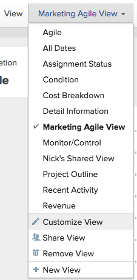

# Creación o edición de vistas en Adobe Workfront

<!-- Audited: 11/2024 -->

Puede personalizar el tipo de información que se muestra en la pantalla mediante las vistas. Puede utilizar varios tipos de vistas en Adobe Workfront.

Este artículo describe cómo crear y editar vistas estándar para listas e informes.

Para obtener más información, consulte [Información general sobre vistas en Adobe Workfront](../../../reports-and-dashboards/reports/reporting-elements/views-overview.md).

## Requisitos de acceso

+++ Expanda para ver los requisitos de acceso para la funcionalidad en este artículo.

<table style="table-layout:auto"> 
 <col> 
 <col> 
 <tbody> 
  <tr> 
   <td role="rowheader">Paquete de Adobe Workfront</td> 
   <td> 
Cualquiera
 </td> 
  </tr> 
  <tr> 
   <td role="rowheader">Licencia de Adobe Workfront</strong></td> 
   <td> 
    
Colaborador o superior

    
Solicitud o superior

   </td>
  </tr> 
  <tr> 
   <td role="rowheader">Configuraciones de nivel de acceso</td> 
   <td> 
Acceso de edición a filtros, vistas y agrupaciones
 
Editar el acceso a Informes, Paneles de control y Calendarios para crear una vista en un informe

   </td> 
  </tr> 
  <tr> 
   <td role="rowheader">Permisos de objeto</td> 
   <td> 
Gestionar permisos de un informe para crear o editar una vista en un informe
 
Permisos de administración de una vista para editarla

   </td> 
  </tr> 
 </tbody> 
</table>

Para obtener más información sobre el contenido de esta tabla, consulte [Requisitos de acceso en la documentación de Workfront](/help/quicksilver/administration-and-setup/add-users/access-levels-and-object-permissions/access-level-requirements-in-documentation.md).
+++

## Creación o personalización de una vista

El proceso de creación o personalización de una vista varía en función de si se está creando o personalizando una vista estándar o una vista de tablero.

### Creación o personalización de una vista estándar {#create-or-customize-a-standard-view}

Puede crear una nueva vista estándar o personalizar una vista estándar existente que haya creado anteriormente.

1. Haga clic en el menú desplegable **Vista** en cualquier lista donde quiera crear o personalizar una vista.

1. Haga clic en el botón **+ Nueva vista** para crear una vista nueva.
O
Haga clic en el icono **Editar**  que aparece al pasar el ratón a la derecha de la vista existente que desee editar.
Se muestra el cuadro de diálogo **Personalizar vista**.

1. En la sección **Vista previa de columna**, realice una de las acciones siguientes:

   * Modifique el valor de cualquier columna haciendo clic en el título de la columna y seleccionando un nuevo campo.
   * Añada una columna haciendo clic en **Añadir columna**, empiece a escribir el nombre de la columna que desea añadir y, a continuación, haga clic en ella cuando aparezca en la lista desplegable.
   * Ajuste el orden en que aparecen las columnas arrastrando el título de la columna a una nueva ubicación.

   * En el área **Configuración de columna**, haga clic en **Resumir esta columna por** y elija cómo desea que se muestren los datos en la columna. Esta opción está disponible para los siguientes tipos de columna:
     <table style="table-layout:auto"> 
         <col> 
         <col> 
         <tbody> 
          <tr> 
           <td role="rowheader"><strong>Campos de fecha</strong></td> 
           <td><ul>
           <li>Máximo</li>
         <li>Mínimo</li>
           </ul></td> 
          </tr> 
          <tr>
           <td role="rowheader"><strong>Campos de moneda</strong></td> 
           <td><ul>
           <li>Cuenta</li>
         <li>Suma</li>
           <li>Promedio</li>
         <li>Máximo</li>
           <li>Mínimo</li>
         </ul></td> 
          </tr> 
         <tr>
           <td role="rowheader"><strong>Campos booleanos y de cadena</strong></td> 
           <td><ul><li>Cuenta</li></ul>
           
Nota: Workfront no suele recomendar el resumen de un campo booleano por recuento, ya que el valor siempre será true/false.
</td> 
          </tr> 
         </tbody> 
        </table>

     >[!NOTE]
     >
     >Las siguientes excepciones se aplican a los objetos principales (por ejemplo, las tareas principales) cuando se resumen los valores de los siguientes campos en las agrupaciones:
     >   
     > * Todos los campos de número y moneda excepto Horas reales (por ejemplo, Costo de mano de obra planificado/ real, Costo de gasto planificado/ real, Costo planificado/ real, Horas planificadas) resumen los valores solo para tareas secundarias y tareas independientes. No resumen los valores de las tareas padre o padre de los padres.
     > * Horas reales resume los valores de las tareas principales e independientes; no resume los números de las tareas principales o secundarias.
     > * Los campos de datos personalizados para valores numéricos y monetarios resumen todas las tareas: padres, hijos, padres de padres y tareas independientes.
     >
     >Para obtener más información acerca del uso de agrupaciones en un informe, consulte el artículo [Información general sobre agrupaciones en Adobe Workfront](../../../reports-and-dashboards/reports/reporting-elements/groupings-overview.md).

      * (Opcional) Haga clic en **Opciones avanzadas** para especificar la siguiente información para la columna:

        <table style="table-layout:auto"> 
         <col> 
         <col> 
         <tbody> 
          <tr> 
           <td role="rowheader"><strong>Etiqueta personalizada de columna</strong></td> 
           <td>
Especifique una etiqueta personalizada para la columna. Esta etiqueta reemplaza la etiqueta predeterminada. Se recomienda utilizar solo caracteres UTF-8 para evitar problemas de compatibilidad.
</td> 
          </tr> 
          <tr> 
           <td role="rowheader"><strong>Formato de campo</strong></td> 
           <td>Seleccione el formato en el que desea que se muestren los valores de los campos de la columna.</td> 
          </tr> 
          <tr> 
           <td role="rowheader"><strong>Mostrar esta columna en panel de control</strong></td> 
           <td>
Seleccione esta opción para mostrar esta columna en un panel de control cuando el informe se muestre en paralelo con otro informe. Cuando esta opción no está seleccionada, esta columna no se muestra al ver el informe en un panel de control en el que los informes se muestran uno al lado del otro.
</td> 
          </tr> 
          <tr> 
           <td role="rowheader"><strong>Reglas de columna</strong></td> 
           <td>
Haga clic en <strong>+ Agregar una regla para esta columna</strong> para definir una regla para la columna. Después de añadir una regla, puede definir estilos de campo y de texto para ver cómo se muestran los campos que coinciden con esa regla. Haga clic en <strong>Añadir regla</strong> después de haber terminado de definir la regla.
</td> 
          </tr> 
         </tbody> 
        </table>

        Para obtener más información acerca del formato condicional de vistas en los informes, consulte el artículo [Usar formato condicional en el modo de texto](../../../reports-and-dashboards/reports/text-mode/use-conditional-formatting-text-mode.md).

1. (Condicional) Si ha hecho clic en **Opciones avanzadas**, haga clic en **Listo**.

1. Haga clic en **Guardar vista** para crear una vista nueva o para reemplazar la vista actual con los cambios.\
   O\
   Haga clic en **Guardar como nueva vista** para guardar los cambios como una vista nueva.

   >[!TIP]
   >
   >**Guardar como nueva vista** es la única opción disponible al personalizar una vista integrada de Workfront.

   Su acceso dicta cómo se guarda la vista. Si ha creado la vista originalmente, puede guardar los cambios; de lo contrario, se le pedirá que guarde una versión. Tenga en cuenta que los cambios que realice en la vista afectan a los usuarios con los que se ha compartido la vista.

### Creación o personalización de una vista de tablero {#create-or-customize-an-agile-view}

Puede administrar proyectos siguiendo una metodología Agile mediante una vista de tablero.

Las vistas de tablero solo están disponibles para listas de tareas y problemas de un proyecto.

Están preconfigurados, pero puede modificar algunos de sus ajustes.

Para obtener más información acerca de las vistas de Agile o Tablero, vea el artículo [Administrar un proyecto Agile en la vista Tablero](../../../manage-work/projects/manage-projects/manage-projects-in-agile-view.md).

<!-- Legacy Agile views were deprecated with 25.3. This is old: 

>[!NOTE]
>
>This procedure only applies to the legacy Agile view, not to the board view of a project.

To create or customize an Agile view:

1. Go to the list of tasks on a project.
1. Click the **Board** icon , and then click **Use legacy agile** on the board view.

1. (Conditional) To customize an existing Agile view:

   1. Click the **View** drop-down menu, then select the Agile view you want to customize.  
      You cannot customize the default Agile view.
   
   1. Click the **View** drop-down menu again, then click **Customize View**.  
      

1. (Conditional) To create a new Agile view, click **New View**.  
   The **Customize Agile View** dialog box displays.  

1. In the **Customize Agile View** dialog box, specify a name for the Agile view.  
   We recommend that you include the word "Agile" in your view name, so users know this is an Agile view.  
   This name is displayed in the **View** drop-down menu when selecting a view.

1. Define the status columns to display on the story board in the agile view. These are the task statuses that are defined by the Workfront administrator, as described in [Create or edit a status](../../../administration-and-setup/customize-workfront/creating-custom-status-and-priority-labels/create-or-edit-a-status.md).

   Only system statuses are available to use on the Agile story board. If a status is available only for an individual group you are a member of, the status is not available on the agile story board. Furthermore, tasks that are in a status that is available only to a custom group are not visible when viewing the project in an Agile view.

   Users can move stories among these status columns on the Agile story board.  
   When defining status columns, you can do the following:

   <table style="table-layout:auto"> 
    <col> 
    <col>
    <tbody> 
     <tr> 
      <td role="rowheader"><strong>Reorder status columns:</strong> </td> 
      <td> Drag a status column to the order where you want it to appear. </td> 
     </tr> 
     <tr> 
      <td role="rowheader"><strong>Remove status columns:</strong> </td> 
      <td>Click the (x) icon on the column that you want to remove. You cannot remove the "New" status unless a custom status has been added to the view and that custom status equates with "New." For information about creating a custom status, see <a href="../../../administration-and-setup/customize-workfront/creating-custom-status-and-priority-labels/create-or-edit-a-status.md" class="MCXref xref">Create or edit a status</a>.</td> 
     </tr> 
     <tr> 
      <td role="rowheader"><strong>Add status columns:</strong> </td> 
      <td> 
Click the <strong>Plus</strong> icon, then select the status you want to add. All default system statuses are displayed, as well as any custom statuses that have been shared with you. You can configure up to 10 statuses to display.
</td> 
     </tr> 
    </tbody> 
   </table>

   *********   
(NOTE FOR ADD STATUS COLUMNS: research this and add: [! What if the status has been shared with me or a group I'm in (so I can see it here), but the status hasn't been shared with another user who also has access to a project where I later apply this view? Can that user still see this status on the project?]) 

       *************

1. In the **Associate Card Color to** area, select from the following options:

   <table style="table-layout:auto"> 
    <col> 
    <col>
    <tbody> 
     <tr> 
      <td role="rowheader"><strong>Story:</strong> </td> 
      <td>Any subtasks match the color of the parent task, so that the colors of all stories in any given swimlane are the same. Colors are randomly assigned to tasks when they are created if the task does not have any subtasks or does not have a parent task.</td> 
     </tr> 
     <tr> 
      <td role="rowheader"><strong>Free Form:</strong> </td> 
      <td> All cards are displayed as blue by default until a user changes the color manually, as described in the article <a href="../../../agile/use-scrum-in-an-agile-team/scrum-board/categorize-stories-by-color.md" class="MCXref xref">Categorize stories by color on the Scrum board</a>. </td> 
     </tr> 
     <tr> 
      <td role="rowheader"><strong>Priority:</strong> </td> 
      <td> 
 Colors are associated with the story priority, as follows:
 
       <ul> 
        <li>High = Red</li> 
        <li>Medium = Yellow</li> 
        <li>Low = Green If your Workfront administrator has configured custom priorities for your Workfront system, the highest priority is red, the second-highest is yellow, and the remaining are green.</li> 
       </ul> </td> 
     </tr> 
     <tr> 
      <td role="rowheader"><strong>Task Owner:</strong> </td> 
      <td> All stories with the same primary assignee are the same color. The primary assignee is the user who was first assigned to the task. </td> 
     </tr> 
    </tbody> 
   </table>

1. In the **Additional Fields** area, click **Add Field**, then select the field you want to add to story cards. (These are the same fields you can add when creating customizing a view or creating columns for a report.)  
   Repeat this process to add up to three additional fields to the story cards.  
   When you add fields to story cards, fields are view-only and display only when the field is populated.

   By default, the following types of data is displayed on the story card:

   * Story name with a link directly to the task
   * The project name with a link directly to the project  
     This link is displayed only when using the agile view on an iteration; it is not displayed when using an Agile view on a project.
   * The task description
   * Current commitment
   * View and edit the percent complete either by adjusting the percent complete itself or by adjusting the number of points or hours that are complete
   * Assigned Users

   You can display additional data (including custom data) on story cards. You might want to display additional fields on story cards for any number of reasons. For example, you might want to display the Customer ID if you are working on stories for multiple customers within the project, or you might want to display the Task Start Date.

1. Click **Save**.  
   Your access dictates how the view is saved. If you created the view originally, you can save the changes; otherwise, you are prompted to save a version. Keep in mind that changes you make to the view impact users with whom the view has been shared.

1. (Optional) Click the **List** icon to return to the list of tasks.

-->
