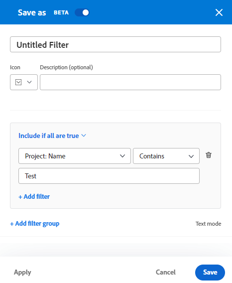
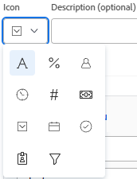

# Creación o edición de filtros en Adobe Workfront

<!--Audited: 12/2023-->

Puede limitar la cantidad de información que se muestra en pantalla en una lista de elementos con un filtro. Se pueden definir ciertos criterios basados en información concreta sobre un objeto y mostrar únicamente los objetos que cumplen esos criterios.

Puede aplicar los siguientes tipos de filtros en Adobe Workfront:

* Filtros rápidos en una lista de objetos para buscar un elemento mediante una palabra clave. Son filtros temporales que no se pueden guardar para un uso futuro.

  Para obtener información acerca de los filtros rápidos, vea [Aplicar el filtro rápido a una lista](../../../workfront-basics/navigate-workfront/use-lists/apply-quick-filter-list.md).

* Filtros permanentes que se pueden guardar y utilizar varias veces en varias listas e informes. En este artículo se describe cómo crear un filtro permanente o editar uno existente en una lista o informe.

* Filtra en otras áreas de Workfront, fuera de listas e informes.

  Para obtener una lista de todos los filtros de Workfront y las áreas donde puede aplicarlos, consulte [Resumen de filtros](../../../reports-and-dashboards/reports/reporting-elements/filters-overview.md).

## Requisitos de acceso

+++ Expanda para ver los requisitos de acceso para la funcionalidad en este artículo.

Debe tener el siguiente acceso para realizar los pasos de este artículo:

<table style="table-layout:auto"> 
 <col> 
 <col> 
 <tbody> 
  <tr> 
   <td role="rowheader"><strong>plan Adobe Workfront*</strong></td> 
   <td> 
Cualquiera
 </td> 
  </tr> 
  <tr> 
   <td role="rowheader"><strong>Licencia de Adobe Workfront*</strong></td> 
   <td> 
Nuevo: Colaborador o superior

O

Actual: Solicitud o superior

<b>NOTA:</b>

Para editar un filtro en un informe, debe tener la siguiente licencia:

Nuevo: estándar

O

Actual: plan

</td> 
  </tr> 
  <tr> 
   <td role="rowheader"><strong>Configuraciones de nivel de acceso*</strong></td> 
   <td> <ul><li>
Editar el acceso a filtros, vistas y agrupaciones
</li></ul>
    
<b>NOTA:</b>

   Para editar un filtro en un informe, debe tener la siguiente configuración de nivel de acceso, además del acceso de edición a filtros, vistas y agrupaciones:

<ul><li>
Editar el acceso a Informes, Paneles y Calendarios
</li></ul>

<b>NOTA:</b>
 
 Si no tiene acceso, pregunte al administrador de Workfront si ha establecido restricciones adicionales en su nivel de acceso. Para obtener información sobre cómo un administrador de Workfront puede modificar su nivel de acceso, vea <a href="../../../administration-and-setup/add-users/configure-and-grant-access/create-modify-access-levels.md" class="MCXref xref">Crear o modificar niveles de acceso personalizados</a>.
 </td> 
  </tr> 
  <tr> 
   <td role="rowheader"><strong>Permisos de objeto</strong></td> 
   <td> 
Administración de permisos para un filtro
 
Para obtener información sobre cómo solicitar acceso adicional, vea <a href="../../../workfront-basics/grant-and-request-access-to-objects/request-access.md" class="MCXref xref">Solicitar acceso a los objetos </a>.
 </td> 
  </tr> 
 </tbody> 
</table>

Para saber qué plan, tipo de licencia o acceso tiene, póngase en contacto con su administrador de Workfront.

+++

## Tipos de interfaces de creación de filtros

Puede crear filtros utilizando los tipos de generadores de filtros que se describen en la tabla siguiente:

<table style="table-layout:auto">
<col>
<col>
<col>
<tbody>
<tr>
<td><strong>Tipo de generador</strong></td>
<td><strong>Objeto Filter</strong></td>
<td><strong>Donde esté disponible</strong></td>
</tr>
<tr>
<td>Generador estándar</td>
<td>
<ul>
<li> 
Proyectos
 </li>
<li> 
Tareas 
 </li>
<li> 
Problemas
 </li>
<li> 
Portafolios
 </li>
<li> 
Programas
 </li>
<li> 
Usuarios
 </li>
<li> 
Plantillas
 </li>
<li> 
Grupos
 </li>
</ul>
</td>
<td>
<ul>
<li> 
Listas 
 </li>
</ul>
<ul>
<li> 
La lista Proyectos del Planificador de escenarios
 
El Scenario Planner requiere una licencia adicional. Para obtener información sobre el Scenario Planner de Workfront, consulte <a href="../../../scenario-planner/scenario-planner-overview.md">Información general sobre el Scenario Planner</a>. 
 </li>
</ul>

<b>NOTA:</b>
 
Los generadores estándar para filtros no están disponibles en los informes.
</td>
</tr>
<tr>
<td>Generador heredado</td>
<td>Todos los objetos </td>
<td>Listas e informes</td>
</tr>
</tbody>
</table>

Para obtener información acerca de los objetos de Workfront, vea [Comprender los objetos en Adobe Workfront](/help/quicksilver/workfront-basics/navigate-workfront/workfront-navigation/understand-objects.md).

Tenga en cuenta lo siguiente al crear filtros con las diferentes interfaces:

* Puede encontrar el generador estándar en los mismos lugares en los que encuentra la interfaz de filtro heredada para las áreas enumeradas en la tabla anterior.
* El generador estándar es la experiencia predeterminada para todas las áreas donde está disponible. Para cambiar al generador de filtros heredados, haga clic en el menú **Más** situado junto a [!UICONTROL **Filtros**] y seleccione [!UICONTROL **Volver a los filtros heredados**].

  

* Los filtros guardados están disponibles en ambos generadores, independientemente de la experiencia que utilizó para crearlos originalmente. Por ejemplo, si ha creado un filtro con el generador heredado, también puede buscarlo y modificarlo en la interfaz del generador estándar.

  >[!TIP]
  >
  >No se incluye un filtro &quot;Todos&quot; con el generador estándar porque todos los elementos de la lista se muestran cuando no se aplican filtros. Haga clic en [!UICONTROL **Borrar todo**] en la parte superior derecha del generador para borrar los filtros activos y mostrar todos los elementos. Si [!UICONTROL **Borrar todo**] está atenuado, no se aplica ningún filtro.

* Los generadores estándar y heredados tienen una sintaxis ligeramente diferente al crear filtros de varias instrucciones que combinan los operadores AND y OR. Como resultado, estos filtros pueden mostrarse de forma diferente al cambiar de un generador a otro.

  >[!INFO]
  >
  >El siguiente escenario existe:
  >
  >1. Utilice el generador estándar para crear un filtro que tenga la siguiente sintaxis:
  >
  >      `(A OR B) AND C`
  >
  >1. Cambie al generador heredado y edite el filtro utilizando la sintaxis del generador heredado como se describe en la sección [Cree o edite un filtro en el generador heredado](#create-filter-in-legacy-builder) en este artículo. La sintaxis del generador heredado muestra las instrucciones de filtro de la siguiente manera:
  >
  >      `A AND C`
  >      `OR`
  >      `B AND C`
  >
  >1. Realice un cambio en el filtro de la interfaz heredada.
  >1. Vuelva al generador estándar. La instrucción de filtro se muestra según la lógica admitida en el generador heredado, tal como se ha descrito anteriormente.
  >
  >      El filtro se muestra en la interfaz del generador estándar de la siguiente manera:
  >  
  >      `A AND C`
  >      `OR`
  >      `B AND C`
  > 
  >      Esto sucede porque el filtro se modificó en la interfaz heredada.

## Creación o edición de un filtro en el generador estándar

Puede crear filtros utilizando la interfaz del generador estándar de las siguientes maneras:

* Desde cero
* Editar un filtro existente
* Duplicación de un filtro existente
* Duplique un filtro existente, edítelo y guárdelo como un filtro nuevo

Cree un filtro con la interfaz del generador estándar:

1. Vaya a la lista donde desee crear un filtro o que contenga el filtro que desea personalizar.
1. Haga clic en el icono **Filtro**  para abrir la interfaz del generador.

   

1. Revise las siguientes listas de filtros:

   <table style="table-layout:auto">
   <col>
   <col>
   <tbody>
   <tr>
   <td role="rowheader"><strong>Marcado como favorito</strong></td>
   <td>Filtros que ha marcado como favoritos. Al marcar como favorito un filtro, su ubicación original se muestra debajo del nombre del filtro y se oculta de la lista original a menos que lo quite como favorito.</td>
   </tr>
   <tr>
   <td role="rowheader"><strong>Guardado</strong></td>
   <td>Filtros que ha creado y guardado usted mismo. De forma predeterminada, esta lista muestra los filtros guardados en orden de los guardados más recientemente, pero los nombres de los filtros se pueden arrastrar para reordenar manualmente la lista.</td>
   </tr>
   <tr>
   <td role="rowheader"><strong>Valores predeterminados del sistema</strong></td>
   <td>filtros predeterminados del sistema de Workfront y filtros que el administrador de Workfront agregó a su lista de filtros, ya sea en el nivel de sistema o en la plantilla de diseño.</td>
   </tr>
   <tr>
   <td role="rowheader"><strong>Compartido conmigo</strong></td>
   <td>Filtros que otros han creado y compartido con usted o que se comparten en todo el sistema.</td>
   </tr>
   </tbody>
   </table>

1. Realice una de las siguientes acciones:

   * Haga clic en **Nuevo filtro** para crear un filtro desde cero.
   * Pase el ratón sobre un filtro que tenga permisos para administrar y haga clic en el icono **Editar**  para editarlo.

     O

     Pase el ratón sobre un filtro existente que tenga permisos para ver, haga clic en el menú **Más**  y, a continuación, haga clic en **Duplicar** para copiar el filtro existente y editar una copia.

   

1. (Condicional) Dependiendo de si desea buscar objetos que coincidan con todas o cualquiera de las instrucciones de un grupo de filtros, seleccione una de las siguientes opciones:

   <table style="table-layout:auto">
   <col>
   <col>
   <tbody>
   <tr>
   <td role="rowheader"><strong>Incluir si todos son verdaderos</strong></td>
   <td>Los objetos encontrados por el filtro deben coincidir con todos los criterios de filtro de un grupo de filtros. En este caso, las instrucciones de filtro están conectadas mediante el operador AND. Esta es la selección predeterminada.</td>
   </tr>
   <tr>
   <td role="rowheader"><strong>Incluir si alguno es verdadero</strong></td>
   <td>Los objetos encontrados por el filtro deben coincidir con cualquier criterio de filtro de un grupo de filtros. En este caso, las instrucciones de filtro están conectadas mediante el operador OR.</td>
   </tr>
   </tbody>
   </table>

   

   Para obtener más información acerca de los operadores de filtro, vea [Resumen de filtros](/help/quicksilver/reports-and-dashboards/reports/reporting-elements/filters-overview.md).

1. Haga clic en el menú desplegable de campos para ver una lista de los campos utilizados recientemente y los campos sugeridos por los que filtrar. Los campos sugeridos se muestran actualmente en la lista que está filtrando.

   También puede seleccionar **Examinar campos** para ver una lista de todos los campos por los cuales puede filtrar. Los campos de la búsqueda avanzada se agrupan por categoría de objeto.

   

1. Haga clic en el menú desplegable de modificadores para seleccionar un modificador. El modificador predeterminado es &quot;Es igual que&quot;.

   Para obtener más información, consulte [Modificadores de filtro y condición](/help/quicksilver/reports-and-dashboards/reports/reporting-elements/filter-condition-modifiers.md).

   >[!TIP]
   >
   >A medida que genera el filtro, los resultados aparecen inmediatamente en la lista. Si el panel de filtro cubre la lista, puede cerrarla para ver la pantalla. La información que haya introducido permanecerá en el generador cuando vuelva a abrir el panel.

1. Empiece a escribir el valor de un campo por el que desee filtrar. Por ejemplo, empiece a escribir el nombre de un problema, si desea filtrar por `Issue:Name`. Seleccione el valor cuando se muestre en la lista.

   >[!TIP]
   >
   >Según el modificador que haya seleccionado, puede seleccionar varios valores.

1. Haga clic en **Agregar filtro** para seleccionar otro campo y agregar un criterio de filtrado a la instrucción de filtro.
1. (Opcional) Haga clic en el icono **Eliminar**  para eliminar las instrucciones de filtro existentes.

   O

   Haga clic en **Borrar todo** para borrar todos los criterios de filtrado.

1. (Opcional) Haga clic en **Agregar grupo de filtros** para agregar otro conjunto de criterios de filtrado. El operador predeterminado entre los conjuntos es **AND**. Haga clic en el operador para cambiarlo a **OR**.

   >[!TIP]
   >
   >Es posible que desee utilizar otro grupo de filtros cuando desee que los grupos estén conectados por un operador diferente al operador en una instrucción de filtro.

   >[!INFO]
   >
   >Cuando filtra proyectos que contienen &quot;marketing&quot; en el nombre que o bien no están completos y no están en espera, puede utilizar los siguientes grupos de filtros múltiples:
   >`(Project: Name Contains Marketing AND Project: Percent Complete Does not equal 100)`
   >`OR`
   >`(Project: Name Contains Marketing AND Project: Status Does not equal On Hold)`
   >En este caso, cada instrucción de filtro está conectada por un operador AND y los grupos de filtros están conectados por un operador OR.

1. (Opcional) Haga clic en **Modo de texto** para seguir creando el filtro mediante el modo de texto.

   

   Se abre la interfaz de modo de texto.

   

   >[!TIP]
   >
   >Se recomienda crear tantos filtros como sea posible mediante la interfaz del generador estándar y solo utilizando el modo de texto cuando deba modificar los filtros que solo se admiten en el modo de texto.

   Para obtener más información acerca de cómo crear un filtro mediante la interfaz de modo de texto, vea [Editar un filtro mediante el modo de texto](/help/quicksilver/reports-and-dashboards/reports/text-mode/edit-text-mode-in-filter.md).

1. Haga clic en **Salir del modo de texto** para volver a la interfaz del generador estándar.

   >[!WARNING]
   >
   >Algunas instrucciones de modo de texto no son compatibles con el generador estándar ni con la interfaz heredada. Si sale del modo de texto cuando ha creado estos tipos de instrucciones, puede generar un mensaje de advertencia.

1. (Opcional) Haga clic en **Aplicar** para aplicar el filtro a la lista y ver los resultados.

   Si el filtro no produce resultados, la lista está vacía.

1. Haga clic en **Guardar como nuevo** para guardar el filtro para uso futuro.

   

1. Seleccione **Filtro sin título** y escriba el nombre del nuevo filtro.

   >[!TIP]
   >
   >Asegúrese de asignar un nombre al filtro para poder encontrarlo más adelante. Si no asigna un nombre al filtro, en el sistema se denomina Filtro sin título.

1. Seleccione un icono para el nuevo filtro en el menú desplegable **Icono**.

   

1. (Opcional) Agregue una descripción para el filtro para indicar qué tiene de único. La descripción se muestra debajo del nombre del filtro en la lista de filtros.

   >[!TIP]
   >
   >Si hace clic en **Cancelar** en cualquier momento, volverá al área de creación de filtros.

1. Haga clic en **Guardar**. El filtro se guarda en la lista de elementos guardados y se aplica a la lista de elementos.
1. (Opcional) Para mover un filtro a la lista Favoritos, pase el ratón sobre cualquier filtro del cajón de filtros y haga clic en el icono **Favorito** .

   O

   Pase el ratón sobre cualquier filtro del cajón de filtros, haga clic en el menú Más  y luego en **Favorito**.

1. (Opcional) Haga clic en el botón **Apilar filtros** para activar los filtros apilados. Esta opción le permite aplicar más de un filtro guardado. Las reglas de filtro se aplican en el orden en que las selecciona.

   >[!TIP]
   >
   >No hay límite en el número de filtros que puede seleccionar.
   >
   >Cuando se seleccionan varios filtros, todas sus condiciones deben cumplirse simultáneamente para mostrar los resultados coincidentes.

   

   El número de filtros seleccionados se muestra junto al icono de filtro en la parte superior de la lista de elementos.

   

1. (Opcional) Realice una de las siguientes acciones:

   * Comparta el filtro con otros o haga que esté disponible en todo el sistema. Para obtener más información, vea [Compartir un filtro, vista o agrupación](/help/quicksilver/reports-and-dashboards/reports/reporting-elements/share-filter-view-grouping.md).

   * Elimine el filtro si ya no es válido o está duplicado. Solo puede eliminar los filtros que sean suyos. Puede eliminar los filtros que se compartieron con usted. Para obtener más información, vea [Quitar filtros, vistas y agrupaciones](/help/quicksilver/reports-and-dashboards/reports/reporting-elements/remove-filters-views-groupings.md).

## Crear o editar un filtro en el generador heredado {#create-filter-in-legacy-builder}

Puede crear filtros heredados en listas e informes de las siguientes maneras:

* Desde cero
* Edite un filtro existente y guárdelo como un nuevo filtro

Independientemente del método que utilice para crear filtros, la creación de un filtro desde cero o desde un filtro existente es similar.

1. Vaya a una lista o a un informe que contenga el filtro que desea personalizar.
1. Haga clic en el icono **Filtro** .

   >[!TIP]
   >
   >El creador del informe debe permitir que se editen los filtros para ver la lista desplegable Filtro en un informe. El filtro Informe predeterminado se aplica a un informe de forma predeterminada. El filtro Informe predeterminado solo se puede personalizar cuando edita el informe.

   

1. Haga clic en **Nuevo filtro** en la parte superior de la lista de filtros.

   O

   Pase el ratón sobre el filtro que quiera modificar y haga clic en el icono **Editar** .

   Generador para personalizar los lanzamientos de filtros.

1. Realice una de las siguientes acciones:

   * Modifique las reglas de filtro existentes haciendo clic en la regla existente y seleccionando una nueva opción.
   * Agregue una regla de filtro haciendo clic en **Agregar otra regla de filtro**, empiece a escribir el nombre de la opción para la que desea agregar una regla en el cuadro **Empiece a escribir el nombre del campo** y, a continuación, haga clic en él cuando aparezca en la lista desplegable.

     Los campos asociados con el objeto del filtro se enumeran en el cuadro **Empiece a escribir el nombre del campo**.

   * Haga clic en **AND** o **OR** al agregar una regla de filtro.\
     Al agregar reglas de filtro, utilice los modificadores de filtro para establecer la condición del filtro. Para obtener más información acerca de los modificadores de filtro, vea [Modificadores de filtro y condición](../../../reports-and-dashboards/reports/reporting-elements/filter-condition-modifiers.md).

     >[!NOTE]
     >
     >Cuando conecta un grupo de instrucciones AND mediante varias instrucciones OR, debe repetir los campos que no cambian entre las instrucciones OR para cada grupo de instrucciones.
     >
     >
     >
     >Cuando genere un filtro para tareas que contengan la palabra &quot;marketing&quot; y se encuentren en proyectos con un estado de Actual o Planning, deberá tener las siguientes reglas de filtrado:
     >
     >`Task: Name Contains Marketing`
     >`AND`
     >`Project: Status Equals Current`
     >`OR`
     >`Task: Name Contains Marketing`
     >`AND`
     >`Project: Status Equals Planning`
     >
     >Aunque Task: Name Contains &quot;marketing&quot; no cambia entre los dos grupos de filtros AND, debe repetirse en el segundo grupo.

   * Elimine una regla de filtro existente haciendo clic en el icono &quot;X&quot;.

1. (Opcional) Haga clic en **Cambiar al modo de texto** para agregar un filtro mediante la interfaz del modo de texto.

   Para obtener más información acerca de cómo crear un filtro mediante la interfaz de modo de texto, vea [Editar un filtro mediante el modo de texto](../../../reports-and-dashboards/reports/text-mode/edit-text-mode-in-filter.md).

1. Haga clic en **Guardar filtro** para crear un filtro o reemplazar el seleccionado con sus cambios.

   O

   Haga clic en **Guardar como nuevo filtro** para crear un filtro a partir del seleccionado.

   El nuevo filtro se muestra en la lista de filtros y se aplica automáticamente a la lista o al informe seleccionado.

1. (Opcional) Realice una de las siguientes acciones:

   * Comparta los filtros que cree con otros usuarios o haga que estén disponibles en todo el sistema. Para obtener más información, vea [Compartir un filtro, una vista o una agrupación](/help/quicksilver/reports-and-dashboards/reports/reporting-elements/share-filter-view-grouping.md).
   * Elimine los filtros que ya no desee mostrar en la lista. Para obtener más información, vea [Quitar filtros, vistas y agrupaciones](/help/quicksilver/reports-and-dashboards/reports/reporting-elements/remove-filters-views-groupings.md).

