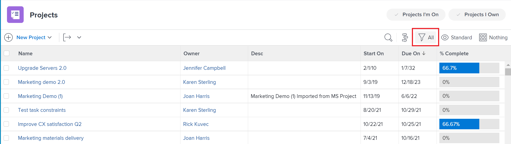

# Elementos de informes: filtros, vistas y agrupaciones

<!--

AL: Add information here about all the different kinds of FVGs: in reports, in lists, beta, etc // OR: this article should be a high-level overview of reporting elements. Then, each type of element should have:

- overview for Filters

- create a filter

- share a filter

ALL in Reporting elements but the Shared ones should be linked to Basics> Sharing; some of the articles in the Basics> Navigation> Use lists might beed to link here as well

-->

Existen varios elementos que hacen posible una lista o un informe en Adobe Workfront. Los elementos principales que debe tener cada lista e informe son un filtro, una vista y una agrupación. Cada elemento proporciona información diferente dentro de un informe.

## Consideraciones sobre los elementos de informes

Tenga en cuenta lo siguiente al trabajar con filtros, vistas y agrupaciones:

* Los elementos de creación de informes funcionan como componentes básicos de la creación de informes. Definen la apariencia de un informe o una lista, así como la información que contiene.
* Los informes de Workfront son específicos de un objeto. Debe definir el objeto principal de un informe antes de poder crear el informe. Por lo tanto, todos los elementos de la creación de informes son específicos del objeto.
* El administrador de Workfront debe otorgarle acceso a filtros, vistas y agrupaciones en su nivel de acceso para poder verlos o editarlos en listas e informes.

  Para obtener información sobre la concesión de acceso a filtros, vistas y agrupaciones, consulte [Conceder acceso a filtros, vistas y agrupaciones](../../../administration-and-setup/add-users/configure-and-grant-access/grant-access-fvg.md).

* El administrador de Workfront debe otorgarle acceso a los informes, tableros y calendarios de su nivel de acceso para poder ver o editar informes.

  Para obtener información sobre la concesión de acceso a informes, paneles y calendarios, consulte [Conceder acceso a informes, tableros y calendarios](../../../administration-and-setup/add-users/configure-and-grant-access/grant-access-reports-dashboards-calendars.md).

* Si selecciona un filtro, una vista o una agrupación en un informe o una lista, Workfront conserva esta selección para las listas de ese objeto incluso después de cerrar la sesión o cerrar el explorador. Por ejemplo, si selecciona una vista específica para un informe de tareas, esa selección aparece para otras listas de tareas, como la lista de tareas de un proyecto.

## Filtros

El filtro controla los resultados que aparecen en un informe y, por lo general, reduce los resultados de generales a específicos. Funciona como un tamiz que solo toma la información que necesita y le devuelve esa información a su informe.

Por ejemplo, si solo desea ver las tareas asignadas al usuario que ha iniciado sesión, puede crear un filtro denominado &quot;Mis tareas&quot;, definir los criterios que deben cumplirse para el filtro y ejecutar el informe para ver únicamente las tareas asignadas al usuario que ha iniciado sesión.

Algunos atributos de los filtros son:

* Workfront proporciona una serie de filtros para varios objetos de forma predeterminada.
* Puede personalizar los filtros que administra o que es suyo.

  Para obtener más información sobre los filtros, consulte el artículo [Resumen de filtros](../../../reports-and-dashboards/reports/reporting-elements/filters-overview.md).

## Vistas

Al definir la vista de un informe, se define qué información se incluye en el informe. Al igual que todos los elementos de los informes, las vistas se basan en un tipo de objeto.\
Por ejemplo, una vista para un informe de tareas podría mostrar Fechas de vencimiento, incluir detalles financieros clave como Costo, o utilizarse para mostrar detalles de Asignaciones y Fecha de entrega. Las vistas se pueden utilizar para proporcionar diversos detalles sobre los datos del informe.

Algunos atributos de las vistas son:

* Puede utilizar una vista de Workfront predeterminada o crear la suya propia.
* Puede aplicar vistas adicionales desde el campo desplegable Vista después de ejecutar un informe.
* Las vistas adicionales reemplazan temporalmente la vista que se define al crear el informe; sin embargo, la vista predeterminada se muestra la próxima vez que vuelva al informe.

  Para obtener más información sobre las vistas, consulte el artículo [Información general sobre vistas en Adobe Workfront](../../../reports-and-dashboards/reports/reporting-elements/views-overview.md).

## Agrupaciones

Una agrupación controla cómo organizar los datos, lo que facilita su lectura y comprensión. Las agrupaciones crean barras horizontales en un informe que muestran los resultados enumerados juntos por atributos comunes. Los criterios para agrupar los resultados del informe se definen al crear la agrupación.

Por ejemplo, al agrupar una lista de tareas que abarcan varios proyectos por su nombre de proyecto, se organizan todas las tareas respectivas que pertenecen a un único proyecto con ese nombre.

Algunos atributos de las agrupaciones son:

* Las agrupaciones son un elemento de sistema de informes obligatorio si desea agregar posteriormente un gráfico al informe.
* Las agrupaciones muestran un valor agregado en los resultados&#x200B;
* Las agrupaciones determinan el eje en los gráficos.
* Las agrupaciones determinan la identificación del encabezado en los informes de matriz.\
  Para obtener más información sobre los informes de matriz, consulte el artículo [Creación de un informe de matriz](../../../reports-and-dashboards/reports/creating-and-managing-reports/create-matrix-report.md).

* Las agrupaciones ayudan a crear la pestaña Resumen de un informe, que proporciona los valores agregados del informe.
* Workfront proporciona una serie de agrupaciones para diferentes objetos de forma predeterminada.
* Puede personalizar las agrupaciones que administre o que posea.

  Para obtener más información sobre las agrupaciones, consulte [Información general sobre agrupaciones en Adobe Workfront](../../../reports-and-dashboards/reports/reporting-elements/groupings-overview.md).

## Otros elementos de informes

Además de los filtros, las vistas y las agrupaciones, también puede agregar los siguientes elementos a un informe:

* **Preguntar**: Filtro abierto que se puede personalizar y aplicar de forma diferente cada vez que se ejecuta un informe.\
  Para obtener más información sobre los indicadores, consulte el artículo [Agregar una solicitud a un informe](../../../reports-and-dashboards/reports/creating-and-managing-reports/add-prompt-report.md).

* **Gráfico**: Puede mejorar los informes añadiéndoles un gráfico y mostrándoles la información de forma visual.\
  Para obtener más información sobre los gráficos de los informes, consulte el artículo [Agregar un gráfico a un informe](../../../reports-and-dashboards/reports/creating-and-managing-reports/add-chart-report.md).
