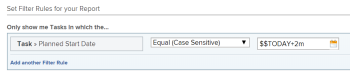

# Utilice caracteres comodín basados en datos para generalizar informes

Puede generalizar un informe utilizando caracteres comodín en lugar de información específica al crear ciertos elementos de informes.

Por ejemplo, si desea crear un informe que muestre las tareas que tienen una fecha de inicio planificada específica, puede utilizar el selector de fechas del calendario en un filtro para seleccionar una fecha específica. Sin embargo, si desea crear un informe que muestre las tareas que tienen la Fecha de inicio planeada dentro de un determinado intervalo de tiempo desde la fecha en que se accede al informe, puede utilizar un comodín que indique que, cuando alguien ve el informe, muestra información para un intervalo de tiempo relevante para el momento en que ve el informe.

Por ejemplo, en la semana pasada, en el año pasado, en las dos semanas siguientes, etc. De esta manera, el informe se crea una vez, pero como se usa un comodín en el filtro, produce resultados diferentes cada vez que alguien lo lee porque se adapta al día en que ejecuta el informe.

Los caracteres comodín basados en datos se pueden usar al crear los siguientes elementos de informes:

* Filtros
* Mensajes personalizados
* Vistas al agregar reglas para columnas

## Requisitos de acceso

Debe tener el siguiente acceso para realizar los pasos de este artículo:

<table style="table-layout:auto"> 
 <col> 
 <col> 
 <tbody> 
  <tr> 
   <td role="rowheader"><strong>plan de Adobe Workfront*</strong></td> 
   <td> 
Cualquiera
 </td> 
  </tr> 
  <tr> 
   <td role="rowheader"><strong>Licencia de Adobe Workfront*</strong></td> 
   <td> 
Plan 
 </td> 
  </tr> 
  <tr> 
   <td role="rowheader"><strong>Configuraciones de nivel de acceso*</strong></td> 
   <td> 
Editar acceso a filtros, vistas y grupos
 
Editar acceso a informes, tableros y calendarios para editar elementos de informes en un informe
 
Nota: Si todavía no tiene acceso, pregunte a su administrador de Workfront si establece restricciones adicionales en su nivel de acceso. Para obtener información sobre cómo un administrador de Workfront puede modificar su nivel de acceso, consulte <a href="../../../administration-and-setup/add-users/configure-and-grant-access/create-modify-access-levels.md" class="MCXref xref">Crear o modificar niveles de acceso personalizados</a>.
 </td> 
  </tr> 
  <tr> 
   <td role="rowheader"><strong>Permisos de objeto</strong></td> 
   <td> 
Administrar permisos en un informe para editar elementos de informes en un informe
 
Administrar permisos para una vista o filtro para editarlos
 
Para obtener información sobre la solicitud de acceso adicional, consulte <a href="../../../workfront-basics/grant-and-request-access-to-objects/request-access.md" class="MCXref xref">Solicitar acceso a objetos </a>.
 </td> 
  </tr> 
 </tbody> 
</table>

&#42;Para saber qué plan, tipo de licencia o acceso tiene, póngase en contacto con el administrador de Workfront.

## Requisitos previos

Debe crear un informe para poder agregarle variables comodín.

Para obtener información sobre la creación de informes, consulte [Crear un informe](../../../reports-and-dashboards/reports/creating-and-managing-reports/create-report.md).

## Pasos prácticos

Para insertar un comodín basado en datos en un informe:

1. Vaya a un informe para el que desee insertar un comodín basado en datos.
1. Haga clic en **Acciones de informe**, luego **Editar**.

1. Haga clic en el **Filtros** pestaña .
1. Haga clic en **Agregar una regla de filtro**.
1. Empiece a escribir el nombre del campo por el que desea filtrar.\
   Debe escribir los campos que hacen referencia a una fecha.
1. Select **Igual** en el menú desplegable para la variable de filtro.

   >[!TIP]
   >
   >Siempre debe seleccionar la variable **Igual** cuando se trabaja con caracteres comodín en Adobe Workfront.

1. En el **Empiece a escribir el nombre ...** cuadro, tipo: `$$TODAY` si desea mostrar información sobre algo que ocurre el mismo día en que se ejecuta el informe.

   O

   Tipo `$$NOW` si desea mostrar información sobre algo que se produzca en la misma fecha y hora en que se ejecuta el informe.

   Esta fecha siempre es diferente, ya que cambia con la fecha en que el usuario ve realmente el informe. por lo tanto, la información del informe es diferente de un día a otro.

1. (Opcional) Si desea mostrar información que se produce dentro de un intervalo de tiempo después de la fecha de ejecución del informe, escriba `$$TODAY+1w` para mostrar información en la semana siguiente, o `$$TODAY+2m` para mostrar la información en los dos meses siguientes. También puede indicar intervalos de tiempo para trimestres, horas, días o años.
1. (Opcional) Si desea mostrar información sobre algo que ocurrió dentro de un intervalo de tiempo antes de la fecha de ejecución del informe, escriba `$$TODAY-1w` para mostrar información de la semana anterior, o `$$TODAY-2m` para mostrar la información de los dos meses anteriores. También puede indicar intervalos de tiempo para trimestres, horas, días o años.

   Para obtener una lista completa de atributos, calificadores y operadores que puede utilizar en los comodines basados en datos, consulte el artículo [Variables de filtro comodín](../../../reports-and-dashboards/reports/reporting-elements/understand-wildcard-filter-variables.md).

   

1. Haga clic en **Guardar + Cerrar**.

## Información adicional

Consulte también:

* [Programa básico de creación de informes](https://one.workfront.com/s/basic-report-creation-program)
* [Variables de filtro comodín](../../../reports-and-dashboards/reports/reporting-elements/understand-wildcard-filter-variables.md)
* [Crear o editar filtros en Adobe Workfront](../../../reports-and-dashboards/reports/reporting-elements/create-filters.md)
* [Agregar solicitudes a un informe](../../../reports-and-dashboards/reports/creating-and-managing-reports/add-prompt-report.md)
* [Utilizar el formato condicional en las vistas](../../../reports-and-dashboards/reports/reporting-elements/use-conditional-formatting-views.md)
