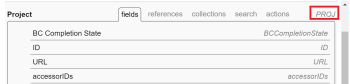

# Creación de filtros complejos de modo de texto mediante instrucciones EXISTS

<!-- Audited: 01/2025 -->

<!--
<p data-mc-conditions="QuicksilverOrClassic.Draft mode">(NOTE: do not EVER&nbsp;delete this article as long as Text Mode still exists in the system.&nbsp;Google ordered this article to be written and we wrote it with the help of consultants, so the use case is very complex and very hard to understand without this. It is also very much used by many customers)</p>
-->

<!--
<p data-mc-conditions="QuicksilverOrClassic.Draft mode">(NOTE:&nbsp;Alina: **~ Replace screen shot of icons when list/ reporting UI changes)</p>
-->

>[!IMPORTANT]
>
>Este artículo requiere una comprensión exhaustiva de la API de Adobe Workfront y de la interfaz de creación de informes en modo de texto. Para obtener más información sobre la API de Workfront, consulte [Conceptos básicos de la API](../../../wf-api/general/api-basics.md).\
>Para obtener más información sobre el uso del modo de texto, consulte [Información general sobre el modo de texto](../../../reports-and-dashboards/reports/text-mode/understand-text-mode.md).

## Información general sobre las relaciones de objetos en Workfront

Todos los objetos están vinculados a otros objetos de la base de datos de Workfront.

Comprender la jerarquía y la interdependencia de los objetos ayuda a saber a qué objetos se puede hacer referencia en los informes.

Para obtener información acerca de los objetos de Workfront y su jerarquía e interdependencia, consulte [Información general sobre los objetos de Adobe Workfront](../../../workfront-basics/navigate-workfront/workfront-navigation/understand-objects.md).

Al crear filtros, puede hacer referencia a otros objetos conectados al objeto del filtro en un máximo de 2 niveles de relación mediante la interfaz de creación de informes estándar.

Por ejemplo, puede hacer referencia al ID de portafolio en un filtro de problemas para mostrar solo los problemas de los proyectos asociados a un determinado portafolio mediante la interfaz estándar. En este caso, el portafolio está a 2 niveles de distancia de los problemas.

Sin embargo, no puede hacer referencia al propietario del portafolio en un filtro de problemas mediante la interfaz estándar para mostrar solo los problemas de los proyectos asociados a portafolios en los que el propietario sea un usuario específico. Debe utilizar el modo de texto para acceder al campo Nombre del propietario del portafolio, que está a tres niveles de los problemas.


Para obtener una lista completa de los objetos de Workfront, consulte [Explorador de API](../../../wf-api/general/api-explorer.md).

Para obtener información sobre cómo navegar por el explorador de API y buscar objetos, consulte [Uso del explorador de API](../../../wf-api/general/using-api-explorer.md).

Al crear filtros, debe crear instrucciones complejas en la interfaz de modo de texto para hacer referencia a estos tipos de objetos.

Para obtener información acerca de cómo generar filtros complejos, consulte la sección [Información general sobre los filtros de modo de texto complejo que utilizan instrucciones EXISTS](#overview-of-complex-text-mode-filters-that-use-exists-statements) de este artículo.

## Información general sobre los filtros de modo de texto complejo que utilizan instrucciones EXISTS {#overview-of-complex-text-mode-filters-that-use-exists-statements}

Tenga en cuenta lo siguiente al crear filtros que abarquen varios niveles en la jerarquía de objetos o al filtrar los objetos que faltan:

* Debe crear filtros complejos cuando desee hacer referencia a objetos que no están conectados directamente al objeto de filtro.
* Debe utilizar una instrucción EXISTS para hacer lo siguiente:

   * Crear filtros que abarquen varios niveles.
   * Crear filtros que busquen los objetos que faltan.\
     Por ejemplo, al crear un informe de usuario, puede filtrar por usuarios que no hayan registrado tiempo durante un período de tiempo determinado.

Tenga en cuenta las siguientes reglas al utilizar instrucciones EXISTS en un filtro:

* Hay tres objetos a los que se puede hacer referencia en un filtro EXISTS:

   * El objeto del filtro (objeto original).
   * El objeto a cuyo campo desea hacer referencia (objeto de destino).
   * El objeto que conecta los objetos de destino y original, en caso de que no estén conectados directamente entre sí (objeto de vinculación).

* Los filtros que utilizan EXISTS contienen dos instrucciones independientes vinculadas por un signo igual:

   * La instrucción antes del signo igual hace referencia al objeto al que se hace referencia (el objeto de vinculación o el objeto de destino).
   * La instrucción situada después del signo igual hace referencia al objeto desde el que hace referencia (el objeto original).

* Debe utilizar el código de objeto del objeto de vinculación para conectar las instrucciones.\
  Puede encontrar el código de objeto de todos los objetos en el Explorador de API.\
  Para obtener información sobre el explorador de API, consulte [Explorador de API](../../../wf-api/general/api-explorer.md).

* Cuando falta un objeto de vinculación porque los objetos original y de destino están conectados entre sí directamente, puede utilizar el código de objeto del objeto de destino en lugar del objeto de vinculación.
* Puede hacer referencia a varios campos (campos de destino) en el mismo objeto (objeto de destino), en cuyo caso debe conectar las líneas que hacen referencia a los campos mediante AND.\
  Para ver un ejemplo de filtrado por más de un campo que pertenece al objeto de destino, consulte la sección [Ejemplo 4: Filtrar por varios campos: tareas por nombre de propietario del portafolio e ID del cuadro de resultados de alineación del portafolio](#example-4-filter-by-multiple-fields-tasks-by-portfolio-owner-name-and-portfolio-alignment-scorecard-id) en este artículo.

* El único modificador admitido para una instrucción EXISTS es NOTEXISTS.

## Requisitos de acceso

+++ Expanda para ver los requisitos de acceso para la funcionalidad en este artículo.

<table style="table-layout:auto"> 
 <col> 
 <col> 
 <tbody> 
  <tr> 
   <td role="rowheader">paquete de Adobe Workfront</td> 
   <td> <p>Cualquiera</p> </td> 
  </tr> 
  <tr> 
   <td role="rowheader">Licencia de Adobe Workfront</td> 
   <td> 
     <p>Estándar</p>
     <p>Plan</p>
   </td> 
  </tr> 
  <tr> 
   <td role="rowheader">Configuraciones de nivel de acceso</td> 
   <td> <p>Acceso de edición a filtros, vistas y agrupaciones</p> <p>Acceso de edición a informes, paneles de control y calendarios para editar filtros en un informe</p></td> 
  </tr> 
  <tr> 
   <td role="rowheader">Permisos de objeto</td> 
   <td><p>Permisos de administración para un informe para editar filtros en un informe</p> <p>Permisos de administración para un filtro para editarlo</p></td> 
  </tr> 
 </tbody> 
</table>

Para obtener más información sobre esta tabla, consulte [Requisitos de acceso en la documentación de Workfront](/help/quicksilver/administration-and-setup/add-users/access-levels-and-object-permissions/access-level-requirements-in-documentation.md).

+++

## Creación de filtros de modo de texto complejos que abarcan varios niveles en la jerarquía de objetos

<!--
<p data-mc-conditions="QuicksilverOrClassic.Draft mode">(NOTE: Alina: ***[This information is somewhat duplicated from the section below: Create Text-Mode Filters for Missing Objects])</p>
-->

Puede generar un filtro que haga referencia a objetos en varios niveles de la jerarquía de objetos en la que existe el objeto de filtro. Por ejemplo, puede crear un filtro de problemas para los problemas que se encuentran en proyectos que no están asociados a un determinado Propietario de portafolio.

Para crear este filtro, siempre debe utilizar una instrucción EXISTS y la interfaz de modo de texto.

Para ver ejemplos de filtros, consulte el [Ejemplo 1: Filtrar problemas por el nombre de propietario del portafolio](#example-1-filter-for-issues-by-portfolio-owner-name) en este artículo.

Para crear un filtro que abarque varios niveles en la jerarquía de objetos:

1. Identifique el objeto del filtro. Nos referimos a este objeto como el objeto original.\
   Por ejemplo, Problema.

1. Identifique el campo por el que desee filtrar. Nos referimos a este objeto como el campo de destino que pertenece a un objeto de destino.\
   Por ejemplo, el campo ownerID (campo de destino), que pertenece a Portafolio (objeto de destino).

1. (Condicional) Si el objeto original (Problema) y el campo de destino (ownerID) no están conectados directamente entre sí, debe encontrar un tercer objeto, un objeto de vinculación (Proyecto) que los conecte. El objeto de vinculación debe tener al menos un campo al que se haga referencia desde las pestañas Campos o Referencias del objeto original (campo de vinculación mostrado en el objeto original), y también debe tener un campo de vinculación al objeto de destino mostrado en las pestañas Campos o Referencias del objeto de vinculación. El campo de vinculación al objeto de destino que se muestra en el objeto de vinculación (o el campo de vinculación mostrado en el objeto de vinculación) debe coincidir con el campo de destino.

   Por ejemplo, se hace referencia al identificador de (proyecto) (campo de vinculación mostrado en el objeto original) desde Problemas (objeto original). (Portafolio) ownerID (campo de vinculación al objeto de destino) se muestra en la pestaña Campos del proyecto (objeto de vinculación). ownerID de Portfolio también es un campo en el objeto de destino (portafolio). El campo de vinculación del objeto de vinculación coincide con el campo de destino.\
   

1. Utilizando el Explorador de API, identifique el **Código de objeto** del objeto de vinculación (proyecto).\
   Por ejemplo, el código de objeto de Proyecto es PROJ.\
   

1. Cree un filtro para el objeto original.\
   Por ejemplo, cree un filtro de Problema.\
   Para obtener información sobre la creación de filtros, consulte [Información general sobre los filtros](../../../reports-and-dashboards/reports/reporting-elements/filters-overview.md).

1. Haga clic en **Cambiar al modo de texto** y después en **Editar modo de texto**.
1. Pegue el siguiente ejemplo de fórmula en la interfaz de modo de texto del nuevo filtro y reemplace el texto de ejemplo por los objetos y campos correctos:

   ```
   EXISTS:A:$$OBJCODE=<Object code of the Linking Object>
   EXISTS:A:<Linking Field on the Linking Object>=FIELD:<Linking Field displayed on the Original Object>
   EXISTS:A:<Target Object>:<Target Field>=<Your value for the Target Field>
   ```

   Para ver un ejemplo con los campos identificados anteriormente, consulte el [Ejemplo 1: Filtrar problemas por el nombre de propietario del portafolio](#example-1-filter-for-issues-by-portfolio-owner-name) en este artículo.

1. Haga clic en **Guardar filtro**.

## Creación de filtros de modo de texto complejos para los objetos que faltan

<!--
<p data-mc-conditions="QuicksilverOrClassic.Draft mode">(NOTE: Alina: **^[This information is somewhat duplicated from the section above: Create Text-Mode Filters that Span Multiple Levels in the Object Hierarchy])</p>
-->

Puede crear un filtro que haga referencia a los objetos que faltan. Por ejemplo, puede crear un filtro de usuario que muestre qué usuarios no han registrado horas en Workfront.

Para generar este filtro, siempre debe utilizar una instrucción *EXISTS* y la interfaz de modo de texto.

Para ver ejemplos de filtros de los objetos que faltan, consulte las siguientes secciones de este artículo:

* [Ejemplo 2: filtrar los objetos que faltan: campos personalizados que no aparecen en ningún formulario personalizado](#example-2-filter-for-missing-objects-custom-fields-that-do-not-appear-in-any-custom-forms)
* [Ejemplo 3: Filtrar objetos que faltan: usuarios que no registraron el tiempo durante un período determinado](#example-3-filter-for-missing-objects-users-who-did-not-log-time-for-a-certain-period-of-time)

Para crear un filtro que haga referencia a los objetos que faltan:

1. Identifique el objeto del filtro. Nos referimos a este objeto como el objeto original.\
   Por ejemplo, Parámetro o Campo personalizado.

1. Identifique el campo por el que desee filtrar. Nos referimos a este objeto como el campo de destino que pertenece a un objeto de destino.\
   Por ejemplo, el campo categoryID (campo de destino), que pertenece a Category (objeto de destino).

1. Dado que el objeto original (Parameter) y el campo de destino (categoryID) no están conectados directamente entre sí, debe encontrar un tercer objeto, un objeto de vinculación (un Category Parameter), que los conecte. El objeto de vinculación debe tener al menos un campo al que se haga referencia desde las pestañas Campos o Referencias del objeto original (campo de vinculación mostrado en el objeto original), y también debe tener un campo de vinculación al objeto de destino mostrado en las pestañas Campos o Referencias del objeto de vinculación. El campo de vinculación al objeto de destino que se muestra en el objeto de vinculación (o el campo de vinculación mostrado en el objeto de vinculación) debe coincidir con el campo de destino.

   Por ejemplo, se hace referencia al ID del Category Parameter (campo de vinculación mostrado en el objeto original) desde Parameter (objeto original). parameterID (campo de vinculación al objeto de destino) se muestra en la pestaña Campos del Category Parameter (objeto de vinculación). El campo de vinculación al objeto de destino que se muestra en el objeto de vinculación coincide con el campo de destino.

1. Con el explorador de API, identifique el **código de objeto** del objeto de vinculación (Category Parameter).\
   Por ejemplo, el código de objeto de Category Parameter es CTGYPA.\
   

1. Cree un filtro para el objeto original.\
   Por ejemplo, cree un filtro de parámetro.\
   Para obtener información sobre la creación de filtros, consulte [Información general sobre los filtros](../../../reports-and-dashboards/reports/reporting-elements/filters-overview.md).

1. Haga clic en **Cambiar al modo de texto** y después en **Editar modo de texto**.
1. (Condicional) Si está filtrando por objetos que faltan, pegue el siguiente ejemplo de fórmula en la interfaz de modo de texto del nuevo filtro y reemplace el texto de ejemplo por los objetos y campos correctos:

   ```
   EXISTS:A:$$OBJCODE=<Object code of the Linking Object>
   EXISTS:A:<Linking Field displayed on the Linking Object>=FIELD:<Linking Field displayed on the Original Object>
   EXISTS:A:$$EXISTSMOD=NOTEXISTS
   ```

   Para ver un ejemplo de creación de informes sobre campos personalizados que no están asociados a formularios personalizados, consulte la sección [Ejemplo 2: Filtrar objetos que faltan: campos personalizados que no aparecen en ningún formulario personalizado](#example-2-filter-for-missing-objects-custom-fields-that-do-not-appear-in-any-custom-forms) de este artículo.

1. Haga clic en **Guardar filtro**.

## Ejemplos de filtros de modo de texto que abarcan varios niveles en la jerarquía de objetos

Utilice estos ejemplos para generar filtros de modo de texto con instrucciones EXISTS.

### Ejemplo 1: Filtrar problemas por nombre de propietario de portafolio {#example-1-filter-for-issues-by-portfolio-owner-name}

Con la interfaz de modo de texto, puede generar un filtro para una lista de problemas a fin de mostrar solo los que se encuentran en proyectos asociados a un portafolio cuyo propietario sea un usuario específico.

Para filtrar problemas por nombre de propietario de portafolio:

1. Cree un informe de problemas.\
   Para obtener información sobre la creación de filtros, consulte [Información general sobre los filtros](../../../reports-and-dashboards/reports/reporting-elements/filters-overview.md).

1. Haga clic en **Cambiar al modo de texto** y después en **Editar modo de texto**.
1. Consulte el siguiente código genérico:

   ```
   EXISTS:A:$$OBJCODE=<Object code of the Linking Object>
   EXISTS:A:<Linking Field on the Linking Object>=FIELD:<Linking Field displayed on the Original Object>
   EXISTS:A:<Target Object>:<Target Field>=<Your value for the Target Field>
   ```

1. Pegue el siguiente código en el área **Establecer reglas de filtro para el informe** para reemplazar el código genérico anterior:

   ```
   EXISTS:A:$$OBJCODE=PROJ
   EXISTS:A:ID=FIELD:projectID
   EXISTS:A:portfolio:ownerID=4d94d7da001699b19edf50de15682221
   ```

   >[!NOTE]
   >
   >* El objeto original es el objeto del informe: Issue
   >* El objeto de destino es Portfolio.
   >* El objeto de vinculación es Project.
   >* Los campos de destino y de vinculación al objeto de destino al que se hace referencia desde el objeto de vinculación son ownerID.
   >* El código de objeto del objeto de vinculación aquí es PROJ.
   >* El campo de vinculación mostrado en el objeto original es projectID y el campo de vinculación es ID.

1. Reemplace el valor del campo de destino (ownerID) de la última instrucción por un ID de usuario de su entorno.
1. Haga clic en **Guardar filtro**.

### Ejemplo 2: Filtrar objetos que faltan: campos personalizados que no aparecen en ningún formulario personalizado {#example-2-filter-for-missing-objects-custom-fields-that-do-not-appear-in-any-custom-forms}

Con la interfaz de modo de texto, puede crear un filtro para ver los campos personalizados (parámetros) que no están asociados a formularios personalizados (categorías). Este filtro vincula los parámetros a categorías, que están conectados a través de otro objeto, Category Parameter. Dado que los dos campos no están conectados directamente entre sí y que está filtrando la información que falta, debe utilizar una instrucción EXISTS.

>[!IMPORTANT]
>
>Un parámetro es un campo tal como existe en la biblioteca de campos a la que se hace referencia en un formulario personalizado. Un parámetro de categoría es la versión de un campo que aparece en un formulario específico. Por ejemplo, si el mismo campo aparece en 5 formularios, habrá 1 parámetro y 5 parámetros de categoría en la base de datos de Workfront.

Para filtrar por campos personalizados que no están asociados a un formulario personalizado:

1. Cree un filtro de parámetro o de campo personalizado.\
   Para obtener información sobre la creación de filtros, consulte [Información general sobre los filtros](../../../reports-and-dashboards/reports/reporting-elements/filters-overview.md).

1. Haga clic en **Cambiar al modo de texto** y después en **Editar modo de texto**.
1. Consulte el siguiente código genérico:

   ```
   EXISTS:A:$$OBJCODE=<Object code of the Linking Object>
   EXISTS:A:<Linking Field displayed on the Linking Object>=FIELD:<Linking Field displayed on the Original Object>
   EXISTS:A:$$EXISTSMOD=NOTEXISTS
   ```

1. Pegue el siguiente código en el área **Establecer reglas de filtro para su informe** para reemplazar el código genérico anterior:

   ```
   EXISTS:A:$$OBJCODE=CTGYPA
   EXISTS:A:parameterID=FIELD:ID
   EXISTS:A:$$EXISTSMOD=NOTEXISTS
   ```

   >[!NOTE]
   >
   >* El objeto original es el objeto del informe: parámetro.
   >* El objeto de destino es categoría.
   >* El objeto de vinculación es un parámetro de categoría.
   >* El código de objeto del objeto de vinculación es CTGYPA.
   >* El campo de vinculación al objeto de destino es parameterID, ya que parameterID existe tanto en la tabla de objetos de vinculación como en la tabla de objetos de destino.
   >* El campo de vinculación que se muestra en el objeto original es ID (del parámetro Categoría).

1. Haga clic en **Guardar filtro**.

### Ejemplo 3: Filtrar objetos que faltan: usuarios que no registraron el tiempo durante un período determinado {#example-3-filter-for-missing-objects-users-who-did-not-log-time-for-a-certain-period-of-time}

Con la interfaz de modo de texto, puede crear un filtro para ver los usuarios que no registraron el tiempo durante un período de tiempo determinado. Este filtro vincula a los usuarios con las horas, que están conectadas entre sí directamente. Sin embargo, debe utilizar una instrucción EXISTS y la interfaz de modo de texto para poder filtrar la información que falta.

Para filtrar por usuarios que no registraron el tiempo durante la semana pasada:

1. Cree un filtro de usuario.\
   Para obtener información sobre la creación de filtros, consulte [Información general sobre los filtros](../../../reports-and-dashboards/reports/reporting-elements/filters-overview.md).

1. Haga clic en **Cambiar al modo de texto** y después en **Editar modo de texto**.
1. Consulte el siguiente código genérico:

   ```
   EXISTS:A:$$OBJCODE=<Object code of the Linking Object>
   EXISTS:A:<Linking Field displayed on the Linking Object>=FIELD:<Linking Field displayed on the Original Object>
   EXISTS:A:$$EXISTSMOD=NOTEXISTS
   ```

1. Pegue el siguiente código en el área **Establecer reglas de filtro para su informe** para reemplazar el código genérico anterior:

   ```
   EXISTS:A:$$OBJCODE=HOUR
   EXISTS:A:ownerID=FIELD:ID
   EXISTS:A:entryDate=$$TODAYb-1w
   EXISTS:A:entryDate_Range=$$TODAYe-1w
   EXISTS:A:entryDate_Mod=between
   EXISTS:A:$$EXISTSMOD=NOTEXISTS
   ```

   >[!NOTE]
   >
   >* El objeto original es el objeto del informe: Usuario.
   >* El objeto de destino es Hora.
   >* No necesita un objeto de vinculación en este ejemplo porque los usuarios y las horas están conectados directamente en la base de datos de Workfront.
   >* Como no hay ningún objeto de vinculación, debe utilizar el código de objeto del objeto de destino: HORA.
   >* El campo de vinculación al objeto de destino es ownerID (que se muestra en el objeto original; falta el objeto de vinculación).
   >* El campo de vinculación que se muestra en el objeto original es ID (de la hora) (que se muestra en el objeto de destino; falta el objeto de vinculación).
   >* La instrucción EXISTS:A:entryDate hace referencia a campos que definen el objeto de destino (Hora) y utiliza la misma sintaxis que en una instrucción de filtro normal. Esto garantiza que se muestren solo los usuarios que no registraron tiempo durante un periodo de tiempo específico, en este caso, la semana anterior.
   >* El modificador NOTEXISTS indica que estamos buscando elementos (Horas) que no existen para el objeto del informe (Usuarios).

1. Haga clic en **Guardar filtro**.

### Ejemplo 4: Filtrar por varios campos: tareas por nombre de propietario del portafolio e ID del cuadro de resultados de alineación del portafolio {#example-4-filter-by-multiple-fields-tasks-by-portfolio-owner-name-and-portfolio-alignment-scorecard-id}

Con la interfaz de modo de texto, puede generar un filtro que haga referencia a más de un campo en el objeto de destino. En este caso, las instrucciones de filtro que hacen referencia a los campos de destino deben estar conectadas mediante AND.

Por ejemplo, puede filtrar una lista de tareas para mostrar solo las tareas que cumplan los siguientes criterios:

* Se encuentran en un proyecto asociado a un portafolio cuyo propietario es un usuario específico.
* Se encuentran en un proyecto asociado a un portafolio cuyos proyectos no están asociados a un cuadro de resultados de alineación específico.

Para filtrar tareas por nombre de propietario del portafolio e ID del cuadro de resultados de alineación del portafolio:

1. Cree un filtro de tareas.\
   Para obtener información sobre la creación de filtros, consulte [Información general sobre los filtros](../../../reports-and-dashboards/reports/reporting-elements/filters-overview.md).

1. Haga clic en **Cambiar al modo de texto** y después en **Editar modo de texto**.
1. Pegue el siguiente código en el área **Establecer reglas de filtro para su informe**:

   ```
   EXISTS:A:$$OBJCODE=PROJ
   EXISTS:A:ID=FIELD:projectID
   EXISTS:A:portfolio:ownerID=4d80ce5200000528787d57807732a33f
   AND:A:EXISTS:A:$$EXISTSMOD=NOTEXISTS
   AND:A:EXISTS:A:$$OBJCODE=PROJ
   AND:A:EXISTS:A:ID=FIELD:projectID
   AND:A:EXISTS:A:portfolio:alignmentScoreCardID=4da387b00001cbc732bb259355c33dad
   ```

   >[!NOTE]
   >
   >* El objeto original es el objeto del filtro: tarea.
   >* El objeto de destino es Portfolio.
   >* El primer campo de destino es ownerID.
   >* El segundo campo de destino es el ID del cuadro de resultados de alineación.
   >* El objeto de vinculación es Project.
   >* El código de objeto del objeto de vinculación es PROJ.
   >* El campo de vinculación al objeto de destino es el ID (del portafolio).
   >* El campo de vinculación mostrado en el objeto original es projectID.
   >* Reemplace ownerID por un ID de usuario de su entorno.

1. Haga clic en **Guardar filtro**.
