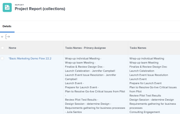

# Colecciones de referencia en un informe

<!-- Audited: 1/2025 -->

La creación de un informe en Adobe Workfront permite mostrar un conjunto de objetos, sus campos respectivos u objetos vinculados en una lista, una cuadrícula o un formato de gráfico.

Para obtener más información sobre cómo generar un informe en Workfront, consulte [Crear un informe personalizado](../../../reports-and-dashboards/reports/creating-and-managing-reports/create-custom-report.md).

## Requisitos de acceso

+++ Expanda para ver los requisitos de acceso para la funcionalidad en este artículo.

Debe tener lo siguiente:

<table style="table-layout:auto"> 
 <col> 
 <col> 
 <tbody> 
  <tr> 
   <td role="rowheader">Plan de Adobe Workfront</td> 
   <td> <p>Cualquiera</p> </td> 
  </tr> 
  <tr> 
   <td role="rowheader">Licencia de Adobe Workfront</td> 
   <td> 
      <p>Nuevo:</p>
         <ul>
         <li><p>Estándar</p></li>
         </ul>
      <p>Actual:</p>
         <ul>
         <li><p>Plan</p></li>
         </ul>
   </td>
  </tr> 
  <tr> 
   <td role="rowheader">Configuraciones de nivel de acceso</td> 
   <td> <p>Acceso de edición a filtros, vistas y agrupaciones</p> <p>Acceso de edición a informes, paneles y calendarios</p> </td> 
  </tr> 
  <tr> 
   <td role="rowheader">Permisos de objeto</td> 
   <td> <p>Permisos de administración para un informe</p> <p>Administrar permisos para una vista, filtro o agrupación </p> </td> 
  </tr> 
 </tbody> 
</table>

Para obtener más información, consulte [Requisitos de acceso en la documentación de Workfront](/help/quicksilver/administration-and-setup/add-users/access-levels-and-object-permissions/access-level-requirements-in-documentation.md).

+++

## Explicación de las colecciones

Una colección es una lista de objetos vinculados a otro objeto.

Tiene las dos relaciones siguientes entre objetos en Workfront:

* **Relación uno a uno**: Un objeto solo se puede vincular a otro objeto a la vez.\
  Por ejemplo, un proyecto solo se puede vincular a un portafolio a la vez.

* **Relación uno a varios**: Un objeto se puede vincular a varios objetos a la vez.\
  Por ejemplo, un proyecto puede tener varias tareas. En este caso, la lista de tareas forma una colección para el proyecto.

>[!IMPORTANT]
>
>Se puede generar un informe que muestre la relación uno a uno entre objetos mediante Report Builder estándar. Sin embargo, solo se puede generar un informe que muestre la relación &quot;uno a varios&quot; entre objetos mediante la interfaz de modo de texto de Report Builder.

Para obtener más información sobre cómo generar un informe en Report Builder estándar, consulte [Crear un informe personalizado](../../../reports-and-dashboards/reports/creating-and-managing-reports/create-custom-report.md).

Para obtener más información sobre la creación de un informe con la interfaz de modo de texto, consulte:

* [Información general sobre el modo de texto](../../../reports-and-dashboards/reports/text-mode/understand-text-mode.md)
* [Información general sobre usos comunes del modo de texto](../../../reports-and-dashboards/reports/text-mode/understand-common-uses-text-mode.md).
* [Resumen de sintaxis de modo de texto](../../../reports-and-dashboards/reports/text-mode/text-mode-syntax-overview.md)

## Busque objetos de colección y sus campos en el Explorador de API {#find-collection-objects-and-their-fields-in-the-api-explorer}

No se pueden crear informes de todas las colecciones.

Para comprender qué objetos se pueden asociar a una colección de otros, debe utilizar el Explorador de API.\
Para obtener más información sobre la tabla del Explorador de API, consulte [Explorador de API](../../../wf-api/general/api-explorer.md).

Para averiguar sobre qué colecciones se pueden crear informes:

1. Vaya a [Explorador de API](../../../wf-api/general/api-explorer.md).
1. Busque el objeto del informe.
1. Seleccione la ficha **colecciones**.

   >[!NOTE]
   >
   >Sólo los objetos enumerados en esta ficha pueden representarse como una colección en un informe para el objeto seleccionado.

1. Expanda el objeto de la colección haciendo clic en él.
1. Haga clic en el vínculo mostrado para ir al objeto de la colección.\
   Se abre la ficha **campos** para el objeto de la colección.

   >[!NOTE]
   >
   >En el informe de recopilación solo se puede hacer referencia a los campos enumerados en esta pestaña, o a los campos asociados a los objetos enumerados en esta pestaña.

## Colecciones de referencia en informes

Puede hacer referencia a objetos de una colección en los siguientes elementos de informes:

* Vistas
* Filtros
* Solicitudes

No se puede hacer referencia a objetos de una colección en los siguientes elementos de informes:

* Agrupaciones
* Gráfico

Por ejemplo, puede hacer referencia a las colecciones de tareas o problemas de un informe de proyecto para mostrar la información de tareas o problemas en el nivel de proyecto.

* [Hacer referencia a una colección en la vista de un informe](#reference-a-collection-in-the-view-of-a-report)
* [Hacer referencia a una colección en el filtro de un informe](#reference-a-collection-in-the-filter-of-a-report)
* [Hacer referencia a una colección en la solicitud personalizada de un informe](#reference-a-collection-in-the-custom-prompt-of-a-report)

### Hacer referencia a una colección en la vista de un informe {#reference-a-collection-in-the-view-of-a-report}

Puede hacer referencia a una colección de objetos en la vista de un informe para mostrar los atributos de los objetos asociados con el objeto del informe.

Por ejemplo, puede mostrar la información de tareas o problemas en un informe de proyecto mediante la generación de una columna de colección para tareas o problemas en la vista del informe.

Puede mostrar información sobre las tareas o problemas, como nombres, fechas, personas asignadas principales, porcentaje completado, etc., en la vista Colección.

La vista muestra la información de tareas o problemas en formato de lista, y cada línea de la lista representa información sobre una tarea o un problema. La lista de tareas o problemas y sus campos aparecen en la misma línea que el proyecto al que pertenecen las tareas o problemas.

{width=400}

* [Agregar una columna de colección en una vista de informe](#add-a-collection-column-in-a-report-view)
* [Comprender las líneas de una vista de colección en modo texto](#understand-the-lines-of-a-collection-view-in-text-mode)
* [Limitaciones de una vista de colección](#limitations-of-a-collection-view)

### Agregar una columna de colección en una vista de informe {#add-a-collection-column-in-a-report-view}

Para agregar una columna de colección en una vista de informe:

1. Haga clic en el **icono del menú principal**  y, a continuación, haga clic en **Informes**.
1. Haga clic en **Nuevo informe**.
1. Seleccione el objeto del informe.
1. Salga del informe y, con el [Explorador de API](../../../wf-api/general/api-explorer.md), determine qué colecciones están disponibles para el objeto que seleccionó para el informe.

   Para obtener más información acerca de cómo seleccionar el objeto de su colección, vea la sección [Buscar objetos de colección y sus campos en el Explorador de API](#find-collection-objects-and-their-fields-in-the-api-explorer) en este artículo.

   Anote el nombre del objeto de la colección.

1. Con el [Explorador de API](../../../wf-api/general/api-explorer.md), vaya a la lista de campos del objeto que desea mostrar en la colección.

   Para obtener más información acerca de cómo buscar los campos del objeto de su colección, vea la sección [Buscar objetos de colección y sus campos en el Explorador de API](#find-collection-objects-and-their-fields-in-the-api-explorer) en este artículo.

   Anote cuál es el nombre del campo que desea mostrar en la colección.

1. Vuelva al informe y, en la ficha **Columnas (Ver)**, haga clic en **Agregar columna**.
1. Haga clic en **Cambiar al modo de texto**.
1. Haga clic en **Editar modo de texto**.
1. Seleccione todo el texto del cuadro de diálogo **Modo de texto**, quítelo y pegue el código siguiente si hace referencia a un campo del objeto de colección:

   ```
   valueformat=HTML
   textmode=true
   type=iterate
   listdelimiter=<p>
   displayname=Column Name
   listmethod=nested(collection object name).lists
   valuefield=collection object field
   ```

1. Reemplace **Column Name** con el nombre de su columna en la línea `displayname`.
1. Reemplace **nombre de objeto de colección** por el nombre de su objeto de colección en la línea `listmethod`, tal como aparece en el [Explorador de API](../../../wf-api/general/api-explorer.md).

1. Reemplace **campo de objeto de colección** por el nombre del campo del objeto de colección en la línea `valuefield`, tal como aparece en el [Explorador de API](../../../wf-api/general/api-explorer.md).

   Puede reemplazar **valuefield** por **valueexpression** si desea crear una expresión personalizada en la vista.

   Para obtener más información sobre las expresiones personalizadas calculadas, consulte [Información general sobre las expresiones de datos calculados](../../../reports-and-dashboards/reports/calc-cstm-data-reports/calculated-data-expressions.md).

   Por ejemplo, si desea mostrar una lista de las tareas en un informe de proyecto. Esta colección usa una línea `valuefield` para hacer referencia a los nombres de las tareas.

   Realice una de las siguientes acciones:

   * Utilice el siguiente código para generar su columna:

     ```
     valueformat=HTML
     textmode=true
     type=iterate
     listdelimiter=<p>
     displayname=Project Tasks Names
     listmethod=nested(tasks).lists
     valuefield=name
     ```

   * Utilice el siguiente código para mostrar una lista de problemas en el informe:

     ```
     displayname=Project Issues Names
     listdelimiter=<p>
     listmethod=nested(issues).lists
     textmode=true
     type=iterate
     valuefield=name
     valueformat=HTML
     ```

     Observe que en una colección debe usar **issues** para la línea **listmethod**, en lugar de **opTasks**, que es el nombre de base de datos de los problemas. Para obtener información sobre cuándo usar **problema** y cuándo usar **opTask** al hacer referencia a problemas, consulte [Usar &quot;opTask&quot; y &quot;problema&quot; al hacer referencia a problemas](../../../manage-work/issues/issue-information/use-optask-instead-of-issue.md).

   * Si desea mostrar una lista de las tareas en un informe de proyecto junto con su usuario asignado principal, debe utilizar una línea **valueexpression** para hacer referencia a los nombres de las tareas adyacentes a los nombres de sus usuarios asignados principales en lugar de **valuefield**.

     Utilice el siguiente código para generar su columna:

     ```
     valueformat=HTML
     textmode=true
     type=iterate
     listdelimiter=<p>
     displayname=Tasks Names - Primary Assignee
     listmethod=nested(tasks).lists
     valueexpression=CONCAT({name},' - ',{assignedTo}.{name})
     ```

1. La siguiente columna se muestra en el informe del proyecto e incluye todas las tareas de cada proyecto junto con sus principales usuarios asignados:

   {width=400}

1. Haga clic en **Guardar**.
1. (Opcional) Continúe editando el informe.

   O

   Haga clic en **Guardar + cerrar** para guardar el informe.

#### Comprender las líneas de una colección Ver en modo texto

Las líneas de una vista de modo de texto de una colección se describen en la siguiente tabla:

<table style="table-layout:auto"> 
 <col> 
 <col> 
 <thead> 
  <tr> 
   <th><strong>Línea de muestra</strong> </th> 
   <th><strong>Descripción</strong> </th> 
  </tr> 
 </thead> 
 <tbody> 
  <tr> 
   <td><code>valueformat=HTML</code> </td> 
   <td> <p>Puede usar varios valores para esta línea, pero le recomendamos que <code style="font-weight: normal;">valueformat</code> para una lista de colección sea <strong>HTML.</strong></p>
   </td> 
  </tr> 
  <tr> 
   <td><code>textmode=true</code> </td> 
   <td> <p>Esta línea indica que la columna se ha configurado con el modo de texto. Si elimina esta línea, Workfront la volverá a añadir de forma predeterminada.</p> </td> 
  </tr> 
  <tr> 
   <td><code>type=iterate</code> </td> 
   <td> <p>El <code>type</code> de una lista siempre es <code>iterate</code>, al generar una vista.</p> </td> 
  </tr> 
  <tr> 
   <td><code>listdelimiter=&lt;p&gt;</code> </td> 
   <td> <p>Este es el delimitador que se utiliza para separar los valores de la lista.<br>Recomendamos usar <code>&lt;p&gt;</code>, que agrega un salto de línea entre los valores.</p> <p>También puede utilizar lo siguiente:</p> <p><code>&amp;zwj;</code> (carpintero de anchura cero). Los valores de la colección no tienen separación entre ellos.<br><strong>,</strong> =separador de comas. Los valores de la colección están separados por una coma seguidos de sin espacio.<br><strong>/</strong> = separador de barras. Los valores de la colección están separados por una barra diagonal.<br><strong>-</strong> = separador de guiones. Los valores de la colección están separados por un guión.<br>Si deja vacía esta línea, se agrega una coma seguida de un espacio entre los valores de la colección, de manera predeterminada.</p> </td> 
  </tr> 
  <tr> 
   <td><code>displayname=</code><em>Nombre de columna</em> </td> 
   <td> <p>Reemplazar <strong>Nombre de columna</strong> por el nombre real de la nueva columna.</p> </td> 
  </tr> 
  <tr> 
   <td><code>listmethod=nested(collection object name).list</code> </td> 
   <td> <p> Esta línea define la colección a la que hace referencia.</p> <p>Reemplace <strong>nombre de objeto de colección</strong> por el nombre del objeto al que hace referencia en su colección, tal como aparece en el <a href="../../../wf-api/general/api-explorer.md" class="MCXref xref">Explorador de API</a>. Este valor suele ser la forma plural del nombre del objeto de colección.</p> </td> 
  </tr> 
  <tr> 
   <td><code>valuefield=collection object field</code> </td> 
   <td> <p>Esta línea define a qué campo se hace referencia desde el objeto de colección.</p> <p>Reemplace <strong>campo de objeto de colección</strong> por el nombre del campo del objeto al que hace referencia en su colección, tal como aparece en el <a href="../../../wf-api/general/api-explorer.md" class="MCXref xref">Explorador de API</a>.</p> <p>Puede reemplazar esta línea por:</p> <p><strong>valueexpression</strong>=campo/ campos de objeto de colección calculada</p> <p>Con <strong>valueexpression</strong>, puede  mostrar una expresión personalizada calculada en la columna.</p> <p>Para obtener más información sobre cómo dar formato a <strong>valueexpression</strong> líneas, vea <a href="../../../reports-and-dashboards/reports/text-mode/text-mode-syntax-overview.md" class="MCXref xref">Información general sobre la sintaxis en modo texto</a>.</p> </td> 
  </tr> 
 </tbody> 
</table>

#### Limitaciones de una vista de colección {#limitations-of-a-collection-view}

Tenga en cuenta las siguientes limitaciones al crear una vista de colección:

* No se puede controlar el orden en que se muestran los datos de colección.
* No se puede aplicar formato condicional a una vista de colección.
* No se puede hacer que un objeto de una colección sea un vínculo en el que se puede hacer clic.
* No se puede generar una vista de colección de otra colección.\
  Por ejemplo, no puede mostrar todas las personas asignadas a cada tarea en un informe de proyecto. Solo puede mostrar el usuario asignado principal de cada tarea en una vista de proyecto.

### Hacer referencia a una colección en el filtro de un informe {#reference-a-collection-in-the-filter-of-a-report}

Puede hacer referencia a una colección de objetos en el filtro de un informe para filtrar los atributos de los objetos asociados con el objeto del informe.

Por ejemplo, puede filtrar la información de tareas o problemas de un informe de proyecto mediante una referencia a los atributos de las tareas o problemas del proyecto en la instrucción de filtro.

Para agregar una referencia a una colección en un filtro de informe:

1. Haga clic en el **icono del menú principal**  y, a continuación, haga clic en **Informes**.
1. Haga clic en **Nuevo informe**.
1. Seleccione el objeto del informe.
1. Salga del informe y, con el [Explorador de API](../../../wf-api/general/api-explorer.md), determine qué colecciones están disponibles para el objeto que seleccionó para el informe.

   Para obtener más información acerca de cómo seleccionar el objeto de su colección, vea la sección [Buscar objetos de colección y sus campos en el Explorador de API](#find-collection-objects-and-their-fields-in-the-api-explorer) en este artículo.

   Anote el nombre del objeto de la colección.

1. Con el [Explorador de API](../../../wf-api/general/api-explorer.md), vaya a la lista de campos del objeto que desea mostrar en la colección.

   Para obtener más información acerca de cómo buscar los campos del objeto de su colección, vea la sección [Buscar objetos de colección y sus campos en el Explorador de API](#find-collection-objects-and-their-fields-in-the-api-explorer) en este artículo.

   Anote el campo que desee mostrar en la colección.

1. Vuelva al informe y, en la ficha **Filtros**, haga clic en **Cambiar al modo de texto** y, a continuación, en **Editar modo de texto**.

1. En el área **Establecer reglas de filtro para su informe**, pegue el siguiente código:

   ```
   collection object name:collection object field=collection object value
   collection object name:collection object field_Mod=value of the modifier
   ```

1. Reemplace **nombre de objeto de colección** por el nombre del objeto de colección tal como aparece en el [Explorador de API](../../../wf-api/general/api-explorer.md). Este valor suele ser la forma plural del nombre del objeto de colección.

1. Reemplace **campo de objeto de colección** con el nombre del campo de su objeto de colección en, tal como aparece en el [Explorador de API](../../../wf-api/general/api-explorer.md).

1. Reemplazar **valor de objeto de colección** por el valor del objeto de colección tal como aparece en Workfront.
1. Reemplazar **valor del modificador** por un modificador válido.

   Para obtener una lista de modificadores, consulte [Modificadores de filtro y condición](../../../reports-and-dashboards/reports/reporting-elements/filter-condition-modifiers.md).\
   Por ejemplo, para generar un informe de proyecto que muestre solo los proyectos con tareas que tienen &quot;Marketing&quot; en su nombre, utilice el siguiente código:

   ```
   tasks:name=Marketing
   tasks:name_Mod=cicontains
   ```

   Este informe solo muestra los proyectos que tienen al menos una tarea con la palabra &quot;marketing&quot; en su nombre.

   {width=400}

1. Para filtrar por el nombre de un problema, utilice el siguiente código:

   ```
   issues:name=Marketing
   issues:name_Mod=cicontains
   ```

   >[!TIP]
   >
   >Observe que debe usar `issues` para el nombre del objeto de colección, en lugar de `optask`, que es el modo en que aparecen los problemas en el Explorador de API.

1. Haga clic en **Listo**.
1. (Opcional) Continúe editando el informe.

   O

   Haga clic en **Guardar + cerrar** para guardar el informe.

### Hacer referencia a una colección en la solicitud personalizada de un informe {#reference-a-collection-in-the-custom-prompt-of-a-report}

Puede hacer referencia a una colección de objetos en la petición de datos personalizada de un informe para filtrar los resultados del informe por los atributos de los objetos asociados con el objeto del informe.

Por ejemplo, puede solicitar información sobre tareas en un informe de proyecto mediante una referencia a los atributos de las tareas del proyecto en la petición personalizada del informe.

>[!NOTE]
>
>No se puede hacer referencia a las colecciones en una petición de datos estándar.

Una petición de datos personalizada es un filtro personalizado en el que las sentencias se unen mediante símbolos ampersand. Le recomendamos que genere su enunciado en un filtro, primero, y luego que una las líneas de las instrucciones con el símbolo et.

Para obtener más información acerca de cómo generar una instrucción de filtro con una referencia de colección, vea la sección [Hacer referencia a una colección en el filtro de un informe](#reference-a-collection-in-the-filter-of-a-report) en este artículo.

Para agregar una referencia a una colección en la petición de datos personalizada de un informe:

1. Haga clic en el **icono del menú principal**  y, a continuación, haga clic en **Informes**.
1. Haga clic en **Nuevo informe**.
1. Seleccione el objeto del informe.
1. Genere un filtro con una referencia de colección como se describe en la sección [Hacer referencia a una colección en el filtro de un informe](#reference-a-collection-in-the-filter-of-a-report) en este artículo.
1. Haga clic en **Configuración del informe**.
1. Haga clic en **Indicadores de informe**.
1. Haga clic en **Agregar solicitud**.
1. Haga clic en **Mensaje personalizado**.
1. Especifique el nombre de la solicitud en el campo **Field****name**.

1. Especifique una **etiqueta de elemento desplegable**.
1. Especifique lo siguiente en el campo **Condición**:

   ```
   collection object name:collection object field_Mod=value of the modifier
   ```

1. (Opcional) Especifique si esta opción se muestra de forma predeterminada en la solicitud.
1. Reemplace **nombre de objeto de colección** por el nombre del objeto de colección tal como aparece en el [Explorador de API](../../../wf-api/general/api-explorer.md). Este valor suele ser la forma plural del nombre del objeto de colección.
1. Reemplace **campo de objeto de colección** por el nombre del campo del objeto de colección, tal como aparece en el [Explorador de API](../../../wf-api/general/api-explorer.md).
1. Reemplazar **valor de objeto de colección** por el valor del objeto de colección tal como aparece en Workfront.

   Por ejemplo, si está filtrando proyectos en los que el nombre de la tarea contiene &quot;Marketing&quot;, reemplace **valor de objeto de colección** por **marketing**.

1. Reemplazar **valor del modificador** por un modificador válido.

   Para obtener una lista de modificadores, consulte [Modificadores de filtro y condición](../../../reports-and-dashboards/reports/reporting-elements/filter-condition-modifiers.md).

   **Ejemplo:** Por ejemplo, para generar un informe de proyecto con una solicitud personalizada en el que desee mostrar solamente los proyectos que tengan al menos una tarea asignada a un usuario específico, use el código siguiente:

   ```
   tasks:assignedToID=57cf1b7a000077c9f02f66cb09c8f86c&tasks:assignedToID_Mod=in
   ```

   Esto genera un informe en el que todos los proyectos enumerados tienen al menos una tarea asignada al usuario cuyo GUID es 57cf1b7a000077c9f02f66cb09c8f86c.

   >[!NOTE]
   >
   >No puede hacer referencia al nombre del usuario asignado principal (campo &quot;Asignado a&quot;) de una tarea, según el [Explorador de API](../../../wf-api/general/api-explorer.md). Solo puede hacer referencia al ID del usuario asignado principal.

   Por ejemplo, para filtrar por cualquier proyecto en el que cualquiera de los problemas del proyecto esté asignado a un usuario específico, utilice el siguiente código para la solicitud personalizada:

   ```
   issues:assignedToID=57cf1b7a000077c9f02f66cb09c8f86c&issues:assignedToID_Mod=in
   ```

   Esto genera un informe en el que todos los proyectos enumerados tienen al menos un problema asignado al usuario cuyo GUID es 57cf1b7a000077c9f02f66cb09c8f86c.

   >[!NOTE]
   >
   >Observe que debe usar **issues** para el nombre del objeto de colección. El Explorador de API no ofrece un nombre de objeto de colección para los problemas en este momento.

1. Haga clic en **Listo**.
1. (Opcional) Continúe editando el informe.

   O

   Haga clic en **Guardar + cerrar** para guardar el informe.
