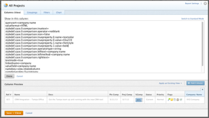

# Utilizar el formato condicional en modo de texto

<!--
(NOTE: Alina: this article might need to be split in its sections. Tony asked that numbers and dates should be in separate articles (??))
-->

El generador de interfaz estándar ofrece una buena gama de flexibilidad a la hora de crear elementos de informes para satisfacer las necesidades de su organización.

Puede aplicar formato condicional en una vista utilizando la interfaz estándar.\
Para obtener más información sobre la aplicación de formato condicional a una vista, consulte [Utilizar el formato condicional en las vistas](../../../reports-and-dashboards/reports/reporting-elements/use-conditional-formatting-views.md).

## Requisitos de acceso

Debe tener el siguiente acceso para realizar los pasos de este artículo:

<table style="table-layout:auto"> 
 <col> 
 <col> 
 <tbody> 
  <tr> 
   <td role="rowheader">plan de Adobe Workfront*</td> 
   <td> <p>Cualquiera</p> </td> 
  </tr> 
  <tr> 
   <td role="rowheader">Licencia de Adobe Workfront*</td> 
   <td> <p>Plan </p> </td> 
  </tr> 
  <tr> 
   <td role="rowheader">Configuraciones de nivel de acceso*</td> 
   <td> <p>Editar acceso a filtros, vistas y grupos</p> <p>Editar acceso a informes, tableros y calendarios para editar vistas en un informe</p> <p>Nota: Si todavía no tiene acceso, pregunte a su administrador de Workfront si establece restricciones adicionales en su nivel de acceso. Para obtener información sobre cómo un administrador de Workfront puede modificar su nivel de acceso, consulte <a href="../../../administration-and-setup/add-users/configure-and-grant-access/create-modify-access-levels.md" class="MCXref xref">Crear o modificar niveles de acceso personalizados</a>.</p> </td> 
  </tr> 
  <tr> 
   <td role="rowheader">Permisos de objeto</td> 
   <td> <p>Administrar permisos en un informe para editar vistas en un informe</p> <p>Administrar permisos en una vista para editarla</p> <p>Para obtener información sobre la solicitud de acceso adicional, consulte <a href="../../../workfront-basics/grant-and-request-access-to-objects/request-access.md" class="MCXref xref">Solicitar acceso a objetos </a>.</p> </td> 
  </tr> 
 </tbody> 
</table>

&#42;Para saber qué plan, tipo de licencia o acceso tiene, póngase en contacto con el administrador de Workfront.

## Formato condicional en modo de texto

El modo Texto permite crear vistas, filtros, agrupaciones y mensajes más complejos, ya que permite utilizar campos que no están disponibles en la interfaz estándar.

Para obtener una lista completa de todos nuestros campos informables, consulte la  [Explorador de API](../../../wf-api/general/api-explorer.md).

Para obtener más información sobre el uso de la sintaxis del modo de texto, consulte [Información general sobre la sintaxis del modo de texto](../../../reports-and-dashboards/reports/text-mode/text-mode-syntax-overview.md).

También puede utilizar el modo de texto para dar formato a las vistas en los informes y las listas. Con el formato condicional, puede cambiar las vistas de los informes cambiando el tipo de fuente y el fondo de los resultados en el informe, así como los iconos y los indicadores. Se recomienda crear siempre las vistas utilizando primero la interfaz estándar y cambiar a la interfaz del modo de texto solo cuando sea absolutamente necesario.

>[!NOTE]
>
> No se admite el uso de estilos CSS para personalizar el formato condicional. En su lugar, debe utilizar las opciones de formato prediseñadas disponibles en Adobe Workfront.

## Añadir formato condicional a las vistas

Para obtener más información sobre la aplicación de formato condicional a una vista en la interfaz del generador estándar, consulte [Utilizar el formato condicional en las vistas](../../../reports-and-dashboards/reports/reporting-elements/use-conditional-formatting-views.md).

Para añadir formato condicional a una vista en la interfaz de modo de texto:

1. Ir a una lista de objetos.
1. Expanda el menú desplegable de una vista a la que desee agregar formato condicional.
1. Haga clic en **Personalizar vista**.
1. Haga clic en la columna de la vista a la que desea aplicar el formato condicional.
1. Haga clic en **Cambiar al modo de texto**.
1. En el **Mostrar en esta columna:** área, haga clic en **Haga clic para editar texto**.
1. Añadir los ejemplos de código proporcionados en [Formato de vistas con el modo de texto](#format-views-using-text-mode) en la parte inferior del texto de la columna seleccionada.
1. Haga clic en **Guardar** y haga clic en **Guardar vista**.

## Formato de vistas con el modo de texto {#format-views-using-text-mode}

Puede añadir los siguientes componentes a una columna de una vista para aplicarle formato condicional en modo de texto:

* [Configuración de columna](#column-settings)
* [Reglas de columna](#column-rules)
* [Formato condicional de una expresión de valor](#conditionally-format-a-valueexpression)

### Configuración de columna {#column-settings}

Debe estar familiarizado con la interfaz del modo de texto para poder agregar formato condicional a las vistas.

Puede personalizar los siguientes elementos de una columna al usar el formato condicional en una vista:

* [Encabezados de columna](#column-headers)
* [Formato de fechas](#format-dates)
* [Formato de números](#format-numbers)

#### Encabezados de columna {#column-headers}

Para cambiar el encabezado de columna mostrado, añada el siguiente código a la columna: `displayname= [Name of column]`. Por ejemplo, para nombrar una columna Propietario del proyecto, el código de texto tendría el siguiente aspecto:

```
displayname=Project Owner
```

#### Formato de fechas {#format-dates}

Las fechas se pueden configurar para que se muestren en diversos formatos.

Para obtener más información, consulte [Formato de fechas en informes en modo de texto](../../../reports-and-dashboards/reports/text-mode/format-dates-in-text-mode-reports.md).

<!--
<div data-mc-conditions="QuicksilverOrClassic.Draft mode"> 
<p data-mc-conditions="QuicksilverOrClassic.Draft mode">(NOTE: this is drafted and replaced by the article linked above)</p>
<p>To establish a date format, you must modify the <code>valueformat</code> line of the text mode code in the column.</p>
<pre>valueformat= [new date format]</pre>
<p>For example, if you wanted the Projected Completion Date to be displayed as MM/DD/YY the code would look like:</p>
<pre>valueformat=atDate<br>valuefield=projectedCompletionDate </pre>
<p>If you wanted to show the Planned Completion Date as <em>Mth, DD, Year</em>, the code would look like:</p>
<pre>valueformat=mediumAtdate<br>valuefield=plannedCompletionDate</pre>
<p>You can format dates using the following <code>valueformat</code> text mode values:</p>
<table style="table-layout:auto">
<col>
<col>
<col>
<thead>
<tr>
<th scope="col"><strong>Format</strong> </th>
<th scope="col">Example </th>
<th scope="col"><em><strong>valueformat=</strong></em> </th>
</tr>
</thead>
<tbody>
<tr>
<td>MM/DD/YY</td>
<td>10/11/18</td>
<td><pre>atDate</pre> </td>
</tr>
<tr>
<td>MM/DD/YY Time</td>
<td>10/11/18 12:00pm</td>
<td><pre>longAtDate</pre> </td>
</tr>
<tr>
<td>MM/DD/YY</td>
<td>10/11/18</td>
<td><pre>shortAtDate</pre> </td>
</tr>
<tr>
<td>Mth, DD, YR</td>
<td>Oct, 11, 2018</td>
<td><pre>mediumAtDate</pre> </td>
</tr>
<tr>
<td>DW, Mth, Day, YR</td>
<td>Mon, Oct, 11, 2018</td>
<td><pre>partialAtDate</pre> </td>
</tr>
<tr>
<td>DW, Mth, Day, YR Time</td>
<td>Mon, Oct, 11, 2018 12:00 pm</td>
<td><pre>fullAtDate</pre> </td>
</tr>
</tbody>
</table>
</div>
-->

#### Formato de números {#format-numbers}

Puede dar formato a los valores numéricos para mostrar la información que mejor se adapte a sus necesidades de creación de informes.

Para obtener más información, consulte [Formato de números, moneda y valores de porcentaje en los informes de modo de texto](../../../reports-and-dashboards/reports/text-mode/format-numbers-in-text-mode-reports.md).

<!--
<div data-mc-conditions="QuicksilverOrClassic.Draft mode">
<p>To modify the format of a numeric value, you must edit the <strong>valueformat</strong> line of your column.</p> 
<p data-mc-conditions="QuicksilverOrClassic.Draft mode">(NOTE: this is drafted and replaced by the article linked above) </p>
<p>For example, if you wanted to display the Budget column as $1000, the value format line would look like:</p>
<pre>valueformat=currencyStringCurrencyRounded<br>valuefield=budget</pre>
<p>You can format numbers using the following values for the <code>valueformat</code> line of your column:</p>
<table border="2" cellspacing="15" cellpadding="1">
<col>
<col>
<thead>
<tr>
<th scope="col"><strong>Example</strong> </th>
<th scope="col"><em><code>valueformat=</code></em> </th>
</tr>
</thead>
<tbody>
<tr>
<td>1234</td>
<td><pre>doubleAsString</pre> or <pre>int</pre></td>
</tr>
<tr>
<td>1,234</td>
<td><pre>doubleAsInt</pre> </td>
</tr>
<tr>
<td>$1,234</td>
<td><pre>currencyStringCurrencyRounded</pre> </td>
</tr>
<tr>
<td>1234.56</td>
<td><pre>doubleAsDouble</pre> </td>
</tr>
<tr>
<td>$1,234.56</td>
<td><pre>currencyStringCurrency</pre> </td>
</tr>
<tr>
<td>12%</td>
<td><pre>doubleAsPercentRounded</pre> </td>
</tr>
<tr>
<td>12.34%</td>
<td><pre>doubleAsPercent</pre> </td>
</tr>
<tr>
<td>(1,234.56)</td>
<td><pre>doubleAsFinancial</pre> </td>
</tr>
<tr>
<td>(1,234)</td>
<td><pre>doubleAsFiancialRounded</pre> </td>
</tr>
</tbody>
</table>
</div>
-->

### Reglas de columna {#column-rules}

Las reglas de columna permiten la adición de imágenes, el color, el formato y las anulaciones de texto dentro de una vista. Las reglas de columna se pueden establecer de forma independiente o pueden contener varias condiciones para una columna.

* [Formato condicional](#conditional-formatting)
* [Varios formatos condicionales](#multiple-conditional-formats)
* [Aplicar texto](#apply-text)
* [Aplicar formatos de fila](#apply-row-formats)
* [Aplicar imágenes](#apply-images)

#### Formato condicional {#conditional-formatting}

Se debe aplicar una instrucción de modo de texto específica al incorporar color o formato de texto.

>[!NOTE]
>
>Es posible que no se admita el formato condicional en las columnas combinadas.\
>Para obtener más información sobre la combinación de columnas con el modo de texto, consulte [Ver: combinar información de varias columnas en una columna compartida](../../../reports-and-dashboards/reports/custom-view-filter-grouping-samples/view-merge-columns.md).

Inserte el siguiente código en cualquier columna a la que desee agregar formato condicional:

```
styledef.case.0.comparison.leftmethod= [field name]
styledef.case.0.comparison.lefttext= [field name]
styledef.case.0.comparison.righttext= [field value]
styledef.case.0.comparison.operator= [qualifier]
styledef.case.0.comparison.operatortype= [data type]
styledef.case.0.comparison.icon=false
styledef.case.0.comparison.truetext= 
styledef.case.0.comparison.trueproperty.0.name= [format option]
styledef.case.0.comparison.trueproperty.0.value= [format style]
```

>[!NOTE]
>
>La variable *styledef.case.0.comparison.icon* line es siempre false a menos que se trabaje con iconos.
>
>La variable *styledef.case.0.comparison.truetext* línea siempre se deja en blanco hasta que se sobrescribe el texto.
>
>La variable *styledef.case.0.comparison.rightext* línea está en blanco cuando el calificador no está en blanco.

Por ejemplo, si queremos mostrar el nombre de la empresa en verde en un informe de proyecto, puede utilizar el siguiente código:

```
styledef.case.0.comparison.leftmethod=company:name
styledef.case.0.comparison.lefttext=company:name ;
styledef.case.0.comparison.righttext= 
styledef.case.0.comparison.operator=notblank
styledef.case.0.comparison.operatortype=string
styledef.case.0.comparison.icon=false
styledef.case.0.comparison.truetext=
styledef.case.0.comparison.trueproperty.0.name=textcolor
styledef.case.0.comparison.trueproperty.0.value=03a219
```

>[!NOTE]
>
>* Aunque esta declaración se puede aplicar a una columna Nombre de la empresa , también se puede aplicar a cualquier otra columna del informe. El texto verde solo se mostraría si el proyecto tenía una empresa asociada. Recuerde `[field name]`, `[value]`y `[qualifier]` conduzca si el condicionamiento aparece o no en última instancia en la columna.
>* Al trabajar con calificadores, recomendamos utilizar `cicontains` en lugar de `equal`. De forma predeterminada, `equal` busca números de ID. Al usar la variable `cicontains` cualificador, puede acceder a los elementos por su nombre.


Tanto si el color del texto, la alineación, el estilo de fuente o el color de fondo se aplican a un modo de texto, se utiliza la misma instrucción (que se muestra arriba).

Las siguientes líneas deben modificarse para reflejar el formato correspondiente necesario para la columna:

```
styledef.case.0.comparison.trueproperty.0.name= [format option]
styledef.case.0.comparison.trueproperty.0.value= [format style]
```

Utilice las tablas siguientes para identificar qué líneas deben modificarse y qué valores debe especificar para definir el estilo de formato de la columna:

| **Color de texto** | **Línea: textcolor=** |
|---|---|
| Negro | `000000` |
| Azul oscuro | `0c6aca` |
| Teal | `1b878c` |
| Verde | `03a219` |
| Púrpura | `6408c4` |
| Gris | `767676` |
| Rojo | `d30519` |
| Amarillo | `e19503` |

{style="table-layout:auto"}

| **Alineación** | **Línea: align=** |
|---|---|
| Alineación izquierda | `left` |
| Alineación derecha | `right` |
| Alineación central | `center` |

{style="table-layout:auto"}

| Fuente | Línea: ***fontstyle=*** |
|---|---|
| Negrita | `bold` |
| Cursiva | `italic` |

{style="table-layout:auto"}

| **Color de fondo** | **Línea: bgcolor=** |
|---|---|
| Teal | `dcf6f7` |
| Verde | `def6e2` |
| Gris | `e8e8e8` |
| Azul | `e8f1ff` |
| Púrpura | `e9def4` |
| Rojo | `eac6c9` |
| Amarillo | `feecc8` |
| Blanco | `ffffff` |

{style="table-layout:auto"}

#### Varios formatos condicionales {#multiple-conditional-formats}

Puede aplicar más de un estilo de formato a una instrucción. La instrucción principal permanecería sin cambios y cualquier expresión de formato adicional se agregaría a la instrucción.

Por ejemplo, si se utiliza la instrucción anterior para incluir el nombre de la empresa en el texto en negrita verde. La declaración se escribiría con el siguiente código:

```
styledef.case.0.comparison.leftmethod=company:name
styledef.case.0.comparison.lefttext=company:name
styledef.case.0.comparison.righttext=
styledef.case.0.comparison.operator=notblank
styledef.case.0.comparison.operatortype=string
styledef.case.0.comparison.icon=false
styledef.case.0.comparison.truetext= 
styledef.case.0.comparison.trueproperty.0.name=textcolor
styledef.case.0.comparison.trueproperty.0.value=03a219
styledef.case.0.comparison.trueproperty.1.name=fontstyle
styledef.case.0.comparison.trueproperty.1.value=bold
```

>[!NOTE]
>
>Cuando se incluye más de una expresión de formato condicional, es necesario identificar numéricamente cada expresión en la instrucción. Observe que se han identificado la expresión 0 y la expresión 1.



#### Aplicar texto {#apply-text}

Si desea reemplazar los valores predeterminados que se rellenan en una columna con un valor de su elección, es posible al aplicar texto a la columna.

Por ejemplo, en un informe de proyecto, configure el valor de la columna Fecha de inicio planeada para que no muestre la fecha de inicio planeada para el proyecto, sino el texto &quot;No hoy&quot;. Utilice el siguiente código para la columna Fecha de inicio planificada :

```
case.0.comparison.leftmethod=plannedStartDate
case.0.comparison.lefttext=plannedStartDate
case.0.comparison.righttext=2013-04-10T10:45:00:000
case.0.comparison.operator=ne
case.0.comparison.operatortype=date
case.0.comparison.icon=false
case.0.comparison.truetext=not today
styledef.case.0.comparison.leftmethod=plannedStartDate
styledef.case.0.comparison.lefttext=plannedStartDate
styledef.case.0.comparison.righttext=2013-04-10T10:45:00:000 
styledef.case.0.comparison.operator=ne
styledef.case.0.comparison.operatortype=date&
styledef.case.0.comparison.icon=false
styledef.case.0.comparison.truetext=not today
```

>[!NOTE]
>
>Las líneas que comienzan con `case.0.` comparaciones de casos de uso con la identificación del uso de texto. Las líneas que comienzan con **styledef.case.0.** son instrucciones de formato condicionales iniciales en las que identificamos el uso de texto a través de la variable `truetext` expresión. Asegúrese de establecer `truetext` a un valor, en lugar de dejarlo en blanco.


#### Aplicar formatos de fila {#apply-row-formats}

Si desea aplicar una condición a toda la fila, utilice el siguiente código con el código de columna:

```
styledef.case.0.comparison.icon=false
```

```
styledef.case.0.comparison.isrowcase=true
```

```
styledef.case.0.comparison.leftmethod= [field name]
```

```
styledef.case.0.comparison.lefttext= [field name]
```

```
styledef.case.0.comparison.operator= [qualifier]
```

```
styledef.case.0.comparison.operatortype= [data type]
```

```
styledef.case.0.comparison.righttext= [field value]
```

```
styledef.case.0.comparison.trueproperty.0.name= [format option]
```

```
styledef.case.0.comparison.trueproperty.0.value= [format style]
```

```
styledef.case.0.comparison.truetext=
```

```
row.0.styledef.applyallcases=true
```

```
row.0.styledef.case.0.comparison.icon=false
```

```
row.0.styledef.case.0.comparison.isrowcase=true
```

```
row.0.styledef.case.0.comparison.leftmethod= [field name]
```

```
row.0.styledef.case.0.comparison.lefttext= [field name]
```

```
row.0.styledef.case.0.comparison.operator= [qualifier]
```

```
row.0.styledef.case.0.comparison.operatortype= [data type]
```

```
row.0.styledef.case.0.comparison.righttext= [field value]
```

```
row.0.styledef.case.0.comparison.trueproperty.0.name= [format option]
```

```
row.0.styledef.case.0.comparison.trueproperty.0.value= [format style]
```

```
row.0.styledef.case.0.comparison.truetext=
```


#### Aplicar imágenes {#apply-images}

Al igual que el formato con texto, las imágenes se pueden utilizar para mostrar información en los informes. Workfront tiene varias imágenes incorporadas para transmitir información visual en una configuración de informe. Para utilizar imágenes en la configuración de formato condicional, se necesita la siguiente instrucción:

```
image.case.0.comparison.leftmethod= [field name]
image.case.0.comparison.lefttext= [field name]
image.case.0.comparison.righttext= [field value]
image.case.0.comparison.operator= [qualifier]
image.case.0.comparison.operatortype= [data type]
image.case.0.comparison.icon=true
image.case.0.comparison.truetext=
```

Por ejemplo, en un informe de proyecto, se desea generar una columna en la que se muestre una cara anterior por cada Fecha de finalización planeada que no sea igual a la fecha actual. Utilice el siguiente código de modo de texto para añadir el icono a la columna:

```
image.case.0.comparison.leftmethod=plannedCompletionDate
image.case.0.comparison.lefttext=plannedCompletionDate
image.case.0.comparison.righttext=2013-04-10T13:00:00:000 
image.case.0.comparison.operator=ne 
image.case.0.comparison.operatortype=date
image.case.0.comparison.icon=true
image.case.0.comparison.truetext=/interface/images/v4_redux/icons/casebuilder/emoticon_frown.gif
```

>[!NOTE]
>
>Observe que la instrucción utiliza la variable `icon=true` expresión. Esta afirmación también es diferente de otras afirmaciones de formato condicional en que no utiliza la variable `style.def` formato, sino un formato de imagen único.


Para utilizar las imágenes disponibles, aplique el código y los valores siguientes:

| **Icono** | **Línea: image.case.0.comparison.truetext=** |
|---|---|
| Cara de ceño  | =`/interface/images/v4_redux/icons/casebuilder/emoticon_frown.gif` |
| Cara feliz  | =`/interface/images/v4_redux/icons/casebuilder/emoticon_smile.gif` |
| Indicador azul   | =`/interface/images/v4_redux/icons/casebuilder/flag_blue.gif` |
| Bandera verde   | =`/interface/images/v4_redux/icons/casebuilder/flag_green.gif` |
| Indicador rojo   | =`/interface/images/v4_redux/icons/casebuilder/flag_red.gif` |
| Bandera amarilla   | =`/interface/images/v4_redux/icons/casebuilder/flag_yellow.gif` |
| Círculo negro   | =`/interface/images/v4_redux/icons/casebuilder/light_black.gif` |
| Círculo azul  | =`/interface/images/v4_redux/icons/casebuilder/light_blue.gif` |
| Círculo gris  | =`/interface/images/v4_redux/icons/casebuilder/light_grey.gif` |
| Círculo verde  | =`/interface/images/v4_redux/icons/casebuilder/light_green.gif` |
| Círculo naranja  | =`/interface/images/v4_redux/icons/casebuilder/light_orange.gif` |
| Círculo rosa  | =`/interface/images/v4_redux/icons/casebuilder/light_pink.gif` |
| Círculo morado  | =`/interface/images/v4_redux/icons/casebuilder/light_purple.gif` |
| Círculo rojo  | =`/interface/images/v4_redux/icons/casebuilder/light_red.gif` |
| Círculo blanco  | =`/interface/images/v4_redux/icons/casebuilder/light_white.gif` |
| Círculo amarillo  | =`/interface/images/v4_redux/icons/casebuilder/light_yellow.gif` |

{style="table-layout:auto"}

### Formatear condicionalmente un `valueexpression` {#conditionally-format-a-valueexpression}

Para mostrar un valor calculado en una columna, puede reemplazar la variable `valuefield` línea de código en la columna con un `valueexpression`. Un valor calculado permite mostrar un nuevo valor para un objeto basándose en el cálculo entre dos campos existentes en el mismo objeto.

Para obtener más información sobre cómo dar formato a la variable `valueexpression line`, consulte [Información general sobre la sintaxis del modo de texto](../../../reports-and-dashboards/reports/text-mode/text-mode-syntax-overview.md).

No se puede dar formato condicional a una columna que contenga una `valueexpression` línea de código. En su lugar, puede agregar un campo personalizado calculado a un formulario personalizado y asociarlo a los objetos que se muestran en el informe. A continuación, puede dar formato condicional a las columnas que muestran este campo.

Para obtener más información sobre los campos personalizados calculados, consulte [Agregar datos calculados a un formulario personalizado](../../../administration-and-setup/customize-workfront/create-manage-custom-forms/add-calculated-data-to-custom-form.md).

## Añadir un valor de agregador en una columna Modo de texto

Se recomienda crear primero la columna en la interfaz del generador, añadir el valor del agregador allí y, a continuación, editar la columna en el modo Texto.

Tenga en cuenta lo siguiente al agregar agregadores a una columna en modo de texto:

* Los valores de la columna deben tener un formato que se pueda resumir. Por ejemplo, deben tener uno de los siguientes formatos:

   * Número
   * Fecha
   * Divisa

* Puede agregar un agregador a una columna que muestre un cálculo. El valor agregado se muestra en la agrupación de la vista o el informe. Para obtener más información, consulte [Agrupación: mostrar el resultado de agregar varios valores calculados en una agrupación](../../../reports-and-dashboards/reports/custom-view-filter-grouping-samples/grouping-calculation-between-two-fields-aggregated-in-grouping.md).
* Las líneas de código para la definición de la columna deben ser idénticas a las líneas de código que presenten el agregador y precedidas por &quot;agregador&quot;. Por ejemplo, si tiene una columna en la que se muestran las horas programadas en un proyecto, el modo de texto de las líneas principales de la columna es:

   ```
   valuefield=workRequired
   valueformat=compound
   ```

   Si desea acumular el valor de todas las líneas en la agrupación de la vista, podemos añadir el siguiente código para añadir los valores del agregador: `aggregator.valuefield=workRequired` (el `aggregator.valuefield` La línea debe ser la misma que la `valuefield` que describe la columna) `aggregator.valueformat=compound` (el `aggregator.valueformat` La línea debe tener el mismo valor que la `valueformat` que describe la columna) `aggregator.function=SUM` (es una línea obligatoria que indica cómo desea acumular la columna; en este caso, desea agregar todas las horas planificadas individuales en un número de la línea de agrupación) `aggregator.displayformat=minutesAsHoursString` (dado que las horas se almacenan en Workfront en minutos, se desea indicar la variable `displayformat` para horas en las que se almacenan en minutos)
