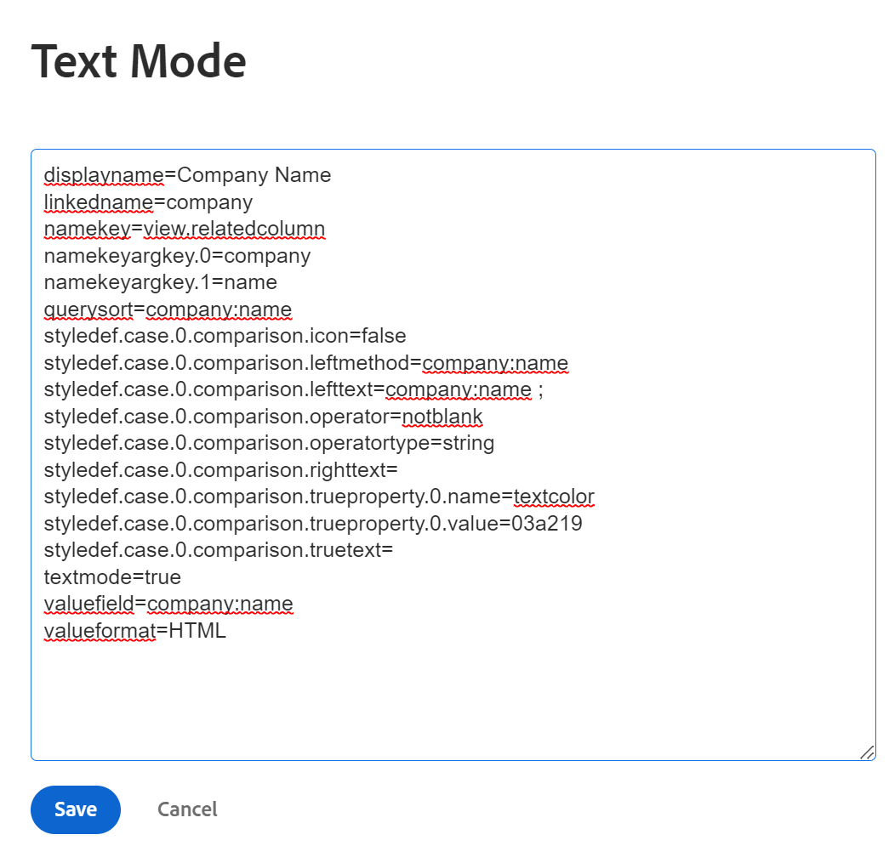
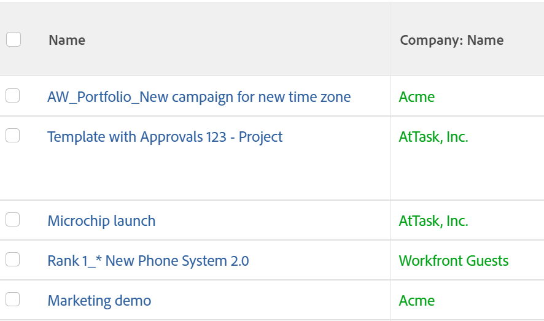
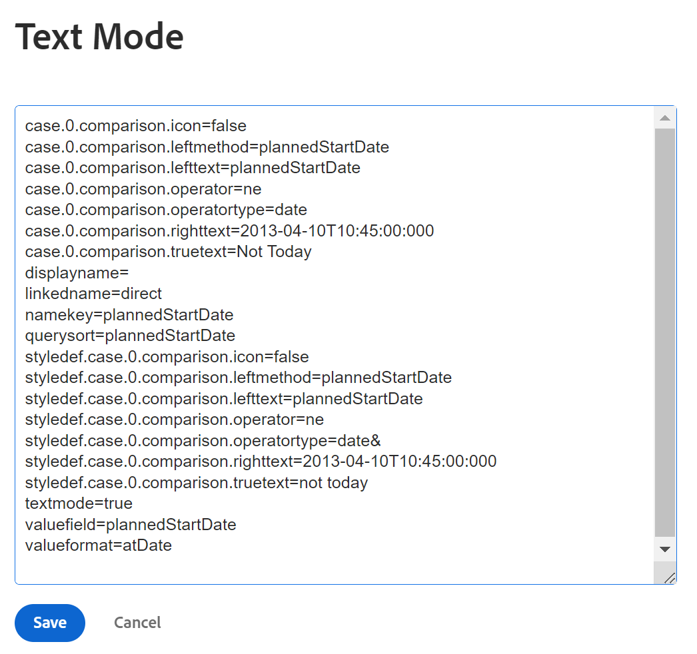
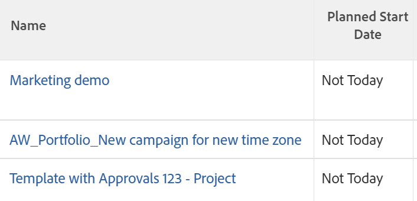
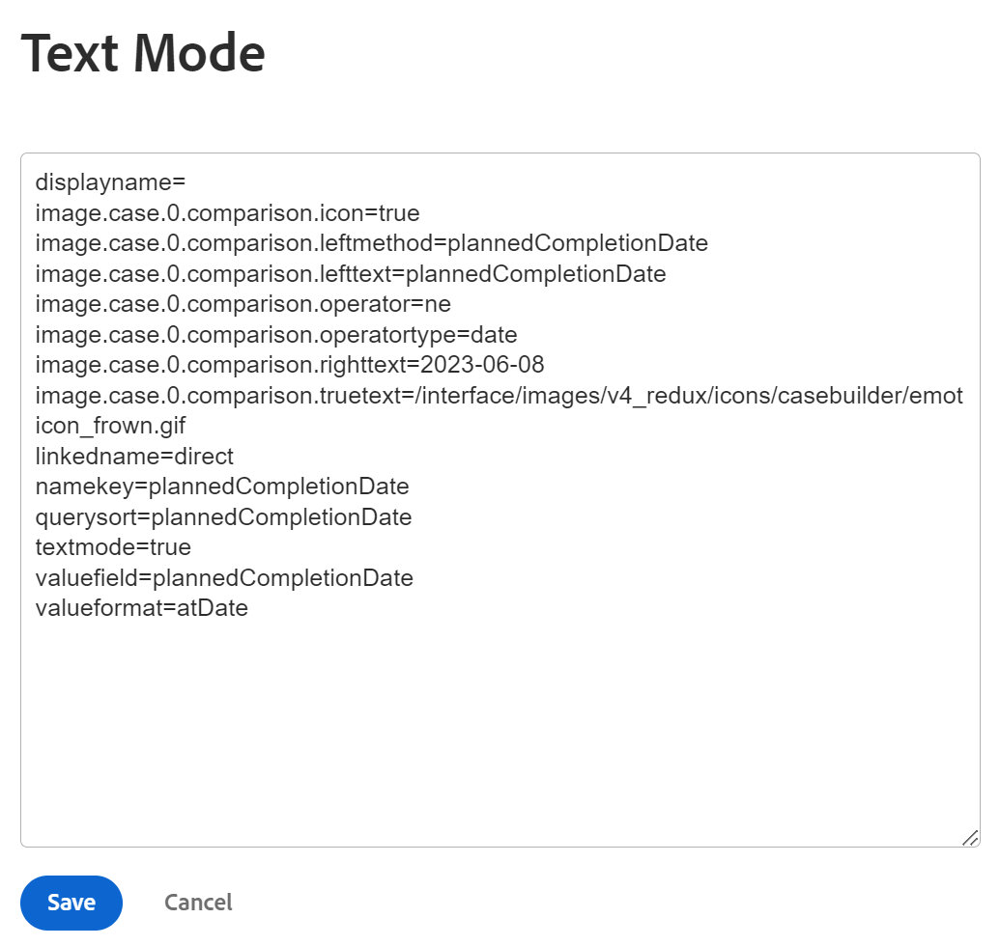
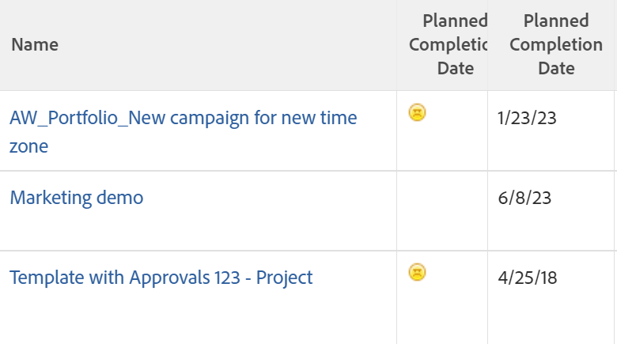

# Usar formato condicional en el modo de texto

<!--Audited: 01/2025-->

El creador de interfaces estándar proporciona una gran flexibilidad a la hora de crear elementos de informes que satisfagan las necesidades de su organización.

Puede aplicar formato condicional en una vista mediante la interfaz estándar.\
Para obtener más información sobre la aplicación de formato condicional a una vista, vea [Usar formato condicional en las vistas](../../../reports-and-dashboards/reports/reporting-elements/use-conditional-formatting-views.md).

## Requisitos de acceso

+++ Expanda para ver los requisitos de acceso para la funcionalidad en este artículo.

<table style="table-layout:auto"> 
 <col> 
 <col> 
 <tbody> 
  <tr> 
   <td role="rowheader">Paquete de Adobe Workfront</td> 
   <td> <p>Cualquiera</p> </td> 
  </tr> 
  <tr> 
   <td role="rowheader">Licencia de Adobe Workfront</td> 
   <td> 
     <p>Estándar</p>
     <p>Plan</p>
   </td> 
  </tr> 
  <tr> 
   <td role="rowheader">Configuraciones de nivel de acceso</td> 
   <td> <p>Acceso de edición a filtros, vistas y agrupaciones</p> <p>Editar el acceso a informes, paneles y calendarios para editar las vistas de un informe</p> </td> 
  </tr> 
  <tr> 
   <td role="rowheader">Permisos de objeto</td> 
   <td> <p>Permisos de administración de un informe para editar vistas en un informe</p> <p>Permisos de administración de una vista para editarla</p> </td> 
  </tr>
 </tbody> 
</table>

Para obtener más información sobre el contenido de esta tabla, consulte [Requisitos de acceso en la documentación de Workfront](/help/quicksilver/administration-and-setup/add-users/access-levels-and-object-permissions/access-level-requirements-in-documentation.md).

+++

## Formato condicional en modo texto

El modo Texto permite crear vistas, filtros, agrupaciones y peticiones de datos más complejos, ya que permite utilizar campos que no están disponibles en la interfaz estándar.

Para obtener una lista completa de todos nuestros campos sobre los que se puede realizar informes, consulte el [Explorador de API](../../../wf-api/general/api-explorer.md).

Para obtener más información acerca del uso de la sintaxis en modo texto, vea [Introducción a la sintaxis en modo texto](../../../reports-and-dashboards/reports/text-mode/text-mode-syntax-overview.md).

También puede utilizar el modo de texto para dar formato a las vistas de informes y listas. Si utiliza el formato condicional, puede cambiar las vistas de los informes cambiando el tipo de fuente y el fondo de los resultados en el informe, así como los iconos y las marcas. Le recomendamos que siempre genere sus vistas utilizando primero la interfaz estándar y cambie a la interfaz de modo de texto solo cuando sea absolutamente necesario.

>[!NOTE]
>
> No se admite el uso del estilo CSS para personalizar el formato condicional. En su lugar, debe utilizar las opciones de formato prediseñadas disponibles en Adobe Workfront.

## Añadir formato condicional a las vistas

Para obtener más información acerca de cómo aplicar formato condicional a una vista en la interfaz del generador estándar, vea [Usar formato condicional en vistas](../../../reports-and-dashboards/reports/reporting-elements/use-conditional-formatting-views.md).

Para agregar formato condicional a una vista en la interfaz de modo de texto:

1. Ir a una lista de objetos.
1. Expanda el menú desplegable de una vista a la que desee agregar formato condicional.
1. Haga clic en **Guardar vista**.
1. Haga clic en la columna de la vista a la que desee aplicar formato condicional.
1. Haga clic en **Cambiar al modo de texto**.
1. En el área **Mostrar en esta columna:**, haga clic en **Hacer clic para editar texto**.
1. Agregue los ejemplos de código proporcionados en [Dar formato a vistas usando el modo de texto](#format-views-using-text-mode) en la parte inferior del texto de la columna seleccionada.
1. Haz clic en **Guardar** y luego haz clic en **Guardar vista**.

## Dar formato a las vistas mediante el modo Texto {#format-views-using-text-mode}

Puede añadir los siguientes componentes a una columna de una vista para aplicarle formato condicional en modo de texto:

* [Configuración de columna](#column-settings)
* [Reglas de columna](#column-rules)
* [Dar formato condicional a una expresión de valor](#conditionally-format-a-valueexpression)

### Configuración de columna {#column-settings}

Debe estar familiarizado con la interfaz de modo de texto para poder agregar formato condicional a las vistas.

Puede personalizar los siguientes elementos de una columna cuando utilice el formato condicional en una vista:

* [Encabezados de columna](#column-headers)
* [Fechas de formato](#format-dates)
* [Formatear números](#format-numbers)

#### Encabezados de columna {#column-headers}

Para cambiar el encabezado de columna mostrado, agregue el siguiente código a la columna: `displayname= [Name of column]`. Por ejemplo, para asignar un nombre a una columna Propietario del proyecto, el código de texto tendría el siguiente aspecto:

`displayname=Project Owner`

#### Formatear fechas {#format-dates}

Las fechas se pueden configurar para que se muestren en varios formatos.

Para obtener más información, consulte [Dar formato a las fechas en los informes en modo de texto](../../../reports-and-dashboards/reports/text-mode/format-dates-in-text-mode-reports.md).

#### Formato de números {#format-numbers}

Puede dar formato a valores numéricos para mostrar la información que mejor se adapte a sus necesidades de generación de informes.

Para obtener más información, consulte [Dar formato a números, monedas y valores de porcentaje en los informes de modo de texto](../../../reports-and-dashboards/reports/text-mode/format-numbers-in-text-mode-reports.md).

### Reglas de columna {#column-rules}

Las reglas de columna permiten agregar imágenes, colores, formato y modificaciones de texto dentro de una vista. Las reglas de columna se pueden establecer independientemente o pueden contener varias condiciones para una columna.

* [Formato condicional](#conditional-formatting)
* [Varios formatos condicionales](#multiple-conditional-formats)
* [Aplicar texto](#apply-text)
* [Aplicar formatos de fila](#apply-row-formats)
* [Aplicación de imágenes](#apply-images)

#### Formato condicional {#conditional-formatting}

Se debe aplicar una instrucción de modo de texto específica al incorporar color o dar formato al texto.

>[!NOTE]
>
>Es posible que no se admita el formato condicional en las columnas combinadas.\
>Para obtener más información sobre la combinación de columnas con el modo de texto, consulte [Ver: combinar información de varias columnas en una columna compartida](../../../reports-and-dashboards/reports/custom-view-filter-grouping-samples/view-merge-columns.md).

Inserte el siguiente código en cualquier columna a la que desee agregar formato condicional:

```
styledef.case.0.comparison.leftmethod= [field name]
styledef.case.0.comparison.lefttext= [field name]
styledef.case.0.comparison.righttext= [field value]
styledef.case.0.comparison.operator= [qualifier]
styledef.case.0.comparison.operatortype= [data type]
styledef.case.0.comparison.icon=false
styledef.case.0.comparison.truetext= 
styledef.case.0.comparison.trueproperty.0.name= [format option]
styledef.case.0.comparison.trueproperty.0.value= [format style]
```

>[!NOTE]
>
>La línea `styledef.case.0.comparison.icon` siempre es false a menos que se trabaje con iconos.
>
>La línea `styledef.case.0.comparison.truetext` siempre se deja en blanco hasta que se sobrescribe texto.
>
>La línea `styledef.case.0.comparison.righttext` está en blanco cuando el calificador no está en blanco.

Por ejemplo, si deseamos mostrar el Nombre de la empresa en texto verde en un informe de proyecto, puede utilizar el siguiente código:

```
styledef.case.0.comparison.leftmethod=company:name
styledef.case.0.comparison.lefttext=company:name ;
styledef.case.0.comparison.righttext= 
styledef.case.0.comparison.operator=notblank
styledef.case.0.comparison.operatortype=string
styledef.case.0.comparison.icon=false
styledef.case.0.comparison.truetext=
styledef.case.0.comparison.trueproperty.0.name=textcolor
styledef.case.0.comparison.trueproperty.0.value=03a219
```

>[!NOTE]
>
>* Aunque esta instrucción se puede aplicar a una columna Nombre de empresa, también se puede aplicar a cualquier otra columna del informe. El texto verde solo se mostraría si el proyecto tuviera una empresa asociada a él. Recuerde la unidad `[field name]`, `[value]` y `[qualifier]`, tanto si el acondicionamiento aparece en última instancia en la columna como si no.
>* Al trabajar con calificadores, recomendamos usar `cicontains` en lugar de `equal`. De manera predeterminada, `equal` busca números de identificación. Con el calificador `cicontains`, puede tener acceso a los elementos por su nombre.

{width="500"}


{width="400"}

Tanto si se aplica Color de texto, Alineación, Estilo de fuente o Color de fondo a un modo de texto, se utiliza la misma instrucción (mostrada arriba).

Las siguientes líneas deben modificarse para reflejar el formato correspondiente necesario para la columna:

```
styledef.case.0.comparison.trueproperty.0.name= [format option]
styledef.case.0.comparison.trueproperty.0.value= [format style]
```

Utilice las siguientes tablas para identificar qué líneas se deben modificar y qué valores se deben especificar para definir el estilo de formato de la columna:

| **Color de texto** | **Línea: textcolor=** |
|---|---|
| Negro | `000000` |
| Azul oscuro | `0c6aca` |
| Cerceta | `1b878c` |
| Verde | `03a219` |
| Púrpura | `6408c4` |
| Gris | `767676` |
| Rojo | `d30519` |
| Amarillo | `e19503` |

{style="table-layout:auto"}

| **Alineación** | **Línea: align=** |
|---|---|
| Alineación izquierda | `left` |
| Alineación derecha | `right` |
| Alineación central | `center` |

{style="table-layout:auto"}

| Fuente | Línea: ***fontstyle=*** |
|---|---|
| Negrita | `bold` |
| Cursiva | `italic` |

{style="table-layout:auto"}

| **Color de fondo** | **Línea: bgcolor=** |
|---|---|
| Cerceta | `dcf6f7` |
| Verde | `def6e2` |
| Gris | `e8e8e8` |
| Azul | `e8f1ff` |
| Púrpura | `e9def4` |
| Rojo | `eac6c9` |
| Amarillo | `feecc8` |
| Blanco | `ffffff` |

{style="table-layout:auto"}

#### Varios formatos condicionales {#multiple-conditional-formats}

Puede aplicar más de un estilo de formato a una instrucción. La instrucción principal permanecería sin cambios y cualquier expresión de formato adicional se agregaría a la instrucción.

Por ejemplo, utilizando la instrucción anterior para incluir Nombre de la compañía en texto en negrita verde. La instrucción se escribiría con el siguiente código:

```
styledef.case.0.comparison.leftmethod=company:name
styledef.case.0.comparison.lefttext=company:name
styledef.case.0.comparison.righttext=
styledef.case.0.comparison.operator=notblank
styledef.case.0.comparison.operatortype=string
styledef.case.0.comparison.icon=false
styledef.case.0.comparison.truetext= 
styledef.case.0.comparison.trueproperty.0.name=textcolor
styledef.case.0.comparison.trueproperty.0.value=03a219
styledef.case.0.comparison.trueproperty.1.name=fontstyle
styledef.case.0.comparison.trueproperty.1.value=bold
```

>[!NOTE]
>
>Al incluir más de una expresión de formato condicional, es necesario identificar numéricamente cada expresión en la instrucción. Observe que la expresión 0 y la expresión 1 se han identificado.

#### Aplicar texto {#apply-text}

Si desea reemplazar los valores predeterminados que rellenan una columna con un valor de su elección, es posible al aplicar texto a la columna.

Por ejemplo, en un informe de proyecto, establezca el valor de la columna Fecha de inicio planeada para que no muestre la fecha de comienzo planeada para el proyecto, sino el texto &#39;Hoy no.&#39; Utilice el siguiente código para la columna Fecha de inicio planeada:

```
case.0.comparison.leftmethod=plannedStartDate
case.0.comparison.lefttext=plannedStartDate
case.0.comparison.righttext=2013-04-10T10:45:00:000
case.0.comparison.operator=ne
case.0.comparison.operatortype=date
case.0.comparison.icon=false
case.0.comparison.truetext=not today
styledef.case.0.comparison.leftmethod=plannedStartDate
styledef.case.0.comparison.lefttext=plannedStartDate
styledef.case.0.comparison.righttext=2013-04-10T10:45:00:000 
styledef.case.0.comparison.operator=ne
styledef.case.0.comparison.operatortype=date&
styledef.case.0.comparison.icon=false
styledef.case.0.comparison.truetext=not today
```

>[!NOTE]
>
>Las líneas que comienzan con `case.0.` usan comparaciones de casos para identificar el uso de texto. Las líneas que comienzan con `styledef.case.0.` son instrucciones de formato condicional inicial en las que identificamos el uso de texto mediante la expresión `truetext`. Asegúrese de establecer `truetext` en un valor, en lugar de dejarlo en blanco.

{width="500"}

{width="400"}

#### Aplicar formatos de fila {#apply-row-formats}

Si desea aplicar una condición a toda la fila, utilice el siguiente código con el código de columna:

```
styledef.case.0.comparison.icon=false
styledef.case.0.comparison.isrowcase=true
styledef.case.0.comparison.leftmethod= [field name]
styledef.case.0.comparison.lefttext= [field name]
styledef.case.0.comparison.operator= [qualifier]
styledef.case.0.comparison.operatortype= [data type]
styledef.case.0.comparison.righttext= [field value]
styledef.case.0.comparison.trueproperty.0.name= [format option]
styledef.case.0.comparison.trueproperty.0.value= [format style]
styledef.case.0.comparison.truetext=
row.0.styledef.applyallcases=true
row.0.styledef.case.0.comparison.icon=false
row.0.styledef.case.0.comparison.isrowcase=true
row.0.styledef.case.0.comparison.leftmethod= [field name]
row.0.styledef.case.0.comparison.lefttext= [field name]
row.0.styledef.case.0.comparison.operator= [qualifier]
row.0.styledef.case.0.comparison.operatortype= [data type]
row.0.styledef.case.0.comparison.righttext= [field value]
row.0.styledef.case.0.comparison.trueproperty.0.name= [format option]
row.0.styledef.case.0.comparison.trueproperty.0.value= [format style]
row.0.styledef.case.0.comparison.truetext=
```

#### Aplicar imágenes {#apply-images}

Al igual que cuando se aplica formato con texto, las imágenes se pueden utilizar para mostrar información en los informes. Workfront tiene varias imágenes integradas para transmitir información visual en un ajuste de informe. Para utilizar imágenes en la configuración de formato condicional se necesita la siguiente instrucción:

```
image.case.0.comparison.leftmethod= [field name]
image.case.0.comparison.lefttext= [field name]
image.case.0.comparison.righttext= [field value]
image.case.0.comparison.operator= [qualifier]
image.case.0.comparison.operatortype= [data type]
image.case.0.comparison.icon=true
image.case.0.comparison.truetext=
```

Por ejemplo, en un informe de proyecto, desea crear una columna en la que se muestre una cara fruncida por cada Fecha de finalización planeada que no sea igual a la fecha actual. Utilice el siguiente código de modo de texto para añadir el icono a la columna:

```
image.case.0.comparison.leftmethod=plannedCompletionDate
image.case.0.comparison.lefttext=plannedCompletionDate
image.case.0.comparison.righttext=2013-04-10T13:00:00:000 
image.case.0.comparison.operator=ne 
image.case.0.comparison.operatortype=date
image.case.0.comparison.icon=true
image.case.0.comparison.truetext=/interface/images/v4_redux/icons/casebuilder/emoticon_frown.gif
```

>[!NOTE]
>
>Observe que la instrucción utiliza la expresión `icon=true`. Esta instrucción también es diferente de otras instrucciones de formato condicional en el sentido de que no utiliza el formato `style.def`, sino un formato de imagen único.

{width="500"}

{width="400"}

Para utilizar las imágenes disponibles, aplique el código y los valores siguientes:

| **Icono** | **Línea: image.case.0.comparison.truetext=** |
|---|---|
|  | =`/interface/images/v4_redux/icons/casebuilder/emoticon_frown.gif` |
| Cara feliz  | =`/interface/images/v4_redux/icons/casebuilder/emoticon_smile.gif` |
| Indicador azul  | =`/interface/images/v4_redux/icons/casebuilder/flag_blue.gif` |
| Indicador verde  | =`/interface/images/v4_redux/icons/casebuilder/flag_green.gif` |
| Marca roja  | =`/interface/images/v4_redux/icons/casebuilder/flag_red.gif` |
| Indicador amarillo  | =`/interface/images/v4_redux/icons/casebuilder/flag_yellow.gif` |
| Círculo negro  | =`/interface/images/v4_redux/icons/casebuilder/light_black.gif` |
| Círculo azul  | =`/interface/images/v4_redux/icons/casebuilder/light_blue.gif` |
| Círculo gris  | =`/interface/images/v4_redux/icons/casebuilder/light_grey.gif` |
| Círculo verde  | =`/interface/images/v4_redux/icons/casebuilder/light_green.gif` |
| Círculo naranja  | =`/interface/images/v4_redux/icons/casebuilder/light_orange.gif` |
| Círculo rosa  | =`/interface/images/v4_redux/icons/casebuilder/light_pink.gif` |
| Círculo púrpura  | =`/interface/images/v4_redux/icons/casebuilder/light_purple.gif` |
| Círculo rojo  | =`/interface/images/v4_redux/icons/casebuilder/light_red.gif` |
| Círculo blanco  | =`/interface/images/v4_redux/icons/casebuilder/light_white.gif` |
| Círculo amarillo  | =`/interface/images/v4_redux/icons/casebuilder/light_yellow.gif` |

{style="table-layout:auto"}

### Dar formato condicional a `valueexpression` {#conditionally-format-a-valueexpression}

Para mostrar un valor calculado en una columna, puede reemplazar la línea de código `valuefield` de la columna por `valueexpression`. Un valor calculado permite mostrar un nuevo valor para un objeto basado en el cálculo entre dos campos existentes en el mismo objeto.

Para obtener más información sobre cómo dar formato a `valueexpression line`, vea [Introducción a la sintaxis del modo de texto](../../../reports-and-dashboards/reports/text-mode/text-mode-syntax-overview.md).

No se puede aplicar formato condicional a una columna que contiene una línea de código `valueexpression`. En su lugar, puede agregar un campo personalizado calculado a un formulario personalizado y asociarlo a los objetos que se muestran en el informe. A continuación, puede dar formato condicional a las columnas que muestran este campo.

Para obtener más información sobre los campos personalizados calculados, vea [Agregar campos calculados a un formulario](/help/quicksilver/administration-and-setup/customize-workfront/create-manage-custom-forms/form-designer/design-a-form/add-a-calculated-field.md).

## Agregar un valor de agregador en una columna de modo de texto

Se recomienda crear primero la columna en la interfaz del generador, agregar allí el valor del agregador y, a continuación, editar la columna en el modo de texto.

Tenga en cuenta lo siguiente al agregar agregadores a una columna en el modo de texto:

* Los valores de la columna deben tener un formato que se pueda resumir. Por ejemplo, deben tener uno de los siguientes formatos:

   * Número
   * Fecha
   * Divisa

* Puede agregar un agregador a una columna que muestre un cálculo. El valor agregado se muestra en la agrupación de la vista o el informe. Para obtener más información, vea [Agrupación: mostrar el resultado de agregar varios valores calculados en una agrupación](../../../reports-and-dashboards/reports/custom-view-filter-grouping-samples/grouping-calculation-between-two-fields-aggregated-in-grouping.md).
* Las líneas de código para la definición de la columna deben ser idénticas a las líneas de código que introducen el agregador y precedidas por &quot;agregador&quot;. Por ejemplo, si tiene una columna en la que se muestran las horas planificadas de un proyecto, el modo de texto de las líneas principales de la columna es:

```
  valuefield=workRequired
  valueformat=compound
```

Cuando desee agregar los valores de todas las líneas en la agrupación de la vista, podemos agregar el siguiente código para agregar los valores de agregador:

`aggregator.valuefield=workRequired` (la línea `aggregator.valuefield` debe ser la misma que la línea `valuefield` que describe la columna)

`aggregator.valueformat=compound` (la línea `aggregator.valueformat` debe tener el mismo valor que `valueformat` que describe la columna)

`aggregator.function=SUM` (esta es una línea obligatoria que indica cómo desea agregar la columna; en este caso, desea agregar todas las horas programadas individuales a un número en la línea de agrupación)

`aggregator.displayformat=minutesAsHoursString` (dado que las horas se almacenan en minutos en Workfront, se desea indicar `displayformat` para las horas en que se almacenan en minutos)
