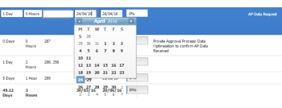

# La edición en línea de fechas desplaza la visualización del calendario fuera del cuadro

## Problema

Al editar fechas en línea en una lista de objetos, el calendario muestra más fechas de las que debería. Esto hace que los días se muestren fuera del cuadro de calendario.\

## Causa

La vista de la ventana del explorador se ha modificado para que se muestre en un nivel de zoom superior al 100 %.

## Solución

Debe cambiar el nivel de zoom en el explorador para que sea del 100 % o menos.

Cambiar el nivel de zoom en el explorador depende del explorador que esté utilizando.

Para cambiar el nivel de zoom en Google Chrome:

1. En una ventana del explorador, vaya a **Ver**.
1. Haz clic en **Reducir** para reducir el nivel de zoom en la ventana actual del explorador.\
   El área de visualización del explorador se reduce.
