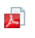

# Iconos de estado integrados en las vistas

<!-- Audited: 11/2024 -->

<!--(NOTE: ALina: ***Link this from the Understanding Fields in Lists and Reports.)-->

Puede añadir el campo Iconos de estado integrado como una columna en las vistas para mejorar la visibilidad de los puntos clave sobre los objetos. Mediante los iconos de estado, puede comprobar de un vistazo cuándo se dan las siguientes condiciones:

* Un objeto tiene documentos adjuntos
* Un objeto está asociado a un proceso de aprobación
* Un objeto tiene notas adicionales asociadas
* Un gasto es facturable o reembolsable
* Una tarea se encuentra en una ruta crítica
* Un usuario pertenece a una empresa, a un equipo o está ubicado personalmente en una zona horaria diferente

Tenga en cuenta lo siguiente:

* La mayoría de los indicadores del campo Iconos de estado son vínculos rápidos al objeto o área real del objeto que representan.

* Si falta alguno de los elementos representados por los iconos en el objeto, el icono que representa el elemento que falta aparece atenuado en la columna Iconos de estado en lugar de tener una imagen en color.

  

  Para obtener más información, consulte la sección [Información general sobre los iconos y los indicadores de estado](#overview-of-status-icons-and-flags) en este artículo.

* En algunas vistas, el campo **Iconos de estado** se llama **Indicadores** o **Iconos de vista**.\
  No se puede personalizar el aspecto de los iconos que se incluyen en el campo Iconos de estado.

* No puede editar el número de iconos en el campo Iconos de estado.

## Requisitos de acceso

+++ Expanda para ver los requisitos de acceso para la funcionalidad en este artículo. 

<table style="table-layout:auto"> 
 <col> 
 <col> 
 <tbody> 
  <tr> 
   <td role="rowheader">paquete de Adobe Workfront</td> 
   <td> 
Cualquiera
 </td> 
  </tr> 
  <tr> 
   <td role="rowheader">Licencia de Adobe Workfront</td> 
   <td> 
      
Colaborador o superior

      
Solicitud o superior

   </td>
  </tr>
  <tr> 
   <td role="rowheader">Configuraciones de nivel de acceso</td> 
   <td> 
Acceso de edición a filtros, vistas y agrupaciones
 
Editar el acceso a informes, paneles de control y calendarios para añadir columnas a un informe
</td> 
  </tr> 
  <tr> 
   <td role="rowheader">Permisos de objeto</td> 
   <td> 
Administrar permisos en una vista existente
 
Administrar permisos para añadir columnas a un informe
</td> 
  </tr> 
 </tbody> 
</table>

Para obtener más información sobre el contenido de esta tabla, consulte [Requisitos de acceso en la documentación de Workfront](/help/quicksilver/administration-and-setup/add-users/access-levels-and-object-permissions/access-level-requirements-in-documentation.md).

+++

## Añadir el campo Iconos de estado a una vista

Algunas vistas e informes integrados ya incluyen el campo Iconos de estado.

No puede añadir el campo Iconos de estado a todas las vistas.

Para añadir el campo Iconos de estado a una vista personalizada que cree desde cero:

1. Vaya a una lista de cualquiera de los siguientes objetos:

   * Tareas
   * Problemas
   * Proyectos
   * Tareas de plantilla
   * Plantillas
   * Gastos
   * Documentos
   * Usuarios\
     Solo estos objetos tienen disponible el campo **Iconos de estado**.\
     Para obtener información sobre las listas de objetos, consulte [Introducción a las listas en Adobe Workfront](../../../workfront-basics/navigate-workfront/use-lists/view-items-in-a-list.md).

1. En el menú desplegable **Vista**, seleccione **Nueva vista**.

1. Haga clic en **Añadir columna**.
1. En el cuadro **Mostrar en esta columna**, empiece a escribir cualquiera de los siguientes nombres de campo y selecciónelo cuando aparezca en la lista:

   * *Iconos de estado*
   * *Indicadores*
   * *Iconos de vista *(solo en vistas de documento).

   Los iconos integrados se enumeran con cualquiera de estos nombres.\
   Una vista de plantilla contiene los campos **Iconos de estado** e **Indicadores**. En este caso, las dos columnas contienen iconos idénticos.\
   Las vistas de documento contienen un campo **Ver iconos**.

1. Haga clic en **Guardar vista**.
1. (Opcional) Especifique un nuevo nombre para la vista y haga clic en **Guardar vista**.\
   Esto añade la columna **Iconos de estado** a la vista.
1. (Opcional) Pase el ratón sobre un icono para entender qué representa.
1. (Opcional) Haga clic en un icono para ir al área del objeto que representa.\
   No todos los iconos son vínculos a objetos.\
   Para obtener una lista completa de los atributos de cada icono, consulte la sección [Información general sobre iconos e indicadores de estado](#overview-of-status-icons-and-flags).

## Información general sobre los iconos y los indicadores de estado {#overview-of-status-icons-and-flags}

En la tabla siguiente se enumeran todos los iconos de estado disponibles en Workfront, el tipo de objetos que pueden asociarse a ellos y lo que sucede cuando se hace clic en ellos.

Debe tener como mínimo permisos de visualización de los objetos para poder hacer clic en algunos de los iconos siguientes y acceder a dichos objetos.

<table style="table-layout:auto"> 
 <col> 
 <col> 
 <col> 
 <col> 
 <col> 
 <thead> 
  <tr> 
   <th><strong>Icono o indicador de estado</strong> </th> 
   <th><strong>Descripción</strong> </th> 
   <th><strong>Objeto</strong> </th> 
   <th>Al hacer clic</th> 
   <th> </th> 
  </tr> 
 </thead> 
 <tbody> 
  <tr> 
   <td> o   o   o </td> 
   <td>Indica que la condición del proyecto es En el destino (verde), Con problemas (rojo) o En riesgo (amarillo). Para obtener información acerca de la condición del proyecto, consulte <a href="../../../manage-work/projects/manage-projects/project-condition-and-condition-type.md" class="MCXref xref">Información general sobre la condición del proyecto y el tipo de condición</a>.</td> 
   <td>Proyectos</td> 
   <td>Haga clic en para abrir la lista de tareas del proyecto. </td> 
   <td> </td> 
  </tr> 
  <tr> 
   <td>  </td> 
   <td>Indica que el objeto tiene notas (actualizaciones) en la pestaña Actualizaciones.</td> 
   <td> 
Proyectos Tareas Problemas Plantillas Tareas de plantillas
 </td> 
   <td> 
Haga clic para abrir la pestaña Actualizaciones del objeto. 
 </td> 
   <td> </td> 
  </tr> 
  <tr> 
   <td> o </td> 
   <td>Indica que el objeto tiene documentos adjuntos. </td> 
   <td> Proyectos Tareas Problemas Plantillas Tareas de plantillas </td> 
   <td>Haga clic para abrir la pestaña Documentos del objeto. </td> 
   <td> </td> 
  </tr> 
  <tr> 
   <td> o </td> 
   <td>Indica que hay problemas pendientes en el proyecto o la tarea.</td> 
   <td> Proyectos  y tareas </td> 
   <td>Haga clic para abrir el objeto. </td> 
   <td> </td> 
  </tr> 
  <tr> 
   <td>  o </td> 
   <td>Indica que hay una aprobación en el objeto.</td> 
   <td> Proyectos Tareas Problemas Plantillas Tareas de plantillas </td> 
   <td>Haga clic para abrir el objeto. </td> 
   <td> </td> 
  </tr> 
  <tr> 
   <td>  </td> 
   <td> 
Puede añadir una columna Icono de gastos en la vista para mostrar este icono. Esto indica que el proyecto o la tarea tienen gastos asociados.
 </td> 
   <td> 
Proyectos
 
Tareas
 </td> 
   <td>Haga clic para abrir la pestaña Gastos del proyecto o de la tarea. </td> 
   <td> </td> 
  </tr> 
  <tr> 
   <td>           </td> 
   <td> 
Indica que el estado de progreso de una tarea es uno de los siguientes:
 
    <ul> 
     <li>Hora de activación (cuadrado verde)</li> 
     <li>Retrasado (círculo rojo)</li> 
     <li>En riesgo (diamante azul)</li> 
     <li>Detrás (triángulo amarillo)</li> 
    </ul> 
Para obtener información sobre el estado de progreso de las tareas, consulte <a href="../../../manage-work/tasks/task-information/task-progress-status.md" class="MCXref xref">Información general sobre el estado de progreso de una tarea</a>.
 </td> 
   <td>Tareas</td> 
   <td>Haga clic para abrir la tarea. </td> 
   <td> </td> 
  </tr> 
  <tr> 
   <td>  o </td> 
   <td>Indica que la tarea se encuentra actualmente en la ruta crítica.  Para obtener información acerca de las tareas en una ruta crítica del proyecto, consulte <a href="../../../manage-work/tasks/manage-tasks/critical-path.md" class="MCXref xref">Información general sobre la ruta crítica del proyecto</a>.</td> 
   <td>Tareas</td> 
   <td>Haga clic para abrir la tarea.</td> 
   <td> </td> 
  </tr> 
  <tr> 
   <td>  </td> 
   <td>Indica que la tarea está asociada a un hito. El administrador del sistema puede personalizar el color del diamante en su entorno. Para obtener información acerca de los hitos, consulte <a href="../../../administration-and-setup/customize-workfront/configure-approval-milestone-processes/create-milestone-path.md" class="MCXref xref">Crear una ruta de hitos</a>.</td> 
   <td>Tareas</td> 
   <td>Haga clic para abrir la tarea. </td> 
   <td> </td> 
  </tr> 
  <tr> 
   <td>  </td> 
   <td>Vínculo al objeto de origen de un problema. El objeto de origen de un problema es el objeto en el que se registró el problema. Una tarea o un proyecto pueden ser objetos de origen para los problemas. </td> 
   <td>Problemas</td> 
   <td>Haga clic para abrir el objeto de origen (tarea o proyecto) de un problema. </td> 
   <td> </td> 
  </tr> 
  <tr> 
   <td>  </td> 
   <td>Indica que hay un objeto de resolución que, en última instancia, resuelve el problema. En este caso, no puede completar el problema. Se completa cuando finaliza el objeto de resolución.  Para obtener información acerca de la resolución de objetos, consulte <a href="../../../manage-work/issues/convert-issues/resolving-and-resolvable-objects.md" class="MCXref xref">Información general sobre la resolución y los objetos solucionables </a>.</td> 
   <td>Problemas</td> 
   <td>Haga clic para abrir el objeto de resolución del problema. </td> 
   <td> </td> 
  </tr> 
  <tr> 
   <td>  </td> 
   <td>Ver un documento.</td> 
   <td>Documentos</td> 
   <td>Haga clic para descargar el documento.</td> 
   <td> </td> 
  </tr> 
  <tr> 
   <td>  </td> 
   <td>Descargue un documento.</td> 
   <td>Documentos</td> 
   <td>Haga clic para descargar el documento.</td> 
   <td> </td> 
  </tr> 
  <tr> 
   <td>  </td> 
   <td>Indica el tipo de documento.</td> 
   <td>Documentos</td> 
   <td>Haga clic para descargar el documento.</td> 
   <td> </td> 
  </tr> 
  <tr> 
   <td>  </td> 
   <td>Indica que el usuario está asociado con una compañía. </td> 
   <td>Usuarios</td> 
   <td>No disponible</td> 
   <td> </td> 
  </tr> 
  <tr> 
   <td>  </td> 
   <td>Indica que el usuario está asociado a un equipo.</td> 
   <td>Usuarios</td> 
   <td>Haga clic para abrir el perfil de usuario.</td> 
   <td> </td> 
  </tr> 
  <tr> 
   <td>  </td> 
   <td>Acceso directo a la pestaña Asignación del usuario. </td> 
   <td>Usuarios</td> 
   <td>Haga clic para abrir la pestaña Asignación del usuario y verá a qué elementos de trabajo está asignado el usuario.</td> 
   <td> </td> 
  </tr> 
  <tr> 
   <td>  </td> 
   <td>Indica que el usuario se encuentra en una zona horaria diferente a la del sistema.</td> 
   <td>Usuarios</td> 
   <td>No disponible</td> 
   <td> </td> 
  </tr> 
  <tr> 
   <td>  </td> 
   <td>Indica que un gasto es facturable. Para obtener información sobre los gastos, consulte <a href="../../../manage-work/projects/project-finances/manage-project-expenses.md" class="MCXref xref">Administrar gastos de proyecto </a>.</td> 
   <td>Gastos</td> 
   <td>No disponible</td> 
   <td> </td> 
  </tr> 
  <tr> 
   <td>  </td> 
   <td> Indica que un gasto es reembolsable. Para obtener información sobre los gastos, consulte <a href="../../../manage-work/projects/project-finances/manage-project-expenses.md" class="MCXref xref">Administrar gastos del proyecto</a>.</td> 
   <td>Gastos</td> 
   <td>No disponible</td> 
   <td> </td> 
  </tr> 
  <tr> 
   <td> </td> 
   <td> Indica que se ha reembolsado un gasto. Para obtener información sobre los gastos, consulte <a href="../../../manage-work/projects/project-finances/manage-project-expenses.md" class="MCXref xref">Administrar gastos de un proyecto </a>.</td> 
   <td>Gastos</td> 
   <td>No disponible</td> 
   <td> </td> 
  </tr> 
 </tbody> 
</table>
