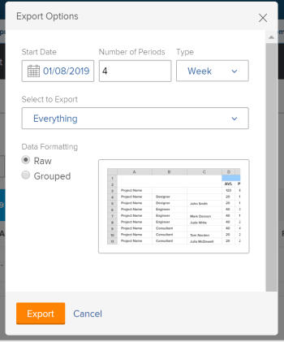
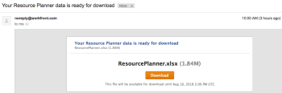

# Exportar información del Planificador de recursos

Puede exportar información desde cualquier vista del Planificador de recursos a un archivo de Excel (.xlsx) que se guarda en el equipo.

>[!IMPORTANT]
>
>Existen limitaciones en la información que se muestra y en la que se puede exportar desde el Planificador de recursos. Para obtener información sobre estas limitaciones, consulte [Limitaciones de visualización del Planificador de recursos](../../resource-mgmt/resource-planning/resource-planner-display-limitations.md)

## Requisitos de acceso

+++ Expanda para ver los requisitos de acceso para la funcionalidad en este artículo.

<table style="table-layout:auto"> 
 <col> 
 <col> 
 <tbody> 
  <tr> 
  <tr> 
   <td>Paquete de Adobe Workfront</td> 
   <td>
Cualquiera
</td>
  </tr> 
  <tr> 
   <td>Licencia de Adobe Workfront</td> 
   <td>
Ligero o superior

       
Revisión o superior
</td> 
  </tr> 
  <tr> 
   <td>Configuraciones de nivel de acceso</td> 
   <td> 
Ver el acceso o superior a Proyectos, Usuarios y Administración de recursos
</td> 
  </tr> 
  <tr> 
   <td>Permisos de objeto</td> 
   <td> 
Ver o permisos superiores para proyectos
</td> 
  </tr> 
 </tbody> 
</table>

Para obtener más información, consulte [Requisitos de acceso en la documentación de Workfront](/help/quicksilver/administration-and-setup/add-users/access-levels-and-object-permissions/access-level-requirements-in-documentation.md).

+++

## Exportar información del Planificador de recursos

{{step1-to-resourcing}}

Se muestra el **Planificador** de forma predeterminada.

1. Seleccione la vista del Planificador. Puede seleccionar una de las siguientes opciones:

   * Ver por usuario
   * Ver por proyecto
   * Ver por rol

1. Haga clic en **Exportar**.

   Aparece el cuadro de diálogo Opciones de exportación.

   

1. Especifique la siguiente información:\
   **Fecha de inicio**: la fecha de inicio de la exportación. El archivo exportado contiene información de asignación y disponibilidad a partir del primer día de la semana que contiene el día que especifique aquí.\
   **Número de períodos**: el número de períodos que desea incluir en el archivo. El predeterminado son cuatro períodos.\
   **Tipo**: tipo de períodos de tiempo durante los cuales desea mostrar la información en el archivo exportado (semanas, meses o trimestres).\
   Los siguientes son los períodos de tiempo máximos que puede exportar:

   * 52 semanas
   * 36 meses
   * 12 trimestres

   **Seleccionar para exportar**: en función de la vista que haya seleccionado, puede seleccionar exportar la información de disponibilidad y presupuesto de todos los objetos enumerados en la pantalla o de los específicos.
Puede seleccionar exportar la siguiente información:

   * En la vista del proyecto, seleccione exportar:

      * Proyectos
      * Proyectos y roles
      * Todo (esta es la opción predeterminada)

   * En la vista de usuario, seleccione exportar:

      * Usuarios
      * Usuarios y proyectos
      * Todo (esta es la opción predeterminada)

   * En la vista de función, seleccione exportar:

      * Funciones
      * Roles y proyectos
      * Todo (esta es la opción predeterminada)

   **Formato de datos**: en función de cómo desee que se muestre el archivo de Excel, seleccione las siguientes opciones:

   * **Básicos**: seleccione esta opción para mostrar la información de disponibilidad y asignación desagrupada por los objetos a los que pertenece en el archivo de Excel. (esta es la opción predeterminada)
   * **Agrupado**: seleccione esta opción para mostrar la información de disponibilidad y asignación agrupada por los objetos a los que pertenece. Muestra la información exportada tal como aparece en la pantalla.

   En el cuadro de diálogo Opciones de exportación se muestra un ejemplo del aspecto que tendrá la información en el archivo exportado.

1. Haga clic en **Exportar** para exportar la información desde el Planificador de recursos.\
   Solo se exporta la información que ha guardado.

1. (Condicional) Si tiene horas presupuestadas sin guardar en las vistas Rol o Proyecto, haga clic en **Guardar y continuar.**
Se descargará un archivo de Excel (.xlsx) en el equipo.\
   La exportación desde el Planificador de recursos no está disponible mientras el archivo esté preparado para la descarga.\
   (Condicional) Si exporta una gran cantidad de datos, recibe un correo electrónico con un vínculo donde puede descargar el archivo.\
   

1. (Condicional) Cuando reciba el correo electrónico con el archivo exportado, haga clic en **Descargar** para descargarlo.\
   Esto le lleva de nuevo a Workfront, donde puede descargar el archivo.\
   Debe iniciar sesión en Workfront para que se complete la descarga.\
   Si no descarga el archivo cuando se envía, el vínculo de descarga permanece activo durante siete días después de iniciar la exportación.
