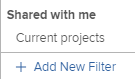

# Filtrar información en el planificador de recursos

<!--

(AL:*Iterate on this article: filtering by custom data. Other enhancements? Special characters caveat might change - follow the story to know when. It originally came in Beta 3 17.3.)

-->

Con los filtros, puede modificar la información que se muestra en el Planificador de recursos a partir de toda la información almacenada en el sistema.

## Requisitos de acceso

Debe tener lo siguiente:

<table style="table-layout:auto"> 
 <col> 
 <col> 
 <tbody> 
  <tr> 
   <td role="rowheader">plan de Adobe Workfront*</td> 
   <td> 
Pro y superior
 </td> 
  </tr> 
  <tr> 
   <td role="rowheader">Licencia de Adobe Workfront*</td> 
   <td> 
Revisar o superior<!--
      <MadCap:conditionalText data-mc-conditions="QuicksilverOrClassic.Draft mode">
        (this seems to be the case in NWE only, not classic. Waiting on Vazgen's response for this)
      </MadCap:conditionalText>
     -->
 </td> 
  </tr> 
  <tr> 
   <td role="rowheader">Configuraciones de nivel de acceso*</td> 
   <td> 
Ver o tener acceso más alto a Proyectos, Usuarios y Administración de recursos 
 
<b>NOTA</b>

Si todavía no tiene acceso, pregunte a su administrador de Workfront si establece restricciones adicionales en su nivel de acceso. Para obtener información sobre cómo un administrador de Workfront puede cambiar su nivel de acceso, consulte <a href="../../administration-and-setup/add-users/configure-and-grant-access/create-modify-access-levels.md" class="MCXref xref">Crear o modificar niveles de acceso personalizados</a>.
 </td>
</tr> 
  <tr> 
   <td role="rowheader">Permisos de objeto</td> 
   <td> 
Ver permisos o superiores para proyectos
 
Para obtener información sobre la solicitud de acceso adicional, consulte <a href="../../workfront-basics/grant-and-request-access-to-objects/request-access.md" class="MCXref xref">Solicitar acceso a objetos </a>.
 </td> 
  </tr> 
 </tbody> 
</table>

*Para saber qué plan, tipo de licencia o acceso tiene, póngase en contacto con el administrador de Workfront.

## Descripción general de los filtros del planificador de recursos

Para minimizar la cantidad de información mostrada en el Planificador de recursos, Adobe Workfront proporciona un Filtro predeterminado con criterios preconfigurados. Para obtener información sobre el filtro predeterminado, consulte la sección [Descripción general del filtro predeterminado en el planificador de recursos](#overview-of-the-default-filter-in-the-resource-planner) en este artículo.

También puede crear filtros personalizados. Para obtener información sobre la personalización de filtros en el planificador de recursos, consulte la sección [Crear filtros del planificador de recursos](#create-resource-planner-filters) en este artículo.

Tenga en cuenta lo siguiente cuando utilice filtros en el Planificador de recursos:

* Los filtros que cree solo serán visibles para usted. Puede compartir filtros para que estén disponibles para otros usuarios.
* Como administrador de Workfront, solo puede ver los filtros que cree o que se hayan compartido con usted.
* Los resultados filtrados no cambian cuando selecciona una vista diferente para el planificador de recursos.\
   Para obtener más información sobre cómo cambiar la vista en el Planificador de recursos, consulte la sección de selección &quot;Proyecto/Función/Vista de usuario&quot; en [Información general sobre navegación del planificador de recursos](../../resource-mgmt/resource-planning/resource-planner-navigation.md).

* La aplicación de un filtro no cambia los datos de asignación y disponibilidad en el Planificador de recursos para proyectos, funciones o usuarios. Un filtro cambia solamente el número de objetos que se ven en el Planificador de recursos.
* El filtrado se aplica a todos los objetos que aparecen en el Planificador de recursos al mismo tiempo. Por ejemplo, si filtra para un usuario específico, el Planificador de recursos muestra solo los siguientes resultados:

   * Proyectos en los que el usuario forma parte del grupo de recursos (para las vistas Proyecto y Función) o tiene una asignación en el proyecto (para la vista Usuario)
   * Funciones asociadas al usuario en esos proyectos\
      No se muestran otras funciones o usuarios de los proyectos con los que está asociado el usuario.

## Descripción general del filtro predeterminado en el planificador de recursos {#overview-of-the-default-filter-in-the-resource-planner}

Cuando abre el Planificador de recursos por primera vez, Workfront aplica el filtro Predeterminado. Puede editar el filtro Predeterminado para filtrar solo los elementos que desea mostrar. Para obtener información sobre la modificación de filtros, consulte la sección [Editar un filtro en el planificador de recursos](#edit-a-filter-in-the-resource-planner) en este artículo.

Tenga en cuenta lo siguiente al usar el filtro Predeterminado:

* El filtro predeterminado recupera información únicamente de proyectos con lo siguiente:

   * Fecha de finalización planeada que se produce después de la primera fecha del mes actual
   * Fecha de inicio planeada que se produce antes del último día del cuarto mes a partir de la fecha actual
   * Estado actual o de planificación

   >[!IMPORTANT]
   >
   >El filtro Predeterminado recupera información de los proyectos que se producen siempre en un plazo de cuatro meses a partir del primer día del mes actual, independientemente del intervalo de tiempo que seleccione para la visualización en el Planificador de recursos.

* En la Vista de usuario, se muestra información de horas a todos los usuarios del sistema, pero solo a los usuarios asociados con los proyectos filtrados.
* Puede editar la información en el filtro Predeterminado sin guardar el filtro.
* Puede duplicar y editar una copia del filtro Predeterminado, cambiar los criterios deseados y, a continuación, guardarlo como un nuevo filtro.
* No se puede eliminar ni compartir el filtro Predeterminado.

   

## Crear filtros del planificador de recursos {#create-resource-planner-filters}

<!--

(Alina: **^ This section is somewhat duplicated (format more than content) from the "Filtering Utilization Information" section in "Viewing Utilization Information for Projects, Programs, and Portfolios.")

-->

La creación de un filtro en el Planificador de recursos es idéntica para todas las vistas.

Asegúrese de que los requisitos previos para ver la información correcta en el Planificador de recursos estén implementados antes de crear un filtro.\
Para obtener información sobre cómo cumplir los requisitos previos necesarios para trabajar con el planificador de recursos, consulte la sección &quot;Requisitos previos para trabajar en el planificador de recursos&quot; en la sección [Información general del planificador de recursos](../../resource-mgmt/resource-planning/get-started-resource-planner.md) artículo.

Tenga en cuenta lo siguiente al crear un filtro:

* No hay límite en el número de objetos que puede filtrar al mismo tiempo.
* Los campos disponibles que puede agregar a un filtro cambian según el objeto de la vista que aplique al Planificador de recursos. Por ejemplo, puede filtrar los campos Problema o Tarea únicamente en la Vista de usuario porque estos objetos solo se muestran en la Vista de usuario. Si genera un filtro para Problemas o Tareas en la vista Usuario y, a continuación, lo aplica a las vistas Proyecto o Rol, se ignora porque los campos no existen en las vistas Proyecto o Rol. En este caso, el filtro parece no estar disponible.

Para crear un filtro en el Planificador de recursos:

1. Haga clic en el **Menú principal** icono  en la esquina superior derecha de Adobe Workfront.

1. Haga clic en **Recurso**.

   La variable **Planificador** se muestra de forma predeterminada.

   De forma predeterminada, la primera vez que acceda al Planificador de recursos, se llama a la función <strong>Filtro predeterminado</strong> se aplica. Para obtener más información sobre el filtro Predeterminado, consulte la <a href="#overview-of-the-default-filter-in-the-resource-planner" class="MCXref xref">Descripción general del filtro predeterminado en el planificador de recursos</a> en este artículo.

1. En la esquina superior izquierda del , haga clic en el botón **Filtro** icono.\
   \
   O\
   Expanda el **Filtro** menú desplegable y haga clic en **Agregar nuevo filtro**.\
   

1. Para crear un filtro utilizando los criterios integrados, especifique cualquiera de los siguientes campos:

   * **Portfolio**: Comience a escribir el nombre del portafolio que contiene la información que desea incluir en el Planificador de recursos y, a continuación, haga clic en el nombre cuando aparezca en la lista.\
      Repita este proceso para incluir información de varios portafolios.

   * **Estado del proyecto**: Expanda el menú desplegable Estado del proyecto y seleccione uno o varios estados de proyecto disponibles en la lista.
   * **Equipo**: Empiece a escribir el nombre de uno o varios equipos asociados a los usuarios asignados a tareas en los proyectos que desee ver.
   * **Función del trabajo**: Empiece a escribir el nombre de una o varias funciones de trabajo asociadas con los usuarios asignados a tareas en los proyectos que desee ver.
   * **Piscinas**: Empiece a escribir el nombre de uno o varios grupos de recursos asociados a los proyectos (para la vista de proyecto), los usuarios (para la vista de usuario) o asociados a los proyectos y a los usuarios (para la vista de función) que desee ver.
   * **Grupo**: Empiece a escribir el nombre de uno o varios grupos asociados a los usuarios (en la vista Usuario) o proyectos (en las vistas Proyecto y Función) que desee ver.

1. Haga clic en **Agregar regla de filtro** y, a continuación, empiece a escribir el nombre del campo por el que desea filtrar en la **Tipo para filtrar elementos** en la ventana Si el campo está disponible, se rellena para cada objeto al que se puede asociar.

   >[!IMPORTANT]
   >
   >Al hacer referencia a campos personalizados, debe escribir el nombre del campo y no la etiqueta del campo. La etiqueta de campo aparece en un formulario personalizado adjunto a un objeto. Para obtener información sobre la diferencia entre la etiqueta y el nombre de un campo personalizado, consulte  [Crear o editar un formulario personalizado](../../administration-and-setup/customize-workfront/create-manage-custom-forms/create-or-edit-a-custom-form.md) .

1. Haga clic en el nombre del campo para agregarlo al filtro cuando aparezca en la lista.\
   Para obtener más información sobre los campos que se ven en la lista, consulte [Glosario de terminología de Adobe Workfront](../../workfront-basics/navigate-workfront/workfront-navigation/workfront-terminology-glossary.md).

1. (Opcional) Seleccione el filtro y los modificadores de condición para el filtro. Los modificadores disponibles se describen en [Modificadores de filtro y condición](../../reports-and-dashboards/reports/reporting-elements/filter-condition-modifiers.md).

   Se pueden usar caracteres comodín basados en datos o basados en usuarios para filtrar información asociada con el usuario que ha iniciado sesión.\
   Para obtener información sobre los caracteres comodín admitidos en los filtros, consulte [Variables de filtro comodín](../../reports-and-dashboards/reports/reporting-elements/understand-wildcard-filter-variables.md).

1. Haga clic en **Guardar** para guardar la regla de filtro.
1. (Opcional) Haga clic en **Agregar regla de filtro** para agregar una regla nueva para otro objeto o campo.
1. Haga clic en **Aplicar** para aplicar el filtro sin guardarlo.

   O

   Haga clic en **Guardar filtro** para guardar el filtro.\
   

1. (Condicional) Después de hacer clic en **Guardar**, especifique un nombre para el filtro en la **Nombre del filtro** dentro del **Guardar filtro** para abrir el Navegador. Este campo es obligatorio.\
   

   >[!NOTE]
   >
   >Si el nombre del filtro incluye caracteres especiales, utilice solamente los siguientes caracteres:
   >
   >* Coma
   >* Barra oblicua
   >* Guion
   >* Guión bajo

1. Haga clic en **Guardar**.

   Los resultados del Planificador de recursos ahora se filtran por la información que ha incluido en las reglas de filtro.

## Aplicar un filtro existente

Cuando usted u otra persona con acceso al Planificador de recursos guarda un filtro, está disponible para todos los que utilizan el Planificador de recursos.

Para aplicar un filtro existente:

1. Vaya al Planificador de recursos.
1. En la esquina superior izquierda, expanda la **Filtro** menú desplegable.

   Puede ver los filtros que ha creado u otros creados y compartidos con usted en este menú.\
   

1. Seleccione un filtro en el menú desplegable. Puede ver los filtros que usted u otros usuarios han creado en este menú.\
   Al seleccionar un filtro, se reduce automáticamente la cantidad de información que aparece en el Planificador de recursos.

## Editar un filtro en el planificador de recursos {#edit-a-filter-in-the-resource-planner}

Puede editar un filtro en el Planificador de recursos realizando una de las siguientes acciones:

* [Cambiar el nombre de un filtro](#rename-a-filter)
* [Editar la información en un filtro](#edit-the-information-in-a-filter)
* [Duplicar un filtro](#duplicate-a-filter)

Cuando edita un filtro, este se actualiza para todos los usuarios del sistema que tengan acceso al Planificador de recursos.

### Cambiar el nombre de un filtro {#rename-a-filter}

Puede cambiar el nombre de un filtro sin cambiar sus criterios. Se recomienda informar a otros usuarios del sistema de este cambio, ya que los filtros son visibles para otros usuarios. Este cambio afecta a las listas de filtros de todos los que pueden ver el Planificador de recursos.

1. Vaya al planificador de recursos y expanda la **Filtro** menú desplegable para seleccionar un filtro guardado.
1. Expanda el **Filtro** menú desplegable. Busque el filtro cuyo nombre desea cambiar y pase el ratón por encima de él.
1. Seleccione el **Cambiar nombre de filtro** junto al nombre del filtro.

   

1. Especifique un nombre nuevo para el filtro en la variable **Nombre del filtro** en la ventana
1. Haga clic en **Guardar**.\
   La información incluida en el filtro es la misma y el nombre se actualiza.

### Editar la información en un filtro {#edit-the-information-in-a-filter}

Puede cambiar la información que incluye en un filtro sin cambiar su nombre. Se recomienda informar a otros usuarios del sistema de este cambio, ya que los filtros son visibles para ellos. Este cambio afecta a las listas de filtros de todos los que pueden ver el Planificador de recursos.

1. Vaya al planificador de recursos y expanda la **Filtro** menú desplegable en la esquina superior izquierda.
1. Seleccione un filtro existente que desee editar.
1. Haga clic en el **Filtro** icono.\
   

1. Agregue nuevos campos al filtro.\
   Para obtener información sobre la creación de filtros, consulte [Crear filtros del planificador de recursos](#create-resource-planner-filters).

1. Pase el ratón sobre los campos existentes seleccionados para el filtro y haga clic en el botón **Editar** para seleccionar otro campo o la variable **Eliminar** para eliminar el campo.\
   

1. (Opcional) Haga clic en **Agregar regla de filtro** para agregar nuevos campos al filtro.\
   Para obtener más información sobre la definición de criterios de filtro, consulte [Crear filtros del planificador de recursos](#create-resource-planner-filters).

1. Haga clic en **Aplicar** para aplicar el filtro sin guardarlo.

   O

   Haga clic en **Guardar** para guardar el filtro.\
   El filtro se guarda con el mismo nombre pero con nuevos criterios de filtrado.

### Duplicar un filtro {#duplicate-a-filter}

Puede duplicar un filtro existente. Los criterios de filtrado originales siguen siendo los mismos en el filtro duplicado y puede guardar el nuevo filtro con un nombre nuevo.

1. Vaya al planificador de recursos y expanda la **Filtro** menú desplegable en la esquina superior izquierda.
1. Pase el ratón sobre el nombre de un filtro guardado que desee duplicar.
1. Haga clic en el **Duplicar** icono.

   \
   Se muestra el cuadro Filtro duplicado.

1. En el **Nombre del filtro** , especifique un nuevo nombre para el filtro duplicado.\
   El nombre predeterminado del nuevo filtro es *`<Original Filter Name>`(copia)*.

1. Haga clic en **Guardar**. Se crea un nuevo filtro con los mismos criterios que el filtro original y con un nuevo nombre.

   >[!NOTE]
   >
   >Aunque puede tener 2 filtros con el mismo nombre y con criterios idénticos, le recomendamos que guarde los filtros con criterios de filtrado y nombres únicos en el Planificador de recursos para evitar confusiones.

## Eliminar un filtro

Puede eliminar un filtro cuando ya no lo necesite. No puede eliminar el filtro predeterminado.

Para obtener información sobre el filtro predeterminado, consulte la [Descripción general del filtro predeterminado en el planificador de recursos](#overview-of-the-default-filter-in-the-resource-planner) en este artículo.

Al eliminar un filtro, este se elimina para todos los usuarios de Workfront que tengan acceso al Planificador de recursos. Antes de eliminarlo, asegúrese de que el filtro que desea eliminar ya no lo usen otras personas que trabajen en el planificador de recursos. No se puede recuperar un filtro eliminado.

Para quitar un filtro:

1. Vaya al Planificador de recursos.
1. Expanda el **Filtro** menú desplegable.
1. Busque el filtro que desea eliminar y pase el ratón sobre su nombre.
1. Seleccione el **Eliminar filtro** junto al nombre del filtro.

   

1. Haga clic en **Eliminar** en el **Eliminar filtro** para abrir el Navegador.

1. El filtro se elimina del Planificador de recursos.

## Compartir un filtro

Puede compartir un filtro que haya creado o al que tenga acceso para compartirlo con otros usuarios. No puede compartir el filtro predeterminado, pero puede duplicarlo y compartir la copia.

>[!NOTE]
>
>Todos los usuarios, incluidos los administradores de Workfront, solo pueden acceder a los filtros que han creado o que se han compartido con ellos. Puede compartir un filtro con usuarios específicos para que un filtro esté disponible para todos los usuarios del Planificador de recursos.

Para obtener información sobre el filtro predeterminado, consulte la [Descripción general del filtro predeterminado en el planificador de recursos](#overview-of-the-default-filter-in-the-resource-planner) en este artículo.

Para obtener información sobre la duplicación de filtros, consulte la [Duplicar un filtro](#duplicate-a-filter) en este artículo.

1. Vaya al Planificador de recursos.
1. Expanda el **Filtro** menú desplegable.
1. Busque el filtro que desea compartir y pase el ratón sobre su nombre.
1. Seleccione el **Filtro Compartir** junto al nombre del filtro.

   

   Aparece el cuadro de diálogo Acceso a filtro .

1. (Opcional) Para que el filtro esté disponible para todos los usuarios del Planificador de recursos, haga clic en el **Configuración** y, a continuación, seleccione **Hacer que esto sea visible en todo el sistema**.

   

1. En el **Proporcione acceso al filtro del planificador de recursos a:** , empiece a escribir los nombres de los usuarios, equipos, funciones, grupos o empresas con los que desee compartir el filtro.
1. Seleccione entre los siguientes niveles de permisos:

   * Vista
   * Administrar

      Para obtener información sobre los permisos en Workfront, consulte [Información general sobre cómo compartir permisos en objetos](../../workfront-basics/grant-and-request-access-to-objects/sharing-permissions-on-objects-overview.md)

1. (Opcional) Haga clic en **Configuración avanzada** s para agregar permisos para cada nivel seleccionándolos o eliminándolos para cada nivel anulando la selección.

   

1. Haga clic en **Guardar**.

   El filtro se comparte con las entidades seleccionadas y aparece en el **Compartido conmigo** .

   
