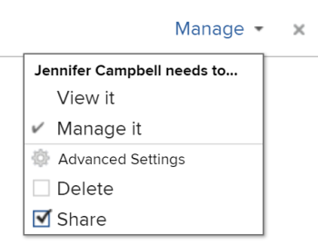

# Filtrar información en el Planificador de recursos

<!--

(AL:*Iterate on this article: filtering by custom data. Other enhancements? Special characters caveat might change - follow the story to know when. It originally came in Beta 3 17.3.)

-->

Mediante los filtros, puede modificar la información que se muestra en el Planificador de recursos a partir de toda la información almacenada en el sistema.

## Requisitos de acceso

+++ Expanda para ver los requisitos de acceso para la funcionalidad en este artículo.

Debe tener el siguiente acceso para realizar los pasos de este artículo:

<table style="table-layout:auto"> 
 <col> 
 <col> 
 <tbody> 
  <tr> 
   <td role="rowheader">plan de Adobe Workfront</td> 
   <td>
Nuevo: Cualquiera

       
o

       
Actual: Pro o superior
 </td> 
  </tr> 
  <tr> 
   <td role="rowheader">Licencia de Adobe Workfront</td> 
   <td>
Nuevo: claro o superior

       
o

       
Actual: revisar o superior
</td>
  </tr> 
  <tr> 
   <td role="rowheader">Configuraciones de nivel de acceso</td> 
   <td> 
Ver el acceso o superior a Proyectos, Usuarios y Administración de recursos
 </td> 
  </tr> 
  <tr> 
   <td role="rowheader">Permisos de objeto</td> 
   <td> 
Ver permisos o superiores para proyectos
 </td> 
  </tr> 
 </tbody> 
</table>

Para obtener más información sobre esta tabla, consulte [Requisitos de acceso en la documentación de Workfront](/help/quicksilver/administration-and-setup/add-users/access-levels-and-object-permissions/access-level-requirements-in-documentation.md).

+++

## Información general sobre los filtros del Planificador de recursos

Para minimizar la cantidad de información mostrada en el Planificador de recursos, Adobe Workfront proporciona un Filtro predeterminado con criterios preconfigurados. Para obtener información acerca del filtro predeterminado, vea la sección [Información general sobre el filtro predeterminado en el Planificador de recursos](#overview-of-the-default-filter-in-the-resource-planner) en este artículo.

También puede crear filtros personalizados. Para obtener información sobre cómo personalizar filtros en el Planificador de recursos, consulte la sección [Crear filtros del Planificador de recursos](#create-resource-planner-filters) en este artículo.

Tenga en cuenta lo siguiente al utilizar filtros en el Planificador de recursos:

* Los filtros que cree solo serán visibles para usted. Puede compartir filtros para que estén disponibles para otros usuarios.
* Como administrador de Workfront, solo puede ver los filtros que cree o que hayan sido compartidos con usted.
* Los resultados filtrados no cambian al seleccionar una vista diferente para el Planificador de recursos.\
  Para obtener más información sobre cómo cambiar la vista en el Planificador de recursos, consulte la sección de selección &quot;Proyecto/ Rol/ Vista de usuario&quot; en [Resumen de navegación del Planificador de recursos](../../resource-mgmt/resource-planning/resource-planner-navigation.md).

* La aplicación de un filtro no cambia los datos de asignación y disponibilidad en el Planificador de recursos para proyectos, roles o usuarios. Un filtro sólo cambia el número de objetos que se ven en el Planificador de recursos.
* El filtrado se aplica a todos los objetos que se muestran en el Planificador de recursos al mismo tiempo. Por ejemplo, si filtra por un usuario específico, el Planificador de recursos muestra solamente los resultados siguientes:

   * Proyectos en los que ese usuario forme parte del conjunto de recursos (para las vistas Proyecto y Rol) o tenga una asignación en el proyecto (para la vista Usuario)
   * Roles asociados con el usuario en esos proyectos\
     No se muestran otros roles o usuarios en los proyectos con los que está asociado el usuario.

## Información general sobre el filtro predeterminado en el Planificador de recursos {#overview-of-the-default-filter-in-the-resource-planner}

Cuando abre el Planificador de recursos por primera vez, Workfront aplica el filtro Predeterminado. Puede editar el Filtro predeterminado para filtrar solo los elementos que desee mostrar. Para obtener información acerca de cómo modificar filtros, vea la sección [Editar un filtro en el Planificador de recursos](#edit-a-filter-in-the-resource-planner) en este artículo.

Tenga en cuenta lo siguiente al utilizar el filtro predeterminado:

* El filtro predeterminado recupera información solo de proyectos con lo siguiente:

   * Fecha planificada de finalización que es posterior a la primera fecha del mes actual
   * Una fecha planificada de inicio que se produce antes del último día del cuarto mes desde la fecha actual
   * Estado de actual o planificado

  >[!IMPORTANT]
  >
  >El filtro predeterminado recupera información de los proyectos que se producen siempre en un plazo de cuatro meses a partir del primer día del mes actual, independientemente del periodo de tiempo que seleccione para que se muestre en el Planificador de recursos.

* En la Vista de usuario, se muestran todos los usuarios del sistema, pero solo los asociados a los proyectos filtrados muestran información sobre las horas.
* Puede editar la información en el filtro predeterminado sin guardar el filtro.
* Puede duplicar y editar una copia del filtro predeterminado, cambiar los criterios deseados en él y, a continuación, guardarlo como un nuevo filtro.
* No puede eliminar ni compartir el filtro predeterminado.

  

## Crear filtros de Planificador de recursos {#create-resource-planner-filters}

<!--

(Alina: **^ This section is somewhat duplicated (format more than content) from the "Filtering Utilization Information" section in "Viewing Utilization Information for Projects, Programs, and Portfolios.")

-->

La creación de un filtro en el Planificador de recursos es idéntica para todas las vistas.

Asegúrese de que se cumplen los requisitos previos para ver la información correcta en el Planificador de recursos antes de crear un filtro.\
Para obtener información sobre cómo cumplir los requisitos previos necesarios para trabajar con el Planificador de recursos, consulte la sección &quot;Requisitos previos para trabajar en el Planificador de recursos&quot; en el artículo [Resumen del planificador de recursos](../../resource-mgmt/resource-planning/get-started-resource-planner.md).

Tenga en cuenta lo siguiente al crear un filtro:

* No hay límite en el número de objetos que se pueden filtrar al mismo tiempo.
* Los campos disponibles que se pueden agregar a un filtro cambian según el objeto de la vista que se aplique al Planificador de recursos. Por ejemplo, puede filtrar por campos de problema o tarea sólo en la vista de usuario porque estos objetos sólo se muestran en la vista de usuario. Si genera un filtro para Problemas o Tareas en la vista Usuario y, a continuación, lo aplica a las vistas Proyecto o Función, se omitirá porque los campos no existen en las vistas Proyecto o Función. En este caso, el filtro no aparece disponible.

Para crear un filtro en el Planificador de recursos:

{{step1-to-resourcing}}

Se muestra **Planificador** de forma predeterminada.

De manera predeterminada, la primera vez que accede al Planificador de recursos, se aplica el <strong>Filtro predeterminado</strong>. Para obtener más información sobre el filtro predeterminado, vea la sección <a href="#overview-of-the-default-filter-in-the-resource-planner" class="MCXref xref">Información general sobre el filtro predeterminado en el Planificador de recursos</a> de este artículo.

1. En la esquina superior izquierda de , haga clic en el icono **Filtro**.
   
O
Expanda el menú desplegable **Filtro** y haga clic en **Agregar nuevo filtro**.
   

1. Para generar un filtro utilizando los criterios integrados, especifique cualquiera de los siguientes campos:

   * **Portfolio**: empiece a escribir el nombre del portafolio que contiene la información que desea incluir en el Planificador de recursos y, a continuación, haga clic en el nombre cuando aparezca en la lista.\
     Repita este proceso para incluir información de varios portafolios.

   * **Estado del proyecto**: expanda el menú desplegable Estado del proyecto y seleccione uno o varios estados de proyecto disponibles en la lista.
   * **Equipo**: empiece a escribir el nombre de uno o varios equipos asociados con los usuarios asignados a tareas en los proyectos que desea ver.
   * **Rol**: empiece a escribir el nombre de uno o varios roles asociados con los usuarios asignados a las tareas de los proyectos que desea ver.
   * **Grupos**: empiece a escribir el nombre de uno o varios grupos de recursos asociados a los proyectos (para la vista de proyecto), a los usuarios (para la vista de usuario) o asociados tanto a los proyectos como a los usuarios (para la vista de rol) que desea ver.
   * **Grupo**: empiece a escribir el nombre de uno o varios grupos asociados con los usuarios (en la vista Usuario) o proyectos (en las vistas Proyecto y Función) que desea ver.

1. Haga clic en **Agregar regla de filtro** y, a continuación, empiece a escribir el nombre del campo por el que desea filtrar en el cuadro **Escriba para filtrar los elementos**. Si el campo está disponible, se rellena para cada objeto donde se puede asociar.

   >[!IMPORTANT]
   >
   >Al hacer referencia a campos personalizados, debe escribir el nombre del campo y no la etiqueta del campo. La etiqueta de campo se muestra en un formulario personalizado adjunto a un objeto. Para obtener información acerca de la diferencia entre la etiqueta y el nombre de un campo personalizado, vea [Crear un formulario personalizado](/help/quicksilver/administration-and-setup/customize-workfront/create-manage-custom-forms/form-designer/design-a-form/design-a-form.md).

1. Haga clic en el nombre del campo para añadirlo al filtro cuando aparezca en la lista.\
   Para obtener más información sobre los campos que se ven en la lista, consulte [Glosario de terminología de Adobe Workfront](../../workfront-basics/navigate-workfront/workfront-navigation/workfront-terminology-glossary.md).

1. (Opcional) Seleccione los modificadores de filtro y condición para el filtro. Los modificadores disponibles se describen en [Modificadores de filtro y condición](../../reports-and-dashboards/reports/reporting-elements/filter-condition-modifiers.md).

   Puede utilizar caracteres comodín basados en usuarios o en fechas para filtrar la información asociada al usuario que ha iniciado sesión.\
   Para obtener información acerca de los caracteres comodín admitidos en los filtros, vea [Información general sobre las variables de filtro comodín](../../reports-and-dashboards/reports/reporting-elements/understand-wildcard-filter-variables.md).

1. Haga clic en **Guardar** para guardar la regla de filtro.
1. (Opcional) Haga clic en **Agregar regla de filtro** para agregar una nueva regla para otro objeto o campo.
1. Haga clic en **Aplicar** para aplicar el filtro sin guardarlo.

   O

   Haga clic en **Guardar filtro** para guardar el filtro.\
   

1. (Condicional) Después de hacer clic en **Guardar**, especifique un nombre para el filtro en el cuadro **Nombre del filtro** dentro del cuadro de diálogo **Guardar filtro**. Este campo es obligatorio.\
   

   >[!NOTE]
   >
   >Si el nombre del filtro incluye caracteres especiales, utilice únicamente los siguientes caracteres:
   >
   >* Coma
   >* Barra oblicua
   >* Guion
   >* Subrayado

1. Haga clic en **Guardar**.

   Los resultados del Planificador de recursos ahora se filtran con la información incluida en las reglas de filtrado.

## Aplicar un filtro existente

Cuando usted o alguien con acceso al Planificador de recursos guarda un filtro, pasa a estar disponible para todos los que lo utilicen.

Para aplicar un filtro existente:

1. Vaya al Planificador de recursos.
1. En la esquina superior izquierda, expanda el menú desplegable **Filtro**.

   Puede ver los filtros que ha creado usted u otros que han creado y compartido con usted en este menú.\
   

1. Seleccione un filtro en el menú desplegable. Puede ver los filtros que usted u otros usuarios han creado en este menú.\
   Al seleccionar un filtro, se reduce automáticamente la cantidad de información que se muestra en el Planificador de recursos.

## Editar un filtro en el Planificador de recursos {#edit-a-filter-in-the-resource-planner}

Puede editar un filtro en el Planificador de recursos realizando una de las siguientes acciones:

* [Cambiar el nombre de un filtro](#rename-a-filter)
* [Editar la información en un filtro](#edit-the-information-in-a-filter)
* [Duplicación de un filtro](#duplicate-a-filter)

Al editar un filtro, se actualiza para todos los usuarios del sistema que tienen acceso al Planificador de recursos.

### Cambiar nombre de filtro {#rename-a-filter}

Puede cambiar el nombre de un filtro sin cambiar sus criterios. Se recomienda informar a otros usuarios del sistema sobre este cambio, ya que los filtros son visibles para otros usuarios. Este cambio afecta a las listas de filtros para todos los que puedan ver el Planificador de recursos.

1. Vaya al Planificador de recursos y expanda el menú desplegable **Filtro** para seleccionar un filtro guardado.
1. Expanda el menú desplegable **Filtro**. Busque el filtro cuyo nombre desea cambiar y pase el ratón sobre él.
1. Seleccione el icono **Rename filter** junto al nombre del filtro.

   

1. Especifique un nuevo nombre para el filtro en el cuadro **Nombre del filtro**.
1. Haga clic en **Guardar**.\
   La información incluida en el filtro es la misma y el nombre se actualiza.

### Edición de la información en un filtro {#edit-the-information-in-a-filter}

Puede cambiar la información que incluye en un filtro sin cambiar su nombre. Se recomienda informar a otros usuarios del sistema sobre este cambio, ya que los filtros son visibles para ellos. Este cambio afecta a las listas de filtros para todos los que puedan ver el Planificador de recursos.

1. Vaya al Planificador de recursos y expanda el menú desplegable **Filtro** en la esquina superior izquierda.
1. Seleccione un filtro existente que desee editar.
1. Haga clic en el icono **Filtro**.\
   

1. Agregue nuevos campos al filtro.\
   Para obtener información sobre cómo generar filtros, consulte [Crear filtros de Planificador de recursos](#create-resource-planner-filters).

1. Pase el ratón sobre los campos existentes seleccionados para el filtro y haga clic en el icono **Editar** para seleccionar otro campo, o en el icono **Eliminar** para eliminar el campo.\
   

1. (Opcional) Haga clic en **Agregar regla de filtro** para agregar nuevos campos al filtro.\
   Para obtener más información sobre la definición de criterios de filtro, consulte [Crear filtros de Planificador de recursos](#create-resource-planner-filters).

1. Haga clic en **Aplicar** para aplicar el filtro sin guardarlo.

   O

   Haga clic en **Guardar** para guardar el filtro.\
   El filtro se guarda con el mismo nombre pero con nuevos criterios de filtrado.

### Duplicación de un filtro {#duplicate-a-filter}

Puede duplicar un filtro existente. Los criterios de filtrado originales siguen siendo los mismos en el filtro duplicado y puede guardar el nuevo filtro con un nombre nuevo.

1. Vaya al Planificador de recursos y expanda el menú desplegable **Filtro** en la esquina superior izquierda.
1. Pase el ratón sobre el nombre del filtro guardado que quiera duplicar.
1. Haga clic en el icono **Duplicar**.

   \
   Se muestra el cuadro Duplicar filtro.

1. En el campo **Nombre de filtro**, especifique un nombre nuevo para el filtro duplicado.\
   El nombre predeterminado para el nuevo filtro es *`<Original Filter Name>`(copia)*.

1. Haga clic en **Guardar**. Se crea un nuevo filtro con los mismos criterios que el filtro original y con un nuevo nombre.

   >[!NOTE]
   >
   >Aunque puede tener dos filtros con el mismo nombre y con criterios idénticos, le recomendamos que guarde los filtros con nombres y criterios de filtrado únicos en el Planificador de recursos para evitar confusiones.

## Eliminación de un filtro

Puede eliminar un filtro cuando ya no lo necesite. No puede eliminar el filtro predeterminado.

Para obtener información sobre el filtro predeterminado, consulte la [Información general sobre el filtro predeterminado en la sección Planificador de recursos](#overview-of-the-default-filter-in-the-resource-planner) de este artículo.

Al eliminar un filtro, este se elimina para todos los usuarios de Workfront que tienen acceso al Planificador de recursos. Antes de eliminarlo, asegúrese de que nadie que trabaje en el Planificador de recursos ya no utilice el filtro que desea eliminar. Un filtro eliminado no se puede recuperar.

Para eliminar un filtro:

1. Vaya al Planificador de recursos.
1. Expanda el menú desplegable **Filtro**.
1. Busque el filtro que desea eliminar y pase el ratón sobre su nombre.
1. Seleccione el icono **Eliminar filtro** junto al nombre del filtro.

   

1. Haga clic en **Eliminar** en el cuadro de diálogo **Eliminar filtro**.

1. El filtro se elimina y elimina del Planificador de recursos.

## Uso compartido de filtros

Puede compartir un filtro que haya creado o que tenga acceso para compartir con otros usuarios. No puede compartir el filtro predeterminado, pero puede duplicarlo y compartir la copia.

>[!NOTE]
>
>Todos los usuarios, incluidos los administradores de Workfront, solo pueden acceder a los filtros que han creado o que se han compartido con ellos. Puede compartir un filtro con usuarios específicos para que un filtro esté disponible para todos los usuarios del Planificador de recursos.

Para obtener información sobre el filtro predeterminado, consulte la [Información general sobre el filtro predeterminado en la sección Planificador de recursos](#overview-of-the-default-filter-in-the-resource-planner) de este artículo.

Para obtener información sobre la duplicación de filtros, consulte la sección [Duplicar un filtro](#duplicate-a-filter) en este artículo.

1. Vaya al Planificador de recursos.
1. Expanda el menú desplegable **Filtro**.
1. Busque el filtro que desea compartir y pase el ratón sobre su nombre.
1. Seleccione el icono **Compartir filtro** junto al nombre del filtro.

   

   Aparece el cuadro de diálogo Filtrar acceso.

1. (Opcional) Para que el filtro esté disponible para todos los usuarios del Planificador de recursos, haga clic en el icono **Configuración** y, a continuación, seleccione **Hacer esto visible en todo el sistema**.

   

1. En el cuadro **Dar acceso al filtro del planificador de recursos a:**, empiece a escribir los nombres de los usuarios, equipos, roles, grupos o empresas con los que desea compartir el filtro.
1. Seleccione entre los siguientes niveles de permisos:

   * Ver
   * Administrar

     Para obtener información acerca de los permisos en Workfront, vea [Información general sobre los permisos de uso compartido en objetos](../../workfront-basics/grant-and-request-access-to-objects/sharing-permissions-on-objects-overview.md)

1. (Opcional) Haga clic en **Configuración avanzada** s para agregar permisos para cada nivel seleccionándolos o para quitar permisos para cada nivel anulando su selección.

   

1. Haga clic en **Guardar**.

   El filtro se comparte con las entidades que ha seleccionado y aparece en el área **Compartido conmigo**.

   
